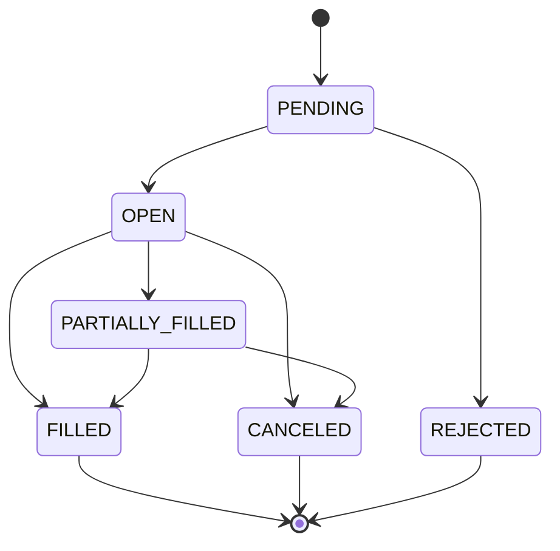

# План рефакторинга Domain Entities

## 🎯 Цель
Привести domain entities в соответствие с принципами DDD, SOLID и Clean Architecture, добавить тесты и документацию.

## 📊 Текущее состояние (Анализ проблем)

### Order.ts - КРИТИЧНО перегружен ⚠️
**Проблемы:**
- ❌ Содержит Event Sourcing логику (`applyExecutionEvent`)
- ❌ Содержит FSM transitions (`mapStatusToExecutionState`)
- ❌ Содержит invariant checks для events
- ❌ Слишком много ответственности (150+ строк только на события)
- ❌ Тяжело тестировать

**Что оставить:**
- ✅ Конструктор и валидация
- ✅ Простые query методы (`isFilled`, `isOpen`, `getNotional`)
- ✅ Immutable операции (`withStatus`, `withFill`)

**Что убрать → куда перенести:**
- `applyExecutionEvent()` → `OrderProjectionService`
- `fromOrderAccepted()` → `OrderProjectionService`
- `mapStatusToExecutionState()` → `OrderStateMachine`
- FSM validation → `OrderStateMachine`

---

### Orderbook.ts - НЕ Entity, а Calculator ⚠️
**Проблемы:**
- ❌ Слишком много вычислительной логики (microprice, imbalance)
- ❌ Больше похож на Value Object с калькулятором
- ❌ Аналитические методы не относятся к lifecycle entity

**Что оставить:**
- ✅ Данные (bids, asks, timestamp)
- ✅ Базовые accessors (`getBestBid`, `getBestAsk`, `getSpread`)
- ✅ Простые проверки (`isEmpty`, `hasLiquidity`)

**Что убрать → куда перенести:**
- `getMicroprice()` → `OrderbookAnalyzer`
- `getImbalance()` → `OrderbookAnalyzer`
- `getTotalBidVolume()` → `OrderbookAnalyzer`
- `getTotalAskVolume()` → `OrderbookAnalyzer`
- Все вычислительные методы → `OrderbookAnalyzer` (Domain Service)

---

### Portfolio.ts - Требует внешние данные ⚠️
**Проблемы:**
- ❌ `getTotalValue(marketPrices)` - требует внешнее состояние
- ❌ `getTotalUnrealizedPnL(marketPrices)` - требует внешнее состояние
- ❌ Entity не должна знать о рыночных ценах

**Что оставить:**
- ✅ Cash management (reserveCash, releaseCash, updateCash)
- ✅ Position management (addPosition, updatePosition, removePosition)
- ✅ Простые getters (getPosition, hasPosition, getPositionCount)

**Что убрать → куда перенести:**
- `getTotalValue()` → `PortfolioValuationService`
- `getTotalUnrealizedPnL()` → `PortfolioValuationService`

---

### Position.ts - В целом OK, мелкие улучшения ✅
**Что оставить:**
- ✅ Lot management (addLot, removeLot, FIFO logic)
- ✅ Aggregate логика (валидация, average price calculation)
- ✅ Query methods

**Улучшения:**
- 📝 Добавить тесты для FIFO алгоритма
- 📝 Документировать edge cases

---

### PositionLot.ts - Идеально ✅
**Статус:** Не требует изменений
- ✅ Простая, чёткая ответственность
- ✅ Immutable
- ✅ Хорошо документировано

---

### Trade.ts - Отлично ✅
**Статус:** Не требует изменений
- ✅ Простая запись сделки
- ✅ Валидация на месте

---

### Market.ts - OK, мелкие улучшения ✅
**Что оставить:**
- ✅ Market data (id, question, outcomes, status)
- ✅ Query methods (isExpired, canTrade, isResolved)

**Улучшения:**
- 📝 Упростить валидацию (вынести в Value Objects)

---

## 🏗️ Новая структура (Изолированные пакеты)

```
packages/
├── entities/                            # 🔵 Изолированный пакет - НЕТ зависимостей
│   ├── package.json                     # "@polymarket/entities", deps: []
│   ├── tsconfig.json                    # Изолированная конфигурация
│   ├── src/
│   │   ├── Order.ts                     # Упрощённый (50-70 строк)
│   │   ├── Orderbook.ts                 # Упрощённый (80-100 строк)
│   │   ├── Portfolio.ts                 # Упрощённый (120-150 строк)
│   │   ├── Position.ts                  # Без изменений
│   │   ├── PositionLot.ts               # Без изменений
│   │   ├── Trade.ts                     # Без изменений
│   │   ├── Market.ts                    # Мелкие улучшения
│   │   ├── types.ts                     # Базовые типы (OrderStatus, Side, etc.)
│   │   └── index.ts                     # Barrel export
│   ├── __tests__/
│   │   ├── Order.test.ts
│   │   ├── Orderbook.test.ts
│   │   ├── Portfolio.test.ts
│   │   ├── Position.test.ts
│   │   ├── PositionLot.test.ts
│   │   ├── Trade.test.ts
│   │   └── Market.test.ts
│   └── README.md
│
├── value-objects/                       # 🟢 Зависит только от себя
│   ├── package.json                     # "@polymarket/value-objects", deps: []
│   ├── tsconfig.json
│   ├── src/
│   │   ├── Price.ts
│   │   ├── Quantity.ts
│   │   ├── Money.ts
│   │   ├── Spread.ts
│   │   └── index.ts
│   └── __tests__/
│       └── ...
│
├── domain-services/                     # 🟡 Зависит от entities + value-objects
│   ├── package.json                     # "@polymarket/domain-services"
│   │                                    # deps: ["@polymarket/entities", "@polymarket/value-objects"]
│   ├── tsconfig.json
│   ├── src/
│   │   ├── OrderProjectionService.ts    # Event Sourcing для Order
│   │   ├── OrderbookAnalyzer.ts         # Аналитика orderbook
│   │   ├── PortfolioValuationService.ts # Расчёты стоимости
│   │   ├── PositionManager.ts           # Управление позициями
│   │   └── index.ts
│   └── __tests__/
│       └── ...
│
├── state-machines/                      # 🟡 Зависит от entities
│   ├── package.json                     # "@polymarket/state-machines"
│   │                                    # deps: ["@polymarket/entities"]
│   ├── tsconfig.json
│   ├── src/
│   │   ├── OrderStateMachine.ts
│   │   └── index.ts
│   └── __tests__/
│       └── ...
│
├── domain-events/                       # 🟢 Изолированный пакет
│   ├── package.json                     # "@polymarket/domain-events", deps: []
│   ├── tsconfig.json
│   ├── src/
│   │   ├── ExecutionEvent.ts
│   │   ├── OrderEvent.ts
│   │   └── index.ts
│   └── __tests__/
│       └── ...
│
└── shared/                              # 🟢 Базовые утилиты (используются всеми)
    ├── package.json                     # "@polymarket/shared", deps: []
    ├── tsconfig.json
    ├── src/
    │   ├── errors/
    │   │   └── TradingError.ts
    │   ├── types/
    │   │   └── Result.ts
    │   └── index.ts
    └── __tests__/
        └── ...
```

### 📦 Dependency Graph (снизу вверх)

```
Layer 4 (Application)
    ↓ depends on
Layer 3 (Domain Services)        [@polymarket/domain-services, @polymarket/state-machines]
    ↓ depends on
Layer 2 (Domain Core)             [@polymarket/entities, @polymarket/value-objects]
    ↓ depends on
Layer 1 (Foundation)              [@polymarket/shared, @polymarket/domain-events]
    ↓ depends on
Layer 0 (External)                [TypeScript stdlib only]
```

**Принцип:** Entities НЕ зависят ни от чего, кроме shared utilities (Result, Error types).

---

## 📋 Детальный план выполнения

### Фаза 1: Подготовка - Изолированные пакеты (2 дня)

#### 1.1. Создать структуру изолированных пакетов
```bash
# Создать изолированные пакеты
mkdir -p packages/entities/src
mkdir -p packages/entities/__tests__
mkdir -p packages/value-objects/src
mkdir -p packages/value-objects/__tests__
mkdir -p packages/domain-services/src
mkdir -p packages/domain-services/__tests__
mkdir -p packages/state-machines/src
mkdir -p packages/state-machines/__tests__
mkdir -p packages/domain-events/src
mkdir -p packages/domain-events/__tests__
mkdir -p packages/shared/src/{errors,types}
mkdir -p packages/shared/__tests__

# Документация
mkdir -p docs/architecture
mkdir -p docs/packages/entities
mkdir -p docs/packages/domain-services
```

#### 1.2. Создать package.json для entities (изолированный)
**Файл:** `packages/entities/package.json`

```json
{
  "name": "@polymarket/entities",
  "version": "1.0.0",
  "description": "Domain entities - isolated, zero dependencies",
  "type": "module",
  "main": "./dist/index.js",
  "types": "./dist/index.d.ts",
  "exports": {
    ".": {
      "import": "./dist/index.js",
      "types": "./dist/index.d.ts"
    }
  },
  "scripts": {
    "build": "tsc",
    "test": "vitest",
    "test:watch": "vitest --watch",
    "test:coverage": "vitest --coverage",
    "lint": "eslint src/**/*.ts",
    "typecheck": "tsc --noEmit"
  },
  "dependencies": {
    "@polymarket/shared": "workspace:*"
  },
  "devDependencies": {
    "@types/node": "^20.0.0",
    "typescript": "^5.3.0",
    "vitest": "^1.0.0",
    "@vitest/coverage-v8": "^1.0.0",
    "eslint": "^8.0.0"
  },
  "keywords": ["domain", "entities", "ddd", "clean-architecture"],
  "license": "MIT"
}
```

**Критично:** `dependencies` содержит ТОЛЬКО `@polymarket/shared` (для Result, Error types)

#### 1.3. Создать tsconfig.json для entities
**Файл:** `packages/entities/tsconfig.json`

```json
{
  "extends": "../../tsconfig.base.json",
  "compilerOptions": {
    "outDir": "./dist",
    "rootDir": "./src",
    "composite": true,
    "declaration": true,
    "declarationMap": true,
    "noEmit": false
  },
  "include": ["src/**/*"],
  "exclude": ["__tests__", "dist", "node_modules"],
  "references": [
    { "path": "../shared" }
  ]
}
```

#### 1.4. Создать package.json для value-objects
**Файл:** `packages/value-objects/package.json`

```json
{
  "name": "@polymarket/value-objects",
  "version": "1.0.0",
  "description": "Domain value objects - immutable, zero dependencies",
  "type": "module",
  "main": "./dist/index.js",
  "types": "./dist/index.d.ts",
  "exports": {
    ".": {
      "import": "./dist/index.js",
      "types": "./dist/index.d.ts"
    }
  },
  "scripts": {
    "build": "tsc",
    "test": "vitest",
    "test:coverage": "vitest --coverage"
  },
  "dependencies": {
    "@polymarket/shared": "workspace:*"
  },
  "devDependencies": {
    "typescript": "^5.3.0",
    "vitest": "^1.0.0"
  },
  "keywords": ["domain", "value-objects", "ddd", "immutable"],
  "license": "MIT"
}
```

#### 1.5. Создать package.json для domain-services
**Файл:** `packages/domain-services/package.json`

```json
{
  "name": "@polymarket/domain-services",
  "version": "1.0.0",
  "description": "Domain services - business logic",
  "type": "module",
  "main": "./dist/index.js",
  "types": "./dist/index.d.ts",
  "scripts": {
    "build": "tsc",
    "test": "vitest",
    "test:coverage": "vitest --coverage"
  },
  "dependencies": {
    "@polymarket/entities": "workspace:*",
    "@polymarket/value-objects": "workspace:*",
    "@polymarket/shared": "workspace:*",
    "@polymarket/domain-events": "workspace:*"
  },
  "devDependencies": {
    "typescript": "^5.3.0",
    "vitest": "^1.0.0"
  },
  "keywords": ["domain", "services", "ddd", "business-logic"],
  "license": "MIT"
}
```

#### 1.6. Создать package.json для state-machines
**Файл:** `packages/state-machines/package.json`

```json
{
  "name": "@polymarket/state-machines",
  "version": "1.0.0",
  "description": "Finite state machines for domain entities",
  "type": "module",
  "main": "./dist/index.js",
  "types": "./dist/index.d.ts",
  "scripts": {
    "build": "tsc",
    "test": "vitest"
  },
  "dependencies": {
    "@polymarket/entities": "workspace:*",
    "@polymarket/shared": "workspace:*"
  },
  "devDependencies": {
    "typescript": "^5.3.0",
    "vitest": "^1.0.0"
  },
  "keywords": ["fsm", "state-machine", "domain"],
  "license": "MIT"
}
```

#### 1.7. Создать package.json для shared
**Файл:** `packages/shared/package.json`

```json
{
  "name": "@polymarket/shared",
  "version": "1.0.0",
  "description": "Shared utilities - foundation layer",
  "type": "module",
  "main": "./dist/index.js",
  "types": "./dist/index.d.ts",
  "scripts": {
    "build": "tsc",
    "test": "vitest"
  },
  "dependencies": {},
  "devDependencies": {
    "typescript": "^5.3.0",
    "vitest": "^1.0.0"
  },
  "keywords": ["shared", "utilities", "foundation"],
  "license": "MIT"
}
```

**Критично:** `dependencies` = `{}` - НЕТ зависимостей!

#### 1.8. Создать root package.json с workspaces
**Файл:** `package.json` (root)

```json
{
  "name": "@polymarket/monorepo",
  "private": true,
  "workspaces": [
    "packages/*"
  ],
  "scripts": {
    "build": "pnpm -r build",
    "test": "pnpm -r test",
    "test:coverage": "pnpm -r test:coverage",
    "lint": "pnpm -r lint",
    "typecheck": "pnpm -r typecheck",

    "build:entities": "pnpm --filter @polymarket/entities build",
    "test:entities": "pnpm --filter @polymarket/entities test",

    "check-deps": "node scripts/check-dependencies.js"
  },
  "devDependencies": {
    "@types/node": "^20.0.0",
    "typescript": "^5.3.0",
    "vitest": "^1.0.0",
    "eslint": "^8.0.0"
  }
}
```

#### 1.9. Создать скрипт проверки зависимостей
**Файл:** `scripts/check-dependencies.js`

```javascript
#!/usr/bin/env node

/**
 * Проверяет, что изолированные пакеты не имеют запрещённых зависимостей
 */

import { readFileSync } from 'fs';
import { join } from 'path';

const ISOLATED_PACKAGES = [
  'packages/entities',
  'packages/value-objects',
  'packages/shared',
  'packages/domain-events'
];

const ALLOWED_DEPS = {
  'packages/entities': ['@polymarket/shared'],
  'packages/value-objects': ['@polymarket/shared'],
  'packages/shared': [],
  'packages/domain-events': []
};

let hasErrors = false;

for (const pkgPath of ISOLATED_PACKAGES) {
  const packageJson = JSON.parse(
    readFileSync(join(pkgPath, 'package.json'), 'utf-8')
  );

  const deps = Object.keys(packageJson.dependencies || {});
  const allowed = ALLOWED_DEPS[pkgPath];

  const forbidden = deps.filter(d => !allowed.includes(d));

  if (forbidden.length > 0) {
    console.error(`❌ ${pkgPath} has forbidden dependencies:`);
    console.error(`   ${forbidden.join(', ')}`);
    console.error(`   Allowed: ${allowed.join(', ') || 'none'}`);
    hasErrors = true;
  } else {
    console.log(`✅ ${pkgPath} - OK`);
  }
}

if (hasErrors) {
  process.exit(1);
} else {
  console.log('\n✅ All packages have correct dependencies!');
}
```

**Использование:**
```bash
pnpm run check-deps
```

#### 1.10. Документация по архитектуре

**Файлы для создания:**
- `docs/architecture/principles.md` - принципы изоляции
- `docs/architecture/dependency-rules.md` - правила зависимостей
- `docs/architecture/package-structure.md` - структура пакетов
- `docs/architecture/testing-strategy.md` - стратегия тестирования

---

### Фаза 2: OrderStateMachine (День 1)

#### 2.1. Создать OrderStateMachine
**Файл:** `packages/domain/state-machines/OrderStateMachine.ts`

```typescript
/**
 * Order State Machine
 *
 * @remarks
 * Управляет переходами состояний Order согласно FSM.
 * Отвечает за валидацию transitions и проверку бизнес-правил.
 *
 * Алгоритм:
 * 1. Проверяет текущее состояние
 * 2. Валидирует возможность перехода
 * 3. Возвращает новое состояние или ошибку
 *
 * FSM схема:
 * PENDING → OPEN → PARTIALLY_FILLED → FILLED
 *        ↘       ↘                   ↗
 *          CANCELED / REJECTED
 *
 * @example
 * ```typescript
 * const fsm = new OrderStateMachine();
 * const result = fsm.transition({
 *   fromStatus: 'OPEN',
 *   toStatus: 'FILLED',
 *   order: order
 * });
 * ```
 */
export class OrderStateMachine {
  /**
   * Выполняет переход состояния
   *
   * @param params - Параметры перехода
   * @returns Result с новым статусом или ошибкой
   */
  transition(params: TransitionParams): Result<OrderStatus, string>

  /**
   * Проверяет возможность перехода
   *
   * @param from - Текущий статус
   * @param to - Желаемый статус
   * @returns True если переход разрешён
   */
  canTransition(from: OrderStatus, to: OrderStatus): boolean

  /**
   * Возвращает допустимые переходы из состояния
   *
   * @param from - Текущий статус
   * @returns Массив допустимых статусов
   */
  getAllowedTransitions(from: OrderStatus): OrderStatus[]
}
```

#### 2.2. Написать тесты
**Файл:** `packages/domain/__tests__/state-machines/OrderStateMachine.test.ts`

```typescript
describe('OrderStateMachine', () => {
  describe('transition()', () => {
    it('должен разрешить переход OPEN → FILLED', () => {
      // Given
      const fsm = new OrderStateMachine();
      const order = Order.create({...});

      // When
      const result = fsm.transition({
        fromStatus: 'OPEN',
        toStatus: 'FILLED',
        order
      });

      // Then
      expect(result.ok).toBe(true);
      expect(result.value).toBe('FILLED');
    });

    it('должен запретить переход FILLED → OPEN', () => {
      // Given
      const fsm = new OrderStateMachine();
      const order = Order.create({status: 'FILLED', ...});

      // When
      const result = fsm.transition({
        fromStatus: 'FILLED',
        toStatus: 'OPEN',
        order
      });

      // Then
      expect(result.ok).toBe(false);
      expect(result.error).toContain('FSM violation');
    });

    // Тесты для всех возможных переходов (15+ тестов)
  });

  describe('canTransition()', () => {
    // Тесты для проверки разрешённых переходов
  });

  describe('getAllowedTransitions()', () => {
    // Тесты для получения списка разрешённых переходов
  });
});
```

#### 2.3. Документация
**Файл:** `docs/domain/state-machines/order-fsm.md`

```markdown
# Order State Machine

## Описание
FSM для управления жизненным циклом Order.

## Диаграмма состояний


## Переходы
| From | To | Условие |
|------|-----|---------|
| PENDING | OPEN | Exchange принял ордер |
| OPEN | FILLED | Весь объём исполнен |
...
```

---

### Фаза 3: OrderProjectionService (День 2)

#### 3.1. Создать OrderProjectionService
**Файл:** `packages/domain/services/OrderProjectionService.ts`

```typescript
/**
 * Order Projection Service
 *
 * @remarks
 * Отвечает за применение ExecutionEvent к Order aggregate.
 * Содержит Event Sourcing логику, invariant checks и FSM validation.
 *
 * Responsibilities:
 * - Создание Order из OrderAccepted event
 * - Применение events к существующим Order
 * - Валидация invariants (price > 0, size > 0, etc.)
 * - Вычисление derived values (totalFilled, weighted average price)
 * - FSM transitions через OrderStateMachine
 *
 * @example
 * ```typescript
 * const projector = new OrderProjectionService(stateMachine);
 *
 * // Создание Order из event
 * const result = projector.projectFromEvent(orderAcceptedEvent);
 *
 * // Применение event к Order
 * const updated = projector.applyEvent(order, orderFilledEvent);
 * ```
 */
export class OrderProjectionService {
  constructor(private readonly stateMachine: OrderStateMachine) {}

  /**
   * Создаёт Order aggregate из OrderAccepted event
   */
  projectFromEvent(event: OrderAccepted): Result<Order, string>

  /**
   * Применяет ExecutionEvent к Order aggregate
   */
  applyEvent(order: Order, event: ExecutionEvent): Result<Order, string>

  /**
   * Валидирует invariants для event
   */
  private validateInvariants(event: ExecutionEvent): Result<void, string>

  /**
   * Вычисляет weighted average fill price
   */
  private calculateWeightedAverage(...): number
}
```

#### 3.2. Тесты
**Файл:** `packages/domain/__tests__/services/OrderProjectionService.test.ts`

```typescript
describe('OrderProjectionService', () => {
  describe('projectFromEvent()', () => {
    it('должен создать Order из OrderAccepted', () => {
      // Given
      const event: OrderAccepted = {
        type: 'OrderAccepted',
        orderId: '123',
        side: 'BUY',
        marketId: 'market-1',
        price: 0.65,
        size: 100
      };

      // When
      const result = projector.projectFromEvent(event);

      // Then
      expect(result.ok).toBe(true);
      expect(result.value.id).toBe('123');
      expect(result.value.status).toBe('OPEN');
    });

    it('должен отклонить event с price <= 0', () => {
      // Invariant violation test
    });
  });

  describe('applyEvent()', () => {
    it('должен применить OrderFilled к OPEN order', () => {
      // Test fill logic
    });

    it('должен вычислить weighted average price для multiple fills', () => {
      // Test weighted average calculation
    });

    // 20+ тестов для всех event types и edge cases
  });
});
```

#### 3.3. Рефакторинг Order.ts
**Удалить из Order.ts:**
```typescript
// ❌ Удалить
public applyExecutionEvent(event: ExecutionEvent): Result<Order, string>
public static fromOrderAccepted(event: OrderAccepted): Result<Order, string>
private mapStatusToExecutionState(status: OrderStatus): OrderExecutionState
private _calculateWeightedAveragePrice(...): number
```

**Упрощённый Order.ts (50-70 строк):**
```typescript
/**
 * Order entity
 *
 * @remarks
 * Представляет торговый ордер с identity и lifecycle.
 * Содержит только состояние и простые query/mutation методы.
 *
 * Event Sourcing логика вынесена в OrderProjectionService.
 * FSM transitions управляются через OrderStateMachine.
 */
export class Order {
  // Properties
  public readonly id: string;
  public readonly tokenId: string;
  public readonly side: OrderSide;
  public readonly price: Price;
  public readonly size: Quantity;
  public readonly status: OrderStatus;
  public readonly timestamp: Date;
  public readonly filledSize?: Quantity;
  public readonly averageFillPrice?: Price;

  private constructor(params: OrderParams) { /* ... */ }

  /**
   * Создаёт Order с валидацией
   */
  public static create(params: OrderParams): Order

  /**
   * Валидирует бизнес-правила Order
   */
  public validate(): void

  // Query methods (readonly)
  public isFilled(): boolean
  public isOpen(): boolean
  public canCancel(): boolean
  public getNotional(): number
  public getRemainingSize(): Quantity
  public getFillPercentage(): number

  // Immutable mutations
  public withStatus(status: OrderStatus): Order
  public withFill(filledSize: Quantity, averageFillPrice: Price): Order

  // Serialization
  public toJSON(): Record<string, unknown>
  public toString(): string
}
```

---

### Фаза 4: OrderbookAnalyzer (День 3)

#### 4.1. Создать OrderbookAnalyzer
**Файл:** `packages/domain/services/OrderbookAnalyzer.ts`

```typescript
/**
 * Orderbook Analyzer Service
 *
 * @remarks
 * Domain Service для анализа orderbook и расчёта метрик.
 * Содержит всю вычислительную логику, убранную из Orderbook entity.
 *
 * Алгоритмы:
 * - Microprice: взвешенная цена по объёмам best bid/ask
 * - Imbalance: дисбаланс ликвидности между bid/ask
 * - Volume aggregation: суммирование объёмов по уровням
 *
 * @example
 * ```typescript
 * const analyzer = new OrderbookAnalyzer();
 *
 * const microprice = analyzer.calculateMicroprice(orderbook);
 * const imbalance = analyzer.calculateImbalance(orderbook, 5);
 * const metrics = analyzer.analyzeOrderbook(orderbook);
 * ```
 */
export class OrderbookAnalyzer {
  /**
   * Вычисляет microprice (взвешенная цена)
   *
   * @param orderbook - Orderbook для анализа
   * @returns Microprice или null
   *
   * @remarks
   * Формула: (bestAsk * bidQty + bestBid * askQty) / (bidQty + askQty)
   */
  calculateMicroprice(orderbook: Orderbook): Price | null

  /**
   * Вычисляет imbalance (дисбаланс объёмов)
   *
   * @param orderbook - Orderbook для анализа
   * @param levels - Количество уровней (default: 5)
   * @returns Imbalance от -1 до 1
   *
   * @remarks
   * Формула: (bidVolume - askVolume) / (bidVolume + askVolume)
   */
  calculateImbalance(orderbook: Orderbook, levels: number = 5): number

  /**
   * Суммирует объём на bid стороне
   */
  calculateTotalBidVolume(orderbook: Orderbook, levels?: number): Quantity

  /**
   * Суммирует объём на ask стороне
   */
  calculateTotalAskVolume(orderbook: Orderbook, levels?: number): Quantity

  /**
   * Выполняет полный анализ orderbook
   *
   * @returns OrderbookMetrics Value Object с результатами
   */
  analyzeOrderbook(orderbook: Orderbook): OrderbookMetrics
}
```

#### 4.2. Создать OrderbookMetrics Value Object
**Файл:** `packages/domain/value-objects/OrderbookMetrics.ts`

```typescript
/**
 * Orderbook Metrics Value Object
 *
 * @remarks
 * Неизменяемый результат анализа orderbook.
 * Содержит все вычисленные метрики.
 */
export class OrderbookMetrics {
  public readonly bestBid: Price | null;
  public readonly bestAsk: Price | null;
  public readonly midPrice: Price | null;
  public readonly microprice: Price | null;
  public readonly spreadWidth: number | null;
  public readonly totalBidVolume: Quantity;
  public readonly totalAskVolume: Quantity;
  public readonly imbalance: number;
  public readonly bidDepth: number;
  public readonly askDepth: number;

  private constructor(params: OrderbookMetricsParams) { /* ... */ }

  public static create(params: OrderbookMetricsParams): OrderbookMetrics

  public toObject(): Record<string, unknown>
}
```

#### 4.3. Упрощённый Orderbook.ts
**Удалить из Orderbook.ts:**
```typescript
// ❌ Удалить
getMicroprice(): Price | null
getImbalance(levels: number = 5): number
getTotalBidVolume(levels?: number): Quantity
getTotalAskVolume(levels?: number): Quantity
toObject() // Переместить в OrderbookMetrics
```

**Упрощённый Orderbook.ts (80-100 строк):**
```typescript
/**
 * Orderbook entity
 *
 * @remarks
 * Представляет стакан заявок с bid/ask уровнями.
 * Содержит только данные и базовые accessors.
 *
 * Вычислительная логика вынесена в OrderbookAnalyzer.
 */
export class Orderbook {
  public readonly marketId: string;
  public readonly bids: readonly OrderbookLevel[];
  public readonly asks: readonly OrderbookLevel[];
  public readonly timestamp: Date;

  private constructor(...) { /* ... */ }

  public static create(marketId: string, data: OrderbookData): Orderbook
  public static empty(marketId: string): Orderbook

  // Базовые accessors
  public getBestBid(): Price | null
  public getBestAsk(): Price | null
  public getSpread(): Spread | null
  public getMidPrice(): Price | null

  // Простые проверки
  public isEmpty(): boolean
  public hasLiquidity(): boolean
  public isStale(maxAgeMs: number = 5000): boolean

  // Metadata
  public getBidDepth(): number
  public getAskDepth(): number
  public getAgeMs(): number

  public toString(): string
}
```

#### 4.4. Тесты
```typescript
describe('OrderbookAnalyzer', () => {
  describe('calculateMicroprice()', () => {
    it('должен вычислить microprice с равными объёмами', () => {
      // Given: bid 100@0.50, ask 100@0.52
      // When: microprice
      // Then: 0.51 (midpoint)
    });

    it('должен учесть дисбаланс объёмов', () => {
      // Given: bid 200@0.50, ask 100@0.52
      // When: microprice
      // Then: ближе к bid (больше bid volume)
    });
  });

  describe('calculateImbalance()', () => {
    it('должен вернуть 0 при равных объёмах', () => {});
    it('должен вернуть +1 при отсутствии asks', () => {});
    it('должен вернуть -1 при отсутствии bids', () => {});
  });

  // 15+ тестов
});
```

---

### Фаза 5: PortfolioValuationService (День 4)

#### 5.1. Создать PortfolioValuationService
**Файл:** `packages/domain/services/PortfolioValuationService.ts`

```typescript
/**
 * Portfolio Valuation Service
 *
 * @remarks
 * Domain Service для расчёта стоимости портфеля и P&L.
 * Требует внешние рыночные цены для вычислений.
 *
 * Алгоритмы:
 * - Total value = cash + sum(position values)
 * - Unrealized P&L = sum(position P&Ls)
 * - Position value = quantity * current price
 *
 * @example
 * ```typescript
 * const service = new PortfolioValuationService();
 *
 * const marketPrices = new Map([
 *   ['market-1', Price.fromNumber(0.70)]
 * ]);
 *
 * const totalValue = service.calculateTotalValue(portfolio, marketPrices);
 * const metrics = service.calculateMetrics(portfolio, marketPrices);
 * ```
 */
export class PortfolioValuationService {
  /**
   * Вычисляет общую стоимость портфеля
   *
   * @param portfolio - Portfolio для оценки
   * @param marketPrices - Текущие рыночные цены
   * @returns Общая стоимость
   *
   * @remarks
   * Total value = cash + sum(position.quantity * price)
   */
  calculateTotalValue(
    portfolio: Portfolio,
    marketPrices: Map<string, Price>
  ): Money

  /**
   * Вычисляет общий нереализованный P&L
   *
   * @param portfolio - Portfolio для расчёта
   * @param marketPrices - Текущие рыночные цены
   * @returns Нереализованный P&L
   */
  calculateUnrealizedPnL(
    portfolio: Portfolio,
    marketPrices: Map<string, Price>
  ): Money

  /**
   * Вычисляет полные метрики портфеля
   *
   * @returns PortfolioMetrics Value Object
   */
  calculateMetrics(
    portfolio: Portfolio,
    marketPrices: Map<string, Price>
  ): PortfolioMetrics
}
```

#### 5.2. Создать PortfolioMetrics Value Object
**Файл:** `packages/domain/value-objects/PortfolioMetrics.ts`

```typescript
/**
 * Portfolio Metrics Value Object
 *
 * @remarks
 * Неизменяемые метрики портфеля.
 */
export class PortfolioMetrics {
  public readonly portfolioId: string;
  public readonly totalValue: Money;
  public readonly cash: Money;
  public readonly availableCash: Money;
  public readonly reservedCash: Money;
  public readonly unrealizedPnL: Money;
  public readonly positionCount: number;
  public readonly positionValues: ReadonlyMap<string, Money>;

  private constructor(params: PortfolioMetricsParams) { /* ... */ }

  public static create(params: PortfolioMetricsParams): PortfolioMetrics

  public toObject(): Record<string, unknown>
}
```

#### 5.3. Упрощённый Portfolio.ts
**Удалить из Portfolio.ts:**
```typescript
// ❌ Удалить
getTotalValue(marketPrices: Map<string, Price>): Money
getTotalUnrealizedPnL(marketPrices: Map<string, Price>): Money
toObject() // Переместить в PortfolioMetrics
```

**Упрощённый Portfolio.ts (120-150 строк):**
```typescript
/**
 * Portfolio entity
 *
 * @remarks
 * Представляет портфель трейдера с cash и позициями.
 * Управляет резервированием средств и позициями.
 *
 * Валидация стоимости вынесена в PortfolioValuationService.
 */
export class Portfolio {
  public readonly id: string;
  public readonly cash: Money;
  public readonly reservedCash: Money;
  public readonly positions: ReadonlyMap<string, Position>;

  private constructor(...) { /* ... */ }

  public static create(id: string, initialCash: Money): Portfolio

  // Cash management
  public get availableCash(): Money
  public reserveCash(amount: Money): Portfolio
  public releaseCash(amount: Money): Portfolio
  public updateCash(amount: Money): Portfolio

  // Position management
  public addPosition(position: Position): Portfolio
  public updatePosition(tokenId: string, position: Position): Portfolio
  public removePosition(tokenId: string): Portfolio

  // Query methods
  public getPosition(tokenId: string): Position | undefined
  public hasPosition(tokenId: string): boolean
  public getPositionCount(): number
  public getAllPositions(): Position[]
  public isEmpty(): boolean

  public toString(): string
}
```

#### 5.4. Тесты
```typescript
describe('PortfolioValuationService', () => {
  describe('calculateTotalValue()', () => {
    it('должен вычислить стоимость = cash + positions', () => {
      // Given: cash 1000, position 10@0.70
      // When: calculate
      // Then: 1007
    });

    it('должен игнорировать позиции без цен', () => {});
  });

  describe('calculateUnrealizedPnL()', () => {
    it('должен суммировать P&L всех позиций', () => {});
    it('должен учитывать YES и NO стороны', () => {});
  });

  // 10+ тестов
});
```

---

### Фаза 6: Тесты для существующих entities (День 5-6)

#### 6.1. Order.test.ts
```typescript
describe('Order', () => {
  describe('create()', () => {
    it('должен создать валидный order', () => {});
    it('должен выбросить ошибку при price <= 0', () => {});
    it('должен выбросить ошибку при size <= 0', () => {});
    it('должен выбросить ошибку при невалидном status', () => {});
  });

  describe('validate()', () => {
    it('должен пройти валидацию корректного order', () => {});
    it('должен отклонить filledSize > size', () => {});
    it('должен требовать averageFillPrice при filledSize > 0', () => {});
  });

  describe('isFilled()', () => {
    it('должен вернуть true для FILLED status', () => {});
    it('должен вернуть false для OPEN status', () => {});
  });

  describe('canCancel()', () => {
    it('должен разрешить cancel для PENDING order', () => {});
    it('должен разрешить cancel для OPEN order', () => {});
    it('должен запретить cancel для FILLED order', () => {});
  });

  describe('withFill()', () => {
    it('должен установить FILLED при полном исполнении', () => {});
    it('должен сохранить статус при частичном исполнении', () => {});
  });

  // 20+ тестов
});
```

#### 6.2. Portfolio.test.ts
```typescript
describe('Portfolio', () => {
  describe('create()', () => {
    it('должен создать пустой портфель', () => {});
    it('должен выбросить ошибку при negative cash', () => {});
  });

  describe('reserveCash()', () => {
    it('должен зарезервировать доступные средства', () => {});
    it('должен выбросить InsufficientFundsError', () => {});
  });

  describe('releaseCash()', () => {
    it('должен освободить зарезервированные средства', () => {});
    it('должен выбросить ошибку при release > reserved', () => {});
  });

  describe('addPosition()', () => {
    it('должен добавить новую позицию', () => {});
    it('должен выбросить DuplicatePositionError', () => {});
  });

  // 25+ тестов
});
```

#### 6.3. Position.test.ts
```typescript
describe('Position', () => {
  describe('empty()', () => {
    it('должен создать пустую позицию', () => {});
  });

  describe('addLot()', () => {
    it('должен добавить лот и пересчитать average price', () => {
      // Given: empty position
      // When: addLot(10@0.60)
      // Then: avgPrice = 0.60, totalQty = 10
    });

    it('должен вычислить weighted average для multiple lots', () => {
      // Given: lot1 (10@0.60)
      // When: addLot(5@0.70)
      // Then: avgPrice = 0.6333
    });

    it('должен выбросить ошибку при token mismatch', () => {});
  });

  describe('removeLot() - FIFO алгоритм', () => {
    it('должен удалить из старого лота (FIFO)', () => {
      // Given: lot1(created first), lot2(created second)
      // When: removeLot(lot1.id, 5)
      // Then: lot1 reduced, lot2 untouched
    });

    it('должен удалить полностью закрытый лот', () => {});
    it('должен выбросить LotNotFoundError', () => {});
  });

  describe('calculateUnrealizedPnL()', () => {
    it('должен вычислить P&L для YES position', () => {});
    it('должен вычислить P&L для NO position', () => {});
  });

  // 30+ тестов
});
```

#### 6.4. PositionLot.test.ts
```typescript
describe('PositionLot', () => {
  describe('constructor', () => {
    it('должен создать валидный лот', () => {});
    it('должен выбросить ошибку при quantity <= 0', () => {});
  });

  describe('calculateCost()', () => {
    it('должен вычислить cost = qty * price', () => {});
  });

  describe('calculateUnrealizedPnL()', () => {
    it('должен вычислить profit для YES (price up)', () => {});
    it('должен вычислить loss для YES (price down)', () => {});
    it('должен инвертировать P&L для NO position', () => {});
  });

  describe('close()', () => {
    it('должен закрыть частично', () => {});
    it('должен закрыть полностью', () => {});
    it('должен выбросить InsufficientLotQuantityError', () => {});
  });

  // 15+ тестов
});
```

---

### Фаза 7: Документация (День 7)

#### 7.1. Архитектурная документация

**`docs/domain/architecture/principles.md`**
```markdown
# Принципы архитектуры Domain Layer

## Entity
### Что может Entity
- Иметь уникальную идентичность (id)
- Управлять своим lifecycle
- Защищать свои инварианты (validation)
- Предоставлять query методы (readonly)
- Выполнять immutable mutations

### Что НЕ может Entity
- Содержать сложную вычислительную логику
- Зависеть от внешних данных для вычислений
- Содержать application-level логику
- Быть "калькулятором"

## Domain Service
Когда создавать Domain Service?
- Сложная логика не принадлежит ни одной Entity
- Операция требует несколько Entities
- Требуются внешние данные для вычислений

## Value Object
...
```

**`docs/domain/architecture/testing-strategy.md`**
```markdown
# Стратегия тестирования

## Entity тесты
- Тестируем создание и валидацию
- Тестируем query методы
- Тестируем immutable mutations
- Тестируем edge cases

## Service тесты
- Тестируем основную бизнес-логику
- Тестируем интеграцию с Entity
- Тестируем invariant checks
- Тестируем граничные условия

## Требования к coverage
- Entities: 90%+
- Services: 95%+
- Value Objects: 100%
```

#### 7.2. Entity документация

**`docs/domain/entities/order.md`**
```markdown
# Order Entity

## Описание
Представляет торговый ордер с identity и lifecycle.

## Ответственность
- Хранение состояния ордера
- Валидация бизнес-правил
- Предоставление query методов
- Immutable mutations

## НЕ ответственность
- Event Sourcing логика (→ OrderProjectionService)
- FSM transitions (→ OrderStateMachine)

## API

### Создание
\`\`\`typescript
const order = Order.create({
  id: '123',
  tokenId: 'market-1',
  side: 'BUY',
  price: Price.fromNumber(0.65),
  size: Quantity.fromNumber(100),
  status: 'PENDING',
  timestamp: new Date()
});
\`\`\`

### Query методы
- `isFilled()` - проверка полного исполнения
- `isOpen()` - проверка активности
- `canCancel()` - возможность отмены
- `getNotional()` - расчёт notional value

### Mutations
- `withStatus(status)` - изменение статуса
- `withFill(size, price)` - добавление fill

## Тесты
См. `packages/domain/__tests__/entities/Order.test.ts`

## Диаграммы
[Lifecycle diagram]
```

Аналогично для всех entities.

#### 7.3. Service документация

**`docs/domain/services/order-projection-service.md`**
```markdown
# OrderProjectionService

## Описание
Domain Service для Event Sourcing проекции Order aggregate.

## Ответственность
- Создание Order из OrderAccepted event
- Применение ExecutionEvent к Order
- Валидация invariants
- Вычисление derived values
- FSM transitions

## Алгоритмы

### Weighted Average Price
\`\`\`
avgPrice = (prevFilled * prevPrice + delta * currentPrice) / totalFilled
\`\`\`

### Invariant Checks
1. price > 0
2. size > 0
3. filledDelta > 0
4. totalFilled <= size

## API
...

## Примеры
...

## Тесты
...
```

---

## 📊 Метрики успеха

### Coverage требования
- **Entities:** 90%+ line coverage
- **Services:** 95%+ line coverage
- **Value Objects:** 100% line coverage

### Документация требования
- ✅ TSDoc для всех public методов (на русском)
- ✅ Markdown документация для каждой Entity/Service
- ✅ Примеры использования в коде
- ✅ Диаграммы для сложной логики

### Качество кода
- ✅ Все entities < 200 строк
- ✅ Все services < 300 строк
- ✅ Complexity < 10 (cyclomatic complexity)
- ✅ 0 ESLint errors/warnings

---

## 🎯 Итоговый чеклист

### Фаза 1: Подготовка (Изолированные пакеты) ✅
- [ ] Создать структуру изолированных пакетов
- [ ] Создать package.json для entities (deps: [@polymarket/shared])
- [ ] Создать package.json для value-objects (deps: [@polymarket/shared])
- [ ] Создать package.json для domain-services
- [ ] Создать package.json для state-machines
- [ ] Создать package.json для shared (deps: [])
- [ ] Создать package.json для domain-events (deps: [])
- [ ] Создать root package.json с workspaces
- [ ] Создать tsconfig.json для каждого пакета
- [ ] Создать скрипт check-dependencies.js
- [ ] Запустить `pnpm run check-deps` (должен пройти)
- [ ] Создать architecture документацию
- [ ] Настроить тестовое окружение (vitest)

### Фаза 2: OrderStateMachine ✅
- [ ] Создать OrderStateMachine.ts
- [ ] Написать тесты (15+ тестов)
- [ ] Написать документацию

### Фаза 3: OrderProjectionService ✅
- [ ] Создать OrderProjectionService.ts
- [ ] Упростить Order.ts
- [ ] Написать тесты (20+ тестов)
- [ ] Написать документацию

### Фаза 4: OrderbookAnalyzer ✅
- [ ] Создать OrderbookAnalyzer.ts
- [ ] Создать OrderbookMetrics.ts
- [ ] Упростить Orderbook.ts
- [ ] Написать тесты (15+ тестов)
- [ ] Написать документацию

### Фаза 5: PortfolioValuationService ✅
- [ ] Создать PortfolioValuationService.ts
- [ ] Создать PortfolioMetrics.ts
- [ ] Упростить Portfolio.ts
- [ ] Написать тесты (10+ тестов)
- [ ] Написать документацию

### Фаза 6: Тесты для entities ✅
- [ ] Order.test.ts (20+ тестов)
- [ ] Portfolio.test.ts (25+ тестов)
- [ ] Position.test.ts (30+ тестов)
- [ ] PositionLot.test.ts (15+ тестов)
- [ ] Trade.test.ts (10+ тестов)
- [ ] Market.test.ts (15+ тестов)
- [ ] Orderbook.test.ts (15+ тестов)

### Фаза 7: Документация ✅
- [ ] Architecture документация
- [ ] Entity документация (7 файлов)
- [ ] Service документация (4 файла)
- [ ] Диаграммы и примеры

### Фаза 8: Проверка качества ✅
- [ ] Запустить все тесты
- [ ] Проверить coverage (90%+)
- [ ] Запустить линтеры
- [ ] Code review

---

## 📈 Оценка времени

- **Фаза 1:** 2 дня (создание изолированных пакетов + настройка)
- **Фаза 2:** 1 день (OrderStateMachine)
- **Фаза 3:** 1 день (OrderProjectionService + рефакторинг Order.ts)
- **Фаза 4:** 1 день (OrderbookAnalyzer + рефакторинг Orderbook.ts)
- **Фаза 5:** 1 день (PortfolioValuationService + рефакторинг Portfolio.ts)
- **Фаза 6:** 2 дня (Тесты для всех entities)
- **Фаза 7:** 1 день (Документация)
- **Фаза 8:** 0.5 дня (Проверка качества + coverage)

**Итого:** ~9.5 рабочих дней

## 🎯 Критерии готовности

### ✅ Entities изолированы
```bash
# Проверка зависимостей
pnpm run check-deps
# Должен показать:
# ✅ packages/entities - OK (deps: [@polymarket/shared])
# ✅ packages/value-objects - OK (deps: [@polymarket/shared])
# ✅ packages/shared - OK (deps: [])
```

### ✅ Можно собрать entities отдельно
```bash
pnpm --filter @polymarket/entities build
pnpm --filter @polymarket/entities test
# Должны работать БЕЗ сборки других пакетов
```

### ✅ Coverage требования
```bash
pnpm --filter @polymarket/entities test:coverage
# Line coverage: 90%+
```

---

## 🚀 С чего начать?

```bash
# Шаг 1: Создать структуру
npm run refactor:prepare

# Шаг 2: Запустить тесты (должны падать - пока сервисов нет)
npm run test:watch

# Шаг 3: Создать OrderStateMachine (Фаза 2)
# Шаг 4: Создать OrderProjectionService (Фаза 3)
# Шаг 5: И так далее...
```

Готов начинать рефакторинг? С какой фазы начнём?
