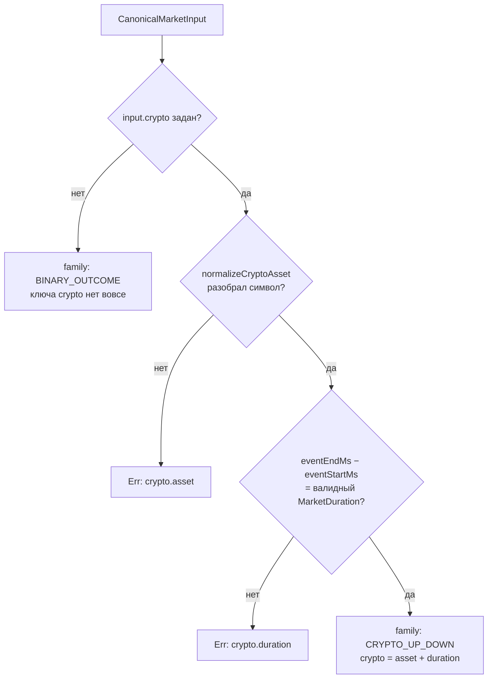

# Канонический Market при регистрации стратегии

## Проблема

`StrategyScheduler.register()` принимает каноническую доменную сущность `Market`
(`@polymarket/market`). Ротация рынков и бэктест-раннеры её под рукой не имели и
подсовывали заглушку:

```typescript
// БЫЛО — так делать нельзя
const marketStub = { expiresAt } as Parameters<typeof engine.scheduler.register>[0]['market'];
```

Каст стирает проверку типов, поэтому код компилировался. Но в рантайме у такого
«рынка» нет ни `outcomes`, ни `id`, ни `question`. Стратегия, которая читает
`snapshot.market.outcomes`, получает `undefined` и молча уходит в свою ветку
fallback.

Именно так `BinanceProbMMStrategy` определяла сторону токена: поиск исхода не
находил ничего **никогда**, срабатывал fallback `this._isUpToken = true`, и
DOWN-токен торговался как UP.

## Решение

Один общий конструктор `apps/bot/src/bot/buildCanonicalMarket.ts`, который
собирает настоящий `Market` из данных, уже доступных в точке регистрации:

```typescript
import { buildCanonicalMarket } from './buildCanonicalMarket.js';

const marketResult = buildCanonicalMarket({
  marketId: slot.marketId,
  question: slot.candidate?.question,
  instrumentId: slot.instrumentId,
  complementaryInstrumentId: slot.complementaryInstrumentId,
  outcomeIndex: slot.outcomeIndex,
  expiresAtMs: slot.expiresAtMs,
  // Начало расписания САМОГО рынка (events[0].startDate)
  startsAtMs: slot.candidate?.startsAt?.toNumber(),
  // Начало СОБЫТИЯ (eventStartTime) — другое поле, запасной источник
  eventStartMs: slot.cryptoMeta?.eventStartTimeMs,
  // Метаданные серии: есть → CRYPTO_UP_DOWN, нет → BINARY_OUTCOME
  crypto: slot.cryptoMeta
    ? {
      symbol: slot.cryptoMeta.rtdsFilter,
      eventStartMs: slot.cryptoMeta.eventStartTimeMs,
      eventEndMs: slot.cryptoMeta.endDateMs,
    }
    : undefined,
});
if (!marketResult.ok) {
  logger.error('Failed to build canonical market', {
    marketId: String(slot.marketId),
    error: marketResult.error.message,
  });
  return false;
}

await engine.scheduler.register({ /* ... */ market: marketResult.value });
```

### Шаги алгоритма

1. Проверяем комплементарный инструмент — без него двух исходов нет.
2. Считаем расписание: `expiresAt` обязателен, `startsAt` выбирается по цепочке
   приоритетов (см. ниже).
3. Определяем семейство: крипто-метаданные есть → `CRYPTO_UP_DOWN` со
   спецификацией (актив + номинал серии), нет → `BINARY_OUTCOME` без неё.
4. Раскладываем исходы: торгуемый инструмент — на позицию `outcomeIndex`,
   комплементарный — на встречную. Метка позиции 0 — `Up`, позиции 1 — `Down`.
5. Отдаём всё в `Market.create()` — доменные инварианты проверяет сущность.

### Точки вызова

| Файл | Источник данных | Поведение при `Err` |
| --- | --- | --- |
| `src/bot/MarketRotation.ts` | `MarketSlot` (discovery-кандидат) | лог + `return false` |
| `src/bot/runMultiMarketBacktest.ts` | `readSnapshotMeta` + Gamma `rawMarket` | лог + `return null` |
| `src/main.ts` (single-market backtest) | `readSnapshotMeta` + Gamma `rawMarket` | `logger.fatal` + `process.exit(1)` |

## Выбор семейства: CRYPTO_UP_DOWN или BINARY_OUTCOME

`MarketFamily` имеет два литерала, и связку «семейство → спецификация»
`Market.create()` проверяет в обе стороны: `CRYPTO_UP_DOWN` **требует** `crypto`,
`BINARY_OUTCOME` — **запрещает**.



**Почему отсутствие крипто-метаданных — не ошибка.** `parseCryptoMeta()`
возвращает `undefined`, когда `rawMarket` отсутствует (`DataRecorder` пишет его
условно, поэтому такие снапшоты существуют) либо `resolutionSource` не указывает
на Binance/Chainlink. Такой рынок существует, торговался и должен реплеиться —
если бы конструктор на нём падал, `main.ts` уходил бы в `process.exit(1)`,
а `runMultiMarketBacktest` возвращал `null` на снапшотах, которые до появления
канонического `Market` проигрывались нормально. `BINARY_OUTCOME` — это точное
утверждение о таком рынке: два взаимоисключающих исхода и окно торгов, без
предметной спецификации.

**Почему противоречивые крипто-метаданные — ошибка.** Если блок `crypto` пришёл,
рынок заявлен как принадлежащий крипто-серии. Символ, который не нормализуется,
и неположительное окно серии означают, что спецификацию из него честно не
собрать; «btc по умолчанию» соврал бы о том, на чём строится модель цены.

## Приоритет источников `startsAt`

`Market.startsAt` — это начало расписания **самого рынка**. `eventStartTime` —
начало **события**, к которому рынок привязан; `DiscoveredMarket` несёт оба поля
раздельно (`startsAt` из `events[0].startDate` и `eventStartMs` из
`eventStartTime`), и `StrategySnapshot.eventStartMs` в своём TSDoc тоже
подчёркивает, что это разные величины.

Конструктор берёт первый доступный источник из цепочки:

| # | Источник | Почему допустим |
| --- | --- | --- |
| 1 | `startsAtMs` (`events[0].startDate`) | Это и есть расписание рынка — ровно то, чем `Market.startsAt` определён. |
| 2 | `eventStartMs` (`eventStartTime`) | Площадка открывает рынок вместе с его событием; расхождение — секунды публикации. Честное приближение, когда собственного начала рынка площадка не отдала. |
| 3 | `expiresAtMs - FALLBACK_MARKET_DURATION_MS` (1 час) | Оба источника молчат. Часовая серия — доминирующее семейство крипто-рынков Polymarket. |

Fallback (шаг 3) влияет ровно на одно поле — `startsAt`. Номинальную
`crypto.duration` он **не** задаёт: она считается по окну серии и от расписания
рынка не зависит. Торговый контур `startsAt` не читает: стратегии берут
`market.expiresAt` и отдельное поле снапшота `eventStartMs`. Fallback существует
исключительно ради строгого инварианта `startsAt < expiresAt`, без которого
`Market.create()` рынок не пропустит.

Выбранный источник, оказавшийся **не раньше** `expiresAtMs`, — это противоречие
в данных площадки, а не пробел в них: переход к следующему источнику «починил»
бы расписание, которого не существует. Поэтому `Err` с
`context.field = 'startsAt'` и `context.source`, указывающим, какой именно
источник противоречив.

## Номинальная длительность серии, а не наблюдаемое окно

`crypto.duration` — это `MarketDuration`, **номинал серии** (5 минут, час), то
есть классификация рынка. Его TSDoc прямо говорит: это не то же самое, что
`expiresAt - startsAt`, потому что площадка сдвигает границы конкретного рынка
внутри серии (задержка публикации, выравнивание по TWAP-окну). `Market` хранит
обе величины и **не** проверяет их на равенство — фактический интервал даёт
`Market.duration()`.

Поэтому номинал считается по окну **события серии**:

```typescript
const duration = asMarketDuration(crypto.eventEndMs - crypto.eventStartMs);
// cryptoMeta.endDateMs − cryptoMeta.eventStartTimeMs
```

а не по расписанию рынка. Вывод номинала из `expiresAt - startsAt` схлопнул бы
ровно то различие, ради которого тип `MarketDuration` и существует: рынок со
сдвинутым на 40 секунд окном получил бы «серию длиной 5 минут 40 секунд».

## Порядок шагов на точках вызова: сборка ДО побочных эффектов

Конструктор зависит **только от метаданных** — ни сети, ни подписок, ни
запущенных сервисов ему не нужно. Поэтому обе точки вызова, у которых есть
побочные эффекты, строят рынок **первым делом**, до этих эффектов:

- **`MarketRotation.registerMarketAndStrategy()`** — сборка идёт до
  `wsAdapter.subscribeToToken()`, `marketCatalog.registerMarket()` и
  `recording.openMarket()`. Вызывающий (`openMarket`) на `false` удаляет только
  запись из `activeMarkets`; если бы сборка падала после этих шагов, за отказом
  оставались бы висящая WS-подписка, инструменты в каталоге и открытый
  market-файл recording.
- **`runSingleMarketBacktest()`** — сборка на шаге 5b, до «10. Запуск сервисов»
  (`marketDataStore.start()`, `orderEventBridge.start()`, `simulator.start()`,
  `scheduler.start()`). Их останавливает только шаг 14, поэтому `return null`
  между стартом и остановкой оставлял бы работающие scheduler/simulator/подписки
  на каждый пропущенный снапшот.

`main.ts` (single-market backtest) завершает процесс через `process.exit(1)`,
поэтому там порядок роли не играет.

## Почему это сделано так

### Почему конструктор возвращает `Result`, а не бросает

Регистрация стратегии — не место для исключений: у каждой точки вызова свой
способ отменить открытие рынка (`false` / `null` / `process.exit`). `Result`
позволяет вызывающему обработать отказ его собственной идиомой.

### Почему у каждого решения именно такое значение

- **`question` → `String(marketId)`.** Вопрос не участвует в торговых решениях,
  но `Market.create()` требует непустую строку. ID рынка — единственная
  подстановка, которая ничего не выдумывает и однозначна в логах.
- **Нет `complementaryInstrumentId` → `Err`.** Второй CTF-токен нельзя вывести из
  одного лишь торгуемого `tokenId`. Придуманный `instrumentId` означал бы
  маршрутизацию ордеров в несуществующий инструмент.
- **Нет крипто-метаданных → `BINARY_OUTCOME`,** а не `Err` — см. раздел
  «Выбор семейства».
- **Начало расписания → цепочка приоритетов,** противоречие → `Err` — см. раздел
  «Приоритет источников `startsAt`».
- **`state` → `MarketState.active()`.** Стратегия регистрируется только на рынке,
  который площадка отдаёт как торгуемый; подтверждённого закрытия у нас нет.
- **`slug` не заполняется.** Домену он не нужен, а строить слаг из вопроса значит
  выдумывать идентификатор площадки.

### Почему `crypto.symbol`, а не готовый `CryptoAssetId`

Планировщик выводит `StrategyEntry.cryptoAsset` из `cryptoSymbol` функцией
`normalizeCryptoAsset()`. Если бы конструктор принимал уже нормализованный актив,
он мог бы разойтись с планировщиком. Поэтому на вход идёт **тот же сырой символ**
(обычно `cryptoMeta.rtdsFilter`), а нормализует его **та же самая функция**:
`normalizeCryptoAsset` экспортирована из `@polymarket/strategy` специально для
этого. Своя копия алгоритма здесь была бы источником молчаливого расхождения —
`market.crypto.asset` и `StrategyEntry.cryptoAsset` указывали бы на разные активы
без единой ошибки компиляции.

### Почему `parseGammaMarketStartMs()` живёт рядом с конструктором

Бэктест-раннеры получают рынок не от discovery, а из meta-строки снапшота, где
`DiscoveredMarket.startsAt` уже не сохранён — но исходный `rawMarket` записан
целиком, и `events[0].startDate` в нём тот же самый, из которого discovery строит
`startsAt`. Обе бэктест-точки вызова читают это поле для одного и того же входа
`CanonicalMarketInput.startsAtMs`, поэтому разбор вынесен в один экспортируемый
хелпер, а не скопирован дважды. `undefined` от него — штатный случай: цепочка
приоритетов перейдёт к следующему источнику.

## Конвенция меток исходов

`outcomeIndex 0 = Up`, `outcomeIndex 1 = Down` — конвенция уже действовала в
`MarketRotation.openMarket`, `readSnapshotMeta` и `BacktestEngine`. Метки `Up` и
`Down` распознают `isUpLikeOutcome`/`isDownLikeOutcome` в
`src/strategies/BinanceProbMMStrategy.ts`, поэтому строки заданы дословно.
