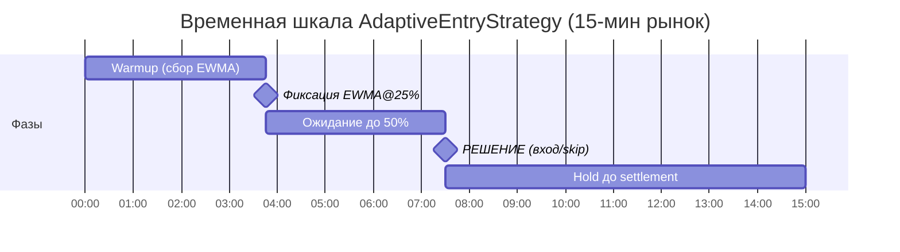
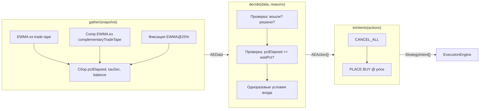

# AdaptiveEntryStrategy

## Обзор

**AdaptiveEntryStrategy** — стратегия одноразового входа на основе momentum-сигнала для бинарных крипто-рынков Polymarket (Bitcoin Up / Down).

Стратегия принимает **одно решение** на отметке 50% времени жизни рынка: войти или пропустить. После этого решение необратимо — повторная оценка не выполняется. Если вход подтверждён, выставляется limit BUY ордер и позиция удерживается до settlement.

**Файл реализации**: `apps/bot/src/strategies/AdaptiveEntryStrategy.ts`

---

## Алгоритм

### Пошаговая логика

1. Вычисляем EWMA (alpha=0.3) цены из trade tape для основного токена
2. Если доступен `complementaryTradeTape` — вычисляем EWMA комплементарного токена
3. На отметке 25% времени рынка — фиксируем EWMA обоих токенов (trajectory snapshot)
4. На отметке `waitPct` (по умолчанию 50%) — **одноразовое** решение:
   - Для каждого токена (primary и complementary) проверяем:
     - EWMA >= `minEwmaCents` (default 50) — токен достаточно дорогой
     - EWMA > 50¢ — токен "в деньгах" (UP+DOWN ~ 100)
     - Rise (EWMA@50% - EWMA@25%) >= `minRiseCents` (default 5) — momentum подтверждён
   - **Auto-selection**: выбираем лучший из подходящих токенов:
     - Оба подходят → берём с большим rise
     - Один подходит → берём его
     - Ни один → SKIP
5. Выбран токен → limit BUY по цене `(EWMA - bidOffsetCents)` на выбранном инструменте
6. Не выбран → **SKIP** этого рынка навсегда

> **Один конфиг на рынок** — стратегия сама решает, купить UP или DOWN.

### Диаграмма принятия решения

```mermaid
flowchart TD
    A[Новый тик] --> B{Уже вошли / есть позиция?}
    B -- Да --> HOLD[HOLD до settlement]
    B -- Нет --> C{Решение уже принято?}
    C -- Да skip --> HOLD
    C -- Нет --> D{pctElapsed >= waitPct?}
    D -- Нет --> HOLD
    D -- Да --> E{EWMA@25% зафиксирован?}
    E -- Нет --> HOLD
    E -- Да --> F["ОДНОРАЗОВОЕ РЕШЕНИЕ<br/>(flag _decided = true)"]
    F --> G["Проверка PRIMARY:<br/>ewma>=minEwma, ewma>50, rise>=minRise"]
    F --> H["Проверка COMP:<br/>compEwma>=minEwma, compEwma>50, compRise>=minRise"]
    G --> I{Кто подходит?}
    H --> I
    I -- Никто --> SKIP[SKIP навсегда]
    I -- "Только primary" --> BUY_P["BUY PRIMARY @ (ewma - offset)"]
    I -- "Только comp" --> BUY_C["BUY COMP @ (compEwma - offset)<br/>с targetInstrumentId"]
    I -- "Оба" --> J{rise >= compRise?}
    J -- Да --> BUY_P
    J -- Нет --> BUY_C
```

### Жизненный цикл на временной шкале рынка



---

## Архитектура: Gather → Decide → ToIntents

Стратегия построена на `BaseStrategy<AEData, AEAction>` и реализует три фазы:



### `gather(snapshot)` — сбор данных

- Обрабатывает trade tape записи с инкрементальным EWMA (alpha=0.3)
- Обрабатывает `complementaryTradeTape` аналогично
- Фиксирует EWMA@25% для обоих токенов (флаги `_ewmaAt25Captured`, `_compEwmaAt25Captured`)
- При смене рынка (`expirationMs` изменился) — полный сброс состояния
- Возвращает `undefined` до warmup (менее `warmupTrades` сделок)

### `decide(data, _reasons)` — одноразовое решение (auto-selection)

- Если `_entered` или есть позиция/pending ордер → `HOLD`
- Если `_decided` (skip) → `HOLD`
- Если `pctElapsed < waitPct` → `HOLD`
- Иначе: выставляем `_decided = true` и проверяем оба токена:
  - Primary: `ewma >= minEwma && ewma > 50 && rise >= minRise`
  - Complementary: `compEwma >= minEwma && compEwma > 50 && compRise >= minRise`
- Выбираем лучший (по rise), при равенстве — primary
- Balance check: `orderSize * buyPrice / 100 <= availableBalance`
- Цена покупки: `clamp(round(chosenEwma) - bidOffset, 1, 99)`
- Если выбран comp: action содержит `targetInstrumentId` + `targetAsset`

### `toIntents(actions)` — конвертация в интенты

- `BUY` → `[CANCEL_ALL, PLACE(BUY, price, size, targetInstrumentId?, targetAsset?)]`
- `HOLD` → `[]` (пустой массив)

---

## Параметры

| Параметр | Тип | Default | Описание |
|----------|-----|---------|----------|
| `orderSize` | `Decimal` | **обязателен** | Размер ордера в токенах |
| `waitPct` | `number` | `0.5` | Доля времени рынка для ожидания перед решением (0.0–1.0) |
| `minEwmaCents` | `number` | `50` | Минимальная EWMA в центах для входа |
| `minRiseCents` | `number` | `5` | Минимальный рост EWMA@50% vs EWMA@25% (центы) |
| `warmupTrades` | `number` | `10` | Минимум трейдов до начала анализа |
| `bidOffsetCents` | `number` | `1` | Смещение от EWMA для limit BUY. Положительное = ниже EWMA (maker), отрицательное = выше (taker) |

---

## Почему это работает

### Momentum persistence
Если токен дорожает к середине 15-минутного рынка, с вероятностью ~85% тренд продолжится до settlement. Стратегия эксплуатирует эту статистическую закономерность.

### Отсутствие inventory risk
Одна сделка за рынок — нет необходимости управлять инвентарём, нет adverse selection.

### Флаг `_decided` — одноразовая оценка
Предотвращает повторный вход на пограничных рынках, где EWMA колеблется вокруг порога. Стратегия SmartEntry (предшественник) проверяла каждый тик после 50% и входила в маргинальные рынки.

### Условие `ewma > 50`
Гарантирует максимум один вход на пару UP/DOWN: если UP EWMA > 50, то DOWN EWMA < 50 (UP + DOWN ~ 100). Это исключает одновременный вход в оба токена.

### Trade tape EWMA вместо order book mid
На 15-минутных рынках Polymarket спреды в ордербуке часто 1¢/99¢, что делает mid всегда ~50¢. Trade tape EWMA отражает реальную цену исполнения.

---

## Auto-Selection (Dual-Token)

Стратегия автоматически выбирает какой токен купить (UP или DOWN) на основе сравнения momentum обоих.

### Источники данных

| Режим | Источник данных |
|-------|----------------|
| **Backtest** | `BacktestEngine` с `replayComplementaryTrades: true` — воспроизводит trade events обоих токенов |
| **Paper** | WS-подписка на комплементарный токен через `wsAdapter.subscribeToToken` |
| **Live** | Аналогично paper через `marketWsAdapter.subscribeToToken` |

### Механизм auto-selection

1. `StrategyScheduler` заполняет `complementaryTradeTape` и `complementaryAsset` в snapshot
2. Стратегия проверяет оба токена по одинаковым критериям (ewma >= minEwma, ewma > 50, rise >= minRise)
3. Выбирает лучший из подходящих (по rise). Если подходит только один — берёт его
4. При покупке комплементарного токена `PlaceIntent` содержит `targetInstrumentId` и `targetAsset`
5. `ExecutionEngine` маршрутизирует ордер на правильный инструмент вместо основного из контекста

### Маршрутизация в ExecutionEngine

`PlaceIntent` теперь поддерживает опциональные поля `targetInstrumentId` и `targetAsset`.
Если указаны — `ExecutionEngine._executePlace()` использует их вместо `ctx.instrumentId/ctx.asset`
для каталога, PlaceOrderUseCase и cooldowns.

### Settlement с auto-selection

В бэктесте settlement проверяет позиции на обоих инструментах (primary и complementary).
Для комплементарного токена `outcomeIndex` инвертирован: если стратегия зарегистрирована на UP (index=0)
и купила DOWN, settlement использует index=1 для определения winning/losing.

---

## Изменённые файлы для auto-selection

| Файл | Изменение |
|------|-----------|
| `packages/application/strategy/src/types/StrategyIntent.ts` | `PlaceIntent` + `targetInstrumentId?`, `targetAsset?` |
| `packages/application/strategy/src/types/StrategySnapshot.ts` | + `complementaryInstrumentId`, `complementaryAsset`, `complementaryTradeTape` |
| `packages/application/strategy/src/StrategyScheduler.ts` | `complementaryInstrumentId` + `complementaryAsset` в регистрации и snapshot |
| `packages/application/strategy/src/ExecutionEngine.ts` | `_executePlace()` использует `targetInstrumentId/targetAsset` из intent |
| `packages/infrastructure/backtesting/src/BacktestEngine.ts` | Конфиг `replayComplementaryTrades`, обработка trade events обоих токенов |
| `apps/bot/src/bot/runMultiMarketBacktest.ts` | Регистрация complementary рынка в PaperExchangeClient и каталоге, settlement обоих инструментов |
| `apps/bot/src/bot/readSnapshotMeta.ts` | Извлечение complementary token ID из meta |
| `apps/bot/src/main.ts` | Paper/live: `complementaryAsset` в слотах и scheduler, WS-подписка |
| `apps/bot/src/strategies/AdaptiveEntryStrategy.ts` | Auto-selection: сравнение обоих EWMA, выбор лучшего, targetInstrumentId в BUY action |

---

## Результаты бэктестов

### 15-мин: Auto-selection (все 4 дня)

Конфиг: `orderSize=5, waitPct=0.5, minEwma=50, minRise=5, warmup=10, bidOffset=1`

| День | Рынков | Fills | Wins | Losses | WR | PnL |
|------|--------|-------|------|--------|-----|-----|
| btc1 | 25 | 13 | 9 | 4 | 69.2% | **-5.45** |
| btc2 (train) | 89 | 45 | 37 | 9 | 80.4% | **+13.71** |
| btc4 | 61 | 20 | 16 | 3 | 84.2% | **+1.87** |
| btc5 (OOS) | 77 | 36 | 29 | 7 | 80.6% | **+8.60** |
| **Итого** | **252** | **114** | **91** | **23** | **79.8%** | **+18.73** |

**3 из 4 дней прибыльные. OOS (btc5) — второй лучший день. btc1 убыточный (малый dataset, 25 рынков).**

### 5-мин: Baseline и parameter sweep

5-минутные рынки протестированы с baseline и полным sweep параметров.

**Baseline (minRise=5)**:

| День | PnL |
|------|-----|
| btc1 | -12.80 |
| btc2 (train) | **+38.79** |
| btc4 | -21.13 |
| btc5 | -2.14 |
| **Итого** | **+2.72** |

**Parameter sweep на btc2 (train)**:

| Параметр | Лучшее значение | PnL btc2 | Комментарий |
|----------|-----------------|----------|-------------|
| minRise | 2 | +41.24 | Overfits: OOS хуже baseline |
| warmup | 3-15 (нет разницы) | +41.24 | Не влияет на 5-мин |
| waitPct | 0.5 | +41.24 | 0.3/0.4/0.6/0.7 все хуже |
| bidOffset | 1 | +41.24 | 0/2/3 все хуже |

**OOS с minRise=2 (overfit)**:

| День | PnL |
|------|-----|
| btc1 | -14.05 |
| btc2 | +41.24 |
| btc4 | -27.78 |
| btc5 | -18.59 |
| **Итого** | **-19.18** (хуже baseline!) |

**Вывод**: 5-минутные рынки не подходят для momentum-стратегии — слишком мало persistence. btc2 аномально хороший день, но 3/4 OOS дней убыточные. **15-мин — рекомендуемый таймфрейм.**

### Сравнение: UP only vs Auto-selection (btc2)

| Метрика | UP only | Auto (UP+DOWN) |
|---------|---------|----------------|
| Fills | 19 | **45** (+137%) |
| Wins/Losses | 19/1 | 37/9 |
| Win Rate | 95.0% | 80.4% |
| PnL | +14.74 | +13.71 |

Auto-selection входит в 2.4x больше рынков. WR ниже, но PnL сопоставим.

### Сравнение вариантов bidOffset (15-мин, все 4 дня)

| Вариант | PnL | Fills | WR | Комментарий |
|---------|-----|-------|----|-------------|
| **Baseline (off=1)** | **+18.73** | 114 | 79.2% | Лучший |
| off=3 | +16.46 | 96 | 75.9% | Меньше fills, широкий offset не помогает |
| Market (off=-2) | +7.98 | 128 | 78.2% | Больше fills, но переплата на входе |
| Combo (ewma45+off=2) | +17.70 | 106 | 79.0% | Похож на baseline |

**Вывод**: baseline (bidOffset=1) оптимален. Агрессивный вход (market buy, off=-2) — худший вариант: переплата ~3¢ на каждом входе уничтожает edge.

### Разрыв: скрипт vs бот

| Метод | PnL | Fill Rate |
|-------|-----|-----------|
| Аналитический скрипт (`scripts/analyze-adaptive.ts`) | +41.30 USDC | 100% (теоретический) |
| Бот-бэктест | +18.73 USDC | ~70% (реалистичный) |

Источники разрыва: незаполненные limit-ордера (~30%), различия в тайминге EWMA, реалистичная механика fill.

---

## Пример конфигурации

```json
{
  "strategy": "adaptive-entry",
  "strategyParams": {
    "orderSize": 5,
    "waitPct": 0.5,
    "minEwmaCents": 50,
    "minRiseCents": 5,
    "warmupTrades": 10,
    "bidOffsetCents": 1
  },
  "market": {
    "source": "snapshots",
    "paths": ["/tmp/15min-btc-day2/*"],
    "outcomeIndex": 0
  },
  "resources": {
    "initialBalance": 100,
    "maxConcurrentMarkets": 1,
    "minCapitalPerMarket": 10,
    "tradingBalanceRatio": 1.0
  },
  "paper": {
    "fillOnBookCrossing": true,
    "fillOnTape": true,
    "fillAtOrderPrice": true
  },
  "account": {
    "accountId": "venue:POLYMARKET:paper-account"
  }
}
```

---

## Запуск

Auto-selection: один конфиг, один запуск — стратегия сама выбирает UP или DOWN.

```bash
# Auto-selection (рекомендуется): outcomeIndex=0, стратегия оценит оба токена
MODE=backtest CONFIG=configs/ae-auto-btc2-backtest.json npx tsx src/main.ts

# Или ручной UP/DOWN (legacy):
MODE=backtest CONFIG=configs/ae-up-btc2-backtest.json npx tsx src/main.ts
MODE=backtest CONFIG=configs/ae-dn-btc2-backtest.json npx tsx src/main.ts
```
