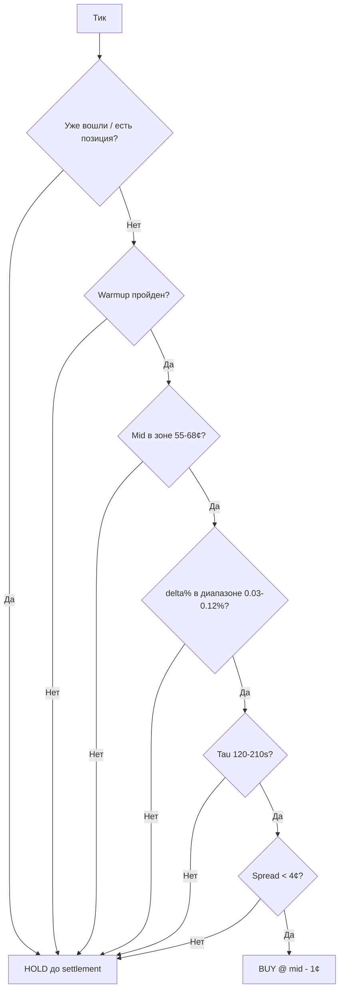

# SelectiveEntryStrategy

## Обзор

**SelectiveEntryStrategy** — простейшая стратегия buy-and-hold до settlement на основе zone filter и delta%.

На каждом рынке стратегия **многократно** проверяет условия входа (на каждом тике). Как только все фильтры пройдены — ставит limit BUY и **держит до settlement**. Без exit logic, без trail stop, без market making.

**Файл реализации**: `apps/bot/src/strategies/SelectiveEntryStrategy.ts`

---

## Алгоритм

### Пошаговая логика

1. Ждём warmup (`warmupSec`, default 60s), накапливаем EWMA mid из trade tape
2. На каждом тике проверяем **все** условия (все должны быть true):
   - Mid (EWMA) в зоне `[minZone, maxZone]` (default 55-68¢)
   - `|delta%|` в диапазоне `[minDelta, maxDelta]` (default 0.03-0.12%)
   - Tau в диапазоне `[minTau, maxTau]` (default 120-210s)
   - Spread < `maxSpread` (default 4¢)
   - Знак delta соответствует `side` (UP: delta > 0, DOWN: delta < 0)
3. Если все фильтры пройдены → limit BUY по `(mid - bidOffset)` ¢
4. Флаг `_entered = true` — больше не проверяем, держим до settlement

### Диаграмма



---

## Параметры

| Параметр | Тип | Default | Описание |
|----------|-----|---------|----------|
| `orderSize` | `Decimal` | **обязателен** | Размер ордера в токенах |
| `minZoneCents` | `number` | `55` | Нижняя граница зоны покупки (¢) |
| `maxZoneCents` | `number` | `68` | Верхняя граница зоны покупки (¢) |
| `minDeltaPct` | `number` | `0.03` | Минимальный |delta%| для входа |
| `maxDeltaPct` | `number` | `0.12` | Максимальный |delta%| для входа |
| `minTauSec` | `number` | `120` | Минимальный tau (секунды) |
| `maxTauSec` | `number` | `210` | Максимальный tau (секунды) |
| `maxSpreadCents` | `number` | `4` | Максимальный spread (¢) |
| `warmupSec` | `number` | `60` | Секунды ожидания для EWMA стабилизации |
| `bidOffsetCents` | `number` | `1` | Скидка от mid для limit BUY (¢) |
| `side` | `'up' \| 'down'` | `'up'` | Какой токен покупаем |

---

## Почему это работает

### Zone filter 55-68¢
Когда токен стоит 55-68¢, рынок считает P(UP) ≈ 55-68%. При этом реальная P(UP) выше из-за momentum persistence. Breakeven для покупки за 60¢ = 60% WR. Мы покупаем при P(UP) > 60%.

### Delta% как сигнал
`delta% = (cryptoPrice - strikePrice) / strikePrice × 100`. Диапазон 0.03-0.12% означает BTC значимо выше strike, но не слишком далеко (ещё есть upside).

### Hold до settlement
Нет overfit на exit logic. Нет adverse selection. Одна сделка на рынок.

---

## Отличия от AdaptiveEntry

| | SelectiveEntry | AdaptiveEntry |
|-|----------------|---------------|
| **Сигнал** | delta% + zone filter | EWMA momentum (rise) |
| **Когда решение** | Любой тик после warmup | Строго на 50% времени рынка |
| **Повторная проверка** | Да (каждый тик до входа) | Нет (одноразовое решение) |
| **Dual-token** | Нет (side='up' или 'down') | Да (auto-selection UP/DOWN) |
| **Зависимость от crypto price** | Да (Chainlink delta%) | Нет (только trade tape EWMA) |
| **Рынки** | 5-мин и 15-мин | Лучше всего 15-мин |

---

## Результаты бэктестов (15-мин)

### Baseline (UP side)

| День | Fills | Wins | Losses | WR | PnL |
|------|-------|------|--------|-----|-----|
| btc1 | 16 | 12 | 4 | 75.0% | +4.87 |
| btc2 (train) | 23 | 16 | 7 | 69.6% | +2.48 |
| btc4 | 25 | 16 | 9 | 64.0% | +2.01 |
| btc5 (OOS) | 17 | 12 | 5 | 70.6% | +4.39 |
| **Итого** | **81** | **56** | **25** | **69.1%** | **+13.75** |

**4/4 дня прибыльные. OOS положительный.** WR 69% при среднем входе ~61¢ (breakeven 61%).

---

## Пример конфигурации

```json
{
  "strategy": "selective-entry",
  "strategyParams": {
    "orderSize": 5,
    "minZoneCents": 55,
    "maxZoneCents": 68,
    "minDeltaPct": 0.03,
    "maxDeltaPct": 0.12,
    "minTauSec": 120,
    "maxTauSec": 210,
    "maxSpreadCents": 4,
    "warmupSec": 60,
    "bidOffsetCents": 1,
    "side": "up"
  },
  "market": {
    "source": "snapshots",
    "paths": ["/tmp/15min-btc-day2/*"],
    "outcomeIndex": 0
  },
  "resources": {
    "initialBalance": 100,
    "maxConcurrentMarkets": 1,
    "minCapitalPerMarket": 10,
    "tradingBalanceRatio": 1.0
  },
  "paper": {
    "fillOnBookCrossing": true,
    "fillOnTape": true,
    "fillAtOrderPrice": true
  },
  "account": {
    "accountId": "venue:POLYMARKET:paper-account"
  }
}
```

---

## Запуск

```bash
MODE=backtest CONFIG=configs/sel-baseline-btc2-backtest.json npx tsx src/main.ts
```
