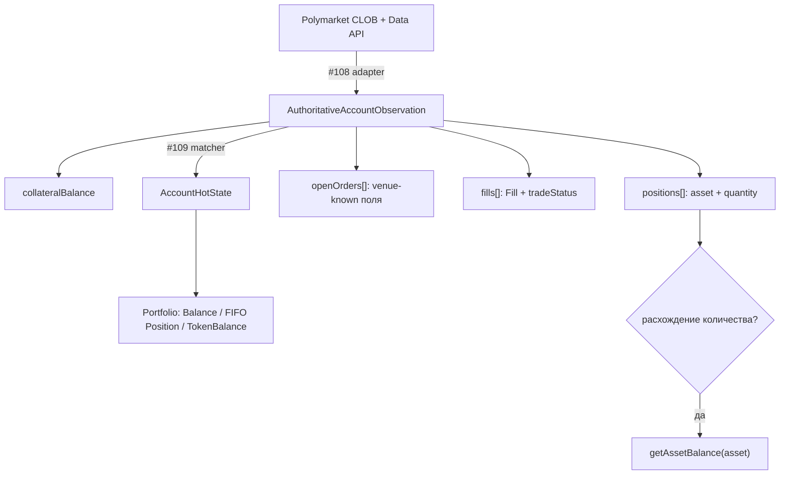

# Наблюдения аккаунта на площадке: контракт и знания для Polymarket-адаптера

Контракт authoritative-**фактов** площадки об аккаунте —
`IAccountVenueObservationSource` и `Authoritative*Observation` из
`@polymarket/account-reconciliation`. Сам контракт, таблица «факт площадки ↔
локальный факт» и будущая политика сверки описаны в README пакета
(`packages/application/account-reconciliation/README.md`, раздел «Venue
Observations vs Local Portfolio»). Здесь — **почему** он устроен так и что
из legacy-кода обязан знать будущий адаптер.

> Статус: контракт объявлен (#107), реализаций нет, сверка его не вызывает.
> Адаптер — #108, matcher и переключение `AccountReconciler` — #109.

## Почему не `getPortfolio(): Portfolio`

Существующий порт сверки `IAccountReconciliationSource` требует готовый
`Portfolio`. Это удобно для fake-источника в тестах, но настоящая площадка не
знает того, из чего `Portfolio` состоит:

| часть `Portfolio` | знает ли площадка | что пришлось бы сделать адаптеру |
| --- | --- | --- |
| `Balance.available` / `reserved` | нет — у неё нет нашей резервации | выдумать разделение |
| `Position.lots[]` (FIFO) | нет — это наша provenance исполнений | синтетический лот на `size × avgPrice` |
| `Order.strategyId`, `timestamp`, `reason` | нет | `undefined` → ложный конфликт идентичности |
| `TokenBalance.available` / `reserved` | нет | выдумать разделение |

Синтетический лот выглядит валидным, но уничтожает FIFO-provenance: первое
же закрытие посчитало бы неверный realized PnL. Поэтому адаптер отдаёт
**только факты**, а собирать из них локальную бухгалтерию будет matcher.

## Решение: факты площадки отдельно от локального состояния



Ключевые правила контракта:

1. `collateralBalance` — **полное** владение, сравнивается с
   `available + reserved`, а не с `available`.
2. Позиция — `asset + quantity`; `averagePrice`/`entryCost` — только
   диагностика, **не** источник лотов. Поля `lots` нет.
3. Заявка — отдельный DTO без `strategyId`/`timestamp`; `PENDING` не может
   быть authoritative (`Exclude<OrderStatus, 'PENDING'>`).
4. Сделка — canonical `Fill` + **обязательный** `tradeStatus`: присутствие в
   ответе площадки ≠ финальность.
5. `getAssetBalance()` — targeted-проверка одного актива и только при
   расхождении, не в каждом проходе.
6. Fail closed везде: непереводимый статус, оборванная пагинация, непонятая
   запись — `Err`, а не «разумное значение по умолчанию».

## Шаги будущего прохода наблюдения (#108)

```text
1. collateral   CLOB balance-allowance, asset_type = COLLATERAL      → Money
2. positions    Data API listPositions(user), все страницы           → asset + quantity
3. open orders  CLOB /data/orders, все страницы (next_cursor)        → AuthoritativeOrderObservation[]
4. trades       CLOB listAccountTrades, все страницы до "LTE="       → FillMapper-правило → Fill + tradeStatus
5. собрать AuthoritativeAccountObservation; отказ ЛЮБОГО шага → Err всего прохода
```

Каждый набор читается **один раз** за проход. Наблюдение не атомарно на
стороне площадки — это свойство источника, а не дефект; CAS в
`AccountHotState` защищает от гонки с живым контуром.

## Что из legacy-кода сохранить — и что не переносить

Legacy-код лежит в `legacy-bot/live-account-reference/` и
`legacy-bot/trading-contour-reference/` **только как справочник**:
импортировать его нельзя, архитектуру не переносим. Ниже — знание, добытое им
в бою.

### Статусы заявок: никакого «неизвестный → OPEN»

`PolymarketOrderMapper.mapStatus` (`rest/mappers/PolymarketOrderMapper.ts`)
на любой незнакомый vendor-статус возвращал `open` с предупреждением в лог.
Под это попадали `canceled` (американское написание), `unmatched`, `delayed`.
Угаданный `OPEN` держит резервацию под заявкой, которой на площадке, возможно,
нет. В новом контракте — `Err`.

Встречавшиеся vendor-строки: `live`, `matched`, `canceled`/`cancelled`,
`delayed`, `unmatched` (и `pending`, `filled` в старых типах). Строка SDK
`OpenOrder` — `id`, `original_size`, `size_matched`, `created_at`, `status`
(статус — невалидируемая строка).

### Открытые заявки: пагинация и «отсутствие ≠ отмена»

- `/data/orders` пагинирован (`{count, data, limit, next_cursor}`), а legacy
  читал одну страницу и превращал не-массив в `[]` — то есть мог молча вернуть
  пустой список.
- Фильтр `signature_type` у proxy-кошелька скрывал наши же заявки.
- Legacy считал локальную заявку, которой нет среди открытых, **отменённой**.
  В контракте отсутствие среди `openOrders` ничего не означает: matcher
  спрашивает `getOrderObservation`, а `undefined` — это «не знаю», не
  `CANCELED`.

### Сделки аккаунта: полнота, владение, идентичность

- `/data/trades` пагинирован курсором до `"LTE="`. Legacy бросал при
  превышении лимита страниц и при отсутствии курсора — fail closed правильно.
- **Одна непереводимая запись роняет весь вызов.** Эндпоинт возвращает только
  наши сделки, поэтому ошибка маппинга — дефект маппинга или schema drift, а не
  «чужая сделка» (см. `polymarket-venue-lessons.md`). Пустой `Ok` однажды
  ошибочно освободил удержанный капитал.
- **Фильтр `maker_address` — открытый вопрос.** Комментарий в
  `PolymarketExecutionAdapter.getFilledOrders` утверждает, что с ним API
  отдаёт только сделки, где мы maker, и taker-исполнения теряются; при этом
  `apps/pnl` его передаёт. Перед #108 проверить на живом аккаунте.
- **Владение maker-заявкой** — по нашей записи в `maker_orders[]` (`owner` или
  `maker_address`, инжектированный из НАШИХ credentials, а не из ответа). В
  cross-outcome сделке поля верхнего уровня (`owner`, `asset_id`, `side`)
  принадлежат тейкеру; наш токен, сторона, цена и объём — из нашей записи.
  `apps/pnl` `TradesFetcher` при ненайденном адресе откатывается на поля
  верхнего уровня, то есть может записать сторону контрагента как свою, — это
  поведение не переносится.
- **Тот же `FillId`, что у приватного WS.** Два P0 legacy
  (`mapUserFillsToVenueTrades.ts`): REST принимал чужие maker-заявки за свои
  и давал другой `FillId`, чем WS, — исполнение применялось дважды. Правило
  `FillId` (`FillMapper.allFromPolymarketTradeEvent`):

  ```text
  TAKER                          FillId = tradeId
  MAKER, одна наша заявка        FillId = tradeId
  MAKER, несколько наших заявок  FillId = `${tradeId}:${orderId}`
  ```

  `FillId` одной заявки зависит от того, **сколько наших** заявок в записи,
  поэтому REST и WS обязаны видеть один и тот же набор `maker_orders`.
  Self-match (мы и тейкер, и мейкер) этим правилом не представим.
- **`FillMapper` умеет только WS-форму** (snake_case). REST `ClobTrade`
  официального SDK — camelCase (`makerOrders`, `matchedAt` в ISO, статус с
  префиксом `TRADE_STATUS_`). Legacy подгонял REST под WS переименованием
  полей. Для #108 правило `FillId` и владения нужно **переиспользовать**, а не
  написать заново.

### Статус сделки: не терять и не угадывать

| путь legacy | применял | откладывал | `FAILED` |
| --- | --- | --- | --- |
| живой WS | `MATCHED` сразу; `CONFIRMED` — если `MATCHED` пропущен | `MINED`, `RETRYING` | откат через `reverseFill` |
| REST-восстановление | `MATCHED` + `CONFIRMED` | `MINED`, `RETRYING`, без статуса | отдельная ветка |
| settlement заявок | только `CONFIRMED` | всё остальное | отдельная ветка |

- Токены cross-outcome MINT-исполнения CLOB не даёт продать, пока сделка не
  `CONFIRMED` (`MINED` недостаточно).
- `FAILED` после локального применения legacy **не откатывал**
  автоматически: `VENUE_FILL_FAILED_AFTER_LOCAL_APPLIED` + issue рассинхрона.
  В новой модели это решение matcher-а (#109), а наблюдение лишь несёт факт.
- `FillMapper` превращает незнакомый или префиксный статус в `undefined`, а
  `apps/pnl` сохраняет сделки с пустым статусом. Для наблюдения статус
  **обязателен**: такая запись — `Err`.
- SDK знает статус `TRADE_STATUS_MATCHED_NOT_BROADCASTED`, которого нет в
  canonical `TradeStatus`. Пока он не решён явно — `Err` (fail closed).

### Балансы: базовые единицы, без `parseFloat`

- Collateral — `balance-allowance` с `asset_type = COLLATERAL`, токен —
  `asset_type = CONDITIONAL` + `token_id`. Оба в базовых единицах 1e6. Legacy
  делил через `parseFloat` и на `NaN` возвращал **ноль** с предупреждением —
  в контракте `Err`, а перевод — точный, без `number`.
- Официальный SDK `fetchBalanceAllowance` отдаёт `{ balance, allowances }`
  (карта по адресам), а не одиночный `allowance`, как ожидал legacy.
- Legacy-провайдер на невалидный `tokenId` возвращал нулевой баланс. Для
  `getAssetBalance` «площадка не знает актив» и «аккаунт держит 0» — разные
  ответы; первое — `Err`.

### Фактический баланс токена расходится с event-sourced портфелем

Именно ради этого есть `getAssetBalance`. Наблюдавшиеся случаи:

- CLOB: `balance: 9557200, order amount: 9560000` — портфель 9.56, on-chain
  9.5572 (округление MINT/MERGE, меньший частичный fill, зазор между WS и
  расчётом), см. `sell-balance-protection.md`;
- «фантомная позиция»: cross-outcome MINT-исполнение тейкера дошло до `MINED`,
  заявку отменили, MINT всё равно завершился — токены есть в портфеле, но не в
  CLOB-балансе;
- legacy `BalancePolicy` не учитывал открытые SELL — двойная продажа. Отсюда
  правило: venue holding = `available + reserved`, а не `available`.

### Позиции: Data API, а не legacy

Legacy-рантайм API позиций не использовал вовсе: позиции были только
event-sourced, а единственной on-chain правдой был `CONDITIONAL`-баланс.
Официальный SDK (`listPositions`, как в `apps/pnl`):

- поля `size`, `avgPrice`, `initialValue`, `tokenId` (**может быть `null`**),
  числа — `DecimalString | null`; поля `currentSize` нет;
- параметры: `user`, `sizeThreshold`, `redeemable`, `mergeable`, курсор;
  `apps/pnl` `sizeThreshold` не задаёт. Значение по умолчанию надо проверить:
  отфильтрованная «пыль» неотличима от отсутствия позиции;
- строка без `tokenId` не адресуется по `asset` — `Err`, а не пропуск.

`size` → `quantity`, `avgPrice` → `averagePrice`, `initialValue` →
`entryCost` (диагностика).

## Открытые вопросы для #108

| вопрос | почему важен |
| --- | --- |
| режет ли `maker_address` taker-сделки в `listAccountTrades` | неполный `fills[]` = невидимые исполнения |
| `sizeThreshold` по умолчанию у `listPositions` | пыль пропадёт из `positions[]` |
| `MATCHED_NOT_BROADCASTED` → какой `TradeStatus` и нужен ли он | сейчас fail closed |
| `delayed` / `unmatched` у заявок → какой `AuthoritativeOrderStatus` | сейчас fail closed |
| `fills[]` — полная история или окно (`after`) | при окне отсутствие исполнения ничего не доказывает |
| `FillMapper` для camelCase `ClobTrade` | тот же `FillId`, что у WS |

## Связанное

- `packages/application/account-reconciliation/README.md` — контракт и
  текущая сверка (#106).
- `docs/guides/polymarket-venue-lessons.md` — ошибка маппинга ≠ «чужая
  запись», семантика эндпоинтов.
- `docs/guides/sell-balance-protection.md` — расхождение баланса токена с
  портфелем.
- `docs/guides/polymarket-fee-settlement.md` — комиссия тейкера.
