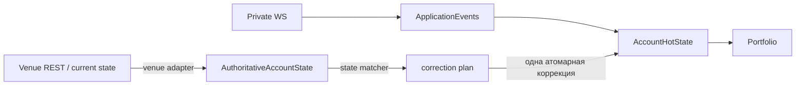

# Authoritative-состояние аккаунта на площадке: граница и знания для Polymarket-адаптера

Target production-граница `IAccountVenueStateSource` и DTO
`Authoritative*State` из `@polymarket/account-reconciliation`. Сам контракт,
таблица «факт площадки ↔ локальный факт», примеры и будущий порядок
коррекции описаны в README пакета
(`packages/application/account-reconciliation/README.md`, раздел «Целевая
модель»). Здесь — **почему** граница устроена так и что из legacy-кода
обязан знать будущий адаптер.

> Статус: граница объявлена, реализаций нет, сверка её не вызывает.
>
> - текущий MR — authoritative venue state boundary;
> - следующий MR — `PolymarketAccountVenueStateSource`;
> - за ним — state matcher + atomic correction planner;
> - затем — runtime wiring `STARTUP` / `PERIODIC` / `RECONNECT`.

## Главный принцип: сходимость к текущему состоянию площадки

```text
live/private события            быстрый realtime-путь → provisional состояние
authoritative состояние venue   источник истины о ТЕКУЩЕМ состоянии аккаунта
AccountHotState                 наше лучшее текущее представление аккаунта
```

Состояние, выведенное из событий, обязано сойтись к состоянию площадки.
Причина расхождения не важна: наш рантайм, UI площадки, другой процесс,
claim/redeem, merge, внешний перевод, коррекция площадки, упавшая сделка,
reorg. Сверка не доказывает происхождение — она приводит локальное состояние
к текущей правде площадки.



Отсюда три следствия, которые меняют прежнюю постановку «REST нужен, чтобы
найти пропущенное событие»:

1. **Неизвестный инициатор — не ошибка.** Заявка или исполнение аккаунта
   принадлежат `AccountHotState`, даже если рантайм их не создавал. Оси
   `MANUAL`/`BOT`/`EXTERNAL` нет: доказать её нечем.
2. **Текущий инвентарь важнее provenance.** Нельзя ни выдумать лот на
   разницу, ни оставить неверное количество, потому что лоты не
   восстанавливаются.
3. **`FAILED` побеждает provisional-историю.** Если WS успел применить
   `MATCHED`, а площадка позже говорит `FAILED`, локальное состояние в итоге
   возвращается к текущему состоянию площадки, а не остаётся навсегда
   неверным с `UNHEALTHY`.

## Почему не `getPortfolio(): Portfolio`

Transitional-порт текущей сверки `IAccountReconciliationSource` требует готовый
`Portfolio`. Для fake-источника в тестах это удобно, но настоящая площадка не
знает того, из чего `Portfolio` состоит:

| часть `Portfolio` | знает ли площадка | что пришлось бы сделать адаптеру |
| --- | --- | --- |
| `Balance.available` / `reserved` | нет — резервация наша | выдумать разделение |
| `Position.lots[]` (FIFO) | нет — это наша provenance | синтетический лот на `size × avgPrice` |
| `Order.strategyId`, `timestamp`, `reason` | нет | `undefined` → ложный конфликт идентичности |
| `TokenBalance.available` / `reserved` | нет | выдумать разделение |

Поэтому адаптер отдаёт **только факты**, а локальную бухгалтерию из них
строит будущий reconciler: резервации — из authoritative открытых заявок,
инвентарь — из текущих количеств площадки, provenance — из настоящих
исполнений, где они есть.

## Шаги будущего прохода (Polymarket-адаптер)

Словарь — официальный `@polymarket/client` 0.6.0 (тот же, что в `apps/pnl`):

```text
1. collateral   fetchBalanceAllowance({ assetType: COLLATERAL })      → Money
2. positions    listPositions({ user, sizeThreshold: 0 })             → AuthoritativePositionState[]
                каждая страница SDK до конца
3. open orders  listOpenOrders(...), каждая страница SDK до конца      → AuthoritativeOpenOrderState[]
4. trades       listAccountTrades(...), каждая страница SDK до конца   → правило FillMapper → Fill + tradeStatus
5. собрать AuthoritativeAccountState; отказ ЛЮБОГО шага → Err всего прохода
```

Каждый набор читается **один раз** за проход. Состояние не атомарно на
стороне площадки — это свойство источника, а не дефект; CAS в
`AccountHotState` защищает от гонки с живым контуром.

### Пагинация — контракт SDK, а не sentinel-ы сырого REST

`listPositions`, `listOpenOrders` и `listAccountTrades` возвращают
`Paginated<T>`: адаптер проходит его **целиком** (`for await` по страницам,
пока SDK сообщает, что следующей страницы нет). Как SDK понимает «страниц
больше нет», — его дело:

- для `/data/orders` и `/data/trades` он сам сравнивает курсор с
  `END_CURSOR` (`"LTE="`) из `@polymarket/bindings`;
- для `/positions` пагинация по `offset`: страница считается последней, если
  в ней меньше `pageSize` записей.

Legacy-клиент работал с сырым REST и сам проверял `"LTE="` как
терминальный курсор. Production-адаптер опирается на контракт пагинации SDK
и этот sentinel **не дублирует**. Отказ на любой странице — `Err` всего
прохода, а не укороченный список.

### Позиции: пыль не имеет права пропасть

Data API `/positions` по умолчанию отфильтровывает мелкие владения:
`sizeThreshold` — `default: 1, minimum: 0` (документация Data API). SDK
0.6.0 своего значения не подставляет и передаёт параметр как есть. Поэтому:

```text
Polymarket-адаптер ОБЯЗАН явно запрашивать позиции без фильтра по размеру
в токенах: listPositions({ user, sizeThreshold: 0 })
```

Инвариант: позиция меньше порога пыли по умолчанию **не может исчезнуть** из
authoritative-состояния. Иначе отсутствие актива в `positions[]` (= «аккаунт
его не держит») занизило бы текущий инвентарь, а сверка «исправила» бы
настоящие токены в ноль.

Других параметров фильтра по количеству у `listPositions` в SDK 0.6.0 нет:
`filterType` (`CASH`/`TOKENS`) и `filterAmount` есть только у
`ListTradesRequest` (публичные сделки Data API), к позициям они не относятся.

Ещё два ограничения `/positions`, которые адаптер обязан учесть:

- `includeArchived` — «позиции в архивных рынках, которые ещё активны»,
  `default: false`. В схеме `ListPositionsRequest` SDK 0.6.0 этого параметра
  **нет** (неизвестные поля zod-схема отбрасывает) — см. открытые вопросы;
- `offset` ограничен `maximum: 10000`, страница — `pageSize ≤ 500`. Отказ
  площадки на пределе offset — `Err`, а не «последняя страница».

## Что из legacy-кода сохранить — и что не переносить

Legacy-код лежит в `legacy-bot/live-account-reference/` и
`legacy-bot/trading-contour-reference/` **только как справочник**:
импортировать его нельзя, архитектуру не переносим. Ниже — знание, добытое им
в бою.

### Статусы заявок: никакого «неизвестный → OPEN»

`PolymarketOrderMapper.mapStatus`
(`legacy-bot/live-account-reference/packages/infrastructure/polymarket/rest/mappers/PolymarketOrderMapper.ts`)
на любой незнакомый vendor-статус возвращал `open` с предупреждением в лог.
Под это попадали `canceled` (американское написание), `unmatched`, `delayed`.
Угаданный `OPEN` держит резервацию под заявкой, которой на площадке, возможно,
нет. В новой границе — `Err`.

Встречавшиеся vendor-строки: `live`, `matched`, `canceled`/`cancelled`,
`delayed`, `unmatched` (и `pending`, `filled` в старых типах). Строка SDK
`OpenOrder` — `id`, `original_size`, `size_matched`, `created_at`, `status`
(статус — невалидируемая строка).

### Открытые заявки: пагинация и «отсутствие ≠ отмена»

- `/data/orders` пагинирован (`{count, data, limit, next_cursor}`), а legacy
  читал одну страницу и превращал не-массив в `[]` — то есть мог молча вернуть
  пустой список.
- Фильтр `signature_type` у proxy-кошелька скрывал наши же заявки: он
  фильтрует по адресу подписанта, а не мейкера.
- Legacy считал локальную заявку, которой нет среди открытых, **отменённой**.
  В новой границе отсутствие среди `openOrders` ничего не означает: reconciler
  спрашивает `getOrderState`, а `undefined` — «источник не может доказать», не
  `CANCELED`.
- Открытая заявка, которой нет локально, в новой модели — заявка аккаунта:
  она резервирует его деньги или токены, кто бы её ни создал.

### Сделки аккаунта: полнота, владение, идентичность

- Legacy читал сырой `/data/trades` курсором до `"LTE="`, бросал при
  превышении лимита страниц и при отсутствии курсора — fail closed правильно.
  Production-адаптер получает ту же полноту, проходя `Paginated`
  `listAccountTrades` до конца (см. «Пагинация — контракт SDK»).
- **Одна непереводимая запись роняет весь вызов.** Эндпоинт возвращает только
  сделки аккаунта, поэтому ошибка маппинга — дефект маппинга или schema drift,
  а не «чужая сделка» (см. `polymarket-venue-lessons.md`). Пустой `Ok`
  однажды ошибочно освободил удержанную резервацию.
- **Фильтр `maker_address` — открытый вопрос.** Комментарий в
  `PolymarketExecutionAdapter.getFilledOrders` утверждает, что с ним API
  отдаёт только сделки, где мы maker, и taker-исполнения теряются; при этом
  `apps/pnl` его передаёт. До Polymarket-адаптера проверить на живом аккаунте.
- **Владение maker-заявкой** — по нашей записи в `maker_orders[]` (`owner` или
  `maker_address`, инжектированный из НАШИХ credentials, а не из ответа). В
  cross-outcome сделке поля верхнего уровня (`owner`, `asset_id`, `side`)
  принадлежат тейкеру; наш токен, сторона, цена и объём — из нашей записи.
  `apps/pnl` `TradesFetcher` при ненайденном адресе откатывается на поля
  верхнего уровня, то есть может записать сторону контрагента как свою, — это
  поведение не переносится.
- **Тот же `Fill`, что у приватного WS.** Два P0 legacy
  (`mapUserFillsToVenueTrades.ts`): REST принимал чужие maker-заявки за свои
  и давал другой `FillId`, чем WS, — исполнение применялось дважды. Правило
  `FillId` (`FillMapper.allFromPolymarketTradeEvent`):

  ```text
  TAKER                          FillId = tradeId
  MAKER, одна наша заявка        FillId = tradeId
  MAKER, несколько наших заявок  FillId = `${tradeId}:${orderId}`
  ```

  `FillId` одной заявки зависит от того, **сколько наших** заявок в записи,
  поэтому REST и WS обязаны видеть один и тот же набор `maker_orders`.
  Self-match (мы и тейкер, и мейкер) этим правилом не представим.
- **`FillMapper` умеет только WS-форму** (snake_case). REST `ClobTrade`
  официального SDK — camelCase (`makerOrders`, `matchedAt` в ISO, статус с
  префиксом `TRADE_STATUS_`). Legacy подгонял REST под WS переименованием
  полей. Для Polymarket-адаптера правило `FillId` и владения нужно **переиспользовать**, а не
  писать второй независимый REST-маппер.

### Статус сделки: не терять и не угадывать

| путь legacy | применял | откладывал | `FAILED` |
| --- | --- | --- | --- |
| живой WS | `MATCHED` сразу; `CONFIRMED` — если `MATCHED` пропущен | `MINED`, `RETRYING` | откат через `reverseFill` |
| REST-восстановление | `MATCHED` + `CONFIRMED` | `MINED`, `RETRYING`, без статуса | отдельная ветка |
| settlement заявок | только `CONFIRMED` | всё остальное | отдельная ветка |

- Токены cross-outcome MINT-исполнения CLOB не даёт продать, пока сделка не
  `CONFIRMED` (`MINED` недостаточно).
- `FAILED` после локального применения legacy **не откатывал**
  автоматически: `VENUE_FILL_FAILED_AFTER_LOCAL_APPLIED` + issue
  рассинхрона. В новой модели текущее
  состояние площадки побеждает: откат, перестроение или коррекция — решение
  state matcher-а, а граница лишь несёт факт `FAILED` без потери.
- `FillMapper` превращает незнакомый или префиксный статус в `undefined`, а
  `apps/pnl` сохраняет сделки с пустым статусом. В новой границе статус
  **обязателен**: такая запись — `Err`.
- SDK знает статус `TRADE_STATUS_MATCHED_NOT_BROADCASTED`, которого нет в
  canonical `TradeStatus`. Пока он не решён явно — `Err` (fail closed).

### Балансы: базовые единицы, без `parseFloat`

- Collateral — `balance-allowance` с `asset_type = COLLATERAL`, токен —
  `asset_type = CONDITIONAL` + `token_id`. Оба в базовых единицах 1e6. Legacy
  делил через `parseFloat` и на `NaN` возвращал **ноль** с предупреждением —
  в новой границе `Err`, а перевод точный, без `number`.
- Официальный SDK `fetchBalanceAllowance` отдаёт `{ balance, allowances }`
  (карта по адресам), а не одиночный `allowance`, как ожидал legacy.
- Legacy-провайдер на невалидный `tokenId` возвращал нулевой баланс. Для
  `getAssetBalance` «площадка не знает актив» и «аккаунт держит 0» — разные
  ответы; первое — `Err`.

### Фактический баланс токена расходится с event-sourced портфелем

Именно поэтому текущее состояние площадки побеждает историю событий, а
`getAssetBalance` служит более сильной проверкой. Наблюдавшиеся случаи:

- CLOB: `balance: 9557200, order amount: 9560000` — портфель 9.56, on-chain
  9.5572 (округление MINT/MERGE, меньший частичный fill, зазор между WS и
  расчётом), см. `sell-balance-protection.md`;
- «фантомная позиция»: cross-outcome MINT-исполнение тейкера дошло до
  `MINED`, заявку отменили, MINT всё равно завершился — токены есть в
  портфеле, но не в CLOB-балансе, продать их нельзя;
- legacy `BalancePolicy` не учитывал открытые SELL — двойная продажа. Отсюда
  правило: venue holding = `available + reserved`, а не `available`.

### Позиции: Data API, а не legacy

Legacy-рантайм API позиций не использовал вовсе: позиции были только
event-sourced, а единственной on-chain правдой был `CONDITIONAL`-баланс.
Официальный SDK (`listPositions`, как в `apps/pnl`):

- поля `size`, `avgPrice`, `initialValue`, `tokenId` (**может быть `null`**),
  числа — `DecimalString | null`; поля `currentSize` нет;
- параметры: `user`, `sizeThreshold`, `redeemable`, `mergeable`, курсор;
  `apps/pnl` `sizeThreshold` не задаёт и поэтому получает серверный порог 1 —
  для authoritative-инвентаря так нельзя, нужен явный `sizeThreshold: 0`
  (см. «Позиции: пыль не имеет права пропасть»);
- строка без `tokenId` не адресуется по `asset` — `Err`, а не пропуск.

`size` → `quantity`, `avgPrice` → `averagePrice`, `initialValue` →
`entryCost` (справка).

## Открытые вопросы для Polymarket-адаптера

| вопрос | почему важен |
| --- | --- |
| режет ли `maker_address` taker-сделки в `listAccountTrades` | неполный `fills[]` = невидимые исполнения |
| `includeArchived` (`default: false`) отсутствует в SDK 0.6.0: теряются ли позиции архивных, но активных рынков | неполный `positions[]` = заниженный инвентарь |
| `MATCHED_NOT_BROADCASTED` → какой `TradeStatus` и нужен ли он | сейчас fail closed |
| `delayed` / `unmatched` у заявок → какой `AuthoritativeOrderStatus` | сейчас fail closed |
| `fills[]` — полная история или окно (`after`) | при окне отсутствие исполнения ничего не доказывает |
| правило `FillMapper` для camelCase `ClobTrade` | тот же `Fill`, что у WS |

## Связанное

- `packages/application/account-reconciliation/README.md` — граница, примеры
  A/B/C, будущий порядок коррекции, текущая сверка.
- `docs/guides/polymarket-venue-lessons.md` — ошибка маппинга ≠ «чужая
  запись», семантика эндпоинтов.
- `docs/guides/sell-balance-protection.md` — расхождение баланса токена с
  портфелем.
- `docs/guides/polymarket-fee-settlement.md` — комиссия тейкера.
