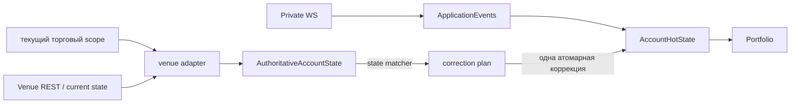

# Authoritative-состояние аккаунта на площадке: граница и знания для Polymarket-адаптера

Target production-граница `IAccountVenueStateSource`, scope
`AccountVenueStateScope` и DTO `Authoritative*State` из
`@polymarket/account-reconciliation`. Сам контракт, таблица «факт площадки ↔
локальный факт», примеры и будущий порядок коррекции описаны в README пакета
(`packages/application/account-reconciliation/README.md`, раздел «Целевая
модель»). Здесь — **почему** граница устроена так и что из legacy-кода и
`apps/pnl` обязан знать будущий адаптер.

> Статус: граница объявлена, реализаций нет, сверка её не вызывает.
>
> - текущий MR — authoritative venue state boundary;
> - следующий MR — `PolymarketAccountVenueStateSource`;
> - за ним — state matcher + atomic correction planner;
> - затем — runtime wiring `STARTUP` / `PERIODIC` / `RECONNECT`.

## Главный принцип: сходимость к текущему состоянию площадки

```text
live/private события            быстрый realtime-путь → provisional состояние
authoritative состояние venue   источник истины о ТЕКУЩЕМ состоянии аккаунта
AccountHotState                 наше лучшее текущее представление аккаунта
```

Состояние, выведенное из событий, обязано сойтись к состоянию площадки.
Причина расхождения не важна: наш рантайм, UI площадки, другой процесс,
claim/redeem, merge, внешний перевод, коррекция площадки, упавшая сделка,
reorg. Сверка не доказывает происхождение — она приводит локальное состояние
к текущей правде площадки.



Отсюда следствия, которые меняют прежнюю постановку «REST нужен, чтобы
найти пропущенное событие»:

1. **Неизвестный инициатор — не ошибка.** Заявка или исполнение аккаунта
   принадлежат `AccountHotState`, даже если рантайм их не создавал. Оси
   `MANUAL`/`BOT`/`EXTERNAL` нет: доказать её нечем.
2. **Текущий инвентарь важнее provenance.** Нельзя ни выдумать лот на
   разницу, ни оставить неверное количество, потому что лоты не
   восстанавливаются.
3. **`FAILED` побеждает provisional-историю.** Если WS успел применить
   `MATCHED`, а площадка позже говорит `FAILED`, локальное состояние в итоге
   возвращается к текущему состоянию площадки, а не остаётся навсегда
   неверным с `UNHEALTHY`.
4. **Текущий баланс сильнее свежих исполнений.** `recentFills` — свидетельство
   для восстановления и provenance; текущий инвентарь задаёт баланс актива.

## Только то, что нужно текущему торговому контуру

```text
Мы НЕ синхронизируем полную историю аккаунта Polymarket.
Мы синхронизируем только состояние, необходимое текущему trading runtime.
```

Рантайм обычно торгует на 1–4 рынках, чаще на одном, и совершает на каждом
десятки операций, а не тысячи. Поэтому не нужны ни все позиции аккаунта за
всю жизнь, ни все его исполнения, ни полная историческая реконструкция
портфеля.

| набор | охват | роль |
| --- | --- | --- |
| `collateralBalance` | весь аккаунт | текущая правда |
| `assetBalances` | `scope.assets` — каждый, ноль явно | текущая правда |
| `openOrders` | весь аккаунт, только живые | текущая правда |
| `recentFills` | рынки `scope.marketIds`, ограниченный хвост | восстановление и provenance |

Scope задаёт вызывающий (будущий runtime), а не источник. Для Polymarket
`MarketId` — это `conditionId`. Рынок в scope, пока он нужен текущему
торговому или учётному состоянию; потом его активы убираются из scope.
Выплата после settlement/redeem старого рынка всё равно видна через
account-wide `collateralBalance` — читать его историю ради неё не нужно.

## Почему не `getPortfolio(): Portfolio`

Transitional-порт текущей сверки `IAccountReconciliationSource` требует готовый
`Portfolio`. Для fake-источника в тестах это удобно, но настоящая площадка не
знает того, из чего `Portfolio` состоит:

| часть `Portfolio` | знает ли площадка | что пришлось бы сделать адаптеру |
| --- | --- | --- |
| `Balance.available` / `reserved` | нет — резервация наша | выдумать разделение |
| `Position.lots[]` (FIFO) | нет — это наша provenance | синтетический лот на `size × avgPrice` |
| `Order.strategyId`, `timestamp`, `reason` | нет | `undefined` → ложный конфликт идентичности |
| `TokenBalance.available` / `reserved` | нет | выдумать разделение |

Поэтому адаптер отдаёт **только факты**, а локальную бухгалтерию из них
строит будущий reconciler: резервации — из authoritative открытых заявок,
инвентарь — из текущих балансов активов, provenance — из настоящих
исполнений, где они есть.

## Шаги будущего прохода (Polymarket-адаптер)

Словарь — официальный `@polymarket/client` 0.6.0 (тот же, что в `apps/pnl`):

```text
1. collateral      fetchBalanceAllowance({ assetType: COLLATERAL })            → Money, весь аккаунт
2. assetBalances   для КАЖДОГО scope.assets:
                   fetchBalanceAllowance({ assetType: CONDITIONAL, tokenId })  → Quantity, ноль явно
3. openOrders      listOpenOrders(...), каждая страница SDK до конца           → AuthoritativeOpenOrderState[]
4. recentFills     ограниченный свежий хвост listAccountTrades(...)            → правило FillMapper
                   → оставить fill.marketId ∈ scope.marketIds                  → Fill + tradeStatus
5. собрать AuthoritativeAccountState; отказ ЛЮБОГО шага → Err всего прохода
```

Каждый набор читается **один раз** за проход. Состояние не атомарно на
стороне площадки — это свойство источника, а не дефект; CAS в
`AccountHotState` защищает от гонки с живым контуром.

`getOrderState(orderId)` — адресный `fetchOrder({ orderId })` для локальной
заявки, исчезнувшей из `openOrders`.

### Балансы активов — адресно, а не листингом позиций

```text
8 активов в scope  →  ~8 маленьких адресных чтений баланса
```

а не сканирование всего листинга позиций аккаунта за его жизнь. Это
сознательный компромисс: активов в scope мало, и каждый ответ — текущий
баланс расчётного слоя площадки.

`listPositions` (Data API) намеренно **не** используется как authoritative
примитив инвентаря: у account-wide листинга есть семантика фильтрации и
пагинации, ненужная scoped-рантайму. Он может оставаться аналитическим или
справочным источником, но не основой сверки инвентаря.

### Пагинация открытых заявок — контракт SDK

`listOpenOrders` возвращает `Paginated<T>`: адаптер проходит его **целиком**
(`for await` по страницам, пока SDK сообщает, что следующей страницы нет).
Живых заявок мало, но список обязан быть полным: отсутствие локальной
заявки в нём ведёт к адресному `getOrderState`.

Legacy-клиент работал с сырым REST и сам проверял `"LTE="` как
терминальный курсор. SDK делает это сам (`END_CURSOR` из
`@polymarket/bindings`), поэтому production-адаптер опирается на контракт
пагинации SDK и этот sentinel **не дублирует**. Отказ на любой странице —
`Err` всего прохода, а не укороченный список.

### Свежие сделки — ограниченный хвост, а не вся история

Всю историю сделок аккаунта читать не нужно. Для нашего профиля нагрузки
хватает небольшого свежего хвоста — ориентир **500–1000 последних сделок
аккаунта**, с большим запасом относительно реального числа операций на
текущих рынках. Затем:

```text
оставить сделки рынков scope.marketIds
(при необходимости — и по orderId, если это нужно восстановлению)
```

Число 500–1000 — деталь адаптера, а **не** application-контракта: в
`AccountVenueStateScope` лимита нет и не будет. Контракт говорит только одно:
`recentFills` — ограниченное свежее свидетельство, и отсутствие исполнения в
нём ничего не доказывает.

Что известно о SDK 0.6.0 и что ещё надо проверить:

- `listAccountTrades({ market?, tokenId?, after?, before?, id?, makerAddress? })`
  → `Paginated<ClobTrade[]>`; `market` — одна строка (`conditionId`), а не
  список;
- параметра размера выборки нет, и ни SDK, ни его документация не обещают,
  что первая страница содержит самые свежие сделки. Эта граница такого
  порядка тоже **не** обещает — его фактически проверяет MR адаптера.

Желаемая реализация и запасной вариант:

```text
предпочтительно   один ограниченный свежий хвост аккаунта
                  → примерно последние 500–1000 → фильтр по scope.marketIds
запасной вариант  если безопасного newest-first хвоста API/SDK не гарантирует:
                  фильтр market (1–4 вызова на scope) и/или окно after/before
```

Это выбор реализации: семантика `recentFills` от него не меняется. Отказ
чтения любой страницы — `Err` прохода; остановка на границе хвоста — не
ошибка, а его определение.

## Опыт `apps/pnl` — справочник, а не зависимость

`apps/pnl` уже ходит в официальный SDK, но его код **не импортируется** в
application- или infrastructure-слой сверки: это аналитика с другими
правилами.

### `apps/pnl/src/core/ActivityFetcher.ts`

Уже делает то, что подтверждает общий подход «читать ограниченные
релевантные данные, а не историю жизни»:

- ограниченное окно времени (`start`/`end`);
- итерация `Paginated` SDK без ручного курсора;
- выборка по кошельку и локальная фильтрация (`type === TRADE`, без combo).

Но публичный `listActivity()` **не** основной источник `recentFills`: в его
`TradeActivity` есть `transactionHash`, но нет статуса сделки площадки
(`TradeStatus`), роли MAKER/TAKER, id сделки CLOB и id заявки — то есть нет
данных для canonical `FillId`, общего с приватным WS.

### `apps/pnl/src/core/TradesFetcher.ts`

Уже использует `listAccountTrades({ makerAddress, after, before })`,
пагинацию SDK и знает про `makerOrders` (наша сторона суб-мейкера — в
`makerOrders[i]`, а не на верхнем уровне). Но для сверки его напрямую не
переиспользовать, потому что эта аналитика:

- отбрасывает `FAILED`/`RETRYING`, оставляя только «исполненные» статусы, и
  сохраняет сделки с пустым статусом;
- строит `NormalizedFill` для PnL, а не canonical `Fill`;
- при ненайденном адресе в `makerOrders` откатывается на поля верхнего
  уровня — то есть может записать сторону контрагента как свою;
- переводит числа через `Number()`.

Источник сверки обязан сохранять `MATCHED`, `MINED`, `CONFIRMED`, `RETRYING`
и `FAILED` и fail closed при неоднозначном владении или маппинге.

## Та же canonical-идентичность `Fill`

Приватная WS-сделка и свежая REST-сделка аккаунта, если это одно исполнение
площадки, **обязаны** дать один и тот же canonical `FillId`. Отдельный
упрощённый PnL-style маппер недопустим: правило уже есть в `FillMapper` и
учитывает TAKER, MAKER, `makerOrders`, cross-outcome, multi-maker и
`owner`/`makerAddress` (подробности — ниже, в разделе о сделках аккаунта).
Реализация — в следующем infrastructure MR.

## Что из legacy-кода сохранить — и что не переносить

Legacy-код лежит в `legacy-bot/live-account-reference/` и
`legacy-bot/trading-contour-reference/` **только как справочник**:
импортировать его нельзя, архитектуру не переносим. Ниже — знание, добытое им
в бою.

### Статусы заявок: никакого «неизвестный → OPEN»

`PolymarketOrderMapper.mapStatus`
(`legacy-bot/live-account-reference/packages/infrastructure/polymarket/rest/mappers/PolymarketOrderMapper.ts`)
на любой незнакомый vendor-статус возвращал `open` с предупреждением в лог.
Под это попадали `canceled` (американское написание), `unmatched`, `delayed`.
Угаданный `OPEN` держит резервацию под заявкой, которой на площадке, возможно,
нет. В новой границе — `Err`.

Встречавшиеся vendor-строки: `live`, `matched`, `canceled`/`cancelled`,
`delayed`, `unmatched` (и `pending`, `filled` в старых типах). Строка SDK
`OpenOrder` — `id`, `original_size`, `size_matched`, `created_at`, `status`
(статус — невалидируемая строка).

### Открытые заявки: пагинация и «отсутствие ≠ отмена»

- Сырой `/data/orders` пагинирован (`{count, data, limit, next_cursor}`), а
  legacy читал одну страницу и превращал не-массив в `[]` — то есть мог
  молча вернуть пустой список.
- Фильтр `signature_type` у proxy-кошелька скрывал наши же заявки: он
  фильтрует по адресу подписанта, а не мейкера.
- Legacy считал локальную заявку, которой нет среди открытых, **отменённой**.
  В новой границе отсутствие среди `openOrders` ничего не означает: reconciler
  спрашивает `getOrderState`, а `undefined` — «источник не может доказать», не
  `CANCELED`.
- Открытая заявка, которой нет локально, в новой модели — заявка аккаунта:
  она резервирует его деньги или токены, кто бы её ни создал.

### Сделки аккаунта: владение и идентичность

- **Одна непереводимая запись роняет весь вызов.** Эндпоинт возвращает только
  сделки аккаунта, поэтому ошибка маппинга — дефект маппинга или schema drift,
  а не «чужая сделка» (см. `polymarket-venue-lessons.md`). Пустой `Ok`
  однажды ошибочно освободил удержанную резервацию.
- **Фильтр `maker_address` — открытый вопрос.** Комментарий в
  `PolymarketExecutionAdapter.getFilledOrders` утверждает, что с ним API
  отдаёт только сделки, где мы maker, и taker-исполнения теряются; при этом
  `apps/pnl` его передаёт. До Polymarket-адаптера проверить на живом аккаунте.
- **Владение maker-заявкой** — по нашей записи в `maker_orders[]` (`owner` или
  `maker_address`, инжектированный из НАШИХ credentials, а не из ответа). В
  cross-outcome сделке поля верхнего уровня (`owner`, `asset_id`, `side`)
  принадлежат тейкеру; наш токен, сторона, цена и объём — из нашей записи.
- **Тот же `Fill`, что у приватного WS.** Два P0 legacy
  (`mapUserFillsToVenueTrades.ts`): REST принимал чужие maker-заявки за свои
  и давал другой `FillId`, чем WS, — исполнение применялось дважды. Правило
  `FillId` (`FillMapper.allFromPolymarketTradeEvent`):

  ```text
  TAKER                          FillId = tradeId
  MAKER, одна наша заявка        FillId = tradeId
  MAKER, несколько наших заявок  FillId = `${tradeId}:${orderId}`
  ```

  `FillId` одной заявки зависит от того, **сколько наших** заявок в записи,
  поэтому REST и WS обязаны видеть один и тот же набор `maker_orders`.
  Self-match (мы и тейкер, и мейкер) этим правилом не представим.
- **`FillMapper` умеет только WS-форму** (snake_case). REST `ClobTrade`
  официального SDK — camelCase (`makerOrders`, `matchedAt` в ISO, статус с
  префиксом `TRADE_STATUS_`). Legacy подгонял REST под WS переименованием
  полей. Для Polymarket-адаптера правило `FillId` и владения нужно
  **переиспользовать**, а не писать второй независимый REST-маппер.

### Статус сделки: не терять и не угадывать

| путь legacy | применял | откладывал | `FAILED` |
| --- | --- | --- | --- |
| живой WS | `MATCHED` сразу; `CONFIRMED` — если `MATCHED` пропущен | `MINED`, `RETRYING` | откат через `reverseFill` |
| REST-восстановление | `MATCHED` + `CONFIRMED` | `MINED`, `RETRYING`, без статуса | отдельная ветка |
| settlement заявок | только `CONFIRMED` | всё остальное | отдельная ветка |

- Токены cross-outcome MINT-исполнения CLOB не даёт продать, пока сделка не
  `CONFIRMED` (`MINED` недостаточно).
- `FAILED` после локального применения legacy **не откатывал**
  автоматически: `VENUE_FILL_FAILED_AFTER_LOCAL_APPLIED` + issue
  рассинхрона. В новой модели текущее состояние площадки побеждает: откат,
  перестроение или коррекция — решение state matcher-а, а граница лишь несёт
  факт `FAILED` без потери.
- `FillMapper` превращает незнакомый или префиксный статус в `undefined`, а
  `apps/pnl` сохраняет сделки с пустым статусом. В новой границе статус
  **обязателен**: такая запись — `Err`.
- SDK знает статус `TRADE_STATUS_MATCHED_NOT_BROADCASTED`, которого нет в
  canonical `TradeStatus`. Пока он не решён явно — `Err` (fail closed).

### Балансы: базовые единицы, без `parseFloat`

- Collateral — `balance-allowance` с `asset_type = COLLATERAL`, токен —
  `asset_type = CONDITIONAL` + `token_id`. Оба в базовых единицах 1e6. Legacy
  делил через `parseFloat` и на `NaN` возвращал **ноль** с предупреждением —
  в новой границе `Err`, а перевод точный, без `number`.
- Официальный SDK `fetchBalanceAllowance({ assetType, tokenId? })` отдаёт
  `{ balance, allowances }` (карта по адресам), а не одиночный `allowance`,
  как ожидал legacy.
- Legacy-провайдер на невалидный `tokenId` возвращал нулевой баланс. Для
  `assetBalances` «площадка не знает актив» и «аккаунт держит 0» — разные
  ответы; первое — `Err`, второе — явная запись с нулём.

### Фактический баланс токена расходится с event-sourced портфелем

Именно поэтому текущее состояние площадки побеждает историю событий, а
`assetBalances` — текущая правда об инвентаре. Наблюдавшиеся случаи:

- CLOB: `balance: 9557200, order amount: 9560000` — портфель 9.56, on-chain
  9.5572 (округление MINT/MERGE, меньший частичный fill, зазор между WS и
  расчётом), см. `sell-balance-protection.md`;
- «фантомная позиция»: cross-outcome MINT-исполнение тейкера дошло до
  `MINED`, заявку отменили, MINT всё равно завершился — токены есть в
  портфеле, но не в CLOB-балансе, продать их нельзя;
- legacy `BalancePolicy` не учитывал открытые SELL — двойная продажа. Отсюда
  правило: venue holding = `available + reserved`, а не `available`.

Legacy-рантайм API позиций не использовал вовсе: единственной on-chain
правдой о токене был тот же адресный `CONDITIONAL`-баланс, на котором
строится `assetBalances`.

## Открытые вопросы для Polymarket-адаптера

| вопрос | почему важен |
| --- | --- |
| порядок страниц `listAccountTrades`: есть ли безопасный newest-first хвост | выбор между одним хвостом аккаунта и фильтром `market` / окном `after`/`before` |
| режет ли `makerAddress` taker-сделки в `listAccountTrades` | неполный `recentFills` = невидимые исполнения |
| `fetchBalanceAllowance(CONDITIONAL)` для токена, которого площадка не знает: ноль или ошибка | «не знает актив» обязано стать `Err`, а не нулём |
| `fetchOrder` для неизвестной заявки: как выглядит «не найдено» | `getOrderState` → `undefined`, а не `Err` и не угаданный статус |
| `MATCHED_NOT_BROADCASTED` → какой `TradeStatus` и нужен ли он | сейчас fail closed |
| `delayed` / `unmatched` у заявок → какой `AuthoritativeOrderStatus` | сейчас fail closed |
| правило `FillMapper` для camelCase `ClobTrade` | тот же `Fill`, что у WS |

## Связанное

- `packages/application/account-reconciliation/README.md` — граница, scope,
  примеры, будущий порядок коррекции, текущая сверка.
- `apps/pnl/src/core/ActivityFetcher.ts`, `apps/pnl/src/core/TradesFetcher.ts`
  — справочник по SDK, не зависимость.
- `docs/guides/polymarket-venue-lessons.md` — ошибка маппинга ≠ «чужая
  запись», семантика эндпоинтов.
- `docs/guides/sell-balance-protection.md` — расхождение баланса токена с
  портфелем.
- `docs/guides/polymarket-fee-settlement.md` — комиссия тейкера.
