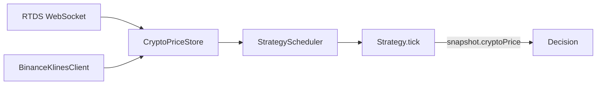

# Crypto Price Tracking (Strike, Real-Time, Resolution)

## Проблема

Бот торгует крипто-рынками Polymarket ("Bitcoin Up or Down - March 11, 6PM ET").
Эти рынки резолвятся по правилу: `close >= open` → UP, иначе DOWN.

Без знания цены актива стратегия не может:
- Определить, в какой зоне сейчас рынок (UP/DOWN)
- Принять решение "держать UP токен до resolution" vs "продать сейчас"
- Оценить settlement при market resolution

## Решение: три компонента

### 1. Strike Price (open свечи)

При открытии рынка один REST-запрос к Binance Klines API:

```
GET https://api.binance.com/api/v3/klines?symbol=BTCUSDT&interval=1h&startTime={ms}&limit=1
```

Open свечи = strike price для определения UP/DOWN.

### 2. Real-Time Price (RTDS WebSocket)

Polymarket предоставляет RTDS WebSocket:

```
wss://ws-live-data.polymarket.com
```

- Topic `crypto_prices` → Binance source (btcusdt, ethusdt, ...)
- Topic `crypto_prices_chainlink` → Chainlink source (btc/usd, eth/usd, ...)
- Payload: `{ symbol, value, timestamp }`
- PING каждые 5 секунд

### 3. Resolution Price (close свечи)

Для бектеста: close свечи на `endDate` из Binance klines.
Для live/paper: RTDS поставляет цену до момента закрытия.

## Архитектура



### Компоненты

| Файл | Назначение |
|------|-----------|
| `CryptoMarketMeta.ts` | Парсинг `resolutionSource` из rawMarket |
| `BinanceKlinesClient.ts` | REST клиент для Binance klines |
| `RtdsWebSocketClient.ts` | RTDS WebSocket клиент |
| `CryptoPriceStore.ts` | In-memory store цен |

### Определение источника из rawMarket

```typescript
// resolutionSource: "https://www.binance.com/en/trade/BTC_USDT"
// → source=binance, symbol=BTCUSDT, rtdsTopic='crypto_prices', rtdsFilter='btcusdt'

// resolutionSource: "https://data.chain.link/streams/btc-usd"
// → source=chainlink, symbol=btc/usd, rtdsTopic='crypto_prices_chainlink', rtdsFilter='btc/usd'
```

## Использование в стратегии

```typescript
tick(snapshot: StrategySnapshot, reasons: ReadonlySet<TriggerReason>): StrategyIntent[] {
  const { cryptoPrice } = snapshot;
  if (!cryptoPrice || !cryptoPrice.targetPrice) return [];

  // Текущий прогноз исхода
  const isUp = cryptoPrice.currentPrice >= cryptoPrice.targetPrice;

  // Рынок зарезолвился
  if (cryptoPrice.resolved) {
    const isUpResolved = cryptoPrice.resolutionPrice! >= cryptoPrice.targetPrice;
    // UP token = $1.00, DOWN token = $0.00
  }
}
```

## Запись и реплей (collect-data + backtest)

### Запись

RTDS-цены пишутся в тот же `.jsonl` файл что и book/trade события:

```json
{"t":"crypto_price","symbol":"btcusdt","price":70741.27,"ts":1773266400123}
```

При финализации рынка записывается синтетическое событие:

```json
{"t":"market_resolved","ts":1773270000000,"symbol":"btcusdt","strikePrice":70741.27,"resolutionPrice":70373.01,"outcome":"DOWN","winningTokenIndex":1}
```

### Реплей (BacktestEngine)

- `crypto_price` → `CryptoPriceStore.updatePrice()`
- Первая цена → `setTargetPrice()` (strike)
- Последняя цена → `setResolutionPrice()`
- Для старых снапшотов без `crypto_price` — fallback на Binance klines

## TriggerReason: CRYPTO_PRICE

Новый reason `'CRYPTO_PRICE'` в `TriggerReason`:

```typescript
type TriggerReason = 'BOOK' | 'TRADE' | 'FILL' | 'ORDER_UPDATE' | 'TIMER' | 'CRYPTO_PRICE';
```

StrategyScheduler маршрутизирует обновления через `cryptoSymbol` → Set<strategyId>.

## Settlement при market resolution

При экспирации крипто-рынка (paper/backtest) бот выполняет settlement:

1. `CryptoPriceStore.getResolution(symbol)` → `'UP' | 'DOWN' | undefined`
2. Определяется, является ли торгуемый токен winning:
   - `outcomeIndex=0` (YES/UP token) + resolution `UP` → winning
   - `outcomeIndex=1` (NO/DOWN token) + resolution `DOWN` → winning
3. Winning token → settlement @ $1.00 за токен (зачисление `qty × $1.00` в баланс)
4. Losing token → settlement @ $0.00 (позиция обнуляется, зачисления нет)

```typescript
const isWinning = (outcomeIndex === 0 && resolution === 'UP')
               || (outcomeIndex === 1 && resolution === 'DOWN');
const settlementPrice = isWinning ? 1.0 : 0.0;
// cash += qty * settlementPrice, position = 0
```

Это обеспечивает реалистичный P&L: купил UP@0.50, рынок resolved UP → profit = (1.00 - 0.50) × qty.

В live режиме settlement выполняет биржа автоматически.
