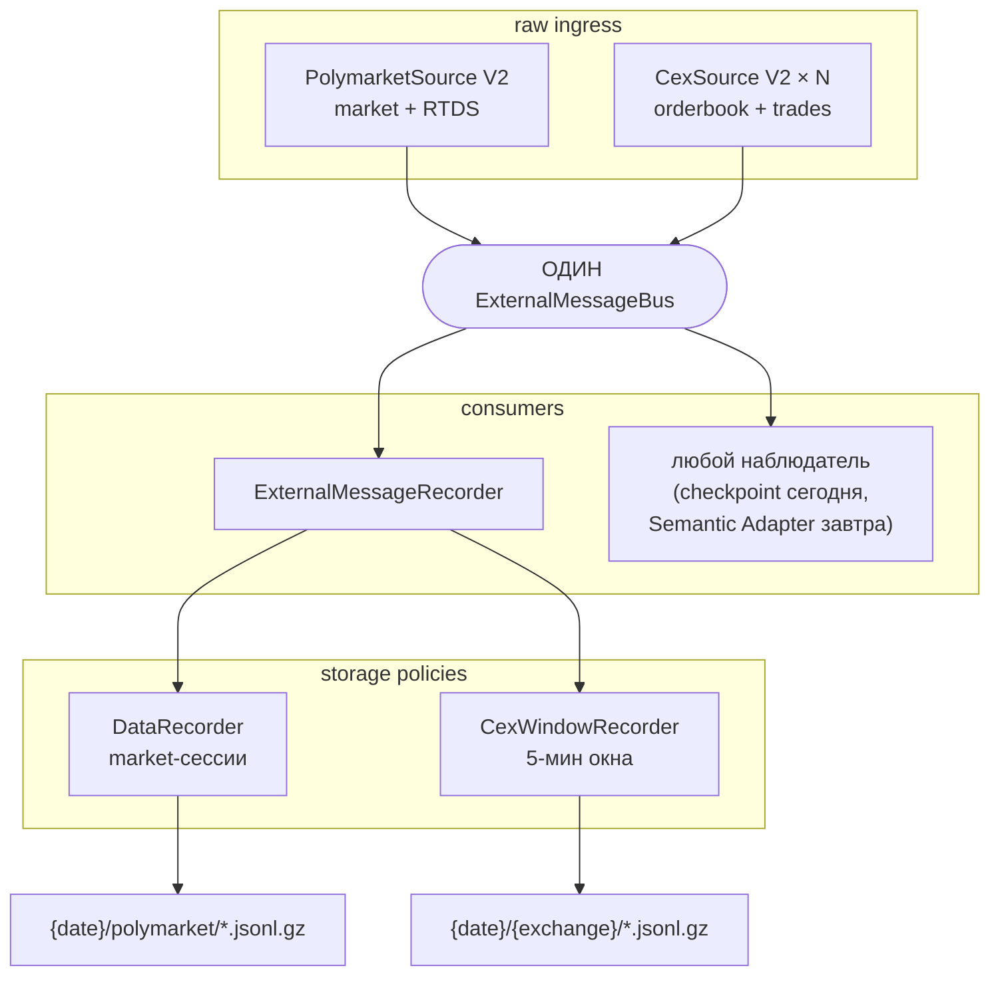

# Data Collector V2 — production cutover (MR-A)

## Зачем это сделано

К моменту MR-A в репозитории было ДВА контура сбора данных:

- **V1** — `apps/collect-data/src/main.ts`: 900 строк, где composition, WS-обработчики,
  карты подписок, очередь обогащения, blacklist истёкших рынков и лестница остановки
  жили в одном файле, а source писал в recorder напрямую;
- **V2** — набор пакетов (`polymarket-v2`, `cex-v2`, `external-message-bus`,
  `external-message-recorder`, `collection-coordinator`, `market-finalizer`), собранных
  вместе только в verification-скрипте `scripts/checkpoint-raw-live.mts` и доказанных
  live на CHECKPOINT #1.

MR-A превращает уже доказанную composition в production-приложение и удаляет V1.
Постепенного рефакторинга V1 не было и не могло быть: это не улучшение старой
архитектуры, а замена её на уже проверенную.

Главное, что этот MR обязан НЕ сломать, — возможность подключить к тому же потоку
сырых сообщений будущий Semantic Adapter, не трогая ни source-пакеты, ни recorder.

## Итоговая архитектура



Control plane сбора живёт рядом с data plane, но не внутри него:

```text
PolymarketMarketDiscovery  →  MarketCollectionCoordinator  →  MarketFinalizer
    «что доступно»              «что записываем сейчас»        «как закрываем»
```

Оркестрирует их `DataCollector` — он владеет тиком цикла, но НЕ владеет их
состоянием: карт подписок, blacklist-ов и очередей обогащения у него нет.

## Что из CHECKPOINT стало production, а что осталось verification

Checkpoint был прототипом production composition, обёрнутым в verification-логику.
Разделение прошло по этой границе.

| Часть checkpoint                                       | Куда ушла                                     |
| ------------------------------------------------------ | --------------------------------------------- |
| один `ExternalMessageBus` + `MessageMetadataGenerator`  | `createDataCollector`                         |
| один `ExternalMessageRecorder` c двумя политиками       | `createDataCollector`                         |
| `DataRecorder` + `CexWindowRecorder`                    | `createDataCollector`                         |
| `PolymarketSource` / `PolymarketMarketDiscovery`        | `createDataCollector`                         |
| `MarketCollectionCoordinator` / `MarketFinalizer`       | `createDataCollector`                         |
| `CexSource[]` по одной на биржу                         | `createDataCollector`                         |
| порядок старта (cleanup → recorder → ingress)           | `DataCollector.start()`                       |
| цикл `refreshCandidates`/`fillSlots`/`runOnce`          | `DataCollector.tick()`                        |
| лестница остановки контура                              | `DataCollector.close()`                       |
| `finalizer.drain()` перед остановкой                    | `DataCollector.drain()` (опционально)         |
| PASS/FAIL, `report.json`, дедлайны прогона              | остался в `scripts/checkpoint-raw-live.mts`   |
| `CountingLogger`, ring-буферы, exact-match сэмплы       | остался в checkpoint                          |
| gunzip/readback валидатор артефактов                    | остался в checkpoint                          |
| широкий discovery-фильтр, `CEX_PLAN`, изолированный вывод | остался в checkpoint как ЕГО конфигурация   |

После extraction checkpoint не поднимает вторую копию composition — он вызывает ту же
`createDataCollector`, что и production `main.ts`, и подписывается на общий bus как
обычный наблюдатель. Это и есть живое доказательство, что точка расширения работает.

## V1 → V2: кто теперь владеет каждой ответственностью

| Ответственность V1              | Статус     | Новый владелец                                |
| ------------------------------- | ---------- | --------------------------------------------- |
| Polymarket WS-подписки          | заменена   | `PolymarketSource` (официальный SDK)           |
| discovery рынков                | заменена   | `PolymarketMarketDiscovery`                    |
| карта подписанных рынков/токенов | заменена   | `MarketCollectionCoordinator`                 |
| RTDS-подписки + ref-count       | заменена   | `MarketCollectionCoordinator` (shared feeds)   |
| запись Polymarket-файлов        | сохранена  | `DataRecorder` (та же реализация)              |
| CEX-потоки                      | заменена   | `CexSource V2`                                 |
| ротация CEX-файлов              | заменена   | `CexWindowRecorder`                            |
| обогащение meta после истечения | заменена   | `MarketFinalizer`                              |
| blacklist `closedMarkets` + TTL | удалена    | не нужна: координатор владеет lifecycle сессий |
| ручной scan истечений           | удалена    | не нужна: expiry-переход — у координатора      |
| очередь `pendingEnrichment`     | удалена    | заменена на `MarketFinalizer`                  |
| прямая запись source → recorder | удалена    | запрещена: только `source → bus → recorder`    |
| DNS override                    | сохранена  | `runtime/processBootstrap.ts` (список хостов пересобран под V2) |
| обработка сигналов              | сохранена  | `runtime/processBootstrap.ts` (один охраняемый путь) |
| лог потребления памяти          | сохранена  | объединён в периодический `collector.status()` |
| heap snapshot по `SIGUSR2`      | удалена    | отладочный инструмент, не операционная функция |
| `process.exit()` в shutdown     | удалена    | процесс завершается сам; выход маскировал бы утечку |

## Аудит поведения файлов

Раскладка датасетов сохранена от V1 — её ожидают уже собранные архивы, ридеры и
бэктест:

```text
{outputDir}/{YYYY-MM-DD}/polymarket/polymarket_{question}___{marketId}.jsonl[.gz]
{outputDir}/{YYYY-MM-DD}/{exchangeId}/{exchange}_{symbol}_{marketType}_{stream}_{dateET}_{startET}-{endET}_ET.jsonl[.gz]
```

| Поведение              | V1                                  | V2                                       | Решение          |
| ---------------------- | ----------------------------------- | ---------------------------------------- | ---------------- |
| date-директории        | `{out}/{YYYY-MM-DD}/`               | то же                                    | parity           |
| директория источника   | `polymarket/` и `{exchange}/`       | то же                                    | parity           |
| имя PM-файла           | строит `DataRecorder`               | тот же `DataRecorder`                    | parity побайтово |
| имя CEX-файла          | без сегмента потока                 | **добавлен `{stream}`**                  | V2 лучше         |
| буферизация            | 100 / 10 c (PM), 200 / 5 c (CEX)    | то же (настраивается)                    | parity           |
| ротация CEX            | окно 5 минут по ET-границам         | то же + sweep «тихих» writer-ов          | V2 лучше         |
| gzip                   | при финализации/ротации             | то же                                    | parity           |
| `.jsonl` = incomplete  | да                                  | да                                       | parity           |
| startup cleanup        | обе политики чистят свои остатки    | то же                                    | parity           |
| shutdown cleanup       | PM удаляет незавершённые, CEX — свои| то же                                    | parity           |
| формат строк           | wire-формат legacy WS               | **`formatVersion: 2`**, source-native SDK | V2, осознанно   |

Два уточнения, которые стоит держать в голове:

- **Разделение потоков в имени CEX-файла.** V2 пишет `orderbook` и `trades` в разные
  партиции; V1 складывал их в один файл. Ридеры V2-архивов обязаны учитывать сегмент
  `{stream}`.
- **Имя PM-файла не менялось этим MR.** Его целиком строит `DataRecorder`, который
  V1 и V2 используют один и тот же, — включая префикс `polymarket_` и вставку года
  (`_-_` → `_-2026_`). Архивы марта 2026 в `apps/collect-data/snapshots/` выглядят
  иначе просто потому, что предшествуют этому изменению именования.
- **Общий корень и startup cleanup.** Обе политики пишут в один `outputDir`, а
  `CexWindowRecorder.cleanup()` обходит ВСЕ поддиректории date-папки, включая
  `polymarket/`. Это безопасно ровно потому, что cleanup выполняется один раз при
  старте, ДО первой записи, и удаляет тот же класс файлов (незавершённые `.jsonl`),
  что и cleanup `DataRecorder`. Вызывать `cleanup()` на живом контуре нельзя.

## Наблюдаемость collection lifecycle

`DataCollector` даёт read-only поток переходов — не domain-события и не trading
lifecycle:

| Событие              | Когда                                            |
| -------------------- | ------------------------------------------------ |
| `DISCOVERED`         | рынок впервые появился в кэше кандидатов          |
| `COLLECTION_STARTED` | сессия перешла в `ACTIVE` (запись пошла)          |
| `FINALIZING`         | рынок истёк, сессия перешла в `FINALIZING`        |
| `FINALIZED`          | финализация завершилась (при однозначности — с исходом) |
| `DROPPED`            | сессия исчезла, не пройдя финализацию             |

```typescript
const off = collector.onMarketLifecycle((event) => {
  if (event.kind === 'FINALIZED') archived.push(String(event.marketId));
});
```

Проекция строится диффом публичных снимков координатора и финализатора на каждом
тике. Так сделано сознательно: координатор остаётся collection-specific и не
превращается в глобальный менеджер рынков, а рантайм и так владеет тиком. Плата —
гранулярность тика: переход, целиком уместившийся между двумя тиками, наблюдается
как его итог. Для рынков, живущих минуты, при тике в секундах это не теряет ни
одного значимого перехода.

`collector.status()` — снимок операционного состояния, целиком собранный из уже
существующих `getStats()` компонентов: сессии, финализации, recorder, CEX-окна, bus и
здоровье каждого source поимённо.

## Точка расширения bus

Bus создаётся composition factory и возвращается наружу; его можно и передать снаружи:

```typescript
// Сегодня — checkpoint-наблюдатель:
const bus = new ExternalMessageBus<ContourMessage>();
const { collector } = createDataCollector({ config, logger, clock, bus });
bus.subscribe('CEX_TRADE', (message) => evidence.count(message.payload));
await collector.start();

// Завтра — Semantic Adapter, тем же способом:
const bus = new ExternalMessageBus<ContourMessage>();
semanticAdapter.attach(bus);          // зависит от bus, НЕ от DataCollector
const { collector } = createDataCollector({ config, logger, clock, bus });
await collector.start();
```

Направление зависимости здесь принципиально: consumer знает про bus, а bus не знает
ни про кого. Поэтому Semantic Adapter никогда не будет вызывать
`DataCollector.getMessages()` — такого метода нет и не появится.

Порядок подписки гарантирован конструкцией: recorder подписывается внутри
`collector.start()`, наблюдатели — до него, ingress стартует последним.

## Известное ограничение: сокеты официального SDK

На длинном прогоне (31.6 минуты, из них 10 минут дренажа финализаций) процесс не
завершился сам в течение 60 секунд после остановки контура: остались 7
`TCPSocketWrap`. Разбор:

- `createPublicClient()` официального SDK не имеет НИКАКОГО метода закрытия — ни
  `close`, ни `dispose`, ни `Symbol.asyncDispose`. Его пул keep-alive соединений к
  `gamma-api`/`clob` не может быть освобождён ни коллектором, ни verification-runner-ом;
- чем дольше идёт финализация, тем больше опросов Gamma и тем больше соединений в
  пуле: прогоны на 17 минут с тремя финализациями завершались чисто, прогон на 31
  минуту с девятью — нет;
- всё, чем владеет сам контур, освобождается: короткий режим checkpoint поднимает и
  гасит ДВЕ полные композиции подряд в одном процессе, и обе заканчиваются состоянием
  `{FSReqPromise: 1}` — ровно тем же, что и прогоны до этого MR, — а процесс выходит
  с кодом 0.

Маскировать это `process.exit()` сознательно не стали: принудительный выход скрыл бы
не только чужой пул сокетов, но и любую будущую утечку таймера или потока. Правильное
место для решения — метод закрытия в SDK-клиенте либо собственный HTTP-агент под
контролем приложения; и то и другое выходит за границы MR-A.

## Аудит collector-legacy после удаления V1

После cutover проверено, остались ли у collector-специфичных классов потребители.
Результат: **ни один из них не оказался zero-consumer** — все они продолжают
использоваться торговым приложением `apps/bot`, которое MR-A не трогает.

| Компонент                         | Решение  | Оставшиеся потребители                               |
| --------------------------------- | -------- | ---------------------------------------------------- |
| `PolymarketWebSocketManager`       | оставлен | `apps/bot/src/main.ts`                               |
| `PolymarketWsAdapter`              | оставлен | `apps/bot`: `main.ts`, `MarketRotation`, `buildLiveInfra` |
| `MarketDataFeedAdapter`            | оставлен | `apps/bot/src/main.ts`                               |
| `PolymarketMarketDiscoveryAdapter` | оставлен | `apps/bot`: `main.ts`, `MarketRotation`, 3 скрипта    |
| `CexCollectorService`              | оставлен | `apps/bot`: `main.ts`, `buildRecording`              |
| `CcxtExchangeWatcher`              | оставлен | внутренний для `CexCollectorService`                 |
| `CcxtSymbolWatcher`                | оставлен | внутренний для `CexCollectorService`                 |
| `CexFileRotator`                   | оставлен | внутренний для `CexCollectorService`                 |
| `DnsOverride`                      | оставлен | коллектор (`processBootstrap`), `apps/bot`, CLI-скрипты |

Единственное, что удалось убрать безопасно, — зависимость приложения коллектора от
`@polymarket/cex-market-data`: после cutover ни один его файл этот пакет не
импортирует, поэтому он исключён из `package.json` и `tsconfig`. Сам пакет остаётся
в репозитории: он смешивает collector-legacy с живой функциональностью бота, и
удалять его целиком было бы поломкой торгового приложения.

## Что НЕ входило в MR-A

TWAP-подписки и парсинг окон, пересмотр резолюции (60-минутный бюджет, fallback,
производный победитель), Semantic Adapter, `MarketUniverse`, dashboard и любые
изменения Application/Risk/Strategy/Execution.

## Ссылки

- CHECKPOINT #1: `docs/guides/checkpoint-1-raw-live.md`
- Приложение коллектора: `apps/collect-data/docs/collect-data.md`
- Запись снапшотов: `docs/architecture/data-collection.md`
