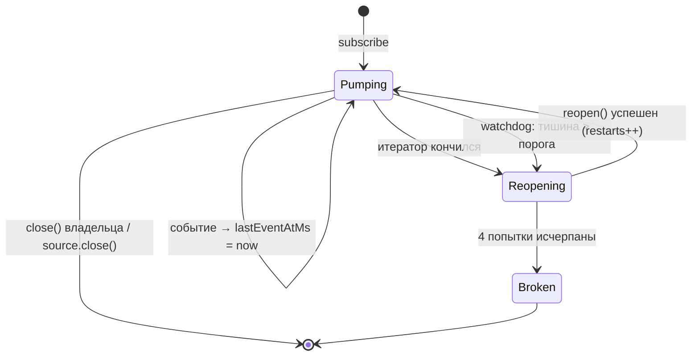

# Надзор за живостью RTDS-подписок Polymarket

## Проблема

Квалификационный прогон №1 ([отчёт](collector-qualification-run-01.md)) нашёл
дефект, который делает данные бесшумно неполными:

```text
POLYMARKET_CRYPTO_BINANCE          10:45:39 → 11:49:48   ← замолчал
POLYMARKET_CRYPTO_CHAINLINK        10:45:38 → 11:49:48   ← замолчал
POLYMARKET_CRYPTO_CHAINLINK_TWAP   10:45:39 → 11:49:47   ← замолчал
POLYMARKET_MARKET                  10:45:37 → 11:59:33   ← жил до конца
```

Через ~64 минуты все три RTDS-потока перестали приносить данные. Ни ошибки,
ни закрытия, ни переоткрытия: подписки были открыты один раз в 10:45:37 и
формально оставались открытыми. Десять минут коллектор писал рынки без единой
котировки; шесть датасетов не содержат RTDS вообще.

### Почему этого никто не заметил

Причина в коде — цикл насоса:

```typescript
for await (const event of handle) {
  // ...
}
// сюда попадаем и когда итератор кончился ШТАТНО
```

`for await` завершается без исключения, если итератор вернул `done: true`.
Никакого сигнала нет: handle тихо удалялся из `_handles`, а объект подписки,
который держит владелец (`PolymarketOpenSubscription`), оставался валидным.
Контроллер продолжал считать фид живым.

Счётчик `pmRtdsFeeds: 6` в operational-логе всё это время был равен шести —
но это **ref-count желаемого состояния**, а не признак живости. Он показывает,
сколько подписок контур хочет иметь, а не сколько из них приносят данные.

У CEX аналогичная защита была изначально (`Frozen orderbook detected,
restarting stream` в `CexSource`), у RTDS — нет.

## Решение

Надзираемый цикл в `PolymarketSource._track()`: подписка живёт не «один раз»,
а до тех пор, пока её не отпустит владелец или не закроется сам источник.



### Два независимых детектора

Они ловят разные отказы, поэтому нужны оба:

| детектор | что ловит |
| --- | --- |
| конец итератора | сервер закрыл поток штатно (`done: true`, без ошибки) |
| watchdog тишины | транспорт «жив», но данных нет — ровно наблюдённый случай |

Watchdog опрашивает возраст последнего события каждые `max(1000, порог/3)` мс
и при превышении порога закрывает handle. Дальше срабатывает общий путь:
насос завершается, цикл переоткрывает подписку.

Порог по умолчанию — **30 секунд**. RTDS идёт с частотой около 1 Гц, так что
30 с тишины — это три порядка величины сверх нормы: ложных срабатываний быть
не может, а десять минут дырки не повторятся.

### Backoff и терминальное состояние

Переподписка идёт по лесенке `1 → 2 → 5 → 10` секунд. Если все четыре попытки
провалились, фид помечается `broken` и **источник не роняется**: отказ одного
RTDS-потока не должен убивать CLOB-подписки и весь контур сбора. Состояние
видно в диагностике, решение принимает оператор.

### Что НЕ надзирается

`subscribeMarket()` (CLOB) намеренно оставлен без watchdog. Тихий стакан — это
норма: у рынка может не быть сделок и изменений котировок минутами. Перезапуск
по тишине здесь ловил бы не отказ, а отсутствие торговли.

Конец итератора для CLOB тоже не приводит к переподписке: у него нет
`supervision`, и цикл просто завершается — прежнее поведение.

## Наблюдаемость

`PolymarketSource.getSubscriptionHealth()` возвращает по одной записи на
надзираемую подписку:

```typescript
interface PolymarketSubscriptionHealth {
  readonly subscription: string;   // 'prices.crypto.binance' | 'twap:60' | ...
  readonly lastEventAtMs?: number; // undefined — событий ещё не было
  readonly restarts: number;       // сколько раз подписка поднималась заново
  readonly broken: boolean;        // backoff исчерпан, фид не восстановлен
}
```

Коллектор сводит это в три числа рядом с прежним ref-count — контраст между
ними и есть суть дефекта:

```text
pmRtdsFeeds: 6          ← желаемое состояние (было 6 и во время тишины)
pmRtdsSilentSec: 612    ← ФАКТ: самый тихий фид молчит 10 минут
pmRtdsRestarts: 0
pmRtdsBroken: 0
```

`pmRtdsSilentSec: null` означает «надзираемых подписок нет» (контур ещё не
поднялся или уже остановлен) — это не то же самое, что `0`.

## Конфигурация

```typescript
new PolymarketSource({
  client,
  bus,
  metadataGenerator,
  logger,
  rtdsStallAfterMs: 30_000, // по умолчанию; в тестах — десятки миллисекунд
});
```

Параметр инъектируется ради детерминированных тестов: с порогом 60 мс сценарий
«поток замолчал» воспроизводится за доли секунды и без фальшивых таймеров.

## Тесты

`packages/infrastructure/polymarket-v2/__tests__/PolymarketSource.supervision.test.ts`
— девять сценариев на реальном `ExternalMessageBus`, fake только на границе SDK.

Ключевой инструмент — `FakeSubscriptionHandle.endFromServer()`: завершает
итератор **не увеличивая `closeCalls`**, то есть воспроизводит именно
production-дефект (поток кончился сам), а не наше закрытие.

Обе половины решения проверены мутацией: с `stallAfterMs = MAX_SAFE_INTEGER`
падают 2 теста (watchdog), с переподпиской, всегда возвращающей `undefined`, —
5 тестов.
