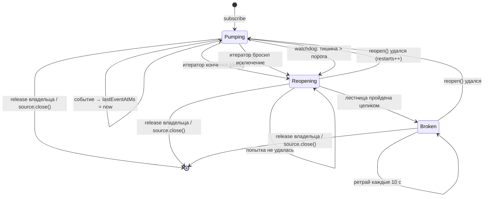

# Надзор за живостью RTDS-подписок Polymarket

## Проблема

Квалификационный прогон №1 ([отчёт](collector-qualification-run-01.md)) нашёл
дефект, который делает данные бесшумно неполными:

```text
POLYMARKET_CRYPTO_BINANCE          10:45:39 → 11:49:48   ← замолчал
POLYMARKET_CRYPTO_CHAINLINK        10:45:38 → 11:49:48   ← замолчал
POLYMARKET_CRYPTO_CHAINLINK_TWAP   10:45:39 → 11:49:47   ← замолчал
POLYMARKET_MARKET                  10:45:37 → 11:59:33   ← жил до конца
```

Через ~64 минуты все три RTDS-потока перестали приносить данные. Ни ошибки,
ни закрытия, ни переоткрытия: подписки были открыты один раз в 10:45:37 и
формально оставались открытыми. Десять минут коллектор писал рынки без единой
котировки; шесть датасетов не содержат RTDS вообще.

### Почему этого никто не заметил

Причина в коде — цикл насоса:

```typescript
for await (const event of handle) {
  // ...
}
// сюда попадаем и когда итератор кончился ШТАТНО
```

`for await` завершается без исключения, если итератор вернул `done: true`.
Никакого сигнала нет: handle тихо удалялся из `_handles`, а объект подписки,
который держит владелец (`PolymarketOpenSubscription`), оставался валидным.
Контроллер продолжал считать фид живым.

Счётчик `pmRtdsFeeds: 6` в operational-логе всё это время был равен шести —
но это **ref-count желаемого состояния**, а не признак живости. Он показывает,
сколько подписок контур хочет иметь, а не сколько из них приносят данные.

У CEX аналогичная защита была изначально (`Frozen orderbook detected,
restarting stream` в `CexSource`), у RTDS — нет.

## Решение

Надзираемый цикл в `PolymarketSource._track()`: подписка живёт не «один раз»,
а до тех пор, пока её не отпустит владелец или не закроется сам источник.



Из диаграммы видно главное свойство: **выйти из цикла можно только через
release** — ни `Broken`, ни серия неудач его не прекращают.

### Два независимых детектора

Они ловят разные отказы, поэтому нужны оба:

| детектор | что ловит |
| --- | --- |
| конец итератора | сервер закрыл поток штатно (`done: true`, без ошибки) |
| исключение итератора | обрыв транспорта с ошибкой |
| watchdog тишины | транспорт «жив», но данных нет — ровно наблюдённый случай |

Исключение итератора надзираемого фида — **локальный перезапуск**, а не
терминальный отказ источника: ронять CLOB и остальные RTDS-потоки из-за одного
упавшего прайс-фида несоразмерно потере, раз восстановление у нас есть. Для
CLOB (без надзора) семантика прежняя: падение итератора терминально, потому что
восстанавливать его некому.

Watchdog опрашивает возраст последнего события каждые `max(1000, порог/3)` мс
и при превышении порога закрывает handle. Дальше срабатывает общий путь:
насос завершается, цикл переоткрывает подписку.

Порог по умолчанию — **30 секунд**. RTDS идёт с частотой около 1 Гц, так что
30 с тишины — это три порядка величины сверх нормы: ложных срабатываний быть
не может, а десять минут дырки не повторятся.

### Backoff: лестница ограничивает шаг, а не число попыток

Переподписка идёт по лесенке `1 → 2 → 5 → 10` секунд, после чего **ретраи
продолжаются каждые 10 секунд**, пока подписку не отпустит владелец или не
закроется источник.

Ограниченное число попыток выглядит аккуратно и является ловушкой: сумма
лестницы — 18 секунд, то есть любой сетевой обрыв длиннее этого навсегда
оставил бы контур без RTDS. При этом контроллер продолжал бы держать фид
приобретённым, а `hasFailed` остался бы `false`. Это ровно исходный дефект,
только с другой причиной.

`broken` выставляется, когда лестница пройдена целиком, — как **диагноз, а не
как конец восстановления**. Первая же удачная переподписка его снимает.
Источник при этом не роняется: отказ одного RTDS-потока не должен убивать
CLOB-подписки и весь контур сбора.

Лог ограничен, потому что ретраи бесконечны: неудачи внутри лестницы
логируются каждая, переход в `broken` — один `error`, дальше одна строка на
каждые шесть попыток (примерно раз в минуту). Молчать нельзя — тишина в логе
при мёртвом фиде и есть тот дефект, который мы чиним.

### Release отменяет восстановление

Инвариант: **после release владельца ни один новый SDK-handle не может стать
активным.**

Гонка здесь не теоретическая, а закономерная для нашего lifecycle: последний
market-ref исчезает по расписанию рынка, безотносительно того, переподключается
ли фид прямо сейчас. Поэтому отмена проверяется в трёх точках:

| точка | что было бы без неё |
| --- | --- |
| до ожидания ступени | лишний цикл ретрая после release |
| после ожидания | `subscribe()` ушёл бы в сеть на отпущенный фид |
| после возврата `reopen()` | новый handle начал бы качать, а `close()` ждал бы его вечно |

Третья — самая узкая: сигнал release тут уже не помогает, потому что ожидание
давно закончилось. Handle, открывшийся после release, немедленно закрывается и
не регистрируется.

Само ожидание ступени **прерываемо**: `close()` владельца и `close()`
источника будят все ожидающие циклы. Иначе остановка контура ждала бы до
10 секунд на каждой надзираемой подписке — на ровном месте вылезая за бюджет
лестницы остановки.

Прерываемо и **само** `subscribe()`. Оно неотменяемо со стороны SDK и на
мёртвом соединении может не разрешиться вовсе, поэтому ожидание идёт гонкой с
сигналом release: если release выигрывает, цикл уходит сразу, а поздно
пришедший handle закрывается отдельным продолжением. Без этой гонки одна
зависшая переподписка держала бы всю лестницу остановки неограниченно долго —
и прерывание ступени backoff ничего бы не спасло.

### Дубль ключа не стирает чужую диагностику

`PolymarketSource` — публичный API, и две подписки с одинаковым ключом им не
запрещены (контроллер их не создаёт, но полагаться на это нельзя). Поэтому
запись здоровья удаляется **только своя**: сравнивается не ключ, а
принадлежность состояния. Иначе завершение первой подписки стирало бы
диагностику второй — снова «фид жив, а health о нём молчит».

Что при этом **остаётся**: две одновременные подписки с одинаковым ключом
по-прежнему дадут одну запись — последнюю. Стирания чужой диагностики нет, но
длина снимка в таком случае не равна числу физических подписок. Чинить это
незачем: RTDS-контроллер дедуплицирует фиды по `rtdsFeedKey` и держит на
каждый ровно одну подписку, так что в рантайме дубль не возникает. Важно, что
ограничение записано, а не подразумевается.

### Что НЕ надзирается

`subscribeMarket()` (CLOB) намеренно оставлен без watchdog. Тихий стакан — это
норма: у рынка может не быть сделок и изменений котировок минутами. Перезапуск
по тишине здесь ловил бы не отказ, а отсутствие торговли.

**Но тишина и конец итератора — разные вещи.** Если SDK-итератор CLOB
завершился сам (`done: true`) и закрывали его не мы, физическая подписка
исчезла, а контроллер продолжает считать рынок ACTIVE — это ровно тот же
бесшумно неполный датасет, что нашёл прогон, только на другом потоке.

Переподписываться здесь нельзя: владение рынками — забота контроллера, а не
источника. Поэтому единственный честный исход — **терминальный отказ
источника**: он поднимает `hasFailed`, и контур пересобирает подписки целиком.

Итоговая таблица семантик:

| поток | тишина | конец итератора | исключение итератора |
| --- | --- | --- | --- |
| RTDS (надзираемый) | перезапуск | перезапуск | перезапуск |
| CLOB | норма | **терминальный отказ** | терминальный отказ |

### Старое поколение закрывается перед новым

Перед каждой переподпиской старый handle закрывается явно. Это важно для пути
«итератор бросил исключение»: туда мы приходим с **живым** handle — SDK не
закрывает подписку от того, что итератор упал, и без явного `close()` на
каждой сетевой ошибке оставался бы висящий SDK-ресурс, уже не принадлежащий
источнику.

Для завершившегося итератора и для handle, закрытого watchdog-ом, вызов
безвреден: контракт `close()` идемпотентен. Одна дорога вместо трёх частных
случаев.

## Наблюдаемость

`PolymarketSource.getSubscriptionHealth()` возвращает по одной записи на
надзираемую подписку:

```typescript
interface PolymarketSubscriptionHealth {
  readonly subscription: string;   // 'prices.crypto.binance\nbtcusdt'
  readonly lastEventAtMs?: number; // undefined — событий ещё не было
  readonly silentSinceMs: number;  // ОТ КОГО считать тишину — всегда есть
  readonly restarts: number;       // сколько раз подписка поднималась заново
  readonly broken: boolean;        // лестница пройдена, ретраи продолжаются
}
```

`silentSinceMs` обязателен намеренно. Считать возраст по одному
`lastEventAtMs` значит отрисовать подписку, не принёсшую **ни одного**
события — самое тревожное состояние из возможных, — как «нечего показать».
Ровно такую ошибку и допускала первая версия статуса: `pmRtdsSilentSec`
показывал `null` и для «подписок нет», и для «подписка есть, данных нет».
Теперь `null` означает только первое, а у второго отсчёт идёт от старта
потока — от того же момента, что берёт watchdog, поэтому диагностика и
решение о перезапуске согласованы по построению.

### Identity обязана совпадать с identity фида у контроллера

Контроллер открывает **отдельную подписку на каждый символ**
(`subscribeCryptoPrices(feed.topic, [feed.symbol])`), а его ключ фида —
`rtdsFeedKey(feed)` = `topic \n symbol` (для TWAP плюс `\n windowSeconds`).

Ключ здоровья построен по той же формуле. Ключ из одного `topic` был бы не
просто неточным, а разрушительным: BTC и ETH на `prices.crypto.binance`
схлопнулись бы в одну запись, вторая подписка затирала бы первую, а завершение
любой из них удаляло бы диагностику обеих. При одном символе строка
байт-в-байт равна `rtdsFeedKey(feed)`, поэтому записи здоровья сопоставимы с
`rtdsFeedKeys` контроллера напрямую.

Коллектор сводит это в три числа рядом с прежним ref-count — контраст между
ними и есть суть дефекта:

```text
pmRtdsFeeds: 6          ← желаемое состояние (было 6 и во время тишины)
pmRtdsSilentSec: 612    ← ФАКТ: самый тихий фид молчит 10 минут
pmRtdsRestarts: 0
pmRtdsBroken: 0
```

`pmRtdsSilentSec: null` означает «надзираемых подписок нет» (контур ещё не
поднялся или уже остановлен) — это не то же самое, что `0`.

## Конфигурация

```typescript
new PolymarketSource({
  client,
  bus,
  metadataGenerator,
  logger,
  rtdsStallAfterMs: 30_000,                        // по умолчанию
  rtdsResubscribeBackoffMs: [1_000, 2_000, 5_000, 10_000], // по умолчанию
});
```

Оба параметра инъектируются ради детерминированных тестов: с порогом 60 мс и
лестницей `[10, 20, 30, 40]` сценарии «поток замолчал» и «фид сломан и ожил»
воспроизводятся за доли секунды, без фальшивых таймеров. Проверяется при этом
ФОРМА лестницы (плато на последней ступени), а не абсолютные величины.

## Тесты

`packages/infrastructure/polymarket-v2/__tests__/PolymarketSource.supervision.test.ts`
— девять сценариев на реальном `ExternalMessageBus`, fake только на границе SDK.

Ключевой инструмент — `FakeSubscriptionHandle.endFromServer()`: завершает
итератор **не увеличивая `closeCalls`**, то есть воспроизводит именно
production-дефект (поток кончился сам), а не наше закрытие.

Каждый инвариант проверен мутацией — то есть доказано, что тест ловит его
отсутствие, а не просто проходит:

| мутация | падает |
| --- | ---: |
| watchdog выключен (`stallAfterMs = MAX_SAFE_INTEGER`) | 2 |
| переподписка всегда возвращает `undefined` | 5 |
| попытки снова ограничены лестницей | 1 |
| release не проверяется после `reopen()` | 1 |
| identity снова по одному `topic` | 4 |
| исключение RTDS-итератора снова терминально | 1 |
| конец CLOB-итератора снова тихий | 1 |
| старый handle не закрывается перед reopen | 1 |
| `silentSinceMs` снова считается только по событиям | 1 |
| cleanup удаляет запись по ключу без проверки владения | 1 |
| `reopen()` снова ждётся безусловно | 1 |
| watchdog игнорирует свежие события | 1 |

Последняя строка стоит отдельного слова: она показала, что тест «поток с
событиями чаще порога НЕ перезапускается» проходил **вхолостую**. Watchdog
опрашивает состояние не чаще `max(1000, порог/3)` мс, а тест жил 240 мс — до
первой же проверки дело не доходило. Тест переписан так, чтобы окно
перекрывало несколько тиков.

Отдельно стоит отметить мутацию «release не проверяется после `reopen()`»:
первая версия теста на release её НЕ ловила, потому что обрывала ожидание
сигналом и до `reopen()` не доходила. Понадобился сценарий с застрявшим
`subscribe()` (`FakePolymarketClient.subscribeHold`), где release случается,
пока handle ещё в полёте.
