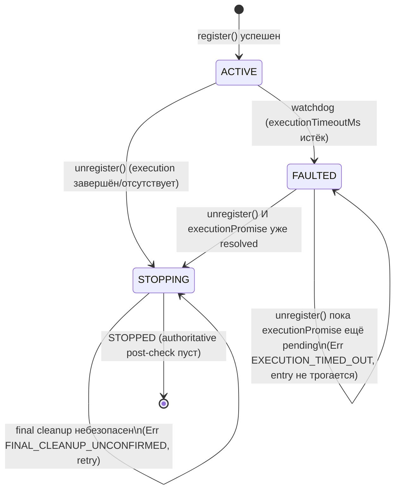

# Strategy: lifecycle, concurrency и execution safety

Пакет `@polymarket/strategy` (StrategyScheduler / ExecutionEngine / OrderEventBridge).

## Почему это сделано так?

Прежняя реализация имела несколько fail-open дыр:

1. `unregister()` мог выполнить final `CANCEL_ALL` **параллельно** с ещё идущим
   `ExecutionEngine.execute()`: поздний PLACE сохранял OPEN-ордер уже после
   отмены «всех» ордеров — после остановки стратегии оставался живой ордер.
2. PLACE блокировался только при `PENDING`-исходе cancel. `FAILED`, rejected
   Promise и исключения **не** блокировали размещение — fail-open
   cancel-and-replace (возможна двойная экспозиция).
3. `targetInstrumentId` можно было передать без `targetAsset` — ордер уходил
   на target instrument с primary asset (чужой CTF-токен).
4. CANCEL не проверял владельца ордера; post-cancel cooldown ставился на
   `ctx.instrumentId`, а не на инструмент фактически отменённого ордера.
5. Dedupe PLACE по `side:price.toNumber()` схлопывал BUY primary и BUY
   complementary по одинаковой цене.
6. `FILL_RECEIVED` снимал post-cancel cooldown **до** finality.
7. Прямые `setTimeout`/`setInterval`/`randomUUID` делали replay недетерминированным.
8. Retry/benign-классификация строилась на парсинге `error.message`.

### Вторая волна hardening (lifecycle/watchdog gaps)

Первая волна ввела lifecycle ACTIVE/STOPPING/STOPPED, но оставила зазоры:

1. Watchdog помечал стратегию `faulted`, но `unregister()` всё равно
   запускал `strategy.stop()` + final `CANCEL_ALL`, **не дожидаясь** реально
   зависшего `executionPromise` — если тот PLACE позже всё-таки завершался
   (например, venue ответил с задержкой), он создавал живой ордер уже ПОСЛЕ
   того, как entry была удалена и unregister «успешно» завершился.
2. Final cleanup не проверялся: `unregister()` удалял entry и логировал
   `Strategy unregistered` даже если `ExecutionEngine.execute()` для final
   intents вернул `CANCEL_PENDING`/`CANCEL_FAILED`/ошибки.
3. `strategy.stop()` мог технически вернуть `PLACE` (типизация это не
   запрещала) — final batch мог разместить новый ордер вместо ликвидации.
4. Регистрация, зависшая в `initialize()`, не могла быть отменена —
   `unregister()` не находил ещё не опубликованную entry.
5. Primary/complementary пара не проверялась против каталога при
   регистрации — рассинхрон обнаруживался только в момент PLACE.
6. `order.accountId === undefined` пропускал CANCEL без проверки владельца.
7. `routingInstrumentKeys` (primary+additional+complementary) ошибочно
   считался разрешённым PLACE-таргетом целиком — routing-only
    `additionalInstrumentIds` не должны быть tradable.

## Lifecycle стратегии



Шаги `unregister()` (`StrategyScheduler._attemptStop`) — может быть вызван
повторно (retry), если предыдущая попытка вернула `Err`:

1. `ACTIVE → STOPPING`: немедленный detach (heartbeat/routing/queue).
   `FAULTED` с **ещё не разрешившимся** `executionPromise` — **НЕ** идёт
   дальше: `strategy.stop()`/final intents не запускаются, entry не
   удаляется, возвращается `Err(EXECUTION_TIMED_OUT)` (retryable). Только
   когда hung promise фактически завершится, следующий explicit
   `unregister()` продолжает как `STOPPING`.
2. Ожидание `entry.executionPromise` (гарантированно завершится — либо его
   не было, либо он уже разрешился на шаге 1).
3. `strategy.stop()` вызывается **ровно один раз** — результат validated
   (только `CANCEL`/`CANCEL_ALL`, см. ниже) и кэшируется в
   `entry.finalIntents` для retry.
4. Исполнение final intents — **никогда** параллельно с обычным execution.
5. **Verification**: `report.errors/failed/blockedByUnsafeCancel`, unsafe
   cancel outcomes (`CANCEL_PENDING`/`CANCEL_FAILED`/
   `CANCEL_CONFIRMED_TARGET_UNKNOWN`) И authoritative post-check
   (`orderStateStore.getOpenOrders(strategyId)` пуст) — только при полном
   подтверждении переходим дальше.
6. Только после этого entry удаляется, lifecycle → `STOPPED`,
   логируется `Strategy unregistered`. Иначе — `Err(FINAL_CLEANUP_UNCONFIRMED)`,
   entry остаётся tracked для retry.

Повторный/конкурентный `unregister()` коалесцируется на **тот же**
`entry.stopAttemptPromise` (`strategy.stop()` и final intents не
запускаются параллельно дважды). `stopAll()` использует этот же flow плюс
global stopping barrier (см. ниже).

### Typed `StopStrategyError`

`unregister()`/`stopAll()` возвращают `Result<void, StopStrategyError>` —
не `Promise<void>`. Коды: `STRATEGY_NOT_FOUND`, `EXECUTION_STILL_RUNNING`,
`EXECUTION_TIMED_OUT`, `FINAL_CLEANUP_UNCONFIRMED`, `UNSAFE_FINAL_INTENT`,
`REGISTRATION_CANCELLED`, `OTHER`. Все — retryable (кроме `STRATEGY_NOT_FOUND`).

### `strategy.stop()` ограничен CANCEL/CANCEL_ALL

`IStrategy.stop(): StrategyStopIntent[]` — compile-time исключает `PLACE`.
Runtime-защита (стратегия может прийти из JS/unsafe cast): если
`strategy.stop()` вернул что-то кроме `CANCEL`/`CANCEL_ALL`, final batch
**не исполняется вообще** — `Err(UNSAFE_FINAL_INTENT)`, programming/
configuration error логируется как критическая ошибка.

### Pending registration cancellation

`register()`, зависшая в `strategy.initialize()`, регистрируется в
`_pendingRegistrations: Map<string, PendingRegistration>` (не просто
`Set<string>`). `unregister()`, вызванный в это время, выставляет
`pending.cancelled = true` и ждёт `pending.completion` — регистрация
пост-проверяет `cancelled` СРАЗУ после `initialize()` и, если отменена,
**не публикует** ACTIVE entry (без routing/heartbeat). `stopAll()`
поднимает global stopping barrier (`_globalStopping`), отменяет все pending
registrations и блокирует новые `register()` вызовы.

## Cancel-replace: fail-closed

`ExecutionEngine.execute()` считает `allCancelsSafeForReplace`:

| Исход cancel | PLACE разрешён? |
|---|---|
| `CONFIRMED` (CANCELLED / ALREADY_CANCELLED) | да |
| `TERMINAL_NOOP` (ALREADY_TERMINAL) | да |
| `PENDING` (FILL_PENDING / ALREADY_FILLED / RECONCILIATION_REQUIRED) | **нет** |
| `FAILED` (Err / ownership-отказ) | **нет** |
| rejected Promise / exception / неизвестный результат | **нет** |

Любой небезопасный cancel блокирует **все** PLACE batch-а (и BUY, и SELL);
каждый заблокированный PLACE увеличивает `skipped` и `blockedByUnsafeCancel`
и получает typed outcome `BLOCKED_BY_UNSAFE_CANCEL` в `report.outcomes`.

## Атомарная target-пара — БЕЗ trusted bypass для primary

`PlaceIntent` — discriminated union: `targetInstrumentId` и `targetAsset`
либо заданы **оба**, либо **ни один**. Helper `placeTarget(instrumentId, asset)`
собирает пару в стратегиях. `ExecutionEngine._resolveEffectiveTarget()`
строит effective pair (`explicit target ?? { ctx.instrumentId, ctx.asset }`)
и прогоняет её через **ОДНУ общую** валидацию (`_validateEffectiveTarget`) —
primary (implicit target) больше не имеет привилегированного bypass:

1. пара полная (оба поля или ни одного);
2. target в `ctx.tradableInstrumentKeys` (primary + complementary +
   explicit `additionalTradableTargets` — **НЕ** routing-only
   `additionalInstrumentIds`, см. ниже);
3. target есть в каталоге;
4. `assetIdToInstrumentId(targetAsset) === targetInstrumentId`.

Результат валидации — единый `EffectiveOrderTarget`; никаких независимых
fallback `targetX ?? ctx.X`.

## Routing vs tradable instruments

`additionalInstrumentIds` (регистрация) триггерят `tick()` (routing), но
**не** являются разрешённым PLACE-таргетом. `StrategyEntry` хранит два
раздельных набора:

- `routingInstrumentKeys` — primary + additional + complementary (routing);
- `tradableInstrumentKeys` — primary + complementary + explicit
  `additionalTradableTargets` (torgовый allow-list, передаётся в
  `ExecutionContext.tradableInstrumentKeys`).

Стратегия, которой нужен дополнительный tradable target (не только
complementary), передаёт его явно через `additionalTradableTargets` —
каждая пара валидируется при регистрации так же строго, как primary/complementary.

## Primary/complementary identity validation (при регистрации)

`StrategyScheduler.register()` валидирует identity **синхронно, ДО**
`strategy.initialize()`:

- `catalog.get(instrumentId) !== undefined` (primary, complementary, каждый
  `additionalTradableTargets`);
- `assetIdToInstrumentId(asset) === instrumentId` для каждой пары;
- `complementaryInstrumentId !== instrumentId` и
  `complementaryAsset !== asset` (через `assetIdToString()` — `AssetId` не
  имеет содержательного `toString()`, сравнение через `String(...)` всегда
  давало бы `"[object Object]" === "[object Object]"`).

При нарушении — `Err` до `initialize()`: routing/heartbeat не создаются.

## Ownership CANCEL

Перед `CancelOrderUseCase` — authoritative `orderRepo.get(orderId)`:

- ордер не найден → `FAILED` (владелец неизвестен);
- `order.strategyId !== ctx.strategyId` → `FAILED`;
- `order.accountId === undefined` → `FAILED` (**unknown owner** — legacy/
  corrupted Order без account identity не получает trusted fallback на
  `ctx.accountId`);
- `order.accountId` задан и ≠ `ctx.accountId` → `FAILED`.

Use case при отказе **не вызывается**; PLACE batch-а блокируются.
`CANCEL_ALL` разворачивается через `getByStrategyId(ctx.strategyId)`.

## Post-cancel cooldown — по фактическому Order

Ставится **только** при `CANCELLED`/`ALREADY_CANCELLED` И определённом
инструменте, **только** для BUY-ордера, на `assetIdToInstrumentId(order.asset)`
отменённого Order. Если BUY подтверждённо отменён venue, но
`assetIdToInstrumentId(order.asset)` не определён — результат
`CONFIRMED_TARGET_UNKNOWN` (не `CONFIRMED`): инкрементирует `cancelled`
(cancel реально произошёл), но **блокирует все PLACE batch-а** (replay-safety
не подтверждена) и **не ставит cooldown** (guessing инструмента запрещён).
Отмена SELL cooldown не ставит; отмена комплементарного ордера не блокирует
primary. Снимается только `FILL_CONFIRMED` (см. ниже).

## FILL_RECEIVED vs FILL_CONFIRMED

- `onFillReceivedForInstrument`: dirty + enqueue. Cooldown **не** снимается.
- `onFillConfirmedForInstrument`: finality cleanup — `clearPostCancelCooldown`
  + `clearExchangeRejectionCooldown`, затем dirty + enqueue.

`OrderEventBridge` маршрутизирует события 1:1 на эти методы.

## Dedupe PLACE

Ключ: `effectiveInstrumentId | side | price.value().toString() | postOnly`.
«Последний побеждает» — только при полностью одинаковом ключе.

## Детерминизм: ISchedulerTimer + IOrderIdGenerator

```typescript
// production (composition root buildStrategyEngine — дефолты):
new NodeSchedulerTimer();       // Node timers + unref
new UuidOrderIdGenerator();     // randomUUID

// replay/backtest:
new DeterministicSchedulerTimer(startMs); // advanceTo(nowMs) синхронно исполняет due-таймеры
new SequentialOrderIdGenerator('replay'); // replay-1, replay-2, ...
```

В оркестрации нет прямых `setTimeout`/`setInterval`/`randomUUID`.

## Typed failure codes (без парсинга error.message)

Граница классификации venue-текстов — **только** infrastructure adapter
(`PolymarketExchangeClientAdapter` → `SubmitRejectionCode` + числовая
`balance`-metadata в `SubmitOrderResult.REJECTED`). `PlaceOrderUseCase`
конвертирует в `PlaceOrderFailureError` (`PlaceFailureCode`):
`POST_ONLY_WOULD_TAKE | INSUFFICIENT_TOKEN_BALANCE | INSUFFICIENT_ALLOWANCE |
DEFINITELY_REJECTED | SUBMISSION_OUTCOME_UNKNOWN | RISK_REJECTED |
PORTFOLIO_UNAVAILABLE | OTHER`.

`ExecutionEngine`:

- benign post-only skip — только точный код `POST_ONLY_WOULD_TAKE`;
- SELL dust-retry (ровно один) — только `INSUFFICIENT_TOKEN_BALANCE`
  (definite reject) **с** Decimal-metadata и дефицитом < 1%;
- `SUBMISSION_OUTCOME_UNKNOWN` / transport ambiguity → никакого retry.

## Constraints (reject-only)

- Отсутствие catalog entry для PLACE → fail-closed local reject.
- Цена не кратна `tickSize` → reject (Decimal `mod`, без float `%`, без
  молчаливого округления) — стратегия сама квантует цену.
- `minOrderValue` — `Money` (денежный notional), а не `Quantity`.
- `StrategySnapshot.complementaryConstraints` — constraints комплементарного
  инструмента из каталога.

## BaseStrategy.adjustBuySize

Новый контракт: `Decimal | undefined` — **никогда** не увеличивает размер:
`desired < minOrderSize` → `undefined`; `price × desired < minOrderValue` →
`undefined`. Явный opt-in overbuy — `adjustBuySizeAllowingIncrease(...)`.

## Register hardening / ScheduleConfig

- дубликат `strategy.id` (включая registration-in-progress) → `Err`;
- concurrent register одного ID — single-flight (`initialize()` один раз);
- `complementaryInstrumentId`/`complementaryAsset` — только парой;
- primary/complementary/additional identity против каталога (см. выше);
- `validateScheduleConfig`: `minIntervalMs` int ≥ 0, `maxIdleMs` int > 0,
  `executionTimeoutMs` int > 0, `priorityTriggers` ⊆ известных reasons;
  внешний Set копируется;
- `createDefaultScheduleConfig()` — фабрика (не экспортированная константа):
  экспортированный default с `Set`-полем был бы разделяемым mutable
  singleton-ом между caller-ами.

## Watchdog

`ScheduleConfig.executionTimeoutMs` (default 30s): зависший `execute()` →
`entry.lifecycle = 'FAULTED'` (critical log), но **только если** entry
сейчас `ACTIVE` — watchdog не перезаписывает уже идущий `STOPPING`/`STOPPED`.
Новые тики блокируются, параллельный execution не запускается. В отличие от
первой волны, `unregister()` теперь **не** продолжает cleanup, пока
`entry.executionPromise` не разрешится сам — см. lifecycle diagram выше
(`FAULTED --> FAULTED` с `Err(EXECUTION_TIMED_OUT)`, затем
`FAULTED --> STOPPING` после разрешения promise). Это state-machine
recovery, не «отмена» Promise (JS не может отменить неотменяемую операцию).

## Per-intent exception isolation (ExecutionEngine)

`execute()` изолирует КАЖДЫЙ PLACE в отдельный try/catch boundary — на трёх
этапах: target resolution, dedupe key generation (`price.value()`), и сам
`_executePlace()`. Необработанное исключение на любом из них → `FAILED`
outcome ТОЛЬКО для этого intent, остальные PLACE и, тем более, уже
выполненные CANCEL/CANCEL_ALL — не затронуты. Критический инвариант:
`CANCEL_ALL` не зависит от корректности соседнего PLACE.

## Детерминированные порты — hardening

- `DeterministicSchedulerTimer.advanceTo()`: guard изменён с `nowMs <=
  this._nowMs` на `nowMs < this._nowMs` — таймер, поставленный с
  `delayMs=0` В ТЕКУЩИЙ момент, обязан сработать при следующем
  `advanceTo(this._nowMs)`; прежний guard считал такой вызов no-op и терял
  due-таймер молча.
- `SequentialOrderIdGenerator`: prefix валидируется в constructor
  (`OrderIdGeneratorConfigError` — пустой/whitespace-only/control chars).
- `UuidOrderIdGenerator`: `asOrderId(randomUUID())` больше не через `!` —
  `OrderIdGeneratorInvariantError`, если инвариант всё же нарушен.
- `KNOWN_TRIGGER_REASONS` — readonly tuple (не `Set`): экспортированный
  `Set`, даже типизированный как `ReadonlySet`, остаётся мутабельным
  runtime-объектом.

## ExecutionReport

```typescript
{ placed, cancelled, skipped, localRejected, blockedByUnsafeCancel, failed,
  errors: [{ intent, error }],   // исходные ошибки, не synthetic
  outcomes: [{ intent, kind, failureCode?, error?, reason? }] }
```

## Пример кода (актуальный!)

```typescript
// apps/bot/src/bot/buildStrategyEngine.ts
const engine = buildStrategyEngine({
  infra, repos, useCases, marketDataStore, marketCatalog,
  // replay/backtest:
  schedulerTimer: new DeterministicSchedulerTimer(startMs),
  orderIdGenerator: new SequentialOrderIdGenerator('replay'),
});
engine.scheduler.start();

const registerResult = await engine.scheduler.register({
  strategy, instrumentId, asset, accountId, market,
  complementaryInstrumentId, complementaryAsset, // строго парой; identity
                                                  // против каталога — до initialize()
});
if (!registerResult.ok) {
  logger.error('Strategy registration rejected', { error: registerResult.error.message });
}

const stopResult = await engine.scheduler.unregister(strategy.id); // typed Result
if (!stopResult.ok) {
  // Retryable: EXECUTION_STILL_RUNNING / EXECUTION_TIMED_OUT / FINAL_CLEANUP_UNCONFIRMED — повторить позже.
  // UNSAFE_FINAL_INTENT — programming/configuration error (strategy.stop() вернул не CANCEL/CANCEL_ALL).
  logger.error('Strategy stop unconfirmed, will retry', {
    code: stopResult.error.code,
    error: stopResult.error.message,
  });
}
```

## Третья волна hardening (2026-07-30): execution timeout, authoritative commitments, dispose()

Вторая волна ввела `FAULTED`/typed `StopStrategyError`, но watchdog оставался
привязан к lifecycle, а final cleanup проверял только локальные `Order`.

### Execution timeout независим от lifecycle

`StrategyEntry.activeExecution: ActiveExecution | undefined` заменяет
разрозненные `running`/`executionPromise` единым состоянием:

```typescript
interface ActiveExecution {
  readonly promise: Promise<void>;
  readonly startedAtMs: number;
  timedOut: boolean;
  completed: boolean;
  readonly timeoutHandle: TimerHandle;
  readonly timeoutSignal: Promise<void>; // resolves В ТОЧНОСТИ когда watchdog сработал
}
```

Watchdog-таймер в `_executeTick` мутирует `current.timedOut`/резолвит
`timeoutSignal` **независимо** от текущего lifecycle — только сама
lifecycle-мутация в `FAULTED` guarded (`if (entry.lifecycle === 'ACTIVE')`).
Раньше guard стоял на ВСЁМ watchdog-коллбэке (`if (entry.lifecycle !==
'ACTIVE') return;`), из-за чего сценарий:

```text
unregister() вызван → ACTIVE → STOPPING (до срабатывания watchdog)
watchdog видит lifecycle !== 'ACTIVE' → ничего не делает
execution зависает НАВСЕГДА
unregister/stopAll ждут execution.promise, который никогда не resolve
```

приводил к вечному зависанию. `_attemptStop` теперь ждёт **гонку**, а не
голый `await`:

```typescript
const outcome = await Promise.race([
  execution.promise.then(() => 'completed' as const),
  execution.timeoutSignal.then(() => 'timed-out' as const),
]);
if (outcome === 'timed-out') return Err(new StopStrategyError('EXECUTION_TIMED_OUT', ...));
```

Если timeout выигрывает гонку — `strategy.stop()`/final intents НЕ
запускаются, entry не удаляется, `Err(EXECUTION_TIMED_OUT)` retryable.
`stopAll()` с одной зависшей execution тоже не виснет — попадает в aggregate
`StopStrategyError[]`.

### Authoritative commitment post-check (`IStrategyCommitmentReader`)

`getOpenOrders(strategyId)` доказывает отсутствие ЛОКАЛЬНОГО `Order`, но не
отсутствие commitment: submission может быть `UNKNOWN`/`VENUE_ACCEPTED` (venue
принял ордер, локальный `Order` ещё не сохранён), reservation —
`RECONCILIATION_REQUIRED`, либо есть unsettled fill. Новый порт:

```typescript
interface IStrategyCommitmentReader {
  getActiveCommitments(input: {
    strategyId: string; accountId: AccountId; instrumentIds: readonly InstrumentId[];
  }): Promise<readonly StrategyCommitment[]>;
}
```

Реализация — `SubmissionJournalStrategyCommitmentReader`
(`@polymarket/use-cases`) поверх УЖЕ существующих `IOrderSubmissionRepository`
(`listByStatus` + `reservation.status`) и `IOrderStateStore.hasUnsettledFills`
— БЕЗ нового параллельного source of truth. `StrategySchedulerDeps.commitmentReader`
**обязателен** (не optional) — composition root (`buildStrategyEngine.ts`)
строит default из `repos.orderSubmissionRepo` + `repos.orderRepo`. Reader
exception — fail-closed (`FINAL_CLEANUP_UNCONFIRMED`, НЕ проглатывается).

### `dispose()` — cleanup отменённой (до публикации) регистрации

Если `unregister()`/`stopAll()` пришли, пока `strategy.initialize()` ещё
выполнялся, а `initialize()` в итоге вернул `Ok` — ресурсы уже открыты, но
ACTIVE entry никогда не публикуется (нет routing/execution context для
`strategy.stop()`). Новый lifecycle hook:

```typescript
dispose(): Promise<Result<void, Error>>; // default в BaseStrategy — Ok(undefined)
```

Вызывается `StrategyScheduler` РОВНО ОДИН РАЗ, ТОЛЬКО если `initialize()`
вернул `Ok` И регистрация была отменена. `initialize()` вернувший `Err`/
бросивший исключение — `dispose()` НЕ вызывается (ресурсы не считаются
открытыми). `dispose()` bросивший/вернувший `Err` — `DISPOSE_FAILED`,
видимый в `stopAll()` aggregate (обычная успешная отмена регистрации Err НЕ
считается stopAll-failure — только явный сбой `dispose()`).

### `strategy.stop()` exception — НЕ считается успехом

Раньше exception из `strategy.stop()` логировался, но `rawIntents`
оставался `[]`, который проходил валидацию — стратегия могла быть удалена
как «успешно остановленная», хотя `stop()` не выполнил свою работу. Теперь:
exception → `Err(STOP_HOOK_FAILED, { cause })`, `entry.finalIntents` НЕ
кэшируется — следующий `unregister()` вызовет `strategy.stop()` заново.

### Fresh `CANCEL_ALL` на каждом retry

`strategy.stop()` кэшируется и вызывается один раз, но список открытых
ордеров мог измениться МЕЖДУ retry-попытками (поздний PLACE, recovery). Final
batch = кэшированные intents + **гарантированный** `CANCEL_ALL` на каждой
попытке (без дублирования, если `stop()` уже вернул один).

### `additionalTradableTargets` теперь автоматически routing

Каждый `additionalTradableTargets` instrumentId добавляется в
`routingInstrumentKeys` при регистрации — раньше tradable target МОГ не
получать tick, если caller не продублировал его в `additionalInstrumentIds`.

### `ExecutionEngine`: CANCEL_ALL expansion изолирован

`orderRepo.getByStrategyId(ctx.strategyId)` (expansion `CANCEL_ALL`) обёрнут
в try/catch — сбой repo раньше ронял весь `execute()` (Promise rejects,
typed report терялся). Теперь — `CANCEL_FAILED` outcome для `CANCEL_ALL`,
блокирует все PLACE batch-а (`BLOCKED_BY_UNSAFE_CANCEL`), `execute()`
всё равно возвращает typed `ExecutionReport`.

### `KNOWN_TRIGGER_REASONS` — `Object.freeze`, `TriggerReason` из tuple

`readonly TriggerReason[]` (TypeScript-only readonly) заменён на
`Object.freeze([...] as const)` — runtime-immutability (`.push()`/индексное
присваивание бросают в strict mode). `TriggerReason` выводится
(`typeof KNOWN_TRIGGER_REASONS[number]`) из tuple, а не объявляется отдельно.
