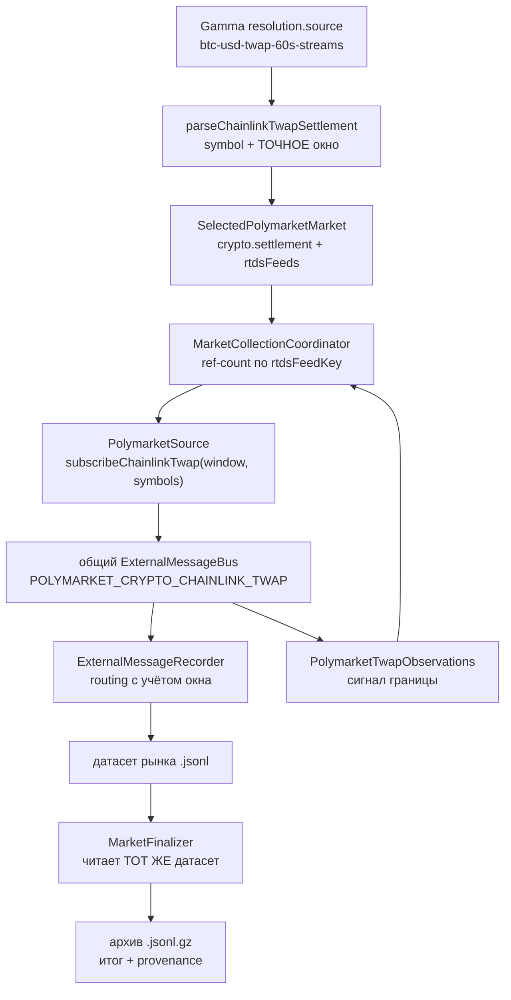
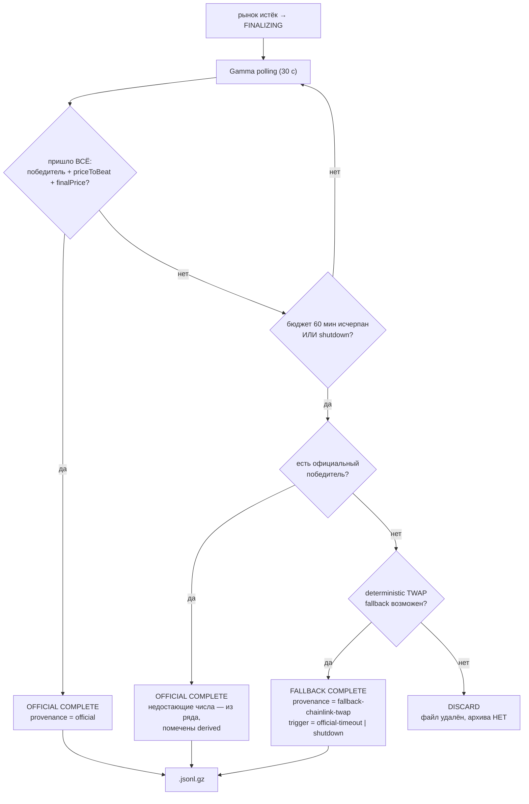

# TWAP settlement: сбор официального потока расчёта и резолюция архивов

Документ описывает, как система собирает официальный settlement-поток
Chainlink TWAP и как определяет итог крипто-рынка Up/Down при архивации.

## Почему это сделано так

### Проблема 1: архив не содержал источника расчёта

Крипто-рынки Polymarket серий «Up or Down» резолвятся по потоку Chainlink
TWAP, а не по спот-цене. Ссылка на этот поток лежит в `resolution.source`
рынка:

```text
https://data.chain.link/streams/btc-usd-twap-60s-streams
```

Прежняя реализация разбирала этот URL ТОЛЬКО чтобы опознать актив (`btc/usd`)
и подписаться на спот-фиды. Сам официальный поток расчёта не подписывался, а
окно усреднения (`60s`) терялось. В результате архив крипто-рынка не содержал
данных, по которым этот рынок в действительности резолвится, — воспроизвести
или проверить его исход по датасету было нельзя.

### Проблема 2: архив мог не знать итога

Финализатор ждал официальную резолюцию 60 минут, после чего архивировал
датасет со статусом `timeout` и, возможно, БЕЗ победителя:

```json
{ "status": "timeout", "winning": null }
```

Такой `.jsonl.gz` выглядит пригодным к replay, не будучи им. Для датасета это
худший из исходов: бектест примет его за полноценную сессию рынка и посчитает
по нему результат, которого рынок не присуждал.

Принятый контракт:

```text
.jsonl     = незавершённый датасет, replay невозможен
.jsonl.gz  = завершённый датасет, итог известен
```

## Правило расчёта (измерено, не предположено)

Live-характеризация 2026-08-26 (рынок `btc-updown-5m` 13:45–13:50Z, поток
`prices.crypto.chainlink.twap` / `btc/usd` / окно 60 с) дала ТОЧНОЕ
совпадение официальных чисел Gamma с записанными наблюдениями:

| Официальное значение Gamma | Наблюдение потока | Совпадение |
| --- | --- | --- |
| `priceToBeat` = 78449.05813530706 | `payload.timestamp` == `eventStartTime` → 78449.05813530705395712 | точное |
| `finalPrice` = 78400.7017548936 | `payload.timestamp` == `endDate` → 78400.701754893592952832 | точное |

Итог: `finalPrice < priceToBeat` → **Down**; Gamma резолвил `Down`=1 / `Up`=0.

Отсюда правило:

```text
priceToBeat = наблюдение TWAP с vendor-timestamp РОВНО == открытие окна рынка
finalPrice  = наблюдение TWAP с vendor-timestamp РОВНО == закрытие окна рынка
итог        = finalPrice >= priceToBeat → Up, иначе Down   (tie = Up)
```

### Почему ТОЧНОЕ совпадение, а не «ближайшее наблюдение»

1. Оракул берёт значение НА границе; соседняя секунда — уже другое число, и
   на близком финише оно способно перевернуть исход.
2. В замере наблюдение на `end + 1s` ДУБЛИРОВАЛО граничное значение — выбор
   «ближайшего по времени» стал бы неоднозначным выбором из двух равных.

Поэтому отсутствие граничного наблюдения — это «деривация недоступна», а не
повод взять соседнее. Лучше не создать архив, чем создать архив с
победителем, которого рынок не присуждал.

## Контракт официального SDK

`@polymarket/client@0.6.0` поддерживает settlement-поток отдельным spec-ом,
у которого окно ОБЯЗАТЕЛЬНО:

```typescript
// spec подписки
{ topic: 'prices.crypto.chainlink.twap', windowSeconds: 30 | 60, symbols: ['btc/usd'] }

// событие (после нормализации SDK)
{
  "topic": "prices.crypto.chainlink.twap",
  "type": "update",
  "timestamp": 1787751722763,
  "payload": {
    "symbol": "btc/usd",
    "timestamp": 1787751721000,
    "value": "78376.356031481042173952",
    "windowSeconds": 60
  }
}
```

Ключевое: `payload.windowSeconds` приходит В САМОМ событии. Поэтому и routing
записи, и последующий replay различают окна БЕЗ внешнего контекста.

Vendor-топики провода (`crypto_prices_twap_thirty` / `_sixty`) SDK
нормализует в один `topic` ещё до нас.

## Идентичность фида: окно — часть identity

`btc/usd` TWAP 30 и `btc/usd` TWAP 60 в один и тот же момент дают РАЗНЫЕ
значения. Это разные потоки, и весь контур обязан их различать. Правило
идентичности единственное на весь контур:

```typescript
// packages/infrastructure/polymarket-v2/src/PolymarketRtdsFeeds.ts
export function rtdsFeedKey(feed: PolymarketRtdsFeed): string {
  return isTwapRtdsFeed(feed)
    ? `${feed.topic}\n${feed.symbol}\n${String(feed.windowSeconds)}`
    : `${feed.topic}\n${feed.symbol}`;
}
```

По нему координатор ведёт ref-count физических подписок, а recorder —
routing записи. Собственного правила ни один слой не держит: добавить окно в
одном месте и забыть в другом означало бы молча смешать два потока в одном
файле.

### Окно берётся из дескриптора, НЕ из длительности рынка

Категорически запрещена эвристика вида «5-минутный рынок → окно 30 с». Все
живые 5-минутные серии (замер 2026-08-26: 130 рынков) резолвятся
**60-секундным** TWAP. Источник истины — `resolution.source` конкретного
рынка, разобранный строгим парсером:

```typescript
parseChainlinkTwapSettlement('https://data.chain.link/streams/btc-usd-twap-60s-streams');
// → { kind: 'chainlink-twap', symbol: 'btc/usd', windowSeconds: 60, resolutionSource: '…' }

parseChainlinkTwapSettlement('https://data.chain.link/streams/btc-usd-twap-45s-streams');
// → undefined — окно вне vendor-домена, подменять его 30/60 ЗАПРЕЩЕНО
```

Рынок с нераспознанным окном продолжает собираться по спот-фидам, но теряет
возможность deterministic-деривации — это честнее подмены окна.

#### Нераспознанное правило ≠ отсутствие правила

Эти два случая обязаны различаться, потому что политика у них
противоположная:

| `resolution.source` | Правило расчёта | Разрешена ли деривация по СПОТУ |
| --- | --- | --- |
| `…/btc-usd` | не объявлено | да (verified-поведение до MR-B) |
| `…/btc-usd-twap-45s-streams` | объявлено: TWAP, но окно не поддержано | **нет — только discard** |

Во втором случае источник расчёта ИЗВЕСТЕН и это не спот. Вывести
победителя по споту здесь значило бы присудить итог по потоку, которым
рынок не рассчитывается. Поэтому такой рынок помечается
`crypto.unsupportedSettlementSource`, и финализатор отказывает ему в
приблизительных ступенях: официальный результат — архивируем, иначе
удаляем.

Поле существует ровно затем, чтобы расширение vendor-домена (TWAP 45/120
или новая форма URL) РАНЬШЕ нашего кода не превратилось в молчаливую
подмену источника расчёта.

## Архитектура потока



Расчёт и артефакт опираются на ОДНО наблюдение: финализатор читает
записанный датасет, а не скрытый второй источник.

## Boundary grace: почему seal не происходит ровно на истечении

Измеренная задержка доставки RTDS: `recv − payload.timestamp` = **1116–2155 мс**
(p50 ≈ 1.5 с, n ≈ 90). Граничное наблюдение — то самое, по которому рынок и
рассчитывается, — приходит уже ПОСЛЕ момента истечения:

```text
10:50:00.000  рынок истёк
10:50:01.895  приходит наблюдение с payload.timestamp = 10:50:00.000
```

Заморозка датасета ровно на `expiresAt` теряла бы его. Поэтому:

```text
истечение рынка
   ├── CLOB-подписка          → закрывается НЕМЕДЛЕННО (trading lifecycle не продлевается)
   ├── spot-фиды              → refs освобождаются немедленно
   ├── routing записи         → сужается до ОДНОГО settlement-фида
   └── boundary grace (5 с)   → ждём граничное наблюдение
          ↓ получено ЛИБО истёк бюджет
       seal + release settlement-фида
```

Grace = измеренный максимум с запасом ×2, а не догадка. Ожидание завершается
ДОСРОЧНО, как только наблюдение получено (обычно ~1.5–2 с).

Сужение routing (`narrowRtdsFeeds`) нужно, чтобы «хвост» спот-фидов, живых
ради ДРУГИХ рынков, не попадал в датасет этого рынка: иначе граница датасета
зависела бы от того, кто ещё подписан.

## Алгоритм резолюции



### Порядок приоритета

1. официальная резолюция UMA (settlement-цены 1/0);
2. формула рынка на официальных `priceToBeat`/`finalPrice`;
3. deterministic-деривация из записанного settlement-потока;
4. иначе — датасет удаляется.

Fallback НИКОГДА не перезаписывает официальный результат: он даже не
вычисляется, если официальный есть.

### Условие завершения — ПОЛНЫЙ комплект официальных данных

Досрочно рынок закрывается, только когда пришло всё: победитель **и**
`priceToBeat` **и** `finalPrice`. Частичный комплект рынок не закрывает —
бюджет всё равно есть, а официальное число ценнее выведенного.

Ожидание дёшево: датасет заморожен, слот capacity освобождён, стоимость —
один Gamma-poll раз в 30 секунд. Верхняя граница — те же 60 минут.

#### Почему 60 минут хватает (замер 2026-08-26)

Три сигнала приходят В РАЗНОЕ время, и ждать нужно самый медленный.
Четыре рынка `*-updown-15m`, истёкшие в 17:00Z, секунды после истечения:

| Сигнал | ZCash | Dogecoin | Bitcoin | Solana |
| --- | --- | --- | --- | --- |
| `priceToBeat` | 143 | 21 | 21 | 82 |
| `uma=resolved` | 494 | 433 | 311 | 600 |
| `finalPrice` | 1054 | 1236 | 1221 | 1296 |

Полный комплект собрался у 4 из 4; медленнее всех `finalPrice` —
до **21.6 минуты**. Бюджет 60 минут покрывает это с запасом ×2.8.

Отсюда же следует, почему прежнее условие («достаточно победителя») теряло
данные: победитель известен уже на 5–10-й минуте, и рынок архивировался бы
за 10+ минут ДО прихода официального `finalPrice`, навсегда оставшись с
выведенным значением вместо официального.

По исчерпании бюджета рынок всё равно закрывается тем, что есть.
Недостающие числа не теряются: они восполняются из записанного
settlement-ряда по его границам и помечаются
`provenance.priceToBeat`/`finalPrice = 'derived'`. Официальное значение
никогда не подменяется выведенным, а выведенное никогда не выдаётся за
официальное.

### Shutdown ускоряет fallback

Остановка процесса после истечения рынка не ждёт оставшиеся минуты
официальной резолюции: если итог выводится из записанного потока
детерминированно, он выводится сразу (`trigger = 'shutdown'`). Рынок,
который ещё НЕ истёк, остаётся координатору и закрывается как `SHUTDOWN` —
его незавершённый файл удаляется.

## Формат архива

Правило расчёта живёт в CORE header-а с момента регистрации:

```json
{
  "crypto": {
    "source": "chainlink",
    "asset": "btc",
    "binanceSymbol": "BTCUSDT",
    "settlement": {
      "kind": "chainlink-twap",
      "topic": "prices.crypto.chainlink.twap",
      "symbol": "btc/usd",
      "windowSeconds": 60,
      "resolutionSource": "https://data.chain.link/streams/btc-usd-twap-60s-streams"
    }
  },
  "rtdsFeeds": [
    { "topic": "prices.crypto.chainlink", "symbol": "btc/usd" },
    { "topic": "prices.crypto.binance", "symbol": "btcusdt" },
    { "topic": "prices.crypto.chainlink.twap", "symbol": "btc/usd", "windowSeconds": 60 }
  ]
}
```

Итог и его происхождение — в `finalization`:

```json
{
  "status": "complete",
  "winning": {
    "label": "Down",
    "instrumentId": "101389397323710999927391642502527339626655709374120918194785825593702250185952",
    "outcomeIndex": 1,
    "source": "recorded-twap",
    "exact": true
  },
  "provenance": {
    "resolution": "fallback-chainlink-twap",
    "fallbackTrigger": "official-timeout",
    "priceToBeat": "official",
    "finalPrice": "derived",
    "evidence": {
      "symbol": "btc/usd",
      "windowSeconds": 60,
      "priceToBeatValue": "78449.05813530706",
      "priceToBeatTimestampMs": 1787751900000,
      "finalPriceValue": "78400.701754893592952832",
      "finalPriceTimestampMs": 1787752200000,
      "marketStartMs": 1787751900000,
      "marketEndMs": 1787752200000,
      "observations": 302
    }
  },
  "crypto": { "priceToBeat": "78449.05813530706", "finalPrice": "78400.701754893592952832" }
}
```

`evidence` достаточно, чтобы ВОСПРОИЗВЕСТИ решение по самому архиву: какой
фид, какое окно, какие два наблюдения и какие границы сравнивались.

### Identity победителя

`instrumentId` (CLOB tokenId) — основная машинная идентичность.
`outcomeIndex` — позиция в canonical `outcomes[]` того же header-а,
найденная СОПОСТАВЛЕНИЕМ. Порядок исходов не предполагается никогда:
константа `tokenIds[0]` присудила бы победу не тому инструменту у серий с
другим порядком. Несопоставимый победитель — это отсутствие результата, а не
индекс 0.

## Scope

Deterministic-деривация применяется ТОЛЬКО к рынкам с распознанным
settlement-дескриптором. Рынки Binance-источника и не-крипто сохраняют
прежнее verified-поведение (включая приблизительную ступень `recorded-rtds`
и статус `timeout`): их правило расчёта не охарактеризовано, и придумывать
его этот контур не берётся.

Для fallback НЕ используются: Binance spot, `prices.crypto.chainlink` spot,
цены токенов Polymarket, `last_trade_price`, стакан.

## Верификация

```bash
# live-прогон полного контура (production-фабрика, не отдельная композиция)
npx tsx scripts/checkpoint-raw-live.mts

# теневая сверка: официальный итог vs выведенный из архива
npx tsx scripts/verify-twap-parity.mts data/mrb-soak

# остановка ДО официальной резолюции: fallback обязан дать итог
npx tsx scripts/verify-shutdown-fallback.mts
```

Скрипт сверки импортирует ТУ ЖЕ production-функцию
`deriveWinnerFromRecordedTwap`, которой пользуется финализатор: расхождение
означает дефект production-кода, а не расхождение двух реализаций.

### Результат контролируемого прогона (2026-08-26)

Рынки `btc-updown-5m` и `eth-updown-5m` 15:20–15:25Z, остановка через 15 с
после истечения — заведомо раньше официальной резолюции Gamma:

```text
archives: 2   incomplete .jsonl left: 0
finalizer: {"archivedTotal":2,"fallbackFinalizations":2,"fallbackByShutdown":2,
            "officialFinalizations":0,"discardedUnresolvable":0}

Bitcoin Up or Down 11:20-11:25 ET
  status: complete   winner: Up idx=0 source=recorded-twap
  provenance: fallback-chainlink-twap trigger=shutdown
  evidence: btc/usd@60s ptb=77761.62984270808219648 @ marketStart
                        fp =77922.725884132700717056 @ marketEnd, obs=541
  recorded TWAP lines: 542
```

`Settlement boundary grace finished … waitedMs: 0, boundaryObserved: true` —
граничное наблюдение уже находилось в трекере к моменту cutoff, поэтому
grace завершился досрочно и датасет заморозился немедленно.

Независимое подтверждение правила на втором рынке: официальный
`priceToBeat` Gamma для ETH — `2438.3554053772505`, наше выведенное
значение — `2438.355405377250525184` (Gamma округляет до double).

### Сверка с официальной резолюцией

Оба рынка резолвились Polymarket уже ПОСЛЕ того, как процесс остановился и
итог был выведен. Сверка выведенного результата с официальным:

| Рынок | Выведено при shutdown | Официально (позже) | Совпадение |
| --- | --- | --- | --- |
| Bitcoin 11:20–11:25 ET | `Up` (recorded-twap) | `Up` (uma=resolved, 1/0) | label + `instrumentId` |
| Ethereum 11:20–11:25 ET | `Up` (recorded-twap) | `Up` (uma=resolved, 1/0) | label + `instrumentId` |

Совпадает не только метка, но и машинная identity инструмента — то есть
архив, созданный без единого официального числа, присуждает победу ровно
тому токену, которому её присудил Polymarket.

Теневой пересчёт по самому архиву (`verify-twap-parity.mts`) воспроизводит
те же `priceToBeat`/`finalPrice` до последнего знака: расчёт и артефакт
опираются на одно наблюдение, скрытого второго источника не существует.

### Известное ограничение окружения

Realtime-транспорт официального SDK под нагрузкой может замолчать без
ошибки: в прогоне 4 рынков (≈64 000 CLOB-событий в минуту + пагинация
10 000 рынков каждые 30 с) ВСЕ RTDS-потоки — Binance spot, Chainlink spot и
TWAP одинаково — прекратили доставку за 79 с до истечения и не
восстановились; независимые CCXT-соединения при этом работали. Это
поведение транспорта, а не settlement-канала, и оно ПРЕДШЕСТВУЕТ данному
контуру.

Последствие для резолюции ровно одно и оно безопасное: без граничного
наблюдения deterministic-деривация недоступна, и датасет либо
резолвится официально, либо удаляется — неверного победителя такой пропуск
дать не может. Для устойчивого fallback нагрузку на процесс нужно снижать
(меньше одновременных рынков), что уже подтверждено прогоном на двух.
