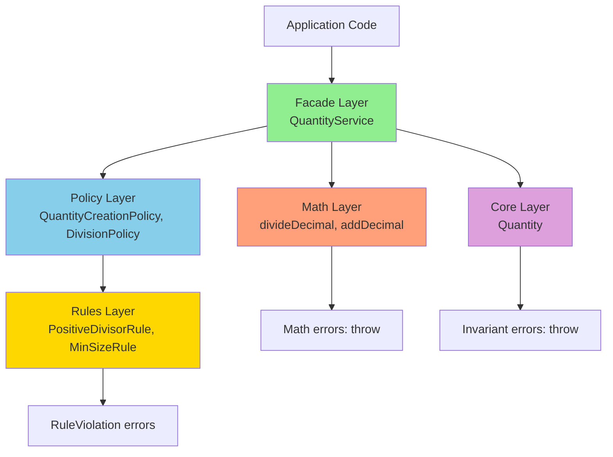

# План рефакторинга Value Objects: Архитектура разделения ответственности

## Оглавление

1. [Резюме](#резюме)
2. [Проблема и мотивация](#проблема-и-мотивация)
3. [Целевая архитектура](#целевая-архитектура)
4. [Детальный план рефакторинга Quantity](#детальный-план-рефакторинга-quantity)
5. [План тестирования](#план-тестирования)
6. [План документации](#план-документации)
7. [Миграционная стратегия](#миграционная-стратегия)

---

## Резюме

**Цель:** Разделить текущую монолитную реализацию Value Objects на четко разделённые слои с ясной ответственностью.

**Пилотный пример:** Quantity - как самый сложный VO с множеством операций.

**Принцип:** Разделение ответственности (Separation of Concerns)
- **Core** - "тупые" value objects (только инварианты существования + equality)
- **Math** - чистые математические операции (throw на математические невозможности)
- **Rules** - атомарные бизнес-правила (Result для ожидаемых ошибок)
- **Policy** - комбинации правил для конкретных сценариев
- **Facade** - единая точка входа (оркестрация)
- **Adapters** - сериализация и форматирование (технические детали)

**Стратегия обработки ошибок:**
- **Инварианты** (объект не может существовать в этом состоянии) → `throw`
- **Математические невозможности** (деление на ноль, NaN) → `throw`
- **Контекстуальные бизнес-правила** (отрицательный результат, нарушение minSize) → `Result.Err`

---

## Проблема и мотивация

### Текущее состояние (Quantity.ts)

**Файл:** `/Users/menvil/Projects/polymarket/packages/domain/value-objects/src/Quantity.ts` (660 строк)

**Проблемы:**

1. **Смешение ответственности** - один класс делает всё:
   - Валидация входных данных (lines 86-121, 166-233)
   - Математические операции (lines 380-498)
   - Бизнес-правила (minSize validation, lines 246-272)
   - Округление (lines 294-372)
   - Сериализация (lines 542-602)

2. **Непредсказуемая обработка ошибок:**
   ```typescript
   // divide() возвращает Result с 3 типами ошибок
   public divide(divisor: number): Result<
     Quantity,
     InvalidQuantityError | ArithmeticOverflowError | DivisionByZeroError
   > {
     // Но внутри:
     if (!divisorDecimal.isFinite()) {
       return Err(new InvalidQuantityError(...)); // ❌ Валидация входа
     }
     if (divisorDecimal.equals(0)) {
       return Err(new DivisionByZeroError(...)); // ✅ Математика
     }
     if (divisorDecimal.lessThan(0)) {
       return Err(new InvalidQuantityError(...)); // ❌ Бизнес-правило
     }
     // Реальная математика
   }
   ```

   **Проблема:** Смешаны валидация, математика, бизнес-правила.

   **Последствия:**
   - Невозможно переиспользовать математику отдельно
   - Нельзя применить другие правила (например, разрешить отрицательные делители)
   - Type signature перегружен
   - Тяжело тестировать изолированно

3. **Зависимость от контекста в "тупом" объекте:**
   ```typescript
   public static fromValue(
     value: number | string | Decimal,
     minSize: number = Quantity.MIN_SIZE // ❌ Бизнес-правило в фабрике VO
   ): Result<Quantity, InvalidQuantityError>
   ```

   **Проблема:** Value Object "знает" о minSize - это контекстуальное бизнес-правило.

   **Последствия:**
   - Нельзя создать Quantity без проверки minSize
   - Разные рынки имеют разные minSize - правило должно быть снаружи
   - Невозможно использовать Quantity для промежуточных вычислений

4. **Невозможность переиспользования:**
   - Математику `divideDecimal()` нельзя использовать для Price или Money
   - Правила привязаны к Quantity
   - Нет единого Policy для комбинирования правил

### Целевое состояние

**Цель:** Разделить на независимые слои, каждый с чёткой ответственностью.

**Преимущества:**
- ✅ Переиспользование математики для всех numeric VO
- ✅ Гибкость в применении разных правил
- ✅ Простота тестирования каждого слоя
- ✅ Явная стратегия обработки ошибок
- ✅ Railway-Oriented Programming для бизнес-логики

---

## Целевая архитектура

### Структура директорий

```
packages/domain/value-objects/src/
 ├─ core/                          ← "Тупые" value objects (только VO essentials)
 │   ├─ Quantity.ts                  - Инварианты + equality (finite, >= 0, equals)
 │   ├─ Price.ts
 │   ├─ Money.ts
 │   ├─ Balance.ts
 │   ├─ Percentage.ts
 │   └─ index.ts
 │
 ├─ adapters/                      ← Сериализация и форматирование
 │   ├─ QuantitySerializer.ts        - toJSON/fromJSON
 │   ├─ QuantityFormatter.ts         - toString
 │   ├─ PriceSerializer.ts
 │   ├─ PriceFormatter.ts
 │   └─ index.ts
 │
 ├─ math/                          ← Чистые математические операции
 │   ├─ decimal/
 │   │   ├─ add.ts                   - addDecimal(a, b): Decimal
 │   │   ├─ subtract.ts              - subtractDecimal(a, b): Decimal
 │   │   ├─ multiply.ts              - multiplyDecimal(a, b): Decimal
 │   │   ├─ divide.ts                - divideDecimal(a, b): Decimal (throw на 0)
 │   │   └─ index.ts
 │   ├─ rounding/
 │   │   ├─ roundToTick.ts           - roundToTick(value, tick, fn): Decimal
 │   │   └─ index.ts
 │   └─ index.ts
 │
 ├─ rules/                         ← Атомарные бизнес-правила
 │   ├─ base/
 │   │   ├─ Rule.ts                  - interface Rule<T>
 │   │   ├─ RuleViolation.ts         - abstract class RuleViolation
 │   │   └─ index.ts
 │   ├─ quantity/
 │   │   ├─ PositiveDivisorRule.ts   - check(divisor): Result<void, RuleViolation>
 │   │   ├─ NonNegativeResultRule.ts - check(result): Result<void, RuleViolation>
 │   │   ├─ MinSizeRule.ts           - check(qty, minSize): Result<void, RuleViolation>
 │   │   └─ index.ts
 │   ├─ price/
 │   │   └─ (аналогично для Price)
 │   └─ index.ts
 │
 ├─ policy/                        ← Комбинации правил
 │   ├─ base/
 │   │   ├─ Policy.ts                - базовый класс для policy
 │   │   └─ index.ts
 │   ├─ quantity/
 │   │   ├─ QuantityDivisionPolicy.ts   - combine division rules
 │   │   ├─ QuantityCreationPolicy.ts   - validate creation parameters
 │   │   └─ index.ts
 │   └─ index.ts
 │
 ├─ facade/                        ← Единая точка входа
 │   ├─ QuantityService.ts           - High-level API для Quantity
 │   ├─ PriceService.ts
 │   ├─ MoneyService.ts
 │   └─ index.ts
 │
 ├─ errors/                        ← Ошибки (уже есть в @polymarket/errors)
 │   └─ index.ts                     - Re-export from @polymarket/errors
 │
 └─ index.ts                       ← Экспортирует facade + core + adapters
```

### Слои и ответственность

#### 1. Core Layer - "Тупые" Value Objects

**Ответственность:**
- **ТОЛЬКО** инварианты существования объекта (immutability)
- **ТОЛЬКО** сравнение по значению (equality)
- Никаких бизнес-правил
- Никакой сериализации (это технические детали → Adapters)
- Private constructor + static factory `of()`
- Throw только на инварианты (finite, не NaN)

**Обоснование:**
Согласно DDD, Value Object имеет только ДВА строгих требования:
1. **Immutability** - объект неизменяемый
2. **Equality by value** - сравнение по значению, а не по ссылке

Сериализация (`toJSON`) и форматирование (`toString`) - это **НЕ** часть определения VO, а технические детали реализации. Они выносятся в Adapters layer.

**Пример: Quantity.ts**
```typescript
/**
 * Value Object для количества (Core Layer)
 *
 * @remarks
 * Строго минимальный VO - содержит ТОЛЬКО:
 * 1. Инварианты существования (immutability):
 *    - Значение должно быть конечным числом (finite)
 *    - Значение должно быть >= 0
 * 2. Сравнение по значению (equality):
 *    - equals() - сравнение двух Quantity
 *    - isZero() - частный случай сравнения
 *
 * НЕ содержит:
 * - Бизнес-правила (minSize, market-specific rules) → используйте QuantityService
 * - Математические операции (add/divide/etc) → используйте QuantityService
 * - Сериализацию (toJSON) → используйте QuantitySerializer
 * - Форматирование (toString) → используйте QuantityFormatter
 *
 * @example
 * ```typescript
 * // Создание (проверяет только инварианты)
 * const qty = Quantity.of(10);
 * const qty2 = Quantity.of(new Decimal(10));
 *
 * // Сравнение по значению
 * qty.equals(qty2); // true
 * qty.isZero();     // false
 *
 * // Доступ к значению
 * qty.value();      // Decimal(10)
 * qty.toNumber();   // 10
 *
 * // Для всего остального используйте facade/adapters
 * ```
 */
export class Quantity {
  private constructor(private readonly v: Decimal) {
    // Инварианты существования - throw
    if (!v.isFinite()) {
      throw new QuantityInvariantViolation('Quantity value must be finite');
    }
    if (v.isNegative()) {
      throw new QuantityInvariantViolation('Quantity cannot be negative');
    }
  }

  /**
   * Создаёт Quantity из значения
   *
   * @param value - Значение: number, string или Decimal
   * @returns Новый Quantity
   * @throws {QuantityInvariantViolation} Если значение нарушает инварианты
   *
   * @remarks
   * Этот метод НЕ делает бизнес-валидацию (minSize, etc).
   * Используйте QuantityService.create() для полной валидации.
   *
   * Оптимизация: если передан Decimal, используется напрямую без пересоздания.
   *
   * @example
   * ```typescript
   * Quantity.of(10);              // из number
   * Quantity.of("10.5");          // из string
   * Quantity.of(new Decimal(10)); // из Decimal (без пересоздания)
   * ```
   */
  public static of(value: number | string | Decimal): Quantity {
    // Оптимизация: если уже Decimal - используем напрямую
    if (value instanceof Decimal) {
      return new Quantity(value);
    }

    // Иначе создаём Decimal
    return new Quantity(new Decimal(value));
  }

  /**
   * Возвращает значение как Decimal
   *
   * @returns Immutable Decimal значение
   */
  public value(): Decimal {
    return this.v;
  }

  /**
   * Возвращает значение как number
   *
   * @returns Number значение (для удобства)
   *
   * @remarks
   * Может терять точность для очень больших чисел.
   * Используйте value() для точных вычислений.
   */
  public toNumber(): number {
    return this.v.toNumber();
  }

  /**
   * Сравнивает два Quantity по значению (Value Object equality)
   *
   * @param other - Другой Quantity для сравнения
   * @param epsilon - Точность сравнения (default: 0.0001)
   * @returns True если значения равны в пределах epsilon
   *
   * @remarks
   * Это строгое требование DDD для Value Object - сравнение по значению.
   * Используется epsilon для floating-point сравнений.
   *
   * @example
   * ```typescript
   * const q1 = Quantity.of(10);
   * const q2 = Quantity.of(10);
   * q1.equals(q2); // true
   *
   * const q3 = Quantity.of(10.00001);
   * q1.equals(q3); // true (в пределах epsilon)
   * ```
   */
  public equals(other: Quantity, epsilon: Decimal = new Decimal(0.0001)): boolean {
    return this.v.minus(other.v).abs().lessThan(epsilon);
  }

  /**
   * Проверяет равенство нулю
   *
   * @param epsilon - Точность сравнения (default: 0.0001)
   * @returns True если значение ~= 0
   *
   * @remarks
   * Частный случай equals() - сравнение с нулём.
   * Удобный helper для частого сценария.
   *
   * @example
   * ```typescript
   * Quantity.of(0).isZero();      // true
   * Quantity.of(0.00001).isZero(); // true (в пределах epsilon)
   * Quantity.of(1).isZero();       // false
   * ```
   */
  public isZero(epsilon: Decimal = new Decimal(0.0001)): boolean {
    return this.v.abs().lessThan(epsilon);
  }
}
```

**Ключевые особенности:**
- ✅ Только `Decimal` внутри (no number для точности)
- ✅ Private constructor (нельзя создать невалидный объект)
- ✅ Static factory `of()` - throws на инварианты, принимает number/string/Decimal
- ✅ Оптимизация: если `value instanceof Decimal` - не пересоздаём
- ✅ Только equality методы (equals, isZero) - требование DDD
- ✅ Никаких бизнес-правил (minSize → QuantityService)
- ✅ Никаких математических операций (add/divide → QuantityService)
- ✅ Никакой сериализации (toJSON → QuantitySerializer)
- ✅ Никакого форматирования (toString → QuantityFormatter)

---

#### 2. Math Layer - Чистые математические операции

**Ответственность:**
- Чистые функции для математики
- Throw только на математические невозможности (division by zero, NaN result)
- Переиспользуются всеми numeric VO

**Пример: math/decimal/divide.ts**
```typescript
/**
 * Делит два Decimal значения
 *
 * @param dividend - Делимое
 * @param divisor - Делитель
 * @returns Результат деления
 * @throws {DivisionByZeroError} Если делитель = 0
 * @throws {InvalidDivisorError} Если делитель не конечное число
 *
 * @remarks
 * Чистая математическая операция без бизнес-правил.
 * НЕ проверяет знак делителя (это бизнес-правило).
 * НЕ проверяет минимальные значения (это бизнес-правило).
 *
 * Throw = математическая невозможность (деление на 0, NaN).
 * Эти ошибки НЕ обрабатываются в бизнес-коде - они указывают на баг.
 *
 * @example
 * ```typescript
 * const a = new Decimal(10);
 * const b = new Decimal(2);
 * const result = divideDecimal(a, b); // 5
 *
 * // Throw на математическую невозможность
 * divideDecimal(a, new Decimal(0)); // throws DivisionByZeroError
 * divideDecimal(a, new Decimal(NaN)); // throws InvalidDivisorError
 * ```
 */
export function divideDecimal(dividend: Decimal, divisor: Decimal): Decimal {
  // Проверка на математическую корректность
  if (!divisor.isFinite()) {
    throw new InvalidDivisorError(
      `Divisor must be finite, got ${divisor.toString()}`
    );
  }

  if (divisor.isZero()) {
    throw new DivisionByZeroError('Cannot divide by zero');
  }

  const result = dividend.div(divisor);

  // Проверка результата на математическую корректность
  if (!result.isFinite()) {
    throw new ArithmeticOverflowError(
      `Division resulted in non-finite value: ${dividend} / ${divisor}`
    );
  }

  return result;
}
```

**Пример: math/decimal/add.ts**
```typescript
/**
 * Складывает два Decimal значения
 *
 * @param a - Первое значение
 * @param b - Второе значение
 * @returns Сумма
 * @throws {ArithmeticOverflowError} Если результат не конечное число
 */
export function addDecimal(a: Decimal, b: Decimal): Decimal {
  const result = a.plus(b);

  if (!result.isFinite()) {
    throw new ArithmeticOverflowError(
      `Addition resulted in non-finite value: ${a} + ${b}`
    );
  }

  return result;
}
```

**Пример: math/rounding/roundToTick.ts**
```typescript
/**
 * Округляет значение до размера тика
 *
 * @param value - Значение для округления
 * @param tickSize - Размер тика
 * @param roundFn - Функция округления (Math.round/floor/ceil)
 * @returns Округлённое значение
 * @throws {InvalidTickSizeError} Если tickSize <= 0 или не конечное
 *
 * @remarks
 * Алгоритм:
 * 1. value / tickSize
 * 2. roundFn(result)
 * 3. * tickSize
 * 4. Фиксирует decimal places по tickSize
 */
export function roundToTick(
  value: Decimal,
  tickSize: Decimal,
  roundFn: (x: number) => number = Math.round
): Decimal {
  if (!tickSize.isFinite() || tickSize.lessThanOrEqualTo(0)) {
    throw new InvalidTickSizeError(
      `Tick size must be finite and positive, got ${tickSize}`
    );
  }

  const divided = value.dividedBy(tickSize).toNumber();
  const rounded = roundFn(divided);
  const result = new Decimal(rounded).times(tickSize);

  return result;
}
```

**Ключевые особенности:**
- ✅ Чистые функции (pure functions)
- ✅ Работают с Decimal напрямую
- ✅ Throw только на математические невозможности
- ✅ Переиспользуемые для Quantity/Price/Money/etc

---

#### 3. Rules Layer - Атомарные бизнес-правила

**Ответственность:**
- Одно правило = одна проверка
- Возвращает `Result<void, RuleViolation>`
- Независимые и переиспользуемые

**Базовый интерфейс: rules/base/Rule.ts**
```typescript
/**
 * Базовый интерфейс для бизнес-правила
 *
 * @typeParam T - Тип проверяемого значения
 */
export interface Rule<T> {
  /**
   * Проверяет правило
   *
   * @param value - Значение для проверки
   * @returns Ok если правило выполнено, Err с нарушением
   */
  check(value: T): Result<void, RuleViolation>;
}
```

**Базовая ошибка: rules/base/RuleViolation.ts**
```typescript
import { DomainError } from '@polymarket/errors';

/**
 * Базовая ошибка для нарушения бизнес-правила
 *
 * @remarks
 * Все конкретные RuleViolation должны наследоваться от этого класса.
 * Это позволяет type-safe обработку в Policy и Facade слоях.
 */
export abstract class RuleViolation extends DomainError {
  public readonly kind = 'rule' as const;

  constructor(
    message: string,
    options?: { context?: Record<string, unknown> }
  ) {
    super(message, options);
  }
}
```

**Пример: rules/quantity/PositiveDivisorRule.ts**
```typescript
/**
 * Правило: делитель должен быть положительным
 *
 * @remarks
 * Бизнес-правило для Quantity division.
 * Математически деление на отрицательное число корректно,
 * но в контексте Quantity (количество акций) это не имеет смысла.
 */
export class PositiveDivisorRule implements Rule<Decimal> {
  check(divisor: Decimal): Result<void, NegativeDivisorNotAllowed> {
    if (divisor.lessThan(0)) {
      return Err(
        new NegativeDivisorNotAllowed(
          `Divisor must be positive, got ${divisor.toString()}`,
          { context: { divisor: divisor.toNumber() } }
        )
      );
    }

    return Ok(undefined);
  }
}

/**
 * Ошибка: отрицательный делитель не разрешён
 */
export class NegativeDivisorNotAllowed extends RuleViolation {
  public readonly code = 'NEGATIVE_DIVISOR_NOT_ALLOWED' as const;
}
```

**Пример: rules/quantity/NonNegativeResultRule.ts**
```typescript
/**
 * Правило: результат операции не должен быть отрицательным
 *
 * @remarks
 * Применяется к результату вычитания/деления.
 * Quantity не может быть отрицательным.
 */
export class NonNegativeResultRule implements Rule<Decimal> {
  check(result: Decimal): Result<void, NegativeQuantityNotAllowed> {
    if (result.lessThan(0)) {
      return Err(
        new NegativeQuantityNotAllowed(
          `Result cannot be negative, got ${result.toString()}`,
          { context: { result: result.toNumber() } }
        )
      );
    }

    return Ok(undefined);
  }
}

export class NegativeQuantityNotAllowed extends RuleViolation {
  public readonly code = 'NEGATIVE_QUANTITY_NOT_ALLOWED' as const;
}
```

**Пример: rules/quantity/MinSizeRule.ts**
```typescript
/**
 * Правило: значение должно быть >= минимального размера
 *
 * @remarks
 * Контекстуальное правило - зависит от параметра (minSize).
 * Разные рынки имеют разные minSize.
 */
export class MinSizeRule implements Rule<{ value: Decimal; minSize: Decimal }> {
  check(params: { value: Decimal; minSize: Decimal }): Result<void, BelowMinSizeError> {
    if (params.value.lessThan(params.minSize)) {
      return Err(
        new BelowMinSizeError(
          `Value ${params.value} is below minimum size ${params.minSize}`,
          {
            context: {
              value: params.value.toNumber(),
              minSize: params.minSize.toNumber()
            }
          }
        )
      );
    }

    return Ok(undefined);
  }
}

export class BelowMinSizeError extends RuleViolation {
  public readonly code = 'BELOW_MIN_SIZE' as const;
}
```

**Ключевые особенности:**
- ✅ Одна проверка = одно правило
- ✅ Возвращает Result<void, RuleViolation>
- ✅ Независимые (можно тестировать изолированно)
- ✅ Переиспользуемые (combine в Policy)

---

#### 4. Policy Layer - Комбинации правил

**Ответственность:**
- Объединяет несколько Rule для конкретного сценария
- Определяет порядок выполнения правил
- Возвращает первую ошибку или Ok

**Базовый класс: policy/base/Policy.ts**
```typescript
/**
 * Базовый класс для Policy
 *
 * @remarks
 * Policy комбинирует Rules в осмысленную проверку для сценария.
 * Выполняет правила в детерминированном порядке.
 * Возвращает первое нарушение или Ok.
 */
export abstract class Policy<T> {
  /**
   * Выполняет список правил по порядку
   *
   * @param rules - Список правил
   * @param value - Значение для проверки
   * @returns Ok если все правила выполнены, Err с первым нарушением
   */
  protected runRules(rules: Rule<T>[], value: T): Result<void, RuleViolation> {
    for (const rule of rules) {
      const result = rule.check(value);
      if (!result.ok) {
        return result;
      }
    }

    return Ok(undefined);
  }
}
```

**Пример: policy/quantity/QuantityDivisionPolicy.ts**
```typescript
/**
 * Policy для валидации деления Quantity
 *
 * @remarks
 * Объединяет правила для division операции:
 * 1. Валидация делителя (положительный)
 * 2. Валидация результата (неотрицательный)
 *
 * Используется в QuantityService.divide()
 */
export class QuantityDivisionPolicy extends Policy<Decimal> {
  constructor(
    private readonly divisorRules: Rule<Decimal>[] = [
      new PositiveDivisorRule()
    ],
    private readonly resultRules: Rule<Decimal>[] = [
      new NonNegativeResultRule()
    ]
  ) {
    super();
  }

  /**
   * Валидирует делитель перед операцией
   */
  validateDivisor(divisor: Decimal): Result<void, RuleViolation> {
    return this.runRules(this.divisorRules, divisor);
  }

  /**
   * Валидирует результат после операции
   */
  validateResult(result: Decimal): Result<void, RuleViolation> {
    return this.runRules(this.resultRules, result);
  }
}
```

**Пример: policy/quantity/QuantityCreationPolicy.ts**
```typescript
/**
 * Policy для создания Quantity
 *
 * @remarks
 * Валидирует параметры создания:
 * 1. Значение >= 0 (инвариант - будет проверен в Quantity.of())
 * 2. Значение >= minSize (контекстуальное правило)
 */
export class QuantityCreationPolicy extends Policy<{ value: Decimal; minSize: Decimal }> {
  constructor(
    private readonly rules: Rule<{ value: Decimal; minSize: Decimal }>[] = [
      new MinSizeRule()
    ]
  ) {
    super();
  }

  validate(params: { value: Decimal; minSize: Decimal }): Result<void, RuleViolation> {
    return this.runRules(this.rules, params);
  }
}
```

**Ключевые особенности:**
- ✅ Комбинирует Rules для сценария
- ✅ Детерминированный порядок выполнения
- ✅ Возвращает первую ошибку
- ✅ Конфигурируемые через constructor injection

---

#### 5. Facade Layer - Единая точка входа

**Ответственность:**
- Высокоуровневое API для работы с VO
- Оркестрация: Policy → Math → Core
- Railway-Oriented Programming с Result

**Пример: facade/QuantityService.ts**
```typescript
/**
 * Facade для работы с Quantity
 *
 * @remarks
 * Единая точка входа для всех операций с Quantity.
 * Оркестрирует слои: Policy → Math → Core
 *
 * Паттерн Railway-Oriented Programming:
 * - Валидация через Policy (Result)
 * - Математика через Math layer (throw на баги)
 * - Создание через Core (throw на инварианты)
 * - Результат как Result для композиции
 */
export class QuantityService {
  constructor(
    private readonly creationPolicy: QuantityCreationPolicy = new QuantityCreationPolicy(),
    private readonly divisionPolicy: QuantityDivisionPolicy = new QuantityDivisionPolicy()
  ) {}

  /**
   * Создаёт Quantity с валидацией
   *
   * @param value - Значение (number/string/Decimal)
   * @param minSize - Минимальный размер (контекст - из market info)
   * @returns Result с Quantity или RuleViolation
   *
   * @remarks
   * Шаги:
   * 1. Конвертация в Decimal
   * 2. Валидация через Policy (minSize rule)
   * 3. Создание через Core (инварианты)
   *
   * @example
   * ```typescript
   * const service = new QuantityService();
   *
   * // Успешное создание
   * const result = service.create(100, 1);
   * if (result.ok) {
   *   console.log(result.value.toNumber()); // 100
   * }
   *
   * // Ошибка - ниже minSize
   * const err = service.create(0.5, 1);
   * if (!err.ok) {
   *   console.log(err.error.code); // BELOW_MIN_SIZE
   * }
   * ```
   */
  create(
    value: Decimal.Value,
    minSize: Decimal.Value = 1
  ): Result<Quantity, RuleViolation> {
    const valueDecimal = new Decimal(value);
    const minSizeDecimal = new Decimal(minSize);

    // Валидация через Policy
    const validation = this.creationPolicy.validate({
      value: valueDecimal,
      minSize: minSizeDecimal
    });

    if (!validation.ok) {
      return validation;
    }

    // Создание через Core (throw на инварианты - это баг если Policy прошла)
    try {
      const quantity = Quantity.of(valueDecimal);
      return Ok(quantity);
    } catch (error) {
      // Если бросает после успешной Policy - это баг в Policy или Core
      // Не должно случиться в production
      throw error;
    }
  }

  /**
   * Создаёт Quantity из market data без minSize проверки
   *
   * @param value - Значение
   * @returns Result с Quantity или RuleViolation
   *
   * @remarks
   * Для входящих данных с биржи (trades, executions).
   * Биржа может отправлять значения < нашего minSize для ордеров.
   */
  fromMarketData(value: Decimal.Value): Result<Quantity, RuleViolation> {
    const valueDecimal = new Decimal(value);

    // Только проверка >= 0 (инвариант Core)
    if (valueDecimal.lessThan(0)) {
      return Err(
        new NegativeQuantityNotAllowed(
          `Market data quantity cannot be negative: ${value}`,
          { context: { value } }
        )
      );
    }

    try {
      return Ok(Quantity.of(valueDecimal));
    } catch (error) {
      // Баг если бросает после проверки >= 0
      throw error;
    }
  }

  /**
   * Делит Quantity на коэффициент
   *
   * @param quantity - Quantity для деления
   * @param divisor - Делитель
   * @returns Result с новым Quantity или RuleViolation
   *
   * @remarks
   * Оркестрация:
   * 1. Валидация делителя (Policy)
   * 2. Математическая операция (Math layer - может throw на 0/NaN)
   * 3. Валидация результата (Policy)
   * 4. Создание нового Quantity (Core)
   *
   * @example
   * ```typescript
   * const service = new QuantityService();
   * const qty = service.create(10, 1).value;
   *
   * // Успешное деление
   * const result = service.divide(qty, 2);
   * if (result.ok) {
   *   console.log(result.value.toNumber()); // 5
   * }
   *
   * // Ошибка - отрицательный делитель (бизнес-правило)
   * const err = service.divide(qty, -2);
   * if (!err.ok) {
   *   console.log(err.error.code); // NEGATIVE_DIVISOR_NOT_ALLOWED
   * }
   *
   * // Throw - деление на ноль (математическая невозможность)
   * service.divide(qty, 0); // throws DivisionByZeroError
   * ```
   */
  divide(
    quantity: Quantity,
    divisor: Decimal.Value
  ): Result<Quantity, RuleViolation> {
    const divisorDecimal = new Decimal(divisor);

    // 1. Валидация делителя через Policy
    const divisorValidation = this.divisionPolicy.validateDivisor(divisorDecimal);
    if (!divisorValidation.ok) {
      return divisorValidation;
    }

    // 2. Математическая операция (throw на division by zero/NaN - это баг)
    const resultDecimal = divideDecimal(quantity.value(), divisorDecimal);

    // 3. Валидация результата через Policy
    const resultValidation = this.divisionPolicy.validateResult(resultDecimal);
    if (!resultValidation.ok) {
      return resultValidation;
    }

    // 4. Создание нового Quantity
    try {
      return Ok(Quantity.of(resultDecimal));
    } catch (error) {
      // Баг если бросает после успешной Policy
      throw error;
    }
  }

  /**
   * Складывает два Quantity
   */
  add(a: Quantity, b: Quantity): Result<Quantity, RuleViolation> {
    // Математика (throw на overflow)
    const result = addDecimal(a.value(), b.value());

    // Создание (инварианты)
    try {
      return Ok(Quantity.of(result));
    } catch (error) {
      throw error;
    }
  }

  /**
   * Вычитает Quantity
   */
  subtract(a: Quantity, b: Quantity): Result<Quantity, RuleViolation> {
    // Математика
    const result = subtractDecimal(a.value(), b.value());

    // Валидация результата (нельзя быть отрицательным)
    const validation = new NonNegativeResultRule().check(result);
    if (!validation.ok) {
      return validation;
    }

    // Создание
    try {
      return Ok(Quantity.of(result));
    } catch (error) {
      throw error;
    }
  }

  /**
   * Умножает на коэффициент
   */
  multiply(quantity: Quantity, factor: Decimal.Value): Result<Quantity, RuleViolation> {
    const factorDecimal = new Decimal(factor);

    // Валидация фактора (неотрицательный)
    if (factorDecimal.lessThan(0)) {
      return Err(
        new NegativeFactorNotAllowed(
          `Factor must be non-negative, got ${factor}`,
          { context: { factor } }
        )
      );
    }

    // Математика (throw на overflow)
    const result = multiplyDecimal(quantity.value(), factorDecimal);

    // Создание
    try {
      return Ok(Quantity.of(result));
    } catch (error) {
      throw error;
    }
  }

  /**
   * Округляет до тика
   */
  roundToTick(
    quantity: Quantity,
    tickSize: Decimal.Value,
    mode: 'round' | 'floor' | 'ceil' = 'round'
  ): Result<Quantity, RuleViolation> {
    const tickDecimal = new Decimal(tickSize);
    const roundFn = mode === 'floor' ? Math.floor : mode === 'ceil' ? Math.ceil : Math.round;

    // Математика (throw на invalid tickSize)
    const result = roundToTick(quantity.value(), tickDecimal, roundFn);

    // Создание
    try {
      return Ok(Quantity.of(result));
    } catch (error) {
      throw error;
    }
  }

  /**
   * Статический helper для zero
   */
  static zero(): Quantity {
    return Quantity.of(0);
  }
}

export class NegativeFactorNotAllowed extends RuleViolation {
  public readonly code = 'NEGATIVE_FACTOR_NOT_ALLOWED' as const;
}
```

**Ключевые особенности:**
- ✅ Единая точка входа
- ✅ Оркестрация Policy → Math → Core
- ✅ Result для композиции
- ✅ try/catch только для защиты от багов
- ✅ Dependency Injection для тестирования

---

#### 6. Adapters Layer - Сериализация и форматирование

**Ответственность:**
- Сериализация Value Objects (toJSON/fromJSON)
- Форматирование для отображения (toString)
- Технические детали, НЕ часть определения VO в DDD

**Обоснование:**
Сериализация и форматирование - это **технические детали реализации**, а не часть теоретического определения Value Object. Согласно DDD, Value Object требует только:
1. Immutability
2. Equality by value

Все остальное (JSON, строковое представление) - это адаптация VO для конкретных технических нужд (HTTP API, логирование, UI).

**Пример: adapters/QuantitySerializer.ts**
```typescript
import { Quantity } from '../core/Quantity.js';
import { Result, Ok, Err } from '@polymarket/result';
import { InvalidQuantityError } from '@polymarket/errors';
import Decimal from 'decimal.js';

/**
 * Адаптер для сериализации Quantity
 *
 * @remarks
 * Отвечает за преобразование Quantity в JSON и обратно.
 * Выделен в отдельный адаптер потому что сериализация - это
 * технический аспект, а не часть определения Value Object.
 *
 * @example
 * ```typescript
 * const qty = Quantity.of(100);
 *
 * // Сериализация
 * const json = QuantitySerializer.toJSON(qty);
 * console.log(json); // { value: 100 }
 *
 * // Десериализация
 * const result = QuantitySerializer.fromJSON(json);
 * if (result.ok) {
 *   console.log(result.value.equals(qty)); // true
 * }
 * ```
 */
export class QuantitySerializer {
  /**
   * Сериализует Quantity в JSON
   *
   * @param quantity - Quantity для сериализации
   * @returns JSON объект
   */
  static toJSON(quantity: Quantity): { value: number } {
    return { value: quantity.toNumber() };
  }

  /**
   * Десериализует Quantity из JSON
   *
   * @param json - JSON объект
   * @returns Result с Quantity или ошибкой
   *
   * @remarks
   * Использует Quantity.of() - проверяет только инварианты.
   * Для валидации с minSize используйте QuantityService.create()
   */
  static fromJSON(json: { value: number }): Result<Quantity, InvalidQuantityError> {
    try {
      const qty = Quantity.of(json.value);
      return Ok(qty);
    } catch (error) {
      return Err(
        new InvalidQuantityError(
          () => `Failed to deserialize Quantity: ${error instanceof Error ? error.message : String(error)}`,
          { context: { json } }
        )
      );
    }
  }

  /**
   * Сериализует в JSON с дополнительными метаданными
   *
   * @param quantity - Quantity
   * @param metadata - Дополнительные данные (например, minSize из market)
   * @returns Расширенный JSON объект
   */
  static toJSONWithMetadata(
    quantity: Quantity,
    metadata?: { minSize?: number }
  ): { value: number; metadata?: { minSize?: number } } {
    return {
      value: quantity.toNumber(),
      ...(metadata && { metadata })
    };
  }
}
```

**Пример: adapters/QuantityFormatter.ts**
```typescript
import { Quantity } from '../core/Quantity.js';

/**
 * Адаптер для форматирования Quantity
 *
 * @remarks
 * Отвечает за представление Quantity в виде строки.
 * Выделен в отдельный адаптер потому что форматирование - это
 * технический аспект для UI/логирования, а не часть VO.
 *
 * @example
 * ```typescript
 * const qty = Quantity.of(10.567);
 *
 * QuantityFormatter.toString(qty);           // "10.57"
 * QuantityFormatter.toString(qty, 3);        // "10.567"
 * QuantityFormatter.toFixed(qty, 1);         // "10.6"
 * QuantityFormatter.toCompactString(qty);    // "10.6"
 * ```
 */
export class QuantityFormatter {
  /**
   * Форматирует Quantity как строку
   *
   * @param quantity - Quantity для форматирования
   * @param decimals - Количество десятичных знаков (default: 2)
   * @returns Отформатированная строка
   */
  static toString(quantity: Quantity, decimals: number = 2): string {
    return quantity.value().toFixed(decimals);
  }

  /**
   * Форматирует с фиксированным количеством знаков
   *
   * @param quantity - Quantity
   * @param decimals - Количество знаков
   * @returns Строка с фиксированным количеством знаков
   */
  static toFixed(quantity: Quantity, decimals: number): string {
    return quantity.value().toFixed(decimals);
  }

  /**
   * Компактное представление (убирает trailing zeros)
   *
   * @param quantity - Quantity
   * @returns Компактная строка
   *
   * @example
   * ```typescript
   * toCompactString(Quantity.of(10.00)); // "10"
   * toCompactString(Quantity.of(10.50)); // "10.5"
   * ```
   */
  static toCompactString(quantity: Quantity): string {
    return quantity.value().toString();
  }

  /**
   * Форматирует для отладки (с типом)
   *
   * @param quantity - Quantity
   * @returns Отладочное представление
   *
   * @example
   * ```typescript
   * toDebugString(Quantity.of(10)); // "Quantity(10)"
   * ```
   */
  static toDebugString(quantity: Quantity): string {
    return `Quantity(${quantity.value().toString()})`;
  }
}
```

**Использование:**
```typescript
const qty = Quantity.of(100.567);

// Сериализация
const json = QuantitySerializer.toJSON(qty);
const restored = QuantitySerializer.fromJSON(json);

// Форматирование
QuantityFormatter.toString(qty);        // "100.57"
QuantityFormatter.toString(qty, 3);     // "100.567"
QuantityFormatter.toCompactString(qty); // "100.567"
QuantityFormatter.toDebugString(qty);   // "Quantity(100.567)"
```

**Ключевые особенности:**
- ✅ Отделяет технические детали от бизнес-логики
- ✅ Сериализация в отдельном адаптере (QuantitySerializer)
- ✅ Форматирование в отдельном адаптере (QuantityFormatter)
- ✅ Core Quantity остаётся чистым (только инварианты + equality)
- ✅ Легко добавить новые адаптеры (XML, Protobuf, etc)
- ✅ Легко тестировать адаптеры отдельно от Core

---

## Детальный план рефакторинга Quantity

### Фаза 0: Подготовка (30 минут)

#### Шаг 0.1: Создать структуру директорий

**Действие:**
```bash
cd /Users/menvil/Projects/polymarket/packages/domain/value-objects/src

mkdir -p core
mkdir -p adapters
mkdir -p math/decimal
mkdir -p math/rounding
mkdir -p rules/base
mkdir -p rules/quantity
mkdir -p policy/base
mkdir -p policy/quantity
mkdir -p facade
```

#### Шаг 0.2: Создать базовые типы для Rules

**Файл:** `rules/base/Rule.ts`
```typescript
import { Result } from '@polymarket/result';
import { RuleViolation } from './RuleViolation.js';

/**
 * Базовый интерфейс для бизнес-правила
 */
export interface Rule<T> {
  check(value: T): Result<void, RuleViolation>;
}
```

**Файл:** `rules/base/RuleViolation.ts`
```typescript
import { DomainError } from '@polymarket/errors';

/**
 * Базовая ошибка для нарушения бизнес-правила
 */
export abstract class RuleViolation extends DomainError {
  public readonly kind = 'rule' as const;
}
```

**Файл:** `rules/base/index.ts`
```typescript
export { Rule } from './Rule.js';
export { RuleViolation } from './RuleViolation.js';
```

#### Шаг 0.3: Создать базовый Policy класс

**Файл:** `policy/base/Policy.ts`
```typescript
import { Result, Ok } from '@polymarket/result';
import { Rule, RuleViolation } from '../../rules/base/index.js';

export abstract class Policy<T> {
  protected runRules(rules: Rule<T>[], value: T): Result<void, RuleViolation> {
    for (const rule of rules) {
      const result = rule.check(value);
      if (!result.ok) return result;
    }
    return Ok(undefined);
  }
}
```

**Файл:** `policy/base/index.ts`
```typescript
export { Policy } from './Policy.js';
```

---

### Фаза 1: Math Layer (1 час)

#### Шаг 1.1: Создать математические операции

**Файл:** `math/decimal/divide.ts`
```typescript
import Decimal from 'decimal.js';
import {
  DivisionByZeroError,
  InvalidDivisorError,
  ArithmeticOverflowError
} from '@polymarket/errors';

/**
 * Делит два Decimal значения
 *
 * @throws {InvalidDivisorError} Если делитель не конечное число
 * @throws {DivisionByZeroError} Если делитель = 0
 * @throws {ArithmeticOverflowError} Если результат не конечное число
 */
export function divideDecimal(dividend: Decimal, divisor: Decimal): Decimal {
  if (!divisor.isFinite()) {
    throw new InvalidDivisorError(
      () => `Divisor must be finite, got ${divisor.toString()}`,
      { context: { divisor: divisor.toString() } }
    );
  }

  if (divisor.isZero()) {
    throw new DivisionByZeroError(
      () => 'Cannot divide by zero',
      { context: {} }
    );
  }

  const result = dividend.div(divisor);

  if (!result.isFinite()) {
    throw new ArithmeticOverflowError(
      (ctx) => `Division resulted in non-finite value: ${ctx.dividend} / ${ctx.divisor}`,
      {
        context: {
          dividend: dividend.toString(),
          divisor: divisor.toString()
        }
      }
    );
  }

  return result;
}
```

**Файл:** `math/decimal/add.ts`
```typescript
import Decimal from 'decimal.js';
import { ArithmeticOverflowError } from '@polymarket/errors';

export function addDecimal(a: Decimal, b: Decimal): Decimal {
  const result = a.plus(b);

  if (!result.isFinite()) {
    throw new ArithmeticOverflowError(
      (ctx) => `Addition overflow: ${ctx.a} + ${ctx.b}`,
      { context: { a: a.toString(), b: b.toString() } }
    );
  }

  return result;
}
```

**Файл:** `math/decimal/subtract.ts`
```typescript
import Decimal from 'decimal.js';
import { ArithmeticOverflowError } from '@polymarket/errors';

export function subtractDecimal(a: Decimal, b: Decimal): Decimal {
  const result = a.minus(b);

  if (!result.isFinite()) {
    throw new ArithmeticOverflowError(
      (ctx) => `Subtraction overflow: ${ctx.a} - ${ctx.b}`,
      { context: { a: a.toString(), b: b.toString() } }
    );
  }

  return result;
}
```

**Файл:** `math/decimal/multiply.ts`
```typescript
import Decimal from 'decimal.js';
import { ArithmeticOverflowError } from '@polymarket/errors';

export function multiplyDecimal(a: Decimal, b: Decimal): Decimal {
  const result = a.times(b);

  if (!result.isFinite()) {
    throw new ArithmeticOverflowError(
      (ctx) => `Multiplication overflow: ${ctx.a} * ${ctx.b}`,
      { context: { a: a.toString(), b: b.toString() } }
    );
  }

  return result;
}
```

**Файл:** `math/decimal/index.ts`
```typescript
export { divideDecimal } from './divide.js';
export { addDecimal } from './add.js';
export { subtractDecimal } from './subtract.js';
export { multiplyDecimal } from './multiply.js';
```

#### Шаг 1.2: Создать операции округления

**Файл:** `math/rounding/roundToTick.ts`
```typescript
import Decimal from 'decimal.js';
import { InvalidTickSizeError } from '@polymarket/errors';

/**
 * Округляет значение до размера тика
 *
 * @throws {InvalidTickSizeError} Если tickSize невалидный
 */
export function roundToTick(
  value: Decimal,
  tickSize: Decimal,
  roundFn: (x: number) => number = Math.round
): Decimal {
  if (!tickSize.isFinite() || tickSize.lessThanOrEqualTo(0)) {
    throw new InvalidTickSizeError(
      () => `Tick size must be finite and positive, got ${tickSize.toString()}`,
      { context: { tickSize: tickSize.toString() } }
    );
  }

  const divided = value.dividedBy(tickSize).toNumber();
  const rounded = roundFn(divided);
  const result = new Decimal(rounded).times(tickSize);

  return result;
}
```

**Файл:** `math/rounding/index.ts`
```typescript
export { roundToTick } from './roundToTick.js';
```

**Файл:** `math/index.ts`
```typescript
export * from './decimal/index.js';
export * from './rounding/index.js';
```

---

### Фаза 2: Core Layer (30 минут)

#### Шаг 2.1: Создать "тупой" Quantity

**Файл:** `core/Quantity.ts`
```typescript
import Decimal from 'decimal.js';

/**
 * Ошибка нарушения инварианта Quantity
 */
export class QuantityInvariantViolation extends Error {
  constructor(message: string) {
    super(message);
    this.name = 'QuantityInvariantViolation';
  }
}

/**
 * Value Object для количества (Core Layer)
 *
 * @remarks
 * Строго минимальный VO - содержит ТОЛЬКО:
 * 1. Инварианты существования (immutability):
 *    - Значение должно быть конечным числом
 *    - Значение должно быть >= 0
 * 2. Сравнение по значению (equality):
 *    - equals() - сравнение двух Quantity
 *    - isZero() - частный случай сравнения
 *
 * Сериализация (toJSON) → QuantitySerializer
 * Форматирование (toString) → QuantityFormatter
 * Бизнес-операции (divide/multiply) → QuantityService
 */
export class Quantity {
  private constructor(private readonly v: Decimal) {
    if (!v.isFinite()) {
      throw new QuantityInvariantViolation('Quantity value must be finite');
    }
    if (v.isNegative()) {
      throw new QuantityInvariantViolation('Quantity cannot be negative');
    }
  }

  /**
   * Создаёт Quantity из значения
   *
   * @param value - Значение: number, string или Decimal
   * @returns Новый Quantity
   * @throws {QuantityInvariantViolation} Если значение нарушает инварианты
   *
   * @remarks
   * Оптимизация: если передан Decimal, используется напрямую без пересоздания.
   */
  public static of(value: number | string | Decimal): Quantity {
    // Оптимизация: если уже Decimal - используем напрямую
    if (value instanceof Decimal) {
      return new Quantity(value);
    }

    // Иначе создаём Decimal
    return new Quantity(new Decimal(value));
  }

  public value(): Decimal {
    return this.v;
  }

  public toNumber(): number {
    return this.v.toNumber();
  }

  public equals(other: Quantity, epsilon: Decimal = new Decimal(0.0001)): boolean {
    return this.v.minus(other.v).abs().lessThan(epsilon);
  }

  public isZero(epsilon: Decimal = new Decimal(0.0001)): boolean {
    return this.v.abs().lessThan(epsilon);
  }
}
```

**Файл:** `core/index.ts`
```typescript
export { Quantity, QuantityInvariantViolation } from './Quantity.js';
```

---

### Фаза 3: Rules Layer (1 час)

#### Шаг 3.1: Создать правила для Quantity

**Файл:** `rules/quantity/PositiveDivisorRule.ts`
```typescript
import Decimal from 'decimal.js';
import { Result, Ok, Err } from '@polymarket/result';
import { Rule, RuleViolation } from '../base/index.js';

export class NegativeDivisorNotAllowed extends RuleViolation {
  public readonly code = 'NEGATIVE_DIVISOR_NOT_ALLOWED' as const;
}

export class PositiveDivisorRule implements Rule<Decimal> {
  check(divisor: Decimal): Result<void, NegativeDivisorNotAllowed> {
    if (divisor.lessThan(0)) {
      return Err(
        new NegativeDivisorNotAllowed(
          `Divisor must be positive, got ${divisor.toString()}`,
          { context: { divisor: divisor.toNumber() } }
        )
      );
    }
    return Ok(undefined);
  }
}
```

**Файл:** `rules/quantity/NonNegativeResultRule.ts`
```typescript
import Decimal from 'decimal.js';
import { Result, Ok, Err } from '@polymarket/result';
import { Rule, RuleViolation } from '../base/index.js';

export class NegativeQuantityNotAllowed extends RuleViolation {
  public readonly code = 'NEGATIVE_QUANTITY_NOT_ALLOWED' as const;
}

export class NonNegativeResultRule implements Rule<Decimal> {
  check(result: Decimal): Result<void, NegativeQuantityNotAllowed> {
    if (result.lessThan(0)) {
      return Err(
        new NegativeQuantityNotAllowed(
          `Result cannot be negative, got ${result.toString()}`,
          { context: { result: result.toNumber() } }
        )
      );
    }
    return Ok(undefined);
  }
}
```

**Файл:** `rules/quantity/MinSizeRule.ts`
```typescript
import Decimal from 'decimal.js';
import { Result, Ok, Err } from '@polymarket/result';
import { Rule, RuleViolation } from '../base/index.js';

export class BelowMinSizeError extends RuleViolation {
  public readonly code = 'BELOW_MIN_SIZE' as const;
}

export class MinSizeRule implements Rule<{ value: Decimal; minSize: Decimal }> {
  check(params: { value: Decimal; minSize: Decimal }): Result<void, BelowMinSizeError> {
    if (params.value.lessThan(params.minSize)) {
      return Err(
        new BelowMinSizeError(
          `Value ${params.value} is below minimum size ${params.minSize}`,
          {
            context: {
              value: params.value.toNumber(),
              minSize: params.minSize.toNumber()
            }
          }
        )
      );
    }
    return Ok(undefined);
  }
}
```

**Файл:** `rules/quantity/index.ts`
```typescript
export { PositiveDivisorRule, NegativeDivisorNotAllowed } from './PositiveDivisorRule.js';
export { NonNegativeResultRule, NegativeQuantityNotAllowed } from './NonNegativeResultRule.js';
export { MinSizeRule, BelowMinSizeError } from './MinSizeRule.js';
```

**Файл:** `rules/index.ts`
```typescript
export * from './base/index.js';
export * from './quantity/index.js';
```

---

### Фаза 4: Policy Layer (45 минут)

#### Шаг 4.1: Создать Policy для Quantity

**Файл:** `policy/quantity/QuantityCreationPolicy.ts`
```typescript
import Decimal from 'decimal.js';
import { Result } from '@polymarket/result';
import { Policy } from '../base/Policy.js';
import { Rule, RuleViolation } from '../../rules/base/index.js';
import { MinSizeRule } from '../../rules/quantity/index.js';

export class QuantityCreationPolicy extends Policy<{ value: Decimal; minSize: Decimal }> {
  constructor(
    private readonly rules: Rule<{ value: Decimal; minSize: Decimal }>[] = [
      new MinSizeRule()
    ]
  ) {
    super();
  }

  validate(params: { value: Decimal; minSize: Decimal }): Result<void, RuleViolation> {
    return this.runRules(this.rules, params);
  }
}
```

**Файл:** `policy/quantity/QuantityDivisionPolicy.ts`
```typescript
import Decimal from 'decimal.js';
import { Result } from '@polymarket/result';
import { Policy } from '../base/Policy.js';
import { Rule, RuleViolation } from '../../rules/base/index.js';
import {
  PositiveDivisorRule,
  NonNegativeResultRule
} from '../../rules/quantity/index.js';

export class QuantityDivisionPolicy extends Policy<Decimal> {
  constructor(
    private readonly divisorRules: Rule<Decimal>[] = [new PositiveDivisorRule()],
    private readonly resultRules: Rule<Decimal>[] = [new NonNegativeResultRule()]
  ) {
    super();
  }

  validateDivisor(divisor: Decimal): Result<void, RuleViolation> {
    return this.runRules(this.divisorRules, divisor);
  }

  validateResult(result: Decimal): Result<void, RuleViolation> {
    return this.runRules(this.resultRules, result);
  }
}
```

**Файл:** `policy/quantity/index.ts`
```typescript
export { QuantityCreationPolicy } from './QuantityCreationPolicy.js';
export { QuantityDivisionPolicy } from './QuantityDivisionPolicy.js';
```

**Файл:** `policy/index.ts`
```typescript
export * from './base/index.js';
export * from './quantity/index.js';
```

---

### Фаза 5: Facade Layer (1 час)

#### Шаг 5.1: Создать QuantityService

**Файл:** `facade/QuantityService.ts`

(См. полный код выше в разделе "Facade Layer")

**Файл:** `facade/index.ts`
```typescript
export { QuantityService } from './QuantityService.js';
```

---

### Фаза 6: Adapters Layer (30 минут)

#### Шаг 6.1: Создать QuantitySerializer

**Файл:** `adapters/QuantitySerializer.ts`
```typescript
import { Quantity } from '../core/Quantity.js';
import { Result, Ok, Err } from '@polymarket/result';
import { InvalidQuantityError } from '@polymarket/errors';
import Decimal from 'decimal.js';

/**
 * Адаптер для сериализации Quantity
 */
export class QuantitySerializer {
  static toJSON(quantity: Quantity): { value: number } {
    return { value: quantity.toNumber() };
  }

  static fromJSON(json: { value: number }): Result<Quantity, InvalidQuantityError> {
    try {
      const qty = Quantity.of(json.value);
      return Ok(qty);
    } catch (error) {
      return Err(
        new InvalidQuantityError(
          () => `Failed to deserialize Quantity: ${error instanceof Error ? error.message : String(error)}`,
          { context: { json } }
        )
      );
    }
  }
}
```

#### Шаг 6.2: Создать QuantityFormatter

**Файл:** `adapters/QuantityFormatter.ts`
```typescript
import { Quantity } from '../core/Quantity.js';

/**
 * Адаптер для форматирования Quantity
 */
export class QuantityFormatter {
  static toString(quantity: Quantity, decimals: number = 2): string {
    return quantity.value().toFixed(decimals);
  }

  static toFixed(quantity: Quantity, decimals: number): string {
    return quantity.value().toFixed(decimals);
  }

  static toCompactString(quantity: Quantity): string {
    return quantity.value().toString();
  }

  static toDebugString(quantity: Quantity): string {
    return `Quantity(${quantity.value().toString()})`;
  }
}
```

**Файл:** `adapters/index.ts`
```typescript
export { QuantitySerializer } from './QuantitySerializer.js';
export { QuantityFormatter } from './QuantityFormatter.js';
```

---

### Фаза 7: Главный index.ts (15 минут)

#### Шаг 7.1: Обновить главный export

**Файл:** `src/index.ts`
```typescript
// Главный export - facade, core и adapters
export { QuantityService } from './facade/index.js';
export { Quantity } from './core/index.js';
export { QuantitySerializer, QuantityFormatter } from './adapters/index.js';

// Ошибки для пользователей
export { RuleViolation } from './rules/base/index.js';
export {
  NegativeDivisorNotAllowed,
  NegativeQuantityNotAllowed,
  BelowMinSizeError
} from './rules/quantity/index.js';

// Старый Quantity - @deprecated (для миграции)
export { Quantity as QuantityLegacy } from './Quantity.js';
```

---

### Фаза 8: Обновить package.json exports (15 минут)

#### Шаг 8.1: Настроить exports

**Файл:** `packages/domain/value-objects/package.json`
```json
{
  "name": "@polymarket/value-objects",
  "exports": {
    ".": {
      "types": "./dist/index.d.ts",
      "import": "./dist/index.js"
    },
    "./core": {
      "types": "./dist/core/index.d.ts",
      "import": "./dist/core/index.js"
    },
    "./adapters": {
      "types": "./dist/adapters/index.d.ts",
      "import": "./dist/adapters/index.js"
    },
    "./math": {
      "types": "./dist/math/index.d.ts",
      "import": "./dist/math/index.js"
    },
    "./rules": {
      "types": "./dist/rules/index.d.ts",
      "import": "./dist/rules/index.js"
    },
    "./policy": {
      "types": "./dist/policy/index.d.ts",
      "import": "./dist/policy/index.js"
    },
    "./facade": {
      "types": "./dist/facade/index.d.ts",
      "import": "./dist/facade/index.js"
    }
  }
}
```

---

## План тестирования

### Структура тестов

```
packages/domain/value-objects/__tests__/
 ├─ unit/
 │   ├─ core/
 │   │   └─ Quantity.test.ts          (инварианты, of(), throw)
 │   ├─ math/
 │   │   ├─ divide.test.ts            (divideDecimal throw cases)
 │   │   ├─ add.test.ts
 │   │   ├─ subtract.test.ts
 │   │   ├─ multiply.test.ts
 │   │   └─ roundToTick.test.ts
 │   ├─ rules/
 │   │   ├─ PositiveDivisorRule.test.ts
 │   │   ├─ NonNegativeResultRule.test.ts
 │   │   └─ MinSizeRule.test.ts
 │   ├─ policy/
 │   │   ├─ QuantityCreationPolicy.test.ts
 │   │   └─ QuantityDivisionPolicy.test.ts
 │   └─ facade/
 │       └─ QuantityService.test.ts   (интеграция всех слоёв)
 │
 └─ integration/
     └─ QuantityWorkflow.test.ts      (полный флоу)
```

### Unit тесты по слоям

#### Core Layer Tests

**Файл:** `__tests__/unit/core/Quantity.test.ts`

```typescript
import { describe, it, expect } from '@jest/globals';
import { Quantity, QuantityInvariantViolation } from '../../../src/core/Quantity.js';
import Decimal from 'decimal.js';

describe('Quantity (Core)', () => {
  describe('of()', () => {
    it('должен создать Quantity с валидным значением', () => {
      const qty = Quantity.of(10);

      expect(qty.toNumber()).toBe(10);
      expect(qty.value().equals(10)).toBe(true);
    });

    it('должен создать Quantity с нулём', () => {
      const qty = Quantity.of(0);

      expect(qty.toNumber()).toBe(0);
      expect(qty.isZero()).toBe(true);
    });

    it('должен throw на отрицательное значение (инвариант)', () => {
      expect(() => Quantity.of(-10)).toThrow(QuantityInvariantViolation);
      expect(() => Quantity.of(-10)).toThrow('cannot be negative');
    });

    it('должен throw на NaN (инвариант)', () => {
      expect(() => Quantity.of(NaN)).toThrow(QuantityInvariantViolation);
      expect(() => Quantity.of(NaN)).toThrow('must be finite');
    });

    it('должен throw на Infinity (инвариант)', () => {
      expect(() => Quantity.of(Infinity)).toThrow(QuantityInvariantViolation);
    });

    it('должен принимать Decimal', () => {
      const qty = Quantity.of(new Decimal(10.5));

      expect(qty.toNumber()).toBe(10.5);
    });

    it('должен принимать строку', () => {
      const qty = Quantity.of('10.75');

      expect(qty.toNumber()).toBe(10.75);
    });
  });

  describe('equals()', () => {
    it('должен правильно сравнивать равные значения', () => {
      const q1 = Quantity.of(10.5);
      const q2 = Quantity.of(10.5);

      expect(q1.equals(q2)).toBe(true);
    });

    it('должен правильно сравнивать неравные значения', () => {
      const q1 = Quantity.of(10);
      const q2 = Quantity.of(20);

      expect(q1.equals(q2)).toBe(false);
    });

    it('должен использовать epsilon для floating point', () => {
      const q1 = Quantity.of(10.00001);
      const q2 = Quantity.of(10.00002);

      expect(q1.equals(q2)).toBe(true); // в пределах epsilon
    });
  });

  describe('isZero()', () => {
    it('должен возвращать true для нуля', () => {
      expect(Quantity.of(0).isZero()).toBe(true);
    });

    it('должен возвращать true для очень малого значения', () => {
      expect(Quantity.of(0.00001).isZero()).toBe(true);
    });

    it('должен возвращать false для ненулевого', () => {
      expect(Quantity.of(1).isZero()).toBe(false);
    });
  });

  describe('toJSON()', () => {
    it('должен сериализовать в JSON', () => {
      const qty = Quantity.of(10.5);

      expect(qty.toJSON()).toEqual({ value: 10.5 });
    });
  });

  describe('toString()', () => {
    it('должен форматировать с 2 знаками по умолчанию', () => {
      const qty = Quantity.of(10.567);

      expect(qty.toString()).toBe('10.57');
    });

    it('должен форматировать с заданным количеством знаков', () => {
      const qty = Quantity.of(10.567);

      expect(qty.toString(3)).toBe('10.567');
    });
  });
});
```

**Покрытие:** 100% core Quantity
**Время:** 15 минут написания

---

#### Math Layer Tests

**Файл:** `__tests__/unit/math/divide.test.ts`

```typescript
import { describe, it, expect } from '@jest/globals';
import { divideDecimal } from '../../../src/math/decimal/divide.js';
import {
  DivisionByZeroError,
  InvalidDivisorError,
  ArithmeticOverflowError
} from '@polymarket/errors';
import Decimal from 'decimal.js';

describe('divideDecimal', () => {
  it('должен делить корректно', () => {
    const result = divideDecimal(new Decimal(10), new Decimal(2));

    expect(result.equals(5)).toBe(true);
  });

  it('должен обрабатывать дробные результаты', () => {
    const result = divideDecimal(new Decimal(10), new Decimal(3));

    expect(result.toNumber()).toBeCloseTo(3.3333, 4);
  });

  it('должен throw на деление на ноль', () => {
    expect(() => divideDecimal(new Decimal(10), new Decimal(0)))
      .toThrow(DivisionByZeroError);
  });

  it('должен throw на NaN делитель', () => {
    expect(() => divideDecimal(new Decimal(10), new Decimal(NaN)))
      .toThrow(InvalidDivisorError);
  });

  it('должен throw на Infinity делитель', () => {
    expect(() => divideDecimal(new Decimal(10), new Decimal(Infinity)))
      .toThrow(InvalidDivisorError);
  });

  it('должен правильно делить отрицательные числа (математика)', () => {
    const result = divideDecimal(new Decimal(10), new Decimal(-2));

    expect(result.equals(-5)).toBe(true);
  });

  it('должен throw на overflow результат', () => {
    const huge = new Decimal('1e308');
    const tiny = new Decimal('1e-308');

    expect(() => divideDecimal(huge, tiny))
      .toThrow(ArithmeticOverflowError);
  });
});
```

**Аналогично для:** `add.test.ts`, `subtract.test.ts`, `multiply.test.ts`, `roundToTick.test.ts`

**Покрытие:** 100% math operations
**Время:** 30 минут написания

---

#### Rules Layer Tests

**Файл:** `__tests__/unit/rules/PositiveDivisorRule.test.ts`

```typescript
import { describe, it, expect } from '@jest/globals';
import {
  PositiveDivisorRule,
  NegativeDivisorNotAllowed
} from '../../../src/rules/quantity/PositiveDivisorRule.js';
import Decimal from 'decimal.js';

describe('PositiveDivisorRule', () => {
  const rule = new PositiveDivisorRule();

  it('должен пройти для положительного делителя', () => {
    const result = rule.check(new Decimal(2));

    expect(result.ok).toBe(true);
  });

  it('должен пройти для нуля (это не бизнес-правило)', () => {
    // Деление на ноль проверяется в Math layer
    const result = rule.check(new Decimal(0));

    expect(result.ok).toBe(true);
  });

  it('должен вернуть Err для отрицательного делителя', () => {
    const result = rule.check(new Decimal(-2));

    expect(result.ok).toBe(false);
    if (!result.ok) {
      expect(result.error).toBeInstanceOf(NegativeDivisorNotAllowed);
      expect(result.error.code).toBe('NEGATIVE_DIVISOR_NOT_ALLOWED');
    }
  });

  it('должен включать контекст в ошибку', () => {
    const result = rule.check(new Decimal(-5));

    expect(result.ok).toBe(false);
    if (!result.ok) {
      expect(result.error.context).toHaveProperty('divisor', -5);
    }
  });
});
```

**Аналогично для:** `NonNegativeResultRule.test.ts`, `MinSizeRule.test.ts`

**Покрытие:** 100% rules
**Время:** 20 минут написания

---

#### Policy Layer Tests

**Файл:** `__tests__/unit/policy/QuantityDivisionPolicy.test.ts`

```typescript
import { describe, it, expect } from '@jest/globals';
import { QuantityDivisionPolicy } from '../../../src/policy/quantity/QuantityDivisionPolicy.js';
import {
  NegativeDivisorNotAllowed,
  NegativeQuantityNotAllowed
} from '../../../src/rules/quantity/index.js';
import Decimal from 'decimal.js';

describe('QuantityDivisionPolicy', () => {
  const policy = new QuantityDivisionPolicy();

  describe('validateDivisor()', () => {
    it('должен пройти для положительного делителя', () => {
      const result = policy.validateDivisor(new Decimal(2));

      expect(result.ok).toBe(true);
    });

    it('должен вернуть Err для отрицательного делителя', () => {
      const result = policy.validateDivisor(new Decimal(-2));

      expect(result.ok).toBe(false);
      if (!result.ok) {
        expect(result.error).toBeInstanceOf(NegativeDivisorNotAllowed);
      }
    });
  });

  describe('validateResult()', () => {
    it('должен пройти для положительного результата', () => {
      const result = policy.validateResult(new Decimal(5));

      expect(result.ok).toBe(true);
    });

    it('должен пройти для нуля', () => {
      const result = policy.validateResult(new Decimal(0));

      expect(result.ok).toBe(true);
    });

    it('должен вернуть Err для отрицательного результата', () => {
      const result = policy.validateResult(new Decimal(-1));

      expect(result.ok).toBe(false);
      if (!result.ok) {
        expect(result.error).toBeInstanceOf(NegativeQuantityNotAllowed);
      }
    });
  });

  describe('custom rules injection', () => {
    it('должен поддерживать кастомные правила через DI', () => {
      // Mock rule
      const mockRule = {
        check: (v: Decimal) => {
          if (v.greaterThan(100)) {
            return { ok: false, error: new Error('Too large') } as any;
          }
          return { ok: true, value: undefined } as any;
        }
      };

      const customPolicy = new QuantityDivisionPolicy([mockRule], []);
      const result = customPolicy.validateDivisor(new Decimal(150));

      expect(result.ok).toBe(false);
    });
  });
});
```

**Аналогично для:** `QuantityCreationPolicy.test.ts`

**Покрытие:** 100% policy
**Время:** 20 минут написания

---

#### Facade Layer Tests

**Файл:** `__tests__/unit/facade/QuantityService.test.ts`

```typescript
import { describe, it, expect } from '@jest/globals';
import { QuantityService } from '../../../src/facade/QuantityService.js';
import {
  NegativeDivisorNotAllowed,
  BelowMinSizeError,
  NegativeQuantityNotAllowed
} from '../../../src/rules/quantity/index.js';
import {
  DivisionByZeroError
} from '@polymarket/errors';
import Decimal from 'decimal.js';

describe('QuantityService', () => {
  const service = new QuantityService();

  describe('create()', () => {
    it('должен создать Quantity с валидными параметрами', () => {
      const result = service.create(10, 1);

      expect(result.ok).toBe(true);
      if (result.ok) {
        expect(result.value.toNumber()).toBe(10);
      }
    });

    it('должен вернуть Err если значение ниже minSize', () => {
      const result = service.create(0.5, 1);

      expect(result.ok).toBe(false);
      if (!result.ok) {
        expect(result.error).toBeInstanceOf(BelowMinSizeError);
        expect(result.error.code).toBe('BELOW_MIN_SIZE');
      }
    });

    it('должен поддерживать разные minSize из market info', () => {
      const result = service.create(0.5, 0.1);

      expect(result.ok).toBe(true);
      if (result.ok) {
        expect(result.value.toNumber()).toBe(0.5);
      }
    });

    it('должен принимать Decimal', () => {
      const result = service.create(new Decimal(10), new Decimal(1));

      expect(result.ok).toBe(true);
    });

    it('должен принимать строку', () => {
      const result = service.create('10.5', 1);

      expect(result.ok).toBe(true);
      if (result.ok) {
        expect(result.value.toNumber()).toBe(10.5);
      }
    });
  });

  describe('fromMarketData()', () => {
    it('должен создать Quantity без minSize проверки', () => {
      const result = service.fromMarketData(0.07);

      expect(result.ok).toBe(true);
      if (result.ok) {
        expect(result.value.toNumber()).toBe(0.07);
      }
    });

    it('должен вернуть Err для отрицательного значения', () => {
      const result = service.fromMarketData(-10);

      expect(result.ok).toBe(false);
      if (!result.ok) {
        expect(result.error).toBeInstanceOf(NegativeQuantityNotAllowed);
      }
    });
  });

  describe('divide()', () => {
    it('должен делить корректно', () => {
      const qty = service.create(10, 1).value!;
      const result = service.divide(qty, 2);

      expect(result.ok).toBe(true);
      if (result.ok) {
        expect(result.value.toNumber()).toBe(5);
      }
    });

    it('должен вернуть Err для отрицательного делителя (бизнес-правило)', () => {
      const qty = service.create(10, 1).value!;
      const result = service.divide(qty, -2);

      expect(result.ok).toBe(false);
      if (!result.ok) {
        expect(result.error).toBeInstanceOf(NegativeDivisorNotAllowed);
      }
    });

    it('должен throw на деление на ноль (математика)', () => {
      const qty = service.create(10, 1).value!;

      expect(() => service.divide(qty, 0)).toThrow(DivisionByZeroError);
    });

    it('должен вернуть Err если результат отрицательный', () => {
      // Невозможно для Quantity, но для полноты
      // Тест на policy validation
      const qty = service.create(10, 1).value!;
      // Mock scenario - would need custom policy
    });
  });

  describe('add()', () => {
    it('должен складывать корректно', () => {
      const q1 = service.create(10, 1).value!;
      const q2 = service.create(5, 1).value!;
      const result = service.add(q1, q2);

      expect(result.ok).toBe(true);
      if (result.ok) {
        expect(result.value.toNumber()).toBe(15);
      }
    });
  });

  describe('subtract()', () => {
    it('должен вычитать корректно', () => {
      const q1 = service.create(10, 1).value!;
      const q2 = service.create(3, 1).value!;
      const result = service.subtract(q1, q2);

      expect(result.ok).toBe(true);
      if (result.ok) {
        expect(result.value.toNumber()).toBe(7);
      }
    });

    it('должен вернуть Err если результат отрицательный', () => {
      const q1 = service.create(5, 1).value!;
      const q2 = service.create(10, 1).value!;
      const result = service.subtract(q1, q2);

      expect(result.ok).toBe(false);
      if (!result.ok) {
        expect(result.error).toBeInstanceOf(NegativeQuantityNotAllowed);
      }
    });
  });

  describe('multiply()', () => {
    it('должен умножать корректно', () => {
      const qty = service.create(10, 1).value!;
      const result = service.multiply(qty, 2);

      expect(result.ok).toBe(true);
      if (result.ok) {
        expect(result.value.toNumber()).toBe(20);
      }
    });
  });

  describe('roundToTick()', () => {
    it('должен округлять корректно', () => {
      const qty = service.create(10.567, 1).value!;
      const result = service.roundToTick(qty, 0.01, 'round');

      expect(result.ok).toBe(true);
      if (result.ok) {
        expect(result.value.toNumber()).toBeCloseTo(10.57, 2);
      }
    });

    it('должен округлять вниз', () => {
      const qty = service.create(10.567, 1).value!;
      const result = service.roundToTick(qty, 0.01, 'floor');

      expect(result.ok).toBe(true);
      if (result.ok) {
        expect(result.value.toNumber()).toBe(10.56);
      }
    });

    it('должен округлять вверх', () => {
      const qty = service.create(10.561, 1).value!;
      const result = service.roundToTick(qty, 0.01, 'ceil');

      expect(result.ok).toBe(true);
      if (result.ok) {
        expect(result.value.toNumber()).toBe(10.57);
      }
    });
  });

  describe('static zero()', () => {
    it('должен создать нулевой Quantity', () => {
      const qty = QuantityService.zero();

      expect(qty.isZero()).toBe(true);
      expect(qty.toNumber()).toBe(0);
    });
  });

  describe('Railway-Oriented Programming композиция', () => {
    it('должен поддерживать chain операций', () => {
      const createResult = service.create(100, 1);
      if (!createResult.ok) throw new Error('Create failed');

      const divideResult = service.divide(createResult.value, 2);
      if (!divideResult.ok) throw new Error('Divide failed');

      const multiplyResult = service.multiply(divideResult.value, 3);
      if (!multiplyResult.ok) throw new Error('Multiply failed');

      expect(multiplyResult.value.toNumber()).toBe(150);
    });
  });
});
```

**Покрытие:** 100% facade + интеграция слоёв
**Время:** 1 час написания

---

### Integration Tests

**Файл:** `__tests__/integration/QuantityWorkflow.test.ts`

```typescript
import { describe, it, expect } from '@jest/globals';
import { QuantityService } from '../../src/facade/QuantityService.js';
import { Quantity } from '../../src/core/Quantity.js';
import {
  BelowMinSizeError,
  NegativeDivisorNotAllowed
} from '../../src/rules/quantity/index.js';

describe('Quantity Integration Workflow', () => {
  const service = new QuantityService();

  it('должен обрабатывать полный флоу создания и операций', () => {
    // 1. Создание из market info
    const createResult = service.create(1000, 1);
    expect(createResult.ok).toBe(true);

    const qty = createResult.value!;

    // 2. Деление
    const divResult = service.divide(qty, 4);
    expect(divResult.ok).toBe(true);
    expect(divResult.value!.toNumber()).toBe(250);

    // 3. Умножение
    const mulResult = service.multiply(divResult.value!, 2);
    expect(mulResult.ok).toBe(true);
    expect(mulResult.value!.toNumber()).toBe(500);

    // 4. Вычитание
    const subResult = service.subtract(mulResult.value!, service.create(100, 1).value!);
    expect(subResult.ok).toBe(true);
    expect(subResult.value!.toNumber()).toBe(400);

    // 5. Округление
    const roundResult = service.roundToTick(subResult.value!, 10, 'round');
    expect(roundResult.ok).toBe(true);
    expect(roundResult.value!.toNumber()).toBe(400);
  });

  it('должен обрабатывать ошибки в цепочке', () => {
    const createResult = service.create(100, 1);
    expect(createResult.ok).toBe(true);

    // Попытка деления на отрицательное (бизнес-правило)
    const divResult = service.divide(createResult.value!, -2);
    expect(divResult.ok).toBe(false);
    expect(divResult.error).toBeInstanceOf(NegativeDivisorNotAllowed);

    // Цепочка прервана - дальнейшие операции не выполняются
  });

  it('должен поддерживать разные minSize для разных рынков', () => {
    // Рынок 1: minSize = 1
    const market1 = service.create(10, 1);
    expect(market1.ok).toBe(true);

    // Рынок 2: minSize = 0.1
    const market2 = service.create(0.5, 0.1);
    expect(market2.ok).toBe(true);

    // Ошибка если ниже minSize
    const market2Error = service.create(0.05, 0.1);
    expect(market2Error.ok).toBe(false);
    expect(market2Error.error).toBeInstanceOf(BelowMinSizeError);
  });

  it('должен обрабатывать market data без minSize', () => {
    // Входящая сделка с биржи - может быть < minSize для ордеров
    const tradeQty = service.fromMarketData(0.07);
    expect(tradeQty.ok).toBe(true);
    expect(tradeQty.value!.toNumber()).toBe(0.07);

    // Можно использовать в операциях
    const doubled = service.multiply(tradeQty.value!, 2);
    expect(doubled.ok).toBe(true);
    expect(doubled.value!.toNumber()).toBe(0.14);
  });
});
```

**Покрытие:** End-to-end workflow
**Время:** 30 минут написания

---

### Суммарная статистика тестов

**Всего тестов:** ~80+

**Breakdown:**
- Core: 15 тестов
- Math: 20 тестов (4 операции + rounding)
- Rules: 15 тестов (3 правила)
- Policy: 10 тестов (2 policy)
- Facade: 25 тестов (QuantityService)
- Integration: 5 тестов

**Покрытие:** Целевое 100%

**Время написания:** ~3 часа

**Время выполнения:** <1 секунда (все unit тесты)

---

## План документации

### Структура документации

```
docs/
 ├─ architecture/
 │   ├─ value-objects-overview.md        (общая архитектура)
 │   ├─ layers-responsibility.md         (описание слоёв)
 │   └─ error-handling-strategy.md       (throw vs Result)
 │
 ├─ guides/
 │   ├─ creating-value-object.md         (как создать новый VO)
 │   ├─ adding-rules.md                  (как добавить правило)
 │   ├─ custom-policies.md               (как создать policy)
 │   └─ migration-from-legacy.md         (миграция с Quantity на QuantityService)
 │
 ├─ api/
 │   ├─ core/
 │   │   └─ Quantity.md                  (API для core/Quantity)
 │   ├─ facade/
 │   │   └─ QuantityService.md           (API для QuantityService)
 │   └─ rules/
 │       └─ quantity-rules.md            (список всех правил)
 │
 └─ refactoring/
     └─ value-objects-architecture.md    (этот документ)
```

---

### Документ 1: Обзор архитектуры

**Файл:** `docs/architecture/value-objects-overview.md`

**Содержание:**
- Общее описание архитектуры
- Диаграмма слоёв (Mermaid)
- Принципы разделения ответственности
- Стратегия обработки ошибок (throw vs Result)
- Примеры использования

**Диаграмма (Mermaid):**


---

### Документ 2: Слои и ответственность

**Файл:** `docs/architecture/layers-responsibility.md`

**Содержание:**
- Подробное описание каждого слоя
- Что можно/нельзя делать в каждом слое
- Примеры кода для каждого слоя
- Правила взаимодействия между слоями

**Формат:**

```markdown
# Слои и ответственность

## Core Layer

### Ответственность
- ТОЛЬКО инварианты существования объекта
- Private constructor + static factory `of()`
- Throw на нарушение инвариантов

### Что можно
✅ Проверять finite/isNaN
✅ Проверять базовые ограничения (>= 0 для Quantity)
✅ Создавать immutable объект

### Что нельзя
❌ Бизнес-правила (minSize, market rules)
❌ Математические операции (add/subtract/etc)
❌ Валидация контекста
❌ Result pattern (только throw)

### Пример
(см. код выше)

## Math Layer
...
```

---

### Документ 3: Стратегия обработки ошибок

**Файл:** `docs/architecture/error-handling-strategy.md`

**Содержание:**
- Когда использовать throw
- Когда использовать Result
- Где ловить исключения (system boundaries)
- Railway-Oriented Programming

**Таблица решений:**

| Ситуация | Механизм | Слой | Пример |
|----------|----------|------|--------|
| Инвариант существования | throw | Core | `Quantity.of(-1)` |
| Математическая невозможность | throw | Math | `divideDecimal(a, 0)` |
| Бизнес-правило | Result.Err | Rules | `MinSizeRule.check()` |
| Контекстуальная валидация | Result.Err | Policy | `QuantityCreationPolicy.validate()` |
| Композиция операций | Result | Facade | `service.divide()` |

**Где ловить try/catch:**

```typescript
// ❌ НЕ ловить в domain коде
const service = new QuantityService();
const result = service.divide(qty, divisor);
// НЕ НУЖЕН try/catch - если Math layer бросает, это БАГ

// ✅ Ловить на system boundary
// HTTP controller
app.post('/order', (req, res) => {
  try {
    const result = orderService.create(req.body);

    if (!result.ok) {
      // Бизнес-ошибка - 400
      return res.status(400).json({ error: result.error.message });
    }

    return res.status(201).json(result.value);
  } catch (error) {
    // Баг или инфраструктурная ошибка - 500
    logger.error('Unexpected error', error);
    return res.status(500).json({ error: 'Internal server error' });
  }
});
```

---

### Документ 4: Руководство по миграции

**Файл:** `docs/guides/migration-from-legacy.md`

**Содержание:**
- Mapping старого API → новое
- Примеры до/после
- Breaking changes
- Стратегия постепенной миграции

**Таблица миграции:**

| Старый API | Новый API | Примечания |
|------------|-----------|------------|
| `Quantity.fromValue(10, 1)` | `QuantityService.create(10, 1)` | Возвращает Result |
| `Quantity.fromMarketData(0.07)` | `QuantityService.fromMarketData(0.07)` | Без minSize проверки |
| `qty.divide(2)` | `service.divide(qty, 2)` | Через facade |
| `qty.add(other)` | `service.add(qty, other)` | Через facade |
| `qty.toTick(0.01)` | `service.roundToTick(qty, 0.01)` | Через facade |

**Пример миграции:**

```typescript
// ДО (legacy)
const result = Quantity.fromValue(100, marketInfo.minSize);
if (!result.ok) {
  console.error(result.error.message);
  return;
}

const divided = result.value.divide(2);
if (!divided.ok) {
  console.error(divided.error.message);
  return;
}

// ПОСЛЕ (новая архитектура)
const service = new QuantityService();

const result = service.create(100, marketInfo.minSize);
if (!result.ok) {
  console.error(result.error.message);
  return;
}

const divided = service.divide(result.value, 2);
if (!divided.ok) {
  console.error(divided.error.message);
  return;
}

// ИЛИ с Railway-Oriented Programming (будущее)
const result = service.create(100, marketInfo.minSize)
  .andThen(qty => service.divide(qty, 2))
  .andThen(qty => service.multiply(qty, 3));

if (!result.ok) {
  console.error(result.error.message);
} else {
  console.log(result.value.toNumber());
}
```

---

### Документ 5: API Reference для QuantityService

**Файл:** `docs/api/facade/QuantityService.md`

**Содержание:**
- Полный API QuantityService
- Все методы с примерами
- Возможные ошибки
- Best practices

**Формат:**

```markdown
# QuantityService API

## create()

Создаёт Quantity с валидацией minSize.

### Signature
```typescript
create(
  value: Decimal.Value,
  minSize: Decimal.Value = 1
): Result<Quantity, RuleViolation>
```

### Parameters
- `value` - Значение (number/string/Decimal)
- `minSize` - Минимальный размер из market info (default: 1)

### Returns
- `Ok(Quantity)` - Успешное создание
- `Err(BelowMinSizeError)` - Значение < minSize
- `Err(NegativeQuantityNotAllowed)` - Отрицательное значение

### Examples
```typescript
const service = new QuantityService();

// Успешно
const result = service.create(100, 1);
if (result.ok) {
  console.log(result.value.toNumber()); // 100
}

// Ошибка - ниже minSize
const err = service.create(0.5, 1);
if (!err.ok) {
  console.log(err.error.code); // BELOW_MIN_SIZE
}
```

### See also
- [fromMarketData()](#frommarketdata) - создание без minSize
- [BelowMinSizeError](../rules/quantity-rules.md#belowminsizeerror)

---

## divide()
...
```

---

### Генерация API документации из TSDoc

**Использовать:** TypeDoc

**Конфигурация:** `typedoc.json`
```json
{
  "entryPoints": ["src/index.ts"],
  "out": "docs/api-generated",
  "plugin": ["typedoc-plugin-markdown"],
  "readme": "none",
  "excludePrivate": true,
  "excludeProtected": true,
  "exclude": ["**/*.test.ts", "**/__tests__/**"]
}
```

**Команда:**
```bash
npx typedoc
```

---

## Миграционная стратегия

### Этапы миграции

#### Этап 1: Параллельное существование (2 недели)

**Действия:**
1. Реализовать новую архитектуру в отдельных директориях
2. Экспортировать старый Quantity как `QuantityLegacy`
3. Добавить deprecation warnings в старый код
4. Обновить package.json exports

**Код:**
```typescript
// src/index.ts
export { QuantityService } from './facade/index.js';
export { Quantity } from './core/index.js';

// Старый API - @deprecated
/** @deprecated Use QuantityService instead */
export { Quantity as QuantityLegacy } from './Quantity.js';
```

**Результат:** Оба API работают параллельно

---

#### Этап 2: Адаптер для обратной совместимости (1 неделя)

**Создать адаптер:** `src/adapter/QuantityLegacyAdapter.ts`

```typescript
/**
 * Адаптер для обратной совместимости
 *
 * @deprecated Используйте QuantityService напрямую
 */
export class QuantityLegacyAdapter {
  private static service = new QuantityService();

  /**
   * @deprecated Use QuantityService.create()
   */
  public static fromValue(
    value: number | string | Decimal,
    minSize: number = 1
  ): Result<Quantity, InvalidQuantityError> {
    const result = this.service.create(value, minSize);

    if (!result.ok) {
      // Конвертируем новые ошибки в старые для совместимости
      return Err(new InvalidQuantityError(
        () => result.error.message,
        { context: result.error.context }
      ));
    }

    return result;
  }

  // ... остальные методы
}
```

**Обновить старый Quantity:**
```typescript
// src/Quantity.ts
import { QuantityLegacyAdapter } from './adapter/QuantityLegacyAdapter.js';

/** @deprecated Use QuantityService */
export class Quantity {
  public static fromValue(value: number | string | Decimal, minSize: number = 1) {
    console.warn('Quantity.fromValue() is deprecated. Use QuantityService.create()');
    return QuantityLegacyAdapter.fromValue(value, minSize);
  }

  // ...
}
```

**Результат:** Старый код продолжает работать с warnings

---

#### Этап 3: Постепенная миграция кодовой базы (4 недели)

**План:**
1. **Неделя 1:** Найти все использования Quantity
   ```bash
   grep -r "Quantity.fromValue" packages/
   grep -r "new Quantity" packages/
   grep -r "qty.divide" packages/
   ```

2. **Неделя 2-3:** Мигрировать по модулям:
   - Начать с листовых модулей (без зависимостей)
   - Затем средние модули
   - Наконец корневые модули

3. **Неделя 4:** Code review и тестирование

**Скрипт для автоматизации:**
```bash
#!/bin/bash
# migrate-quantity.sh

# Найти файлы использующие старый API
files=$(grep -rl "Quantity.fromValue" packages/)

for file in $files; do
  echo "Migrating $file..."

  # Заменить Quantity.fromValue на QuantityService.create
  sed -i '' 's/Quantity\.fromValue/service.create/g' "$file"

  # Добавить import QuantityService если нет
  if ! grep -q "QuantityService" "$file"; then
    sed -i '' '1i\
import { QuantityService } from "@polymarket/value-objects";
' "$file"
  fi
done

echo "Migration complete. Please review changes."
```

---

#### Этап 4: Удаление старого кода (1 неделя)

**Действия:**
1. Проверить что нет использований `QuantityLegacy`
2. Удалить `src/Quantity.ts` (старый файл)
3. Удалить `src/adapter/QuantityLegacyAdapter.ts`
4. Обновить exports в `src/index.ts`
5. Обновить CHANGELOG

**Результат:** Только новая архитектура в кодовой базе

---

### Timeline

| Неделя | Этап | Активность |
|--------|------|-----------|
| 1-2 | Разработка | Реализация новой архитектуры + тесты |
| 3 | Параллельное существование | Оба API работают |
| 4 | Адаптер | Обратная совместимость |
| 5-8 | Миграция | Постепенная замена в кодовой базе |
| 9 | Cleanup | Удаление старого кода |

**Общее время:** 9 недель

---

## Критерии успеха

### Функциональные

- ✅ 100% покрытие тестами всех слоёв
- ✅ Все старые тесты Quantity проходят с новым API
- ✅ Производительность не хуже старого кода
- ✅ API документация полная и актуальная

### Архитектурные

- ✅ Четкое разделение слоёв (core/math/rules/policy/facade)
- ✅ Переиспользуемые математические операции
- ✅ Независимые и композируемые правила
- ✅ Railway-Oriented Programming для бизнес-логики

### Качество кода

- ✅ ESLint без warnings
- ✅ TypeScript компилируется без ошибок
- ✅ TSDoc комментарии для всех public API
- ✅ Примеры кода в комментариях актуальны

---

## Команды для выполнения

### Разработка

```bash
# Создать структуру
npm run setup:structure

# Запустить тесты
npm test

# Запустить тесты с покрытием
npm run test:coverage

# Проверить типы
npm run typecheck

# Линтинг
npm run lint

# Сборка
npm run build
```

### Документация

```bash
# Сгенерировать API документацию
npm run docs:generate

# Локально запустить docs
npm run docs:serve
```

### Миграция

```bash
# Найти использования старого API
npm run find:legacy-usage

# Автоматическая миграция (осторожно!)
npm run migrate:quantity

# Проверить что миграция успешна
npm test && npm run lint
```

---

## Приложение: Checklist для внедрения

### Фаза 0: Подготовка
- [ ] Создать структуру директорий
- [ ] Создать базовые типы (Rule, RuleViolation, Policy)
- [ ] Настроить TypeScript paths

### Фаза 1: Math Layer
- [ ] Реализовать divideDecimal()
- [ ] Реализовать addDecimal()
- [ ] Реализовать subtractDecimal()
- [ ] Реализовать multiplyDecimal()
- [ ] Реализовать roundToTick()
- [ ] Написать тесты для Math layer

### Фаза 2: Core Layer
- [ ] Реализовать Quantity.of()
- [ ] Добавить equals(), isZero(), toString()
- [ ] Написать тесты для Core layer

### Фаза 3: Rules Layer
- [ ] Реализовать PositiveDivisorRule
- [ ] Реализовать NonNegativeResultRule
- [ ] Реализовать MinSizeRule
- [ ] Написать тесты для Rules layer

### Фаза 4: Policy Layer
- [ ] Реализовать QuantityCreationPolicy
- [ ] Реализовать QuantityDivisionPolicy
- [ ] Написать тесты для Policy layer

### Фаза 5: Facade Layer
- [ ] Реализовать QuantityService.create()
- [ ] Реализовать QuantityService.divide()
- [ ] Реализовать QuantityService.add/subtract/multiply()
- [ ] Реализовать QuantityService.roundToTick()
- [ ] Написать тесты для Facade layer
- [ ] Написать integration тесты

### Фаза 6: Документация
- [ ] Написать architecture overview
- [ ] Написать layers responsibility guide
- [ ] Написать error handling strategy
- [ ] Написать migration guide
- [ ] Сгенерировать API docs с TypeDoc

### Фаза 7: Миграция
- [ ] Создать adapter для обратной совместимости
- [ ] Добавить deprecation warnings
- [ ] Мигрировать тесты
- [ ] Мигрировать application code
- [ ] Удалить старый код

### Фаза 8: Верификация
- [ ] Все тесты проходят
- [ ] Coverage 100%
- [ ] ESLint clean
- [ ] TypeScript compiles
- [ ] Документация актуальна
- [ ] Performance benchmarks OK

---

**Конец документа**

Этот план служит как:
1. ✅ Промпт для Claude - детальные инструкции что делать
2. ✅ План тестирования - структура и примеры тестов
3. ✅ План документации - структура и содержание документов
4. ✅ Миграционная стратегия - как перейти на новую архитектуру

Можно использовать этот документ как input для Claude Code для пошаговой реализации рефакторинга.
