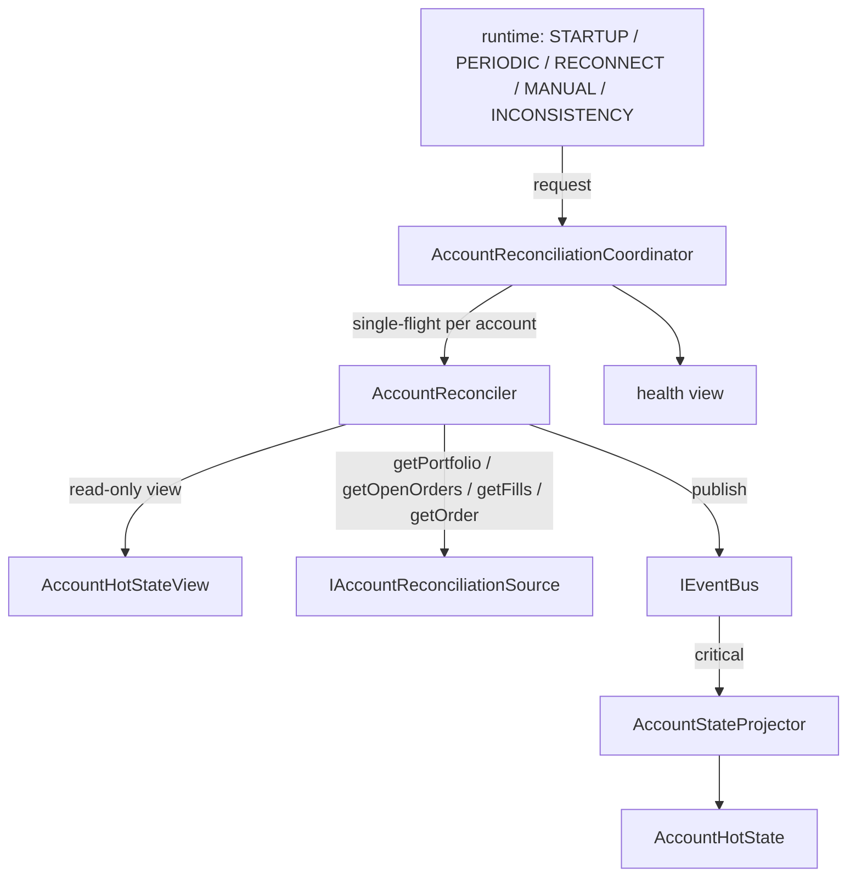

# @polymarket/account-reconciliation

Authoritative-сверка торгового аккаунта: получает состояние аккаунта от
внешнего authoritative-источника, сравнивает его с локальным `AccountHotState`
и при расхождении корректирует локальное состояние — через **ту же**
canonical-шину и **того же** единственного писателя.

```text
authoritative account source        IAccountReconciliationSource
        ↓
AccountReconciler                   один проход: снимок + expectedAccountVersion
        ↓
TRADING_ACCOUNT_RECONCILED
        ↓
IEventBus
        ↓
AccountStateProjector               единственный писатель: CAS + одна мутация
        ↓
AccountHotState
```

Источник этой сверки — **transitional**-контракт
`IAccountReconciliationSource` (готовый локальный `Portfolio`). Target
production-граница для настоящей площадки — `IAccountVenueStateSource`
(authoritative текущее состояние площадки, а не наша бухгалтерия); она уже
объявлена, но сверкой пока не вызывается. См. [Целевая модель](#целевая-модель-текущее-состояние-площадки-побеждает-историю-событий).



## Что сверка исправляет

Живой контур (`TRADING_ACCOUNT_ORDER_COMMITTED`, `_FILL_APPLIED`, …) описывает
операции, которые рантайм выполнил сам. Он может пропустить факт: разрыв
приватного потока, рестарт, ошибка процессора. Тогда локальное состояние
расходится с площадкой — молча. Сверка берёт authoritative-снимок и
исправляет:

- **портфель** — деньги, позиции, токенные балансы;
- **заявки** — неизвестные вставляются, изменившиеся заменяются настоящим
  состоянием;
- **исполнения** — пропущенные появляются, применённые подтверждаются.

## Чем сверка НЕ является

Это не live-обработка и не её замена. Сверка не повторяет FSM заявки, не
считает резервации, комиссии и FIFO — она принимает готовое authoritative-
состояние. Живые события остаются основным путём; коррекция — ещё один
canonical-путь рядом с ними.

## Почему нет прямой мутации

У `AccountHotState` ровно один писатель — `AccountStateProjector`. Reconciler
получает только read-only `AccountHotStateView` и публикует canonical-событие
в ту же `IEventBus`:

```text
никаких прямых мутаций AccountHotState
никакой третьей шины и отдельного reconciliation bus
только canonical ApplicationEvent
```

Второй писатель вернул бы гонку, ради устранения которой проектор и заведён:
порядок эффектов двух писателей не определялся бы ничем.

## Почему CAS обязателен

Снимок строится несколькими запросами к источнику, пока живой контур
продолжает менять аккаунт:

```text
reconciler прочитал аккаунт      version = 100 → expectedAccountVersion
идут запросы к источнику
  живое событие                  version = 101
TRADING_ACCOUNT_RECONCILED(100)  → AccountReconciliationVersionConflictError
```

Снимок, основанный на версии 100, не видел изменения, создавшего версию 101.
Наложить его значило бы откатить это изменение — например, вернуть в
`available` деньги, уже зарезервированные под новую заявку. Поэтому
`AccountHotState` перед ЛЮБОЙ мутацией коррекции проверяет
`account.version === expectedAccountVersion` и при расхождении отвергает её
целиком: ни мутации, ни приращения версий, ни изменения `lastMutationAt`.

Конфликт — **нормальная гонка**, а не дефект. Координатор не ставит
`UNHEALTHY`, не публикует тот же снимок повторно (он устарел) и делает свежий
проход: заново читает и версию, и источник. Распознаётся конфликт по классу
(`instanceof AccountReconciliationVersionConflictError`), а не по тексту.

## Почему отсутствие open order требует `getOrder`

```text
локально:        order-123 OPEN
getOpenOrders:   order-123 нет
```

Из «её нет среди открытых» нельзя вывести, что с ней стало: отменена,
исполнена, отвергнута, истекла — или источник временно её не вернул. Поэтому
для каждой локально открытой заявки (`OPEN_ORDER_STATUSES` из
`@polymarket/order`), отсутствующей среди открытых, reconciler спрашивает
`getOrder(orderId)`:

```text
найдена     → её настоящее состояние идёт в снимок
undefined   → статус НЕ угадывается: события нет, health UNHEALTHY
```

Fail closed: угаданный статус освободил бы или оставил резервацию наугад.

`PENDING` входит в открытые сознательно: под неё уже зарезервированы деньги.
Следствие — заявка, ещё не дошедшая до площадки, делает сверку `UNHEALTHY`,
пока площадка её не узнает: по одному снимку «ещё летит» от «потеряна» не
отличить.

## Почему authoritative Fill сразу `CONFIRMED`

У исполнения две оси:

```text
TradeStatus        MATCHED / MINED / RETRYING / CONFIRMED / FAILED   что говорит площадка
AccountFillStatus  APPLIED / CONFIRMED / REVERTED                    что сделал рантайм
```

Сверка работает со второй. Присутствие исполнения в `getFills()` означает, что
сделка на площадке существует, — на оси рантайма это подтверждение:

```text
нет локально   → { status: CONFIRMED, appliedAt = confirmedAt = время коррекции }
APPLIED        → CONFIRMED, исходный appliedAt сохранён
CONFIRMED      → no-op
REVERTED       → Err: противоречие нашего отката и площадки, не «воскрешаем»
другой факт    → Err (findFillFactDifference)
```

Искусственного `APPLIED → CONFIRMED` у нового исполнения нет: его экономика
уже внутри authoritative-портфеля, и симулировать для неё живой жизненный цикл
незачем. Venue-ось (`venueStatus`, `venueStatusAt`) коррекция не стирает и не
придумывает.

Это правило transitional-контракта: его источник отдаёт исполнения, уже
подтверждённые вместе с готовым портфелем. Для настоящей площадки оно
неверно — сделка в ответе REST может быть `MATCHED`, `MINED` или `FAILED`.
Поэтому target-граница несёт обязательный `tradeStatus` (см. [Целевая модель](#целевая-модель-текущее-состояние-площадки-побеждает-историю-событий)).

## Почему Portfolio принимается целиком

Authoritative-портфель — экономическая истина аккаунта. `AccountStateProjector`
**не** пересчитывает его из заявок и исполнений: вторая реализация экономики
рядом с первой неизбежно разошлась бы с ней. Все инварианты `Portfolio`
(владение, `Position.quantity == available + reserved` токенов) выполнены его
конструктором ещё на границе источника.

No-op определяется canonical-равенством домена — `samePortfolioState` из
`@polymarket/portfolio` (поверх `samePositionState` из `@polymarket/position`),
`sameOrderState`, `findFillFactDifference`, — а не `JSON.stringify`,
сравнением ссылок или числовым приведением.

### Требование к будущему источнику: настоящая lot provenance

`Position` лотовая: количество, средняя цена и FIFO-закрытие выводятся из
лотов. Будущий Polymarket-адаптер **не имеет права** собирать позицию из пары
`quantity + averagePrice` из REST: позиция выглядела бы валидной, но её лоты
были бы выдуманы, и первое же FIFO-закрытие дало бы неверный realized PnL.
Для materialization authoritative-портфеля адаптеру нужна достаточная история
исполнений, из которой строятся настоящие лоты. В этом MR адаптера нет —
fake-источник отдаёт заранее собранный валидный `Portfolio`.

Поэтому настоящий Polymarket-адаптер реализует не этот порт, а target-границу
`IAccountVenueStateSource`: площадка сообщает текущий инвентарь, лоты остаются
локальными, а неполная provenance не уменьшает инвентарь (см. [Целевая модель](#целевая-модель-текущее-состояние-площадки-побеждает-историю-событий)).

## Целевая модель: текущее состояние площадки побеждает историю событий

Два пути строят одно и то же состояние аккаунта:

```text
EVENT PATH

Private WS
↓
ApplicationEvents
↓
AccountHotState
↓
fast provisional state
```

```text
RECONCILIATION PATH

Venue REST/current state
↓
authoritative facts
↓
state convergence
```

```text
live/private события             быстрый realtime-путь → provisional состояние
authoritative состояние venue    источник истины о ТЕКУЩЕМ состоянии аккаунта
AccountHotState                  наше лучшее текущее представление аккаунта
```

Состояние, выведенное из событий, **обязано сойтись** к authoritative
состоянию площадки. События — не окончательная истина, а REST — не только
способ найти пропущенное событие: если площадка сообщает, что аккаунт сейчас
держит, открыл или исполнил другое, побеждает площадка.

```text
CURRENT VENUE STATE > EVENT HISTORY
```

История событий помогает provenance, но не может перекрыть противоречащие
ей authoritative текущие владения, заявки и статусы.

### Transitional и target

| контракт | роль |
| --- | --- |
| `IAccountReconciliationSource` | **transitional**-контракт текущей сверки: источник отдаёт готовый локальный `Portfolio` |
| `IAccountVenueStateSource` | **target** production-граница площадки: источник отдаёт факты площадки |

Сегодня новый порт только объявлен: его не вызывает ни `AccountReconciler`,
ни runtime, реализаций нет. Текущая сверка работает без изменений до
миграционного шага.

```text
текущий MR    граница authoritative-состояния площадки
следующий MR  PolymarketAccountVenueStateSource на официальном @polymarket/client
за ним        state matcher + atomic correction planner;
              уход от transitional-модели authoritative-Portfolio
затем         runtime wiring: STARTUP / PERIODIC / RECONNECT
```

```text
           VENUE
             ↓
 AuthoritativeAccountState
 ├── collateral
 ├── positions
 ├── open orders
 └── fills + venue status
             ↓
      future reconciler
             ↓
       correction plan
             ↓
       AccountHotState
             ↓
          Portfolio
```

```typescript
export interface IAccountVenueStateSource {
  getAccountState(venueId, accountId):
    Promise<Result<AuthoritativeAccountState, AccountReconciliationSourceError>>;
  getOrderState(venueId, accountId, orderId):
    Promise<Result<AuthoritativeOrderState | undefined, AccountReconciliationSourceError>>;
  getAssetBalance(venueId, accountId, asset: AuthoritativeOutcomeAssetId):
    Promise<Result<Quantity, AccountReconciliationSourceError>>;
}
```

### Неизвестный инициатор — не ошибка

Аккаунт мог изменить наш рантайм, человек через UI площадки, другой процесс,
claim/redeem, merge, внешний перевод, коррекция площадки, упавшая сделка,
reorg. Сверке не нужно знать, кто и почему:

```text
UNKNOWN INITIATOR IS VALID

Заявка или исполнение, принадлежащие аккаунту на площадке,
принадлежат AccountHotState, даже если наш рантайм их не инициировал.
```

- открытая заявка, которой локально никогда не было, — заявка аккаунта: она
  резервирует его деньги или токены;
- `CONFIRMED`-исполнение, которого локальное состояние не знает, — реальная
  активность аккаунта; требовать для него локально созданную заявку нельзя.

`AccountHotState` моделирует **аккаунт**, а не только нашего бота. Оси
происхождения (`MANUAL`/`BOT`/`EXTERNAL`) нет и не будет: площадка не даёт
её доказательства. Если позже понадобится provenance локального намерения —
это отдельная ось metadata, а не выдуманный origin authoritative-активности.

### DTO состояния площадки

`AuthoritativeAccountState` — **один проход** сверки, а **не** снимок
транзакции базы данных. Адаптер соберёт collateral, позиции, заявки и сделки
разными запросами, но обязан получить каждый набор целиком (пагинация пройдена
до конца), не возвращать частично успешное состояние и fail closed при schema
drift, оборванной пагинации и ошибке маппинга. Позиции запрашиваются **без**
фильтра пыли площадки: владение меньше любого порога по умолчанию не может
исчезнуть из authoritative-состояния (требование к Polymarket-адаптеру — в
`docs/guides/account-venue-state.md`).

| DTO | факт площадки | чего в нём нет и почему |
| --- | --- | --- |
| `collateralBalance: Money` | фактическое текущее collateral-владение | `available`/`reserved` — наша форма представления |
| `AuthoritativePositionState` | `asset + quantity` — текущий инвентарь | `lots[]` — площадка их не знает; `averagePrice`/`entryCost` — только справка |
| `AuthoritativeOrderState` | `orderId`, `asset`, `side`, `price`, `size`, `filledSize`, `status` — в любом authoritative статусе (ответ `getOrderState`) | `strategyId`, `decisionId`, `intentId`, локальные времена, `reason`, metadata |
| `AuthoritativeOpenOrderState` | то же, но `status` — только `OPEN`/`PARTIALLY_FILLED` (элемент `openOrders`) | терминальные статусы — не компилируются |
| `AuthoritativeFillState` | canonical `Fill` + **обязательный** `metadata.tradeStatus` | origin, локальное владение заявкой |

`AuthoritativeOutcomeAssetId = Exclude<AssetId, { type: 'CURRENCY' }>` —
актив заявки, позиции и `getAssetBalance`. Collateral живёт только в
`collateralBalance: Money`, поэтому `CURRENCY` там запрещён на этапе
компиляции; canonical `AssetId` не меняется.

`AuthoritativeOrderStatus = Exclude<OrderStatus, 'PENDING'>`: `PENDING` —
локальный жизненный цикл до приёма площадкой. Для списка живых заявок —
`AuthoritativeOpenOrderStatus = Extract<…, 'OPEN' | 'PARTIALLY_FILLED'>`. Vendor-статус, который нельзя
**однозначно** привести к `OPEN`/`PARTIALLY_FILLED`/`FILLED`/`CANCELED`/
`REJECTED`/`EXPIRED`, — `Err` источника; legacy-правило «неизвестный →
`OPEN`» не переносится. Canonical `Order` здесь не используется: его
идентичность включает `strategyId`, и `undefined` от площадки дал бы ложный
конфликт на каждой заявке стратегии.

### Факт площадки ↔ локальный факт

| факт площадки | | локальный факт |
| --- | --- | --- |
| `collateralBalance` | ↔ | `Balance.available + Balance.reserved` |
| `position.quantity` | ↔ | `Position.quantity` |
| | ↔ | `TokenBalance.available + TokenBalance.reserved` |
| открытые BUY | → | reserved cash |
| открытые SELL | → | reserved tokens |
| fill + venue status | ↔ | `AccountFillRecord` |

Что **не** является authoritative-заменой:

```text
Polymarket position.avgPrice      ≠  источник локальных FIFO-лотов
Polymarket collateral balance     ≠  локальный Balance.available
Polymarket token balance          ≠  локальный TokenBalance.available
Polymarket order                  ≠  canonical локальная идентичность Order
```

### Резервации — наша бухгалтерия (описание; не реализовано)

Площадка не источник наших `available`/`reserved` — это локальная форма
представления. Разделение выводится из authoritative открытых заявок:

```text
BUY   remaining = order.size - order.filledSize
      reserved cash   = remaining × order.price

SELL  reserved tokens = order.size - order.filledSize
```

```text
venue total collateral + venue open orders  →  local available/reserved split
```

```text
venue collateral = 1000, open BUY reservations = 250
→ Balance:      available = 750, reserved = 250

venue token holding = 10, open SELL remaining = 4
→ TokenBalance: available = 6,   reserved = 4
```

### Текущий инвентарь vs accounting provenance

```text
CURRENT INVENTORY TRUTH     сколько актива аккаунт держит СЕЙЧАС — решает площадка
ACCOUNTING PROVENANCE       какие исполнения образовали позицию — FIFO-лоты, наше знание
```

FIFO-лоты — не состояние площадки. Запрещены **оба** искажения:

```text
venue quantity + avgPrice → синтетический единственный PositionLot   выдуманная provenance
не можем восстановить лоты → оставить неверное количество            выдуманный инвентарь
```

Правда о текущем инвентаре важнее provenance:

```text
venue quantity = 10
известные локальные FIFO-лоты объясняют только 8
→ текущий инвентарь всё равно 10
```

Provenance двух единиц требует отдельного представления/статуса. Его форма —
задача будущего рефакторинга `Position`/учёта, не этой границы. Требование к нему:

```text
lack of complete FIFO provenance
must not force runtime to pretend
venue inventory is smaller than reality
```

### Жизненный цикл сделки на площадке

```text
MATCHED    матчинг наблюдался → годится для быстрого восстановления → НЕ финальность
MINED      продвижение в сети → НЕ финальность
CONFIRMED  authoritative финальное подтверждение
RETRYING   не разрешено
FAILED     площадка говорит: исполнение не выжило
```

Это отдельная ось от рантаймовой — смешивать их нельзя:

```text
TradeStatus        MATCHED / MINED / RETRYING / CONFIRMED / FAILED   что говорит площадка
AccountFillStatus  APPLIED / CONFIRMED / REVERTED                    что сделал рантайм
```

Правило «REST-сделка существует → `AccountFillStatus.CONFIRMED`» неверно —
поэтому `tradeStatus` в `AuthoritativeFillState` обязателен.

**`FAILED` обязан уметь победить event-derived состояние.**

```text
WS: MATCHED → локальный fill APPLIED → Position увеличена
позже authoritative REST: сделка FAILED
```

Оставить позицию увеличенной навсегда и просто стать `UNHEALTHY` нельзя.
Задача сверки — вернуть `AccountHotState` к текущему состоянию площадки
(откат, перестроение или коррекция — решит state matcher); текущее состояние площадки
побеждает provisional историю событий.

**Та же идентичность `Fill`.** Приватная WS-сделка и REST-сделка аккаунта,
если это одно исполнение площадки, обязаны дать **один и тот же** canonical
`Fill`. Правило уже есть (`FillMapper`: taker/maker, `maker_orders`,
`owner`/`makerAddress`, cross-outcome, составной `FillId` при нескольких наших
maker-заявках) — второй независимый REST-маппер с другой политикой
идентичности недопустим. Подробности для Polymarket-адаптера — в
`docs/guides/account-venue-state.md`.

### `getOrderState` и `getAssetBalance` — адресные запросы

`openOrders` содержит только живые заявки. Из «локально `OPEN`, а среди
живых её нет» состояние не выводится, поэтому:

```text
getOrderState(A)
  FILLED / CANCELED / EXPIRED / REJECTED   authoritative терминальное состояние
  undefined                                источник не может доказать — неразрешённый случай,
                                           терминальный статус НЕ угадывается
```

`getAssetBalance(asset)` — независимая проверка фактического текущего
владения одним активом (не `TokenBalance.available`/`reserved`):

```text
external holding  ↔  TokenBalance.available + reserved  ↔  Position.quantity
```

Прежде всего — как более сильная проверка при расхождении; обязательной для
каждого токена в каждом проходе она не является.

### Будущая сверка — state-based (описание; не реализовано)

Главный вопрос будущего reconciler-а — не «какие события мы пропустили?», а:

```text
Какое состояние аккаунта должно существовать СЕЙЧАС
согласно authoritative фактам площадки?
```

Пропущенные события и исполнения — удобный способ сохранить provenance, но
не единственный источник коррекции. Порядок:

```text
1. получить authoritative состояние площадки
2. сравнить: collateral, позиции/владения токенами, открытые заявки,
   известные состояния заявок, исполнения + статусы площадки
3. использовать настоящие исполнения и заявки там, где они улучшают provenance
4. построить желаемое текущее состояние аккаунта
5. вывести резервации из authoritative открытых заявок
6. выровнять: total collateral, количества токенов, состояния заявок, статусы исполнений
7. применить ОДНУ атомарную коррекцию
8. состояние аккаунта представляет текущую правду площадки
```

### `READY` и полнота учёта — разные понятия (описание; не реализовано)

В будущем `READY` означает:

```text
local current account state  matches  authoritative venue state
```

а **не** «мы объяснили историческую причину каждого изменения». История
provenance может быть частичной — текущее состояние всё равно обязано быть
правильным. Поэтому две оси нельзя смешивать в один `UNHEALTHY`:

```text
venue synchronization            совпадает ли текущее состояние с площадкой
accounting provenance            полна ли FIFO-история (cost basis / PnL)
completeness
```

```text
venue position = 10, локальный инвентарь скорректирован до 10,
FIFO-provenance известна для 8
→ venue sync может быть READY, а cost basis/PnL provenance — PARTIAL
```

Конкретную модель (`unattributedQuantity`, accounting health и т. п.) эта
граница не проектирует.

### Примеры

**A. Заявка, созданная вне рантайма.**

```text
local:   заявки нет
venue:   SELL 5 YES OPEN
будущая сверка: заявка появляется в состоянии аккаунта, 5 YES reserved
```

Неизвестный инициатор — не ошибка.

**B. Исполнение, увиденное вне рантайма.**

```text
local:   Position = 0
venue:   BUY fill 10 @ 0.42 CONFIRMED, position quantity = 10
будущая сверка: текущий инвентарь аккаунта → 10
```

**C. Событие, позже опровергнутое площадкой.**

```text
WS:              MATCHED BUY 10 → local Position → 10
позже venue:     сделка FAILED, текущая позиция = 0
будущая сверка:  побеждает authoritative текущее состояние → local → 0
```

Оставить 10 только потому, что событие когда-то существовало, нельзя.

## Один проход: `AccountReconciler`

```text
1. прочитать локальный аккаунт: version → expectedAccountVersion,
                                локально открытые заявки (одним синхронным участком)
2. getPortfolio + getOpenOrders + getFills   параллельно; любой отказ → Err, события нет
3. getOrder для каждой локально открытой, отсутствующей среди открытых
4. собрать снимок, опубликовать TRADING_ACCOUNT_RECONCILED
5. исход шины → исход прохода
```

Никогда не бросает: адаптер, нарушивший контракт порта исключением, даёт тот
же `AccountReconciliationSourceError`.

Проверки согласованности снимка (владелец, инструмент, идентичность,
переходы) живут в `AccountHotState` — reconciler проверяет только то, без
чего снимок не собрать.

### Граница подтверждения доставки: `publishConfirmed()`

Обычный `IEventBus.publish()` при уже активном drain только ставит событие в
очередь, и его `Ok` означает «принято в очередь», а не «обработано». Для
reentrant-доставки это правильно; для сверки — нет: успешный проход обязан
значить, что ИМЕННО её `TRADING_ACCOUNT_RECONCILED` прошёл critical-проектор.
Поэтому коррекция публикуется через `IEventBus.publishConfirmed()`:

```text
активен drain / в очереди backlog → дождаться (MessageBus.drain())
    backlog упал                  → Err, коррекция в очередь НЕ ставится вовсе
очередь пуста и drain нет         → коррекция первая в новом drain → её исход
    отказ ПОЗЖЕ в том же drain    → исход коррекции всё равно Ok
```

Отказ признаётся «своим» только по `CriticalHandlerError.context.messageId`,
совпавшему с `metadata.messageId` опубликованной коррекции, — не по типу
события. Координатор сверяет аккаунты параллельно, и `publishConfirmed()`
возвращает отказ уже стоявшего backlog — например, коррекции другого
аккаунта. Чужой отказ означает, что наша коррекция не публиковалась:
`PUBLISH_FAILED`, а не диагноз нашего снимка. Применить её позже он не может —
в очереди её нет.

```text
Ok                    именно эта коррекция прошла critical-обработчики:
                      состояние приняло её или признало no-op
Err(VersionConflict)  именно эта коррекция получила CAS-конфликт
Err(Validation)       именно эта коррекция отвергнута состоянием
Err(Publish)          эта коррекция не подтверждена (и не применится)
```

`reconcile()` и `request()` — внешняя request/response-граница: вызывать их с
`await` из handler'а шины нельзя — `publishConfirmed()` ждал бы drain, который
держит сам этот handler.

| исход | ошибка | `failureCode` | событие |
| --- | --- | --- | --- |
| аккаунт не принят состоянием | `AccountReconciliationValidationError` (`ACCOUNT_NOT_INITIALIZED`) | `VALIDATION_FAILED` | нет |
| отказ обязательного чтения | `AccountReconciliationSourceError` | `SOURCE_FAILED` | нет |
| `getOrder` → `undefined` | `AccountReconciliationUnresolvedOrderError` | `UNRESOLVED_ORDER` | нет |
| `getOrder(X)` вернул `Y` | `AccountReconciliationValidationError` (`ORDER_ID_MISMATCH`) | `VALIDATION_FAILED` | нет |
| состояние отвергло снимок | `AccountReconciliationValidationError` (`CORRECTION_REJECTED`) | `VALIDATION_FAILED` | опубликовано, не применено |
| шина не приняла коррекцию либо упал уже стоявший backlog (чужой `messageId`) | `AccountReconciliationPublishError` | `PUBLISH_FAILED` | не поставлено в очередь, не применится |
| снимок устарел | `AccountReconciliationVersionConflictError` | — (не отказ) | опубликовано, не применено |

## Планирование: `AccountReconciliationCoordinator`

Per-account single-flight с dirty-флагом `requestedAgain`:

```text
request(A) ──► проход A#1
request(A) ─┐
   … ×10    ├► requestedAgain = true — параллельных проходов нет
request(A) ─┘
               A#1 завершён ──► ОДИН свежий проход A#2
                                (запросы во время A#2 → A#3, …)
request(B) ──► B#1 идёт параллельно с A — аккаунты независимы
```

Запрос, пришедший во время прохода, этим проходом обслужен быть не может — тот
уже начал читать источник раньше него. Поэтому `request()` отдаёт исход
ПЕРВОГО прохода, начавшегося после запроса. Ключ аккаунта — `VenueId` +
canonical `accountIdToString` на вложенных `Map`, как в `AccountHotState`.

При конфликте версий ожидающие переходят к свежему проходу. Серия конфликтов
подряд ограничена `maxConsecutiveVersionConflicts` (по умолчанию
`DEFAULT_MAX_CONSECUTIVE_VERSION_CONFLICTS = 3`): аккаунт, который живой контур
меняет быстрее, чем источник отвечает, иначе держал бы координатор в
бесконечной петле запросов. По исчерпании ожидающие получают конфликт, health
не меняется. Это предохранитель, а не каденция.

Таймеров нет. Причина запроса — `AccountReconciliationTrigger`
(`STARTUP` | `PERIODIC` | `RECONNECT` | `MANUAL` | `INCONSISTENCY`) — только
запоминается в health; когда какую запрашивать, решает будущий runtime.

## Health

Отдельное состояние пакета — не в `AccountHotState` и не в `Portfolio`:
проекция строится только из событий, а health — результат наших попыток эти
события подтвердить.

```text
INITIALIZING  успешной сверки ещё не было (так же — для незнакомого аккаунта)
READY         последняя завершённая сверка успешна, включая no-op
UNHEALTHY     последняя завершённая сверка отказала
```

| событие | status | времена |
| --- | --- | --- |
| начат проход | не меняется | `lastAttemptAt`, `lastTrigger` |
| успех (применено или no-op) | `READY` | `lastSuccessAt`; `failureCode`/`failureReason` сняты |
| отказ | `UNHEALTHY` | `lastFailureAt`, `failureCode`, `failureReason` |
| конфликт версий | **не меняется** | только `lastAttemptAt` (свежий проход) |

Время — только от инъецированного `IClock`; `Date.now()` и `new Date()` в коде
пакета нет (это проверяет `boundary.test.ts`). Health — текущее состояние, а
не история попыток; персистентности нет.

## Пример

```typescript
import {
  AccountReconciler,
  AccountReconciliationCoordinator,
} from '@polymarket/account-reconciliation';

const reconciler = AccountReconciler.create({
  source,                          // IAccountReconciliationSource
  eventBus,                        // та же IEventBus, что у живого контура
  accountState: projector.state(), // AccountHotStateView — только чтение
  metadata,                        // MessageMetadataGenerator рантайма
});
const coordinator = AccountReconciliationCoordinator.create({ reconciler, clock });

const result = await coordinator.request(venueId, accountId, 'STARTUP');
if (!result.ok) {
  // UNHEALTHY или исчерпан предел конфликтов — решает рантайм
}
coordinator.health().get(venueId, accountId).status; // 'READY' | 'UNHEALTHY' | 'INITIALIZING'
```

## Известные ограничения

- **Чужой упавший backlog делает проход `UNHEALTHY`.** Если перед коррекцией
  в очереди упало чужое событие (например, коррекция другого аккаунта с
  конфликтом версий), коррекция не публикуется и проход получает
  `PUBLISH_FAILED`. Это fail closed: состояние не подтверждено; следующий
  запрос сверки делает свежий проход.
- **Живой контур по-прежнему на `publish()`.** Как он реагирует на отказ
  приватной публикации — открытый вопрос контура (см. `AccountStateProjector`),
  он обязан быть решён fail-closed до включения Strategy/Execution.
- **Локальный `APPLIED`, которого нет в `getFills()`,** не интерпретируется:
  ни откат, ни отказ. Порт не даёт «спросить исполнение по id», а список
  исполнений источника может быть окном, а не полной историей.
- **Согласованность снимка между вызовами** (портфель прочитан до исполнения,
  список исполнений — после) порт не гарантирует — это свойство адаптера.

## Что реализовано и что нет

| реализовано | не реализовано |
| --- | --- |
| узкий canonical-порт `IAccountReconciliationSource` (transitional) | Polymarket REST-адаптер, SDK, DTO |
| target-граница `IAccountVenueStateSource` + `Authoritative*State` (только типы) | её реализация, state matcher, correction planner, импорт внешних заявок, откат исполнений, пересчёт резерваций, модель неатрибутированного инвентаря, accounting health |
| `AccountReconciler` — один проход | таймеры, cron, production-каденция |
| событие `TRADING_ACCOUNT_RECONCILED` с CAS | startup/runtime wiring, CLI |
| атомарная коррекция в `AccountStateProjector` / `AccountHotState` | private WebSocket reconciliation |
| семантика заявок и исполнений | персистентный health / снимок |
| health: `INITIALIZING` / `READY` / `UNHEALTHY` | metrics exporter, dashboard |
| per-account single-flight координатор | Strategy, TradingContext, Risk, Execution |
| `FakeAccountReconciliationSource` (test-only) и тесты | |

## Тесты

| файл | что покрывает |
| --- | --- |
| `reconciler.test.ts` | ровно одно событие на успех; отказ каждого обязательного чтения → события нет; исключение адаптера; `getOrder` для отсутствующих открытых; `undefined` → `UnresolvedOrder`; `PENDING` как открытая; `ORDER_ID_MISMATCH`; `CORRECTION_REJECTED` |
| `coordinator.test.ts` | single-flight (10 запросов → один свежий проход), цепочка проходов, независимость аккаунтов, CAS-гонка v10 → v11 со свежим проходом, предел конфликтов, дефект reconciler'а |
| `health.test.ts` | все переходы статуса, времена из `PaperClock`, no-op → `READY`, конфликт ≠ `UNHEALTHY`, независимость аккаунтов |
| `publish.test.ts` | классификация исходов `publishConfirmed()` на stub-шине (обычный `publish()` в ней бросает): переполнение, исключение, critical-ошибка чужого события (другого типа и чужой `TRADING_ACCOUNT_RECONCILED` по `messageId`), конфликт по классу |
| `confirmedDelivery.test.ts` | настоящая шина: A держит drain — B не резолвится и не `READY` до обработки своей коррекции; конфликт A не достаётся B; упавший чужой backlog — коррекция B не встаёт в очередь и не применяется позже; отказ другого события после B в том же drain — исход B успешен |
| `venueState.types.test.ts` | compile-time контракт target-границы: outcome-актив — `OUTCOME_TOKEN`/`POLYMARKET_CTF_TOKEN`, `CURRENCY` запрещён в заявке, позиции и `getAssetBalance` (состав закреплён); в `openOrders` только `OPEN`/`PARTIALLY_FILLED`, терминальные не компилируются, а `getOrderState` отдаёт полный статус; фикстура заявки согласована с инвариантами (`FILLED` исполнена целиком); `PENDING` не authoritative (состав статусов закреплён); заявка валидна без `strategyId`/`decisionId`/`intentId`; без `tradeStatus`, голый `Fill` и `Fill[]` не компилируются; у позиции нет `lots`; у состояния нет `available`/`reserved`; `Portfolio` — не состояние площадки; нет оси происхождения, заявка и исполнение неизвестного инициатора валидны; порт реализуем одними canonical-типами; операции ошибки = методы порта |
| `boundary.test.ts` | нет зависимостей на infrastructure; закрытый список импортов; контракт состояния площадки зависит только от ids/value-objects/order/fill/result; нет `@polymarket/client`/`@polymarket/bindings`/`@polymarket/clob-client`/`@polymarket/order-utils`, HTTP-библиотек, путей `infrastructure`/`apps/pnl`/`legacy-bot`; нет часов, таймеров, `JSON.stringify`, HTTP |

`FakeAccountReconciliationSource` (`__tests__/helpers/`) задаёт данные по
аккаунтам, отказы (`Err` или исключение), удержание следующего вызова до
`release()` с сигналом `entered` и считает вызовы и пик одновременных вызовов
по методу.
