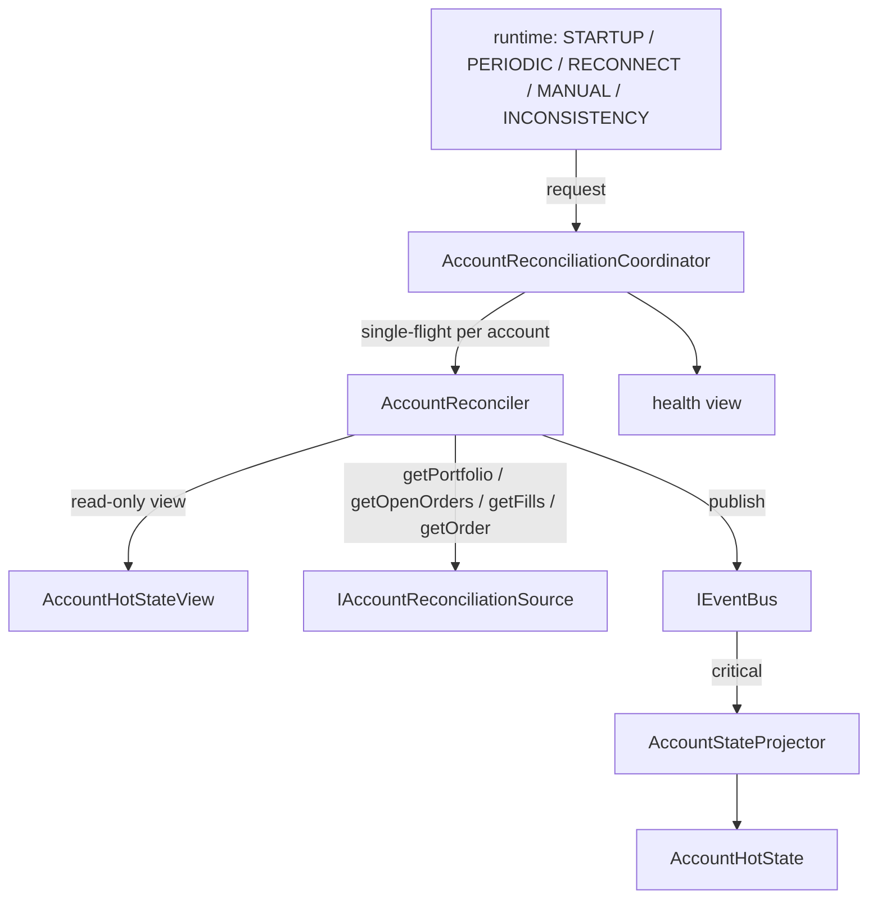

# @polymarket/account-reconciliation

Authoritative-сверка торгового аккаунта: получает состояние аккаунта от
внешнего authoritative-источника, сравнивает его с локальным `AccountHotState`
и при расхождении корректирует локальное состояние — через **ту же**
canonical-шину и **того же** единственного писателя.

```text
authoritative account source        IAccountReconciliationSource
        ↓
AccountReconciler                   один проход: снимок + expectedAccountVersion
        ↓
TRADING_ACCOUNT_RECONCILED
        ↓
IEventBus
        ↓
AccountStateProjector               единственный писатель: CAS + одна мутация
        ↓
AccountHotState
```



## Что сверка исправляет

Живой контур (`TRADING_ACCOUNT_ORDER_COMMITTED`, `_FILL_APPLIED`, …) описывает
операции, которые рантайм выполнил сам. Он может пропустить факт: разрыв
приватного потока, рестарт, ошибка процессора. Тогда локальное состояние
расходится с площадкой — молча. Сверка берёт authoritative-снимок и
исправляет:

- **портфель** — деньги, позиции, токенные балансы;
- **заявки** — неизвестные вставляются, изменившиеся заменяются настоящим
  состоянием;
- **исполнения** — пропущенные появляются, применённые подтверждаются.

## Чем сверка НЕ является

Это не live-обработка и не её замена. Сверка не повторяет FSM заявки, не
считает резервации, комиссии и FIFO — она принимает готовое authoritative-
состояние. Живые события остаются основным путём; коррекция — ещё один
canonical-путь рядом с ними.

## Почему нет прямой мутации

У `AccountHotState` ровно один писатель — `AccountStateProjector`. Reconciler
получает только read-only `AccountHotStateView` и публикует canonical-событие
в ту же `IEventBus`:

```text
никаких прямых мутаций AccountHotState
никакой третьей шины и отдельного reconciliation bus
только canonical ApplicationEvent
```

Второй писатель вернул бы гонку, ради устранения которой проектор и заведён:
порядок эффектов двух писателей не определялся бы ничем.

## Почему CAS обязателен

Снимок строится несколькими запросами к источнику, пока живой контур
продолжает менять аккаунт:

```text
reconciler прочитал аккаунт      version = 100 → expectedAccountVersion
идут запросы к источнику
  живое событие                  version = 101
TRADING_ACCOUNT_RECONCILED(100)  → AccountReconciliationVersionConflictError
```

Снимок, основанный на версии 100, не видел изменения, создавшего версию 101.
Наложить его значило бы откатить это изменение — например, вернуть в
`available` деньги, уже зарезервированные под новую заявку. Поэтому
`AccountHotState` перед ЛЮБОЙ мутацией коррекции проверяет
`account.version === expectedAccountVersion` и при расхождении отвергает её
целиком: ни мутации, ни приращения версий, ни изменения `lastMutationAt`.

Конфликт — **нормальная гонка**, а не дефект. Координатор не ставит
`UNHEALTHY`, не публикует тот же снимок повторно (он устарел) и делает свежий
проход: заново читает и версию, и источник. Распознаётся конфликт по классу
(`instanceof AccountReconciliationVersionConflictError`), а не по тексту.

## Почему отсутствие open order требует `getOrder`

```text
локально:        order-123 OPEN
getOpenOrders:   order-123 нет
```

Из «её нет среди открытых» нельзя вывести, что с ней стало: отменена,
исполнена, отвергнута, истекла — или источник временно её не вернул. Поэтому
для каждой локально открытой заявки (`OPEN_ORDER_STATUSES` из
`@polymarket/order`), отсутствующей среди открытых, reconciler спрашивает
`getOrder(orderId)`:

```text
найдена     → её настоящее состояние идёт в снимок
undefined   → статус НЕ угадывается: события нет, health UNHEALTHY
```

Fail closed: угаданный статус освободил бы или оставил резервацию наугад.

`PENDING` входит в открытые сознательно: под неё уже зарезервированы деньги.
Следствие — заявка, ещё не дошедшая до площадки, делает сверку `UNHEALTHY`,
пока площадка её не узнает: по одному снимку «ещё летит» от «потеряна» не
отличить.

## Почему authoritative Fill сразу `CONFIRMED`

У исполнения две оси:

```text
TradeStatus        MATCHED / MINED / RETRYING / CONFIRMED / FAILED   что говорит площадка
AccountFillStatus  APPLIED / CONFIRMED / REVERTED                    что сделал рантайм
```

Сверка работает со второй. Присутствие исполнения в `getFills()` означает, что
сделка на площадке существует, — на оси рантайма это подтверждение:

```text
нет локально   → { status: CONFIRMED, appliedAt = confirmedAt = время коррекции }
APPLIED        → CONFIRMED, исходный appliedAt сохранён
CONFIRMED      → no-op
REVERTED       → Err: противоречие нашего отката и площадки, не «воскрешаем»
другой факт    → Err (findFillFactDifference)
```

Искусственного `APPLIED → CONFIRMED` у нового исполнения нет: его экономика
уже внутри authoritative-портфеля, и симулировать для неё живой жизненный цикл
незачем. Venue-ось (`venueStatus`, `venueStatusAt`) коррекция не стирает и не
придумывает.

## Почему Portfolio принимается целиком

Authoritative-портфель — экономическая истина аккаунта. `AccountStateProjector`
**не** пересчитывает его из заявок и исполнений: вторая реализация экономики
рядом с первой неизбежно разошлась бы с ней. Все инварианты `Portfolio`
(владение, `Position.quantity == available + reserved` токенов) выполнены его
конструктором ещё на границе источника.

No-op определяется canonical-равенством домена — `samePortfolioState` из
`@polymarket/portfolio` (поверх `samePositionState` из `@polymarket/position`),
`sameOrderState`, `findFillFactDifference`, — а не `JSON.stringify`,
сравнением ссылок или числовым приведением.

### Требование к будущему источнику: настоящая lot provenance

`Position` лотовая: количество, средняя цена и FIFO-закрытие выводятся из
лотов. Будущий Polymarket-адаптер **не имеет права** собирать позицию из пары
`quantity + averagePrice` из REST: позиция выглядела бы валидной, но её лоты
были бы выдуманы, и первое же FIFO-закрытие дало бы неверный realized PnL.
Для materialization authoritative-портфеля адаптеру нужна достаточная история
исполнений, из которой строятся настоящие лоты. В этом MR адаптера нет —
fake-источник отдаёт заранее собранный валидный `Portfolio`.

## Один проход: `AccountReconciler`

```text
1. прочитать локальный аккаунт: version → expectedAccountVersion,
                                локально открытые заявки (одним синхронным участком)
2. getPortfolio + getOpenOrders + getFills   параллельно; любой отказ → Err, события нет
3. getOrder для каждой локально открытой, отсутствующей среди открытых
4. собрать снимок, опубликовать TRADING_ACCOUNT_RECONCILED
5. исход шины → исход прохода
```

Никогда не бросает: адаптер, нарушивший контракт порта исключением, даёт тот
же `AccountReconciliationSourceError`. Проверки согласованности снимка
(владелец, инструмент, идентичность, переходы) живут в `AccountHotState` —
reconciler проверяет только то, без чего снимок не собрать.

| исход | ошибка | `failureCode` | событие |
| --- | --- | --- | --- |
| аккаунт не принят состоянием | `AccountReconciliationValidationError` (`ACCOUNT_NOT_INITIALIZED`) | `VALIDATION_FAILED` | нет |
| отказ обязательного чтения | `AccountReconciliationSourceError` | `SOURCE_FAILED` | нет |
| `getOrder` → `undefined` | `AccountReconciliationUnresolvedOrderError` | `UNRESOLVED_ORDER` | нет |
| `getOrder(X)` вернул `Y` | `AccountReconciliationValidationError` (`ORDER_ID_MISMATCH`) | `VALIDATION_FAILED` | нет |
| состояние отвергло снимок | `AccountReconciliationValidationError` (`CORRECTION_REJECTED`) | `VALIDATION_FAILED` | опубликовано, не применено |
| шина не подтвердила обработку | `AccountReconciliationPublishError` | `PUBLISH_FAILED` | применение не подтверждено |
| снимок устарел | `AccountReconciliationVersionConflictError` | — (не отказ) | опубликовано, не применено |

## Планирование: `AccountReconciliationCoordinator`

Per-account single-flight с dirty-флагом `requestedAgain`:

```text
request(A) ──► проход A#1
request(A) ─┐
   … ×10    ├► requestedAgain = true — параллельных проходов нет
request(A) ─┘
               A#1 завершён ──► ОДИН свежий проход A#2
                                (запросы во время A#2 → A#3, …)
request(B) ──► B#1 идёт параллельно с A — аккаунты независимы
```

Запрос, пришедший во время прохода, этим проходом обслужен быть не может — тот
уже начал читать источник раньше него. Поэтому `request()` отдаёт исход
ПЕРВОГО прохода, начавшегося после запроса. Ключ аккаунта — `VenueId` +
canonical `accountIdToString` на вложенных `Map`, как в `AccountHotState`.

При конфликте версий ожидающие переходят к свежему проходу. Серия конфликтов
подряд ограничена `maxConsecutiveVersionConflicts` (по умолчанию
`DEFAULT_MAX_CONSECUTIVE_VERSION_CONFLICTS = 3`): аккаунт, который живой контур
меняет быстрее, чем источник отвечает, иначе держал бы координатор в
бесконечной петле запросов. По исчерпании ожидающие получают конфликт, health
не меняется. Это предохранитель, а не каденция.

Таймеров нет. Причина запроса — `AccountReconciliationTrigger`
(`STARTUP` | `PERIODIC` | `RECONNECT` | `MANUAL` | `INCONSISTENCY`) — только
запоминается в health; когда какую запрашивать, решает будущий runtime.

## Health

Отдельное состояние пакета — не в `AccountHotState` и не в `Portfolio`:
проекция строится только из событий, а health — результат наших попыток эти
события подтвердить.

```text
INITIALIZING  успешной сверки ещё не было (так же — для незнакомого аккаунта)
READY         последняя завершённая сверка успешна, включая no-op
UNHEALTHY     последняя завершённая сверка отказала
```

| событие | status | времена |
| --- | --- | --- |
| начат проход | не меняется | `lastAttemptAt`, `lastTrigger` |
| успех (применено или no-op) | `READY` | `lastSuccessAt`; `failureCode`/`failureReason` сняты |
| отказ | `UNHEALTHY` | `lastFailureAt`, `failureCode`, `failureReason` |
| конфликт версий | **не меняется** | только `lastAttemptAt` (свежий проход) |

Время — только от инъецированного `IClock`; `Date.now()` и `new Date()` в коде
пакета нет (это проверяет `boundary.test.ts`). Health — текущее состояние, а
не история попыток; персистентности нет.

## Пример

```typescript
import {
  AccountReconciler,
  AccountReconciliationCoordinator,
} from '@polymarket/account-reconciliation';

const reconciler = AccountReconciler.create({
  source,                          // IAccountReconciliationSource
  eventBus,                        // та же IEventBus, что у живого контура
  accountState: projector.state(), // AccountHotStateView — только чтение
  metadata,                        // MessageMetadataGenerator рантайма
});
const coordinator = AccountReconciliationCoordinator.create({ reconciler, clock });

const result = await coordinator.request(venueId, accountId, 'STARTUP');
if (!result.ok) {
  // UNHEALTHY или исчерпан предел конфликтов — решает рантайм
}
coordinator.health().get(venueId, accountId).status; // 'READY' | 'UNHEALTHY' | 'INITIALIZING'
```

## Известные ограничения

- **`publish()` при чужом drain.** `IEventBus` возвращает `Ok` на постановку в
  очередь, если drain уже ведёт другой публикатор; исход обработки тогда
  получает владелец drain. Reconciler в такой ситуации посчитает проход
  успешным до применения. Как живой контур реагирует на отказ приватной
  публикации — общий открытый вопрос контура (см. `AccountStateProjector`),
  он обязан быть решён fail-closed до включения Strategy/Execution.
- **Локальный `APPLIED`, которого нет в `getFills()`,** не интерпретируется:
  ни откат, ни отказ. Порт не даёт «спросить исполнение по id», а список
  исполнений источника может быть окном, а не полной историей.
- **Согласованность снимка между вызовами** (портфель прочитан до исполнения,
  список исполнений — после) порт не гарантирует — это свойство адаптера.

## Что реализовано и что нет

| реализовано | не реализовано |
| --- | --- |
| узкий canonical-порт `IAccountReconciliationSource` | Polymarket REST-адаптер, SDK, DTO |
| `AccountReconciler` — один проход | таймеры, cron, production-каденция |
| событие `TRADING_ACCOUNT_RECONCILED` с CAS | startup/runtime wiring, CLI |
| атомарная коррекция в `AccountStateProjector` / `AccountHotState` | private WebSocket reconciliation |
| семантика заявок и исполнений | персистентный health / снимок |
| health: `INITIALIZING` / `READY` / `UNHEALTHY` | metrics exporter, dashboard |
| per-account single-flight координатор | Strategy, TradingContext, Risk, Execution |
| `FakeAccountReconciliationSource` (test-only) и тесты | |

## Тесты

| файл | что покрывает |
| --- | --- |
| `reconciler.test.ts` | ровно одно событие на успех; отказ каждого обязательного чтения → события нет; исключение адаптера; `getOrder` для отсутствующих открытых; `undefined` → `UnresolvedOrder`; `PENDING` как открытая; `ORDER_ID_MISMATCH`; `CORRECTION_REJECTED` |
| `coordinator.test.ts` | single-flight (10 запросов → один свежий проход), цепочка проходов, независимость аккаунтов, CAS-гонка v10 → v11 со свежим проходом, предел конфликтов, дефект reconciler'а |
| `health.test.ts` | все переходы статуса, времена из `PaperClock`, no-op → `READY`, конфликт ≠ `UNHEALTHY`, независимость аккаунтов |
| `publish.test.ts` | переполнение шины, исключение `publish`, critical-ошибка чужого события, конфликт по классу |
| `boundary.test.ts` | нет зависимостей на infrastructure; закрытый список импортов; нет часов, таймеров, `JSON.stringify`, HTTP |

`FakeAccountReconciliationSource` (`__tests__/helpers/`) задаёт данные по
аккаунтам, отказы (`Err` или исключение), удержание следующего вызова до
`release()` с сигналом `entered` и считает вызовы и пик одновременных вызовов
по методу.
