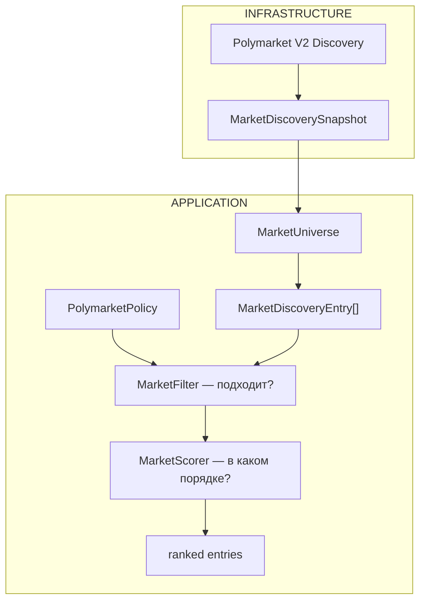

# @polymarket/policy

Application-слой отбора рынков: какие из технически доступных рынков хочет
конкретный consumer.

## Почему это отдельный слой

Infrastructure Discovery отвечает на **технический** вопрос — «какие рынки
контур вообще способен вести». Policy отвечает на вопрос **вкуса** — «какие
из них нужны этому потребителю». Смешение этих двух вопросов и было
исходной проблемой: драйвер площадки знал про «BTC интереснее ETH» и
«5m интереснее 15m», то есть содержал политику, которая к площадке
отношения не имеет.



## Policy — значение, а не сервис

Policy здесь — иммутабельная конфигурация без поведения. Ни реестра, ни
владельцев, ни ref-count: всё это появится там, где впервые возникнет
физический ресурс (подписка), а у значения владеть нечем.

```ts
export type Policy = PolymarketPolicy | CexPolicy;
```

Union закрытый и дискриминируется по `kind`. Общего «базового набора
фильтров» у двух площадок нет — попытка его выделить дала бы абстракцию,
которая ничего не выражает.

## Окно применимости: интервал ПОЛУОТКРЫТЫЙ

```text
effectiveFrom <= at < effectiveUntil
```

Это не стилистический выбор. При замкнутом с обеих сторон интервале две
соседние policy пересекались бы ровно в точке стыка:

| Момент | `effectiveUntil = 18:00` | `effectiveFrom = 18:00` |
| --- | --- | --- |
| 17:59:59.999 | ✅ действует | ❌ |
| **18:00:00.000** | ❌ | ✅ действует |
| 18:00:00.001 | ❌ | ✅ действует |

В одну и ту же миллисекунду рынок подошёл бы обеим policy. Для значения это
выглядит безобидно, но следующий этап строит на нём владение подписками —
и «двое владеют одним ресурсом ровно одну миллисекунду» превращается в
гонку, которую почти невозможно воспроизвести.

Обе границы необязательны: policy без них действует всегда.

## Время всегда приходит снаружи

Ни одна функция пакета не вызывает `Date.now()`. Момент оценки — параметр,
потому что вызывающий спрашивает **разное**:

| Кто | Вопрос | Что передаёт |
| --- | --- | --- |
| runtime | действует ли policy сейчас | `Timestamp.now(clock)` |
| subscription planner | будет ли действовать к старту ЭТОГО рынка | `entry.market.startsAt` |
| backtest | действовала ли в момент из архива | момент из архива |

Функция, читающая часы сама, отвечает только на первый вопрос и молча
ломает два остальных.

## Семантика пустых селекторов

Единообразно во всех необязательных селекторах:

```text
отсутствует ИЛИ пустой массив → ограничения нет
```

Пустой список сознательно **не** означает «не подходит ничего»:
конфигурация приходит из файлов и переменных окружения, где пустой список —
обычный способ сказать «фильтр выключен», и противоположное прочтение молча
обнулило бы весь universe.

Фабрика схлопывает пустой список в `undefined`: это одно и то же
утверждение, и хранить два его представления значило бы заставлять каждого
потребителя проверять оба.

## Валидация при создании

`createPolymarketPolicy()` / `createCexPolicy()` — fail-fast с
`PolicyValidationError`. Policy — программная конфигурация, её собирает
разработчик, а не внешний недоверенный источник; дефект настройки нужно
показывать там, где его можно исправить. Отложить до применения значило бы
получить не ошибку, а тихо пустой результат фильтрации — симптом, по
которому причину не найти.

Что отвергается:

| Условие | Почему |
| --- | --- |
| `effectiveFrom >= effectiveUntil` | окно не действует НИКОГДА (интервал полуоткрыт) |
| селектор из одних пробелов | `''` совпал бы с любым текстом — «фильтр по слову» стал бы «пропустить всё» |
| пустой обязательный список CEX | подписаться «на всё» у биржи нельзя, это не означает ничего |
| `orderbook: false, trades: false` | подписка без данных |
| неположительная/дробная глубина | не бывает |

Нормализация: обрезка пробелов, дедупликация с сохранением порядка первого
появления, заморозка результата. Входные массивы **не мутируются** — policy
собирают из общих констант.

## `CexPolicy` — declaration, а не конфигурация транспорта

Выражает потребность: «Binance, swap, `BTC/USDT:USDT`, стакан и сделки,
глубина 10». Сознательно не знает про интервалы перезапуска, таймауты
устаревания, шаг опроса, backoff, способ получения стакана и возможности
библиотеки-коннектора — это свойства транспорта, они принадлежат
Infrastructure и меняются по своим причинам. Смешать их здесь значило бы,
что смена таймаута требует правки пользовательской политики.

Тип рынка — собственный словарь Application (`spot | future | swap`).
Импортировать vendor-перечисление означало бы зависимость Application от
Infrastructure, то есть ровно ту стрелку, которую этот слой разворачивает.

В этом MR `CexPolicy` ни к чему не подключена: это модель, которую
subscription controller превратит в физическую конфигурацию источника.

## Граница зависимостей

```text
MAY:  @polymarket/market   @polymarket/ports    @polymarket/ids
      @polymarket/errors   @polymarket/timestamp
      @polymarket/value-objects
      decimal.js           ← разрешён архитектурно, но src его НЕ использует

MUST NOT: infrastructure/*, polymarket-v2, cex-v2, client, bindings,
          ccxt, реализации шин
```

Про `decimal.js`: он разрешён так же, как в соседних контурах (арифметика
за границей VO — обычная практика репозитория), но сегодня ни один файл
`src/` его не импортирует, поэтому в `package.json` он лежит в
`devDependencies` — его используют только тесты. Появится импорт в `src` —
его придётся перевести в рантайм-зависимости, и это не вопрос дисциплины:
проверка ниже упадёт.

Всё это закреплено тестом `__tests__/contour-boundary.test.ts` по реальным
артефактам — `package.json` и import-ам исходников:

| Проверка | Что ловит |
| --- | --- |
| закрытый allow-list импортов `src` | новую зависимость, о которой тест не знает |
| запрет infrastructure/transport в `package.json` | объявленную, но ещё не использованную связь |
| «каждый импорт `src` объявлен рантайм-зависимостью» | расхождение «импортирую, но не объявляю» — у потребителя это ломает сборку |
| отсутствие `DiscoveredMarket`/`IMarketFilterConfig` | незавершённую миграцию со старого контракта |

Allow-list **закрытый**: открытый («всё, кроме запрещённого») пропустил бы
новую infrastructure-зависимость, о которой тест ещё не знает.

## Ссылки

- [`market-filter.md`](./market-filter.md) — правила отбора и keyword-матчинг
- [`market-scorer.md`](./market-scorer.md) — алгоритм ранжирования
- `packages/application/market-discovery/docs/market-discovery.md` —
  `MarketUniverse`, откуда берутся записи
