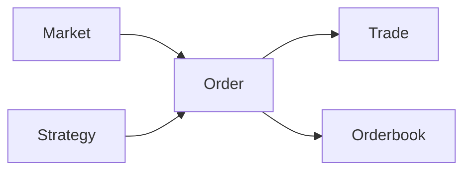

# Order Entity

## Описание

`Order` — это доменная сущность, представляющая **ордер (заявку)** в системе трейдинга на рынках предсказаний Polymarket.

Ордер — это **неизменяемый (immutable)** объект с readonly свойствами, описывающий намерение купить или продать токены предсказательного рынка по определённой цене и в определённом объёме.

## Зачем нужен?

Order используется для:
- **Размещения заявок** на покупку/продажу токенов рынка
- **Отслеживания состояния исполнения** (PENDING → OPEN → FILLED)
- **Хранения истории заполнения** (filledSize, averageFillPrice)
- **Изоляции стратегий** через strategyId (для multi-strategy систем)
- **Валидации бизнес-правил** через Result pattern

## Бизнес-правила

1. **Order должен иметь валидные** `marketId`, `tokenId`, `price` и `size`
2. **Price** должен быть в диапазоне [0.01, 0.99]
3. **Size** должен быть >= минимального количества
4. **Filled size** не может превышать исходный size
5. **Average fill price** обязателен если order частично/полностью заполнен
6. **Только PENDING или OPEN ордера** могут быть отменены

## Жизненный цикл

```
PENDING → OPEN → PARTIALLY_FILLED → FILLED
         ↓                ↓
      CANCELED        CANCELED
         ↓
      REJECTED
```

### Описание статусов

| Статус | Описание |
|--------|----------|
| `PENDING` | Ордер создан, но ещё не принят биржей |
| `OPEN` | Ордер принят биржей и находится в стакане |
| `PARTIALLY_FILLED` | Ордер частично исполнен |
| `FILLED` | Ордер полностью исполнен |
| `CANCELED` | Ордер отменён пользователем или системой |
| `REJECTED` | Ордер отклонён биржей (недостаточно средств, невалидные параметры и т.д.) |

## Создание Order

### Базовый пример

```typescript
import { Order } from '@polymarket/entities';
import { Price, Quantity } from '@polymarket/value-objects';

// Создание value objects
const priceResult = Price.fromValue(0.65);
const sizeResult = Quantity.fromValue(100);

if (priceResult.ok && sizeResult.ok) {
  // Создание ордера
  const orderResult = Order.create({
    id: 'order-123',
    marketId: 'market-btc-100k',
    tokenId: 'token-yes',
    side: 'BUY',
    price: priceResult.value,
    size: sizeResult.value,
    status: 'PENDING',
    timestamp: new Date(),
  });

  if (orderResult.ok) {
    const order = orderResult.value;
    console.log(`Order created: ${order.id}`);
    console.log(`Notional: ${order.getNotional()}`); // 65.00
  } else {
    console.error('Validation failed:', orderResult.error.message);
  }
}
```

### Создание из события OrderAccepted

```typescript
import { Order } from '@polymarket/entities';
import type { OrderAccepted } from '@polymarket/entities/events';

const event: OrderAccepted = {
  type: 'OrderAccepted',
  orderId: 'order-789',
  side: 'BUY',
  marketId: 'market-test',
  price: 0.55,
  size: 150,
};

const result = Order.fromOrderAccepted(event);

if (result.ok) {
  const order = result.value;
  console.log(`Order ${order.id} accepted`);
  console.log(`Status: ${order.status}`); // 'OPEN'
  console.log(`Filled: ${order.filledSize?.value}`); // 0
}
```

### Сериализация и десериализация

```typescript
import { Order } from '@polymarket/entities';

// Создание ордера
const orderResult = Order.create({
  id: 'order-serialize',
  marketId: 'market-abc',
  tokenId: 'token-yes',
  side: 'BUY',
  price: Price.fromValue(0.68).value!,
  size: Quantity.fromValue(300).value!,
  status: 'OPEN',
  timestamp: new Date('2024-01-15T14:00:00Z'),
});

if (orderResult.ok) {
  // Сериализация в JSON
  const json = orderResult.value.toJSON();
  const jsonString = JSON.stringify(json);

  // Сохранение в БД или отправка по API
  await db.saveOrder(jsonString);

  // Восстановление из JSON
  const loaded = JSON.parse(jsonString);
  const restoredResult = Order.fromJSON(loaded);

  if (restoredResult.ok) {
    console.log('Order restored:', restoredResult.value.id);
  }
}
```

## Обновление Order

Order — **immutable entity**, поэтому все методы обновления возвращают **новый экземпляр**.

### Обновление статуса

```typescript
const orderResult = Order.create({
  id: 'order-update',
  marketId: 'market-test',
  tokenId: 'token-yes',
  side: 'BUY',
  price: Price.fromValue(0.5).value!,
  size: Quantity.fromValue(100).value!,
  status: 'OPEN',
  timestamp: new Date(),
});

if (orderResult.ok) {
  const order = orderResult.value;

  // Отмена ордера
  const canceledOrder = order.withStatus('CANCELED');
  console.log(order.status); // 'OPEN' (оригинал не изменился)
  console.log(canceledOrder.status); // 'CANCELED'
}
```

### Обновление заполнения

```typescript
if (orderResult.ok) {
  const order = orderResult.value;

  // Частичное заполнение
  const partiallyFilled = order.withFill(
    Quantity.fromValue(50).value!,
    Price.fromValue(0.51).value!
  );

  console.log(partiallyFilled.filledSize?.value); // 50
  console.log(partiallyFilled.status); // 'OPEN' (не полностью заполнен)
  console.log(partiallyFilled.getRemainingSize().value); // 50

  // Полное заполнение
  const fullyFilled = order.withFill(
    Quantity.fromValue(100).value!,
    Price.fromValue(0.51).value!
  );

  console.log(fullyFilled.status); // 'FILLED' (автоматически)
  console.log(fullyFilled.getFillPercentage()); // 100
}
```

## Методы Order

### Предикаты (boolean методы)

```typescript
const order = orderResult.value;

// Проверка статуса
order.isFilled();           // true если status === 'FILLED'
order.isOpen();             // true если status === 'OPEN'
order.isPending();          // true если status === 'PENDING'
order.canCancel();          // true если status === 'PENDING' || 'OPEN'
order.isPartiallyFilled();  // true если 0 < filledSize < size
```

### Вычисления

```typescript
// Номинальная стоимость (price * size)
const notional = order.getNotional();
console.log(notional); // 50.00 для price=0.5, size=100

// Оставшийся размер
const remaining = order.getRemainingSize();
console.log(remaining.value); // 60 если size=100, filledSize=40

// Процент заполнения
const fillPct = order.getFillPercentage();
console.log(fillPct); // 40 если size=100, filledSize=40
```

### Применение событий

```typescript
const order = orderResult.value;

// Применение события отмены
const cancelResult = order.applyExecutionEvent({
  type: 'OrderCancelled',
  orderId: order.id,
});

if (cancelResult.ok) {
  const canceledOrder = cancelResult.value;
  console.log(canceledOrder.status); // 'CANCELED'
}

// Применение события отклонения
const rejectResult = order.applyExecutionEvent({
  type: 'OrderRejected',
  orderId: order.id,
  reason: 'Insufficient funds',
});

if (rejectResult.ok) {
  const rejectedOrder = rejectResult.value;
  console.log(rejectedOrder.status); // 'REJECTED'
}
```

## API Reference

### OrderParams

```typescript
interface OrderParams {
  id: string;                    // Уникальный идентификатор ордера
  marketId: string;              // ID рынка
  tokenId: string;               // ID токена (YES/NO)
  side: TradeSide;               // 'BUY' или 'SELL'
  price: Price;                  // Цена исполнения
  size: Quantity;                // Размер ордера
  status: OrderStatus;           // Статус ордера
  timestamp: Date;               // Время создания
  strategyId?: string;           // Опционально: ID стратегии
  filledSize?: Quantity;         // Опционально: Заполненный размер
  averageFillPrice?: Price;      // Опционально: Средняя цена исполнения
}
```

### Статические методы

| Метод | Сигнатура | Описание |
|-------|-----------|----------|
| `create()` | `(params: OrderParams) => Result<Order, OrderValidationError>` | Создаёт Order с валидацией |
| `fromOrderAccepted()` | `(event: OrderAccepted) => Result<Order, OrderValidationError>` | Создаёт Order из события |
| `fromJSON()` | `(json: Record<string, unknown>) => Result<Order, OrderValidationError>` | Создаёт Order из JSON |

### Методы экземпляра

**Обновление:**
- `withStatus(status: OrderStatus): Order` — новый Order с обновлённым статусом
- `withFill(filledSize: Quantity, avgPrice: Price): Order` — новый Order с данными заполнения
- `applyExecutionEvent(event: ExecutionEvent): Result<Order, string>` — применяет событие

**Предикаты:**
- `isFilled(): boolean` — проверяет статус FILLED
- `isOpen(): boolean` — проверяет статус OPEN
- `isPending(): boolean` — проверяет статус PENDING
- `canCancel(): boolean` — можно ли отменить (PENDING || OPEN)
- `isPartiallyFilled(): boolean` — частично заполнен?

**Вычисления:**
- `getNotional(): number` — номинальная стоимость (price * size)
- `getRemainingSize(): Quantity` — оставшийся размер (size - filledSize)
- `getFillPercentage(): number` — процент заполнения (0-100)

**Сериализация:**
- `toJSON(): Record<string, unknown>` — преобразует в JSON
- `toString(): string` — строковое представление

## Валидация и ошибки

Order использует **Result pattern** для обработки ошибок:

```typescript
const result = Order.create({
  id: '',  // ❌ Невалидный ID
  marketId: 'market-test',
  tokenId: 'token-yes',
  side: 'BUY',
  price: Price.fromValue(0.5).value!,
  size: Quantity.fromValue(100).value!,
  status: 'OPEN',
  timestamp: new Date(),
});

if (!result.ok) {
  console.error('Validation failed:', result.error.message);
  // "Order ID must be a non-empty string"

  console.log('Error context:', result.error.context);
  // { field: 'id', value: '' }
}
```

### Типичные ошибки валидации

| Ошибка | Причина |
|--------|---------|
| `Order ID must be a non-empty string` | Пустой или невалидный ID |
| `Market ID must be a non-empty string` | Пустой marketId |
| `Token ID must be a non-empty string` | Пустой tokenId |
| `Invalid order side` | side не 'BUY' и не 'SELL' |
| `Invalid order status` | Неизвестный статус |
| `Order size must be positive` | size <= 0 |
| `Filled size cannot exceed order size` | filledSize > size |
| `Average fill price is required when filled size > 0` | filledSize > 0 но нет averageFillPrice |
| `Invalid timestamp` | Невалидный Date объект |

## Связь с другими entities



- **Market** — Order размещается на конкретном Market
- **Trade** — Order может породить один или несколько Trade (при исполнении)
- **Orderbook** — Order попадает в Orderbook рынка
- **Strategy** — Order может быть привязан к Strategy через strategyId

## Примеры использования

### Market Making стратегия

```typescript
import { Order } from '@polymarket/entities';
import { Price, Quantity } from '@polymarket/value-objects';

async function placeMarketMakerOrders(marketId: string, tokenId: string) {
  const midPrice = 0.50;
  const spread = 0.02;
  const size = 100;

  // Buy order (ниже mid price)
  const buyResult = Order.create({
    id: generateId(),
    marketId,
    tokenId,
    side: 'BUY',
    price: Price.fromValue(midPrice - spread / 2).value!,
    size: Quantity.fromValue(size).value!,
    status: 'PENDING',
    timestamp: new Date(),
    strategyId: 'market-maker-1',
  });

  // Sell order (выше mid price)
  const sellResult = Order.create({
    id: generateId(),
    marketId,
    tokenId,
    side: 'SELL',
    price: Price.fromValue(midPrice + spread / 2).value!,
    size: Quantity.fromValue(size).value!,
    status: 'PENDING',
    timestamp: new Date(),
    strategyId: 'market-maker-1',
  });

  if (buyResult.ok && sellResult.ok) {
    await exchange.placeOrders([buyResult.value, sellResult.value]);
  }
}
```

### Отслеживание исполнения

```typescript
async function monitorOrderExecution(orderId: string) {
  let order = await loadOrder(orderId);

  // Подписка на события
  exchange.on('OrderAccepted', (event) => {
    if (event.orderId === orderId) {
      const result = Order.fromOrderAccepted(event);
      if (result.ok) {
        order = result.value;
        console.log(`Order ${orderId} accepted and is now OPEN`);
      }
    }
  });

  exchange.on('OrderPartiallyFilled', (event) => {
    if (event.orderId === orderId) {
      order = order.withFill(
        Quantity.fromValue(event.filledSize).value!,
        Price.fromValue(event.price).value!
      );
      console.log(`Order ${orderId} filled ${order.getFillPercentage()}%`);
    }
  });

  exchange.on('OrderFilled', (event) => {
    if (event.orderId === orderId) {
      order = order.withFill(
        order.size,
        Price.fromValue(event.price).value!
      );
      console.log(`Order ${orderId} fully filled!`);
    }
  });
}
```

## Best Practices

### ✅ DO

```typescript
// ✅ Всегда проверяй Result перед использованием
const result = Order.create(params);
if (result.ok) {
  const order = result.value;
  // Работа с order
} else {
  handleError(result.error);
}

// ✅ Используй strategyId для изоляции
const order = Order.create({
  ...params,
  strategyId: 'my-strategy-1',
});

// ✅ Проверяй canCancel() перед отменой
if (order.canCancel()) {
  const canceled = order.withStatus('CANCELED');
}
```

### ❌ DON'T

```typescript
// ❌ Не используй .value! без проверки
const order = Order.create(params).value!; // Может упасть!

// ❌ Не мутируй Order напрямую
order.status = 'FILLED'; // ❌ Compilation error (readonly)

// ❌ Не создавай Order через new
const order = new Order(params); // ❌ Compilation error (private constructor)
```

## См. также

- [Orderbook](./orderbook.md) — стакан заявок
- [Trade](./trade.md) — сделка
- [Market](./market.md) — рынок
- [OrderValidationError](../errors/OrderValidationError.md) — ошибки валидации Order
