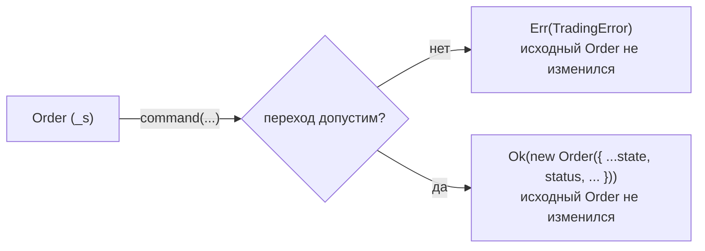

# Order — самодостаточный агрегат заявки

## Что такое Order

`Order` — неизменяемая доменная сущность, представляющая торговую заявку в системе предсказательных рынков Polymarket.

Весь экземпляр — это одно приватное поле `_s: OrderState`. Команды проверяют
допустимость перехода и возвращают `Result` с **новым** экземпляром; скрытого
изменяемого состояния нет, событий агрегат не копит и не публикует.

Пакет: `packages/domain/entities/order/`

**Самодостаточный модуль** — вся бизнес-логика заявки сосредоточена в одной папке, без зависимостей от других domain entities.

## Структура пакета

```text
src/
├── Order.ts          — агрегат (фабрики + команды + геттеры)
├── OrderState.ts     — типы (OrderStatus, FillState, OrderSnapshot, ...)
├── identity.ts       — сравнение заявок: идентичность отдельно от состояния
├── _fill.ts          — арифметика fills (приватный модуль)
├── index.ts          — публичный API
└── view/
    ├── OrderViewModel.ts     — сериализация для API/логирования
    ├── OrderDeserializer.ts  — десериализация из снэпшота
    └── index.ts
```

## Жизненный цикл

```
              accept()                applyFill()
  PENDING ──────────────► OPEN ◄──────────────────────────────┐
     │                     │                                  │
     │ reject()            │ applyFill()      applyFill()     │
     ▼                     ▼                  (partial)       │
  REJECTED          PARTIALLY_FILLED ─────────────────────────┘
     │                     │
     │            applyFill() (full) / cancel() / expire()
     │                     │
     │           ┌──────────┼──────────┐
     │           ▼          ▼          ▼
     │        FILLED     CANCELED   EXPIRED
     │
     └── (терминальный)

  Терминальные: FILLED, CANCELED, REJECTED, EXPIRED
  Fillable:     OPEN, PARTIALLY_FILLED
```

### Возможные переходы

| Из                      | Команда          | В                            |
|-------------------------|------------------|------------------------------|
| PENDING                 | accept()         | OPEN                         |
| PENDING                 | reject(reason)   | REJECTED                     |
| OPEN                    | applyFill(fill)  | PARTIALLY_FILLED или FILLED  |
| OPEN / PARTIALLY_FILLED | cancel(reason?)  | CANCELED                     |
| OPEN / PARTIALLY_FILLED | expire()         | EXPIRED                      |
| PARTIALLY_FILLED        | applyFill(fill)  | PARTIALLY_FILLED или FILLED  |

## Почему Order не публикует события

Раньше `Order` был одновременно состоянием заявки и Domain Event Outbox:
каждая команда складывала draft `OrderEvent` во внутренний буфер, а
`pullEvents()` опустошал его **мутацией** (`splice`). Отсюда три проблемы:

1. Объект был immutable только по торговому состоянию — буфер менялся у
   экземпляра, уже лежащего в чужом состоянии (например, в `AccountHotState`).
2. Каждый producer был обязан «слить драфты» до публикации, и проверить это
   на стороне потребителя было нельзя — контракт держался соглашением.
3. Команды строили фиктивное событие только для того, чтобы вычислить из него
   новое состояние (`command → draft → _applyEventToState → new Order`).

Живых потребителей у `pullEvents()` и `Order.fromEvents()` не осталось: их
вызывал только старый торговый контур, перенесённый в
`legacy-bot/trading-contour-reference/`. Новый рантайм публикует уже
совершённое изменение одним событием `TRADING_ACCOUNT_ORDER_COMMITTED`
(`Order` + `Portfolio` атомарно), и за публикацию отвечает Application-слой, а
не сущность.

Поэтому `Order` — чистый immutable-переход состояния:



## Два пути создания

### 1. Новая заявка: `create()` + команды

```typescript
// Создание — всегда PENDING, пустое fill-состояние
const result = Order.create({
  id: asOrderId('order-1')!,
  asset: myAsset,
  side: 'BUY',
  price: OutcomePrice.of(new Decimal('0.65')),
  size: Quantity.of(new Decimal('100')),
  timestamp: Timestamp.now(),
});

if (result.ok) {
  const pending = result.value;

  // Биржа приняла: PENDING → OPEN
  const acceptResult = pending.accept();
  if (!acceptResult.ok) throw new Error(acceptResult.error.message);
  const open = acceptResult.value;

  // Исполнение: OPEN → FILLED
  const fillResult = open.applyFill({
    id: asFillId('fill-1')!, orderId: pending.id, asset: myAsset, side: 'BUY',
    size: Quantity.of(new Decimal('100')),
    price: OutcomePrice.of(new Decimal('0.65')),
  });
  if (!fillResult.ok) throw new Error(fillResult.error.message);

  // Каждый шаг вернул новый экземпляр — прежние не изменились
  pending.status;              // 'PENDING'
  open.status;                 // 'OPEN'
  fillResult.value.status;     // 'FILLED'
}
```

### 2. Восстановление: `rehydrate()` (из снэпшота через `OrderDeserializer`)

```typescript
const result = OrderDeserializer.fromSnapshot({
  id: 'order-1',
  asset: 'POLYMARKET_CTF:POLYGON:0xabc...:YES',
  side: 'BUY',
  price: 0.65,
  size: 100,
  status: 'PARTIALLY_FILLED',
  timestamp: '2024-01-01T00:00:00.000Z',
  filledSize: 60,
  averagePrice: 0.63,
  fillIds: ['fill-1', 'fill-2'],
});

// OrderDeserializer парсит примитивы → вызывает Order.rehydrate(state)
// rehydrate() проверяет консистентность состояния:
//   - filledSize не превышает size
//   - PENDING не может иметь fills
//   - FILLED должна иметь filledSize === size
//   - PARTIALLY_FILLED должна иметь 0 < filledSize < size
```

## Публичный API

### Геттеры (identity)

| Геттер       | Тип              | Описание               |
|--------------|------------------|------------------------|
| `id`         | `OrderId`        | ID заявки              |
| `asset`      | `AssetId`        | Торгуемый актив        |
| `side`       | `'BUY' \| 'SELL'`| Сторона                |
| `price`      | `OutcomePrice`          | Лимитная цена          |
| `size`       | `Quantity`       | Полный размер          |
| `status`     | `OrderStatus`    | Текущий статус         |
| `timestamp`  | `Timestamp`      | Время создания         |
| `reason`     | `string?`        | Причина отклонения     |
| `strategyId` | `StrategyId?`    | ID стратегии           |
| `accountId`  | `AccountId?`     | ID аккаунта-владельца  |

### Геттеры (fill state)

| Геттер         | Тип                | Описание                  |
|----------------|--------------------|---------------------------|
| `filledSize`   | `Quantity`         | Исполненный объём         |
| `averagePrice` | `OutcomePrice \| undefined`| VWAP, undefined если нет fills |
| `fillIds`      | `readonly FillId[]`| Список ID fills           |
| `tradeCount`   | `number`           | Количество fills          |

### Вычисляемые геттеры

| Геттер          | Тип       | Описание                     |
|-----------------|-----------|------------------------------|
| `remainingSize` | `Quantity`| size - filledSize            |
| `fillPercentage`| `Decimal` | filledSize / size × 100      |
| `notional`      | `Decimal` | price × size                 |
| `isTerminal`    | `boolean` | статус в TERMINAL_STATUSES   |
| `isFillable`    | `boolean` | статус в FILLABLE_STATUSES   |

### Предикаты

```typescript
order.isPending()        // status === 'PENDING'
order.isOpen()           // status === 'OPEN'
order.isFilled()         // status === 'FILLED'
order.isPartiallyFilled()// status === 'PARTIALLY_FILLED'
order.canCancel()        // OPEN || PARTIALLY_FILLED
order.canModify()        // не терминальный
```

### Фабрики

```typescript
Order.create(params)           // новая заявка, всегда PENDING
Order.rehydrate(state)         // из доверенного OrderState, с кросс-валидацией
```

### Команды (возвращают Result<Order, TradingError>)

```typescript
order.accept()                    // PENDING → OPEN
order.reject('reason')            // PENDING → REJECTED (причина непустая)
order.cancel('reason?')           // OPEN|PARTIALLY_FILLED → CANCELED (по умолчанию 'User cancelled')
order.expire()                    // OPEN|PARTIALLY_FILLED → EXPIRED
order.applyFill(fill: FillData)   // OPEN|PARTIALLY_FILLED → PARTIALLY_FILLED|FILLED
order.canAcceptFill(fill: FillData) // boolean (без применения)
```

Каждая команда:

1. проверяет исходный статус (и для `applyFill` — соответствие fill заявке);
2. при недопустимом переходе возвращает `Err(TradingError)`;
3. иначе возвращает `Ok(new Order({ ...state, ... }))` — новый экземпляр.

Исходный экземпляр не меняется ни в одном из случаев.

### `applyFill()` по шагам

1. Статус OPEN или PARTIALLY_FILLED — иначе `Err`.
2. `fill.asset`, `fill.side`, `fill.orderId` совпадают с заявкой — иначе `Err`.
3. `addFill()` отклоняет нулевой размер, дубликат `fillId` и превышение
   остатка, затем считает новый `filledSize` и VWAP.
4. `isFull()` выбирает статус: FILLED, если остаток исчерпан с учётом порога
   пыли (0.01), иначе PARTIALLY_FILLED.

### Сериализация

```typescript
order.toSnapshot(): OrderSnapshot  // плоский объект с примитивами
order.toString(): string           // "Order[id]: SIDE SIZE @ PRICE (STATUS)"
```

## Модуль _fill.ts (приватный)

Содержит арифметику fills. **Не экспортируется из index.ts.**

- `emptyFill()` — начальное состояние (filledSize=0, no VWAP)
- `addFill(state, fill, orderSize)` — добавить исполнение с валидацией
- `isFull(state, orderSize)` — заявка полностью исполнена
- `_vwap(...)` — взвешенная средняя цена (VWAP)

### Алгоритм VWAP

```
VWAP = (currentSize × currentAvg + newSize × newPrice) / (currentSize + newSize)
```

При первом fill: `VWAP = newPrice` (нет предыдущего среднего).

## Инварианты

1. **Создание всегда PENDING** — `create()` не принимает статус
2. **Неизменяемость** — все команды возвращают новый экземпляр; кроме
   `OrderState` экземпляр не хранит ничего (буфера событий нет)
3. **Never Throw** — команды возвращают `Result<Order, TradingError>`, не бросают
4. **Fill dedup** — повторный fillId → ошибка
5. **Fill overflow** — fillSize > remainingSize → ошибка
6. **Terminal lock** — команды над терминальными статусами → ошибка
7. **Rehydrate consistency** — filledSize > size, PENDING+fills, FILLED+partial → ошибка

## Кросс-валидация в rehydrate()

| Условие                        | Ошибка                                      |
|--------------------------------|---------------------------------------------|
| `filledSize > size`            | `filledSize (X) exceeds size (Y)`           |
| `status=PENDING, filledSize>0` | `PENDING order cannot have fills`           |
| `status=FILLED, filledSize≠size`| `FILLED order must have filledSize equal to size` |
| `status=PARTIALLY_FILLED`, не `0 < filledSize < size` | `PARTIALLY_FILLED order must have 0 < filledSize < size` |

**Известное ограничение.** `applyFill()` переводит заявку в FILLED, когда
остаток меньше порога пыли (0.01), но `rehydrate()` требует для FILLED строгого
`filledSize === size`. Поэтому заявка, закрытая по порогу пыли, не проходит
round-trip `toSnapshot()` → `OrderDeserializer.fromSnapshot()`. Поведение
унаследовано и в этом документе только зафиксировано.

## Тестовое покрытие

| Файл                      | Тесты | Описание                          |
|---------------------------|-------|-----------------------------------|
| `unit/Order.test.ts`      | 109   | create, rehydrate, FSM (все исходные статусы), applyFill-guards, VWAP, пыль, иммутабельность |
| `unit/orderIdentity.test.ts` | 8  | идентичность против состояния |
| `unit/view/OrderView.test.ts` | 33 | ViewModel, Deserializer, round-trip |
| `integration/OrderLifecycle.test.ts` | 28 | End-to-end сценарии, VWAP, round-trip (включая it.each) |

**Итого: 178 тестов**
