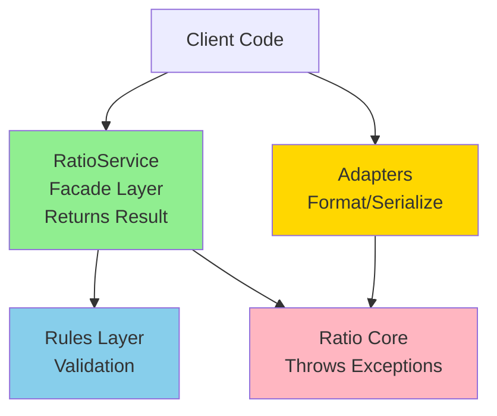

# Ratio Value Object

**Ratio** - value object для представления относительных величин (коэффициентов, долей) с точной арифметикой на базе Decimal.js.

## 🎯 Ключевые особенности

- ✅ **Хранит дробь (fraction), не процент**: `0.02` означает 2%, а `2` означает 200%
- ✅ **Точная арифметика**: использует Decimal.js вместо нативного JavaScript number
- ✅ **Type-safe**: типизированные ошибки через Result pattern
- ✅ **Минимальная абстракция**: содержит только вспомогательные методы, операции живут в целевых value objects
- ✅ **Множество форматов**: создание из decimal, percent, basis points
- ✅ **Иммутабельность**: все операции возвращают новые инстансы

## 🚀 Quick Start

### Установка

```bash
npm install @polymarket/value-objects
```

### Базовое использование

```typescript
import { RatioService } from '@polymarket/value-objects';

// Создание из разных форматов
const fromPercent = RatioService.fromPercent(2);      // 2% => 0.02
const fromBps = RatioService.fromBps(200);           // 200 bps => 0.02
const fromDecimal = RatioService.fromDecimal(0.02);  // 0.02 (explicit)

if (fromPercent.ok) {
  const ratio = fromPercent.value;

  // Использование в расчетах
  console.log(ratio.onePlus());   // Decimal(1.02) - для amount * (1 + ratio)
  console.log(ratio.oneMinus());  // Decimal(0.98) - для amount * (1 - ratio)
  console.log(ratio.toDecimal()); // Decimal(0.02)
}
```

### Применение в расчетах

```typescript
import { RatioService } from '@polymarket/value-objects';
import Decimal from 'decimal.js';

// Добавить 10% markup
const markupResult = RatioService.fromPercent(10);
if (markupResult.ok) {
  const amount = new Decimal(100);
  const newAmount = amount.mul(markupResult.value.onePlus()); // 100 * 1.1 = 110
}

// Вычесть 2% fee
const feeResult = RatioService.fromPercent(2);
if (feeResult.ok) {
  const amount = new Decimal(100);
  const afterFee = amount.mul(feeResult.value.oneMinus()); // 100 * 0.98 = 98
}
```

## ⚠️ Важно: Семантика дроби (fraction)

**Ratio хранит ДРОБЬ, не процент!**

```typescript
// ❌ НЕПРАВИЛЬНО: прямое создание через Ratio.of()
const ratio = Ratio.of(new Decimal(2)); // 2 как дробь = 200%! (не 2%)

// ✅ ПРАВИЛЬНО: используйте RatioService для ясной семантики
const ratioFromPercent = RatioService.fromPercent(2);     // 2% => 0.02 (явно)
const ratioFromDecimal = RatioService.fromDecimal(0.02);  // 0.02 fraction (явно)
```

**Почему это важно:**

- `0.02` = 2% (дробь 0.02)
- `2.0` = 200% (дробь 2.0, НЕ 2%)
- `1.0` = 100%
- `-0.1` = -10%

Используйте factory methods для ясности!

## 🏗️ Архитектура: Throws+Facade Pattern

Ratio следует 4-layer architecture:



**Слои:**

1. **Core** (`Ratio`) - инварианты, бросает исключения
2. **Rules** (`ValidateRatioGteMinusOne`) - бизнес-правила валидации
3. **Facade** (`RatioService`) - публичный API, возвращает Result, Never Throw
4. **Adapters** (`RatioFormatter`, `RatioSerializer`) - форматирование и сериализация

## 📚 Документация

- **[Architecture](./architecture.md)** - детальная архитектура и design decisions
- **[Core API](./core.md)** - Ratio class reference
- **[Facade API](./facade.md)** - RatioService reference (основной API)
- **[Adapters](./adapters.md)** - RatioFormatter и RatioSerializer
- **[Examples](./examples.md)** - примеры использования в реальных сценариях

## 🔑 API Overview

### Factory Methods (RatioService)

```typescript
// Создание
RatioService.fromDecimal(value, options?)   // из дроби
RatioService.fromPercent(percent, options?) // из процента
RatioService.fromBps(bps, options?)         // из basis points

// Опции
interface RatioCreateOptions {
  ensureGteMinusOne?: boolean; // валидировать ratio >= -1
  ensureLteOne?: boolean;      // валидировать ratio <= 1
}

// Сравнение
RatioService.equals(a, b) // сравнить два Ratio
```

### Core Methods (Ratio)

```typescript
ratio.toDecimal()  // Decimal - дробь
ratio.toNumber()   // number (lossy!)
ratio.onePlus()    // Decimal - (1 + ratio)
ratio.oneMinus()   // Decimal - (1 - ratio)
ratio.equals(other) // boolean
ratio.isZero()     // boolean
ratio.isPositive() // boolean
ratio.isNegative() // boolean

// Константы
Ratio.ZERO // 0
Ratio.ONE  // 1 (100%)
```

### Formatting (RatioFormatter)

```typescript
RatioFormatter.toDecimal(ratio, decimals?) // "0.0200"
RatioFormatter.toPercent(ratio, decimals?) // "2.00%"
RatioFormatter.toBps(ratio, decimals?)     // "200 bps"
RatioFormatter.parse(input)                // "2%" → Ratio
```

### Serialization (RatioSerializer)

```typescript
RatioSerializer.toJSON(ratio)   // { ratio: "0.02" }
RatioSerializer.fromJSON(json)  // JSON → Ratio
```

## 🎨 Примеры использования

### Пример 1: Добавить markup (onePlus)

```typescript
const price = new Decimal(100);
const markupResult = RatioService.fromPercent(10); // 10% markup

if (markupResult.ok) {
  const newPrice = price.mul(markupResult.value.onePlus());
  console.log(newPrice.toString()); // "110"
}
```

### Пример 2: Вычесть fee (oneMinus)

```typescript
const amount = new Decimal(100);
const feeResult = RatioService.fromPercent(2); // 2% fee

if (feeResult.ok) {
  const afterFee = amount.mul(feeResult.value.oneMinus());
  console.log(afterFee.toString()); // "98"
}
```

### Пример 3: Валидация ensureGteMinusOne

```typescript
// ✅ Корректный discount
const validDiscount = RatioService.fromPercent(-50, { ensureGteMinusOne: true });
// OK: -50% => -0.5, и -0.5 >= -1

// ❌ Некорректный discount
const invalidDiscount = RatioService.fromPercent(-150, { ensureGteMinusOne: true });
// Err: -150% => -1.5, и -1.5 < -1 (приведет к отрицательному результату)
```

### Пример 4: Форматирование

```typescript
const ratioResult = RatioService.fromPercent(2.5);
if (ratioResult.ok) {
  const ratio = ratioResult.value;

  RatioFormatter.toDecimal(ratio, 4); // "0.0250"
  RatioFormatter.toPercent(ratio, 1); // "2.5%"
  RatioFormatter.toBps(ratio, 0);     // "250 bps"
}
```

### Пример 5: Сериализация

```typescript
const ratioResult = RatioService.fromPercent(2);
if (ratioResult.ok) {
  const json = RatioSerializer.toJSON(ratioResult.value);
  console.log(json); // { ratio: "0.02" }

  const parsed = RatioSerializer.fromJSON(json);
  // Round-trip сохраняет точность
}
```

## 🔍 Сравнение: Ratio vs Percentage (удален)

Ratio заменяет удаленный Percentage value object. Ключевые отличия:

| Аспект | Percentage (удален) | Ratio (новый) |
| -------- | ------------------- | --------------- |
| **Семантика** | Неясная (value object для процента?) | Четкая (relative value, дробь) |
| **Операции** | add/subtract (бессмысленно) | Минимум (только вспомогательные) |
| **Использование** | Standalone | В контексте целевого value object |
| **Арифметика** | В Percentage классе | В Money/Price/Quantity |

**Почему Percentage был удален:**

- Операции `Percentage.add(25%, 35%)` бессмысленны без базы
- "Процент это доля ОТ ЧИСЛА" - нужен контекст
- Ratio решает эту проблему минимальной абстракцией

Подробнее: см. раздел «Ratio vs Percentage» выше

## 🚫 Важно: Ratio НЕ содержит арифметических операций

Ratio - это минимальная абстракция. Арифметические операции живут в целевых value objects:

```typescript
// ❌ НЕТ таких методов в Ratio
ratio.add(other)      // нет
ratio.subtract(other) // нет
ratio.multiply(value) // нет

// ✅ Операции живут в Money/Price/Quantity
Money.addRate(ratio: Ratio)          // добавить процент к сумме
Price.take(ratio: Ratio)             // взять процент от цены
Quantity.applyDiscount(ratio: Ratio) // применить скидку
```

**Почему:** Операции с процентами имеют смысл только в контексте конкретной величины.

## 📦 Экспорты

```typescript
// Основной экспорт (рекомендуется)
import { RatioService } from '@polymarket/value-objects';

// Специфичный экспорт
import {
  Ratio,              // Core class
  RatioService,       // Facade (main API)
  RatioFormatter,     // Formatting
  RatioSerializer,    // Serialization
  RatioErrorReason    // Typed errors
} from '@polymarket/value-objects/ratio';
```

## 🧪 Тестирование

Все компоненты покрыты тестами:

- Unit tests: Core, Facade, Adapters, Rules
- Integration tests: full workflows
- Coverage: >90%

```bash
npm test -- ratio
```

## 📝 Лицензия

MIT

---

**Следующие шаги:**

- [Architecture Guide](./architecture.md) - глубокое погружение в архитектуру
- [Examples](./examples.md) - больше примеров использования
- [API Reference](./facade.md) - полная документация RatioService
