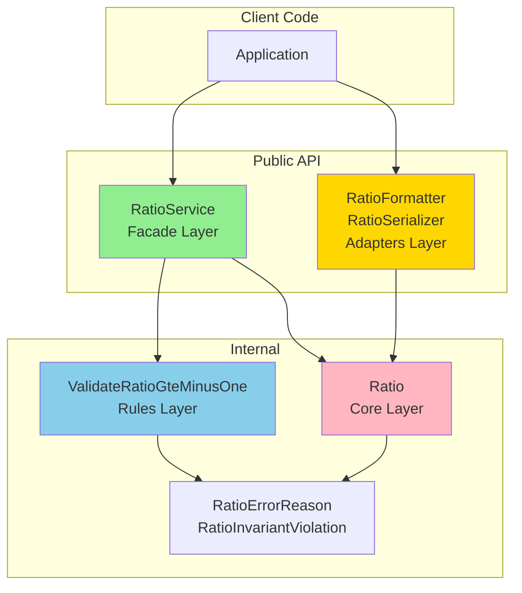
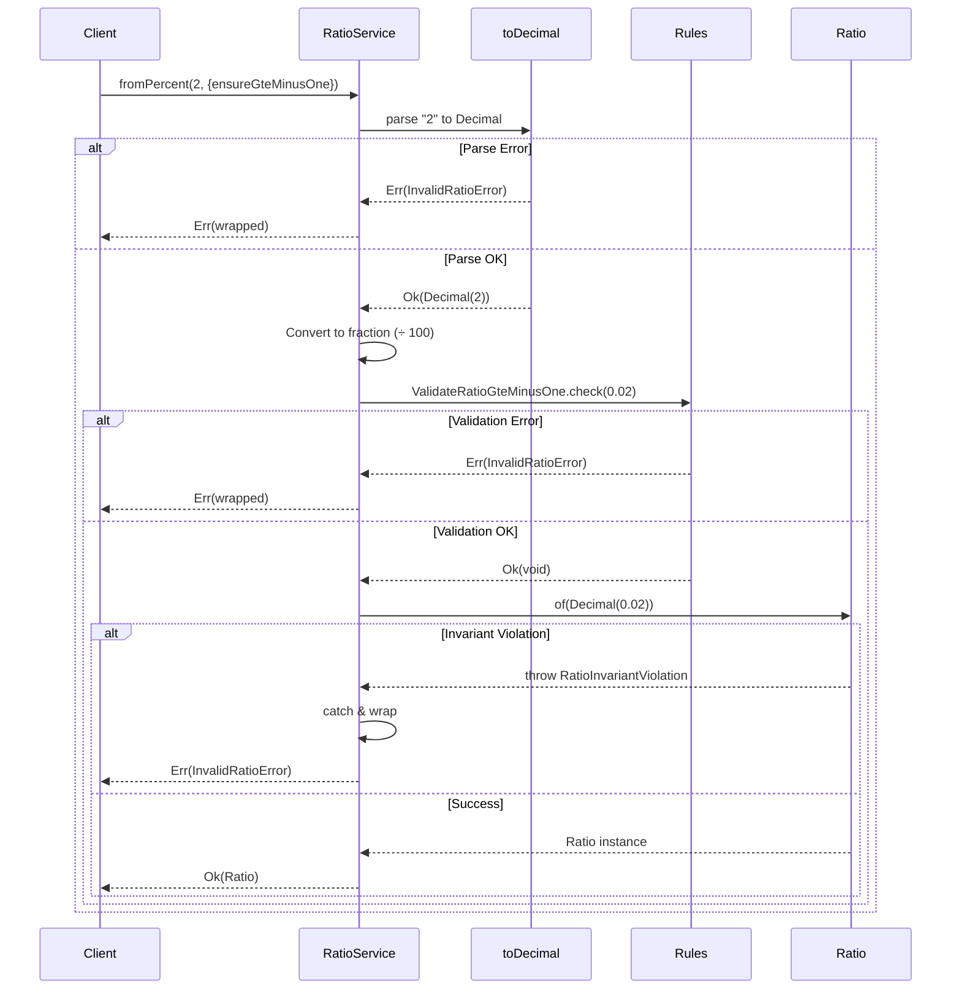
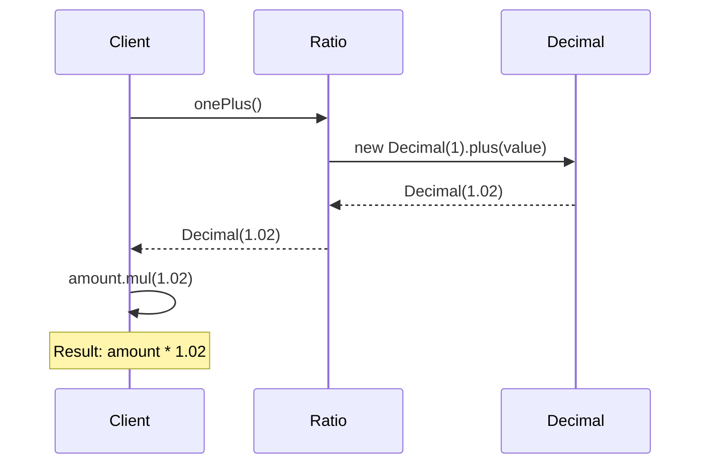
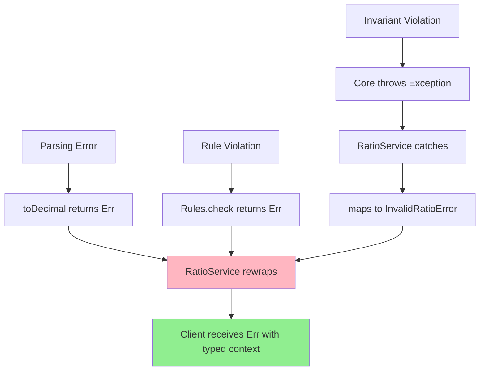

# Ratio Architecture

Подробное описание архитектуры Ratio value object.

## Содержание

- [Архитектурный паттерн](#архитектурный-паттерн)
- [4-Layer Architecture](#4-layer-architecture)
- [Throws+Facade Pattern](#throwsfacade-pattern)
- [Data Flow](#data-flow)
- [Design Decisions](#design-decisions)
- [Error Handling](#error-handling)

## Архитектурный паттерн

Ratio следует паттерну **Throws+Facade** с 4-слойной архитектурой, используемой во всех value objects проекта.

### Ключевые принципы

1. **Separation of Concerns**: каждый слой имеет четкую ответственность
2. **Type Safety**: типизированные ошибки через Result pattern
3. **Never Throw от Facade**: публичный API никогда не бросает исключения
4. **Immutability**: все операции создают новые инстансы
5. **Minimal Abstraction**: Ratio содержит минимум логики, операции в target objects

## 4-Layer Architecture



### Слой 1: Core (Ratio)

**Ответственность:**

- Хранение значения (Decimal)
- Проверка инвариантов
- Базовые операции (toDecimal, onePlus, oneMinus)

**Характеристики:**

- ✅ Бросает `RatioInvariantViolation` при нарушении инвариантов
- ✅ Private конструктор
- ✅ Static factory `.of()` (internal, не рекомендуется для прямого использования)
- ✅ Иммутабельность через `readonly`

**Инварианты:**

```typescript
// 1. Значение не NaN
if (value.isNaN()) {
  throw new RatioInvariantViolation('...', RatioErrorReason.NAN);
}

// 2. Значение конечно (не Infinity)
if (!value.isFinite()) {
  throw new RatioInvariantViolation('...', RatioErrorReason.NON_FINITE);
}
```

**НЕ-инварианты (не проверяются в Core):**

- Границы значений (min/max) - проверяются в Rules при необходимости
- Парсинг строк - делает RatioFormatter
- Валидация для специфических операций - делает Rules

### Слой 2: Rules (Validation)

**Ответственность:**

- Domain-specific валидация
- Precondition checks для операций
- Бизнес-правила

#### Пример: ValidateRatioGteMinusOne

```typescript
public static check(value: Decimal, operation: string): Result<void, InvalidRatioError> {
  if (value.lessThan(-1)) {
    return Err(new InvalidRatioError(...));
  }
  return Ok(undefined);
}
```

**Когда используется:**

- `ensureGteMinusOne` опция в RatioService
- Защита от бессмысленных операций: `amount * (1 + ratio)` где `ratio < -1` приведет к отрицательному результату

**Принципы:**

- ✅ Static-only classes (никогда не инстанцируются)
- ✅ Single responsibility (одно правило = один класс)
- ✅ Возвращают `Result<void, InvalidRatioError>`
- ✅ Typed error reasons в context

### Слой 3: Facade (RatioService)

**Ответственность:**

- Публичный API для создания Ratio
- Never Throw Contract
- Оркестрация Core + Rules
- Преобразование исключений в Result

**Factory Methods:**

```typescript
fromDecimal(value, options?)  // из дроби
fromPercent(percent, options?) // из процента
fromBps(bps, options?)        // из basis points
```

**Never Throw Contract:**

```typescript
// ✅ Всегда возвращает Result
public static fromPercent(percent, options?): Result<Ratio, InvalidRatioError> {
  // Step 1: Parse to Decimal (может вернуть Err)
  const decimalResult = toDecimal('percent', percent, ...);
  if (isErr(decimalResult)) return Err(...);

  // Step 2: Optional validation (может вернуть Err)
  if (options?.ensureGteMinusOne) {
    const validationResult = ValidateRatioGteMinusOne.check(...);
    if (isErr(validationResult)) return Err(...);
  }

  // Step 3: Create Ratio (ловит исключения из Core)
  try {
    const ratio = Ratio.of(fraction);
    return Ok(ratio);
  } catch (error) {
    return Err(mapInvariantToError(error));
  }
}
```

**Принципы:**

- ✅ Никогда не бросает исключения
- ✅ Все ошибки возвращаются через Result
- ✅ Typed error context с reason enum
- ✅ Ловит все исключения из Core и Rules

### Слой 4: Adapters (RatioFormatter, RatioSerializer)

**Ответственность:**

- Форматирование в строки (decimal, percent, bps)
- Парсинг строк обратно в Ratio
- JSON сериализация/десериализация

**RatioFormatter:**

```typescript
toDecimal(ratio, decimals?)  // "0.0200"
toPercent(ratio, decimals?)  // "2.00%"
toBps(ratio, decimals?)      // "200 bps"
parse(input)                 // "2%" → Ratio
```

**RatioSerializer:**

```typescript
toJSON(ratio)   // { ratio: "0.02" }
fromJSON(json)  // JSON → Ratio
```

**Принципы:**

- ✅ Все методы возвращают Result
- ✅ Inline валидация параметров (decimals >= 0)
- ✅ Используют RatioService для создания Ratio
- ✅ JSON хранит decimal string для точности

## Throws+Facade Pattern

### Зачем?

**Проблема:** Исключения vs Type Safety

- Исключения удобны для invariant checks в Core
- Result pattern удобен для API и композиции

**Решение:** Throws+Facade

- Core бросает исключения (простота проверки инвариантов)
- Facade ловит и оборачивает в Result (type-safe API)

### Преимущества

1. **Type Safety на границе API**

   ```typescript
   // ✅ Компилятор заставляет обработать ошибку
   const result = RatioService.fromPercent(2);
   if (result.ok) {
     const ratio = result.value; // Type: Ratio
   } else {
     const error = result.error; // Type: InvalidRatioError
   }
   ```

2. **Простота Core слоя**

   ```typescript
   // Проверка инвариантов - просто throw
   if (value.isNaN()) {
     throw new RatioInvariantViolation(...);
   }
   ```

3. **Exhaustive Error Handling**

   ```typescript
   // Typed errors позволяют exhaustive checking
   if (isErr(result)) {
     switch (result.error.context.reason) {
       case RatioErrorReason.NAN:
       case RatioErrorReason.NON_FINITE:
       case RatioErrorReason.LESS_THAN_MINUS_ONE:
         // Компилятор проверит что все cases покрыты
     }
   }
   ```

## Data Flow

### Создание Ratio



### Использование в расчетах



## Design Decisions

### Почему Ratio хранит fraction, не percentage?

**Решение:** Храним `0.02` для 2%, а не `2`

**Причины:**

1. **Математическая корректность**: арифметика работает с дробями

   ```typescript
   amount * (1 + 0.02) = amount * 1.02 // правильно
   amount * (1 + 2) = amount * 3      // неправильно
   ```

2. **Консистентность с Decimal.js**: все математические операции с дробями

3. **Универсальность**: поддержка >100% (markup 200% = 2.0)

**Trade-off:** Нужны factory methods для ясности семантики

### Почему Ratio.of() @internal?

**Решение:** `.of()` публичный, но помечен как @internal

**Причины:**

1. **Неясная семантика прямого вызова**:

   ```typescript
   Ratio.of(new Decimal(2)) // Это 2% или 200%? 🤔
   ```

2. **Рекомендуем factory methods**:

   ```typescript
   RatioService.fromPercent(2)   // Явно: 2%
   RatioService.fromDecimal(0.02) // Явно: дробь 0.02
   ```

3. **Но нужен для RatioService**: TypeScript не поддерживает package-private

**Решение:** Публичный + @internal + документация "не используйте напрямую"

### Почему НЕТ арифметических операций?

**Решение:** Ratio не содержит add/subtract/multiply/divide

**Причины:**

1. **Бессмысленность без контекста**:

   ```typescript
   ratio1.add(ratio2) // 2% + 3% = 5%? Процентов чего?
   ```

2. **Операции живут в целевых объектах**:

   ```typescript
   Money.addRate(ratio)    // amount * (1 + ratio) - ясный смысл
   Price.take(ratio)       // price * ratio - взять процент
   ```

3. **Single Responsibility**: Ratio - минимальная абстракция

### Почему onePlus() и oneMinus()?

**Решение:** Вспомогательные методы для частых операций

**Причины:**

1. **Частая операция**: `(1 + ratio)` и `(1 - ratio)` используются постоянно
2. **Читаемость**:

   ```typescript
   // ✅ С методом
   amount.mul(ratio.onePlus())

   // ❌ Без метода
   amount.mul(new Decimal(1).plus(ratio.toDecimal()))
   ```

3. **Симметрия**: onePlus для markup, oneMinus для discount/fee

## Error Handling

### Типизированные ошибки

```typescript
enum RatioErrorReason {
  NAN = 'NAN',
  NON_FINITE = 'NON_FINITE',
  INVALID_FORMAT = 'INVALID_FORMAT',
  INVALID_JSON_STRUCTURE = 'INVALID_JSON_STRUCTURE',
  LESS_THAN_MINUS_ONE = 'LESS_THAN_MINUS_ONE',
  INVALID_DECIMALS = 'INVALID_DECIMALS',
  DECIMAL_ERROR = 'DECIMAL_ERROR'
}
```

### Error Context

Все ошибки содержат структурированный контекст:

```typescript
{
  source: ErrorSource.PARSING | CORE_INVARIANT | RULE_VALIDATION,
  op: 'fromPercent' | 'fromDecimal' | ...,
  reason: RatioErrorReason.NAN | ...,
  ratioValue?: string,
  percent?: string,
  decimals?: string
}
```

### Error Flow



## Сравнение с другими Value Objects

Ratio использует ту же архитектуру что Money, Price, Quantity:

| Аспект | Money | Price | Ratio |
| -------- | ------- | ------- | ------- |
| Core throws | ✅ | ✅ | ✅ |
| Facade Result | ✅ | ✅ | ✅ |
| Rules validation | ✅ | ✅ | ✅ |
| Adapters | ✅ | ✅ | ✅ |
| Арифметика | В классе | В классе | **Нет** |
| Константы | ZERO | ZERO, ONE | ZERO, ONE |

**Ключевое отличие:** Ratio минимальная абстракция, арифметика в target objects.

## Следующие шаги

- [Core API Reference](./core.md) - детальная документация Ratio class
- [Facade API Reference](./facade.md) - детальная документация RatioService
- [Examples](./examples.md) - примеры использования
