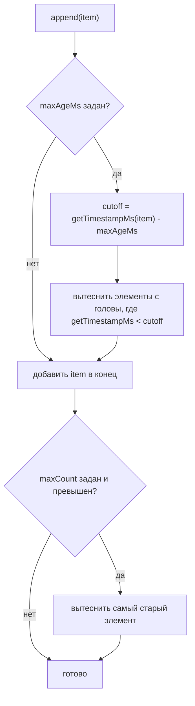

# RollingWindow — универсальный retention-буфер

## Почему это сделано так?

Паттерн "накапливать элементы, вытесняя устаревшие по возрасту и/или количеству" был
независимо реализован трижды в кодовой базе:

- `TradeTape` (`@polymarket/trade-tape`) — лента трейдов, вытеснение по `record.timestamp`
  самого элемента.
- `OrderBookHistory` (`@polymarket/order-book`) — история снапшотов стакана, вытеснение по
  времени локальной записи (`recordedAtMs`), а не по полю снапшота.
- `pruneAndCap()` (`packages/application/market-state/src/CryptoMarketDataStore.ts`) —
  отдельная функция с той же логикой, вытеснение по `exchangeTsMs` элемента.

Три независимые реализации сошлись к одной форме (append + вытеснение по `maxAgeMs`/
`maxCount`) — это признак настоящей, а не надуманной абстракции. `RollingWindow<T>`
обобщает её через параметр `getTimestampMs: (item: T) => number`, извлекающий временную
метку из элемента любого типа — этого оказалось достаточно, чтобы покрыть все три случая
(включая будущую историю для `Orderbook`-entity, у которой `receivedAt: Timestamp` —
обязательное поле, аналогично `TradeTape`).

### Result вместо throw

`RollingWindow.create()` возвращает `Result<RollingWindow<T>, ValidationError>`, а не
бросает исключение — в отличие от `TradeTape.create()`/`OrderBookHistory.create()`,
которые пока throw-based (их конвертация в `Result` — отдельная, уже запланированная
работа). Причина не копировать их текущее поведение: `docs/architecture/boundary-contract.md`
(Решение 2) прямо ограничивает throw только пакетом `value-objects` — `rolling-window` им не
является, и `RollingWindow` — новый код без исторических ограничений совместимости.

## Как работает вытеснение

### Алгоритм `append(item)`

1. Если задан `maxAgeMs` — вычисляется cutoff = `getTimestampMs(item) - maxAgeMs` (от
   временной метки ДОБАВЛЯЕМОГО элемента, не от `clock.now()` — это делает вытеснение
   детерминированным при replay исторических данных). Буфер сканируется с головы, все
   элементы с меткой строго меньше cutoff — удаляются.
2. Элемент добавляется в конец буфера.
3. Если задан `maxCount` и размер превышен — удаляется самый старый элемент (FIFO).

Элемент с возрастом РОВНО `maxAgeMs` не вытесняется (строгое `<`, не `<=`) — граница
зафиксирована тестами (`__tests__/unit/RollingWindow.test.ts`, `вытеснение по maxAgeMs`).

### Допущение о порядке поступления

`append()` предполагает неубывающий порядок элементов по `getTimestampMs` — при вытеснении
по возрасту сканирование с головы не пересортировывает буфер при единичном out-of-order
элементе. Это унаследованное допущение всех трёх исходных реализаций, не новый риск
`RollingWindow`.



## Пример кода (актуальный!)

```typescript
import { RollingWindow } from '@polymarket/rolling-window';
import { PaperClock } from '@polymarket/time';

interface TapeRecord {
  readonly price: number;
  readonly timestampMs: number;
}

const clock = new PaperClock(new Date());

const result = RollingWindow.create<TapeRecord>(
  { maxCount: 1000, maxAgeMs: 300_000 },
  clock,
  (record) => record.timestampMs,
);
if (!result.ok) {
  throw result.error;
}
const window = result.value;

window.append({ price: 0.62, timestampMs: Date.now() });

const lastMinute = window.getRecent(60_000);
const latest = window.getLatest();
```

## Потребители (план миграции)

`RollingWindow<T>` построен в Этапе 1 плана миграции, но подключение к реальным потребителям
происходит позже — сама постройка класса не меняет поведение существующего кода:

- `TradeTape` — Этап 2 (`packages/domain/market-data/trade-tape/docs/trade-tape.md`).
- Новая история для `Orderbook`-entity — Этап 2 (заменяет `OrderBookHistory`).
- `CryptoMarketDataStore.pruneAndCap()` — Этап 8.

См. `/Users/menvil/.claude/plans/synthetic-swimming-heron.md`, раздел "Новый foundation-пакет:
`packages/foundation/rolling-window/`" и Этап 1.
