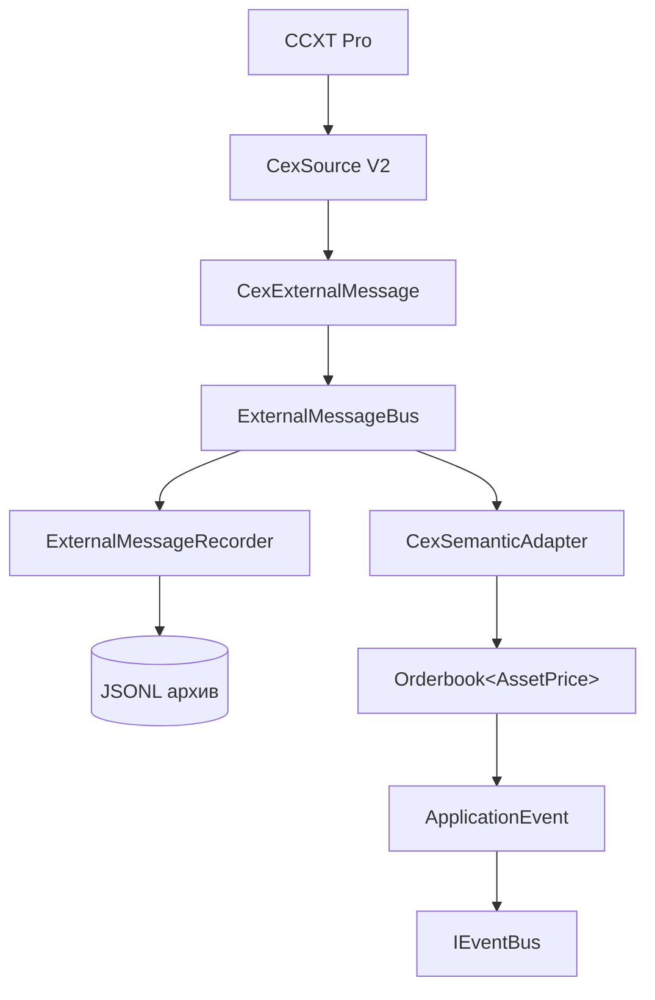

# CEX Semantic Adapter

## Проблема

К моменту MR-D сырой CEX-контур был закончен: наблюдения CCXT Pro доезжают
до общего `ExternalMessageBus` и записываются в архив как есть. Но между
«у нас есть unified-объекты CCXT» и «стратегия видит биржевой стакан» не
было ничего.

Отдельная сложность: цена биржи (`79233.99`) физически не помещается в
домен рынка предсказаний `[0.0001, 0.9999]`. До foundation-изменения
(#72) это означало бы второй тип стакана, второй тип события и вторую
копию всей market-data границы.

## Решение

Отдельный infrastructure-пакет — независимый потребитель raw-шины:



Модель стакана — ТА ЖЕ, что у рынка предсказаний; различие ровно в
параметре ценового домена:

```text
рынок предсказаний → Orderbook<OutcomePrice>
биржа              → Orderbook<AssetPrice>
```

### Почему именно независимый потребитель

Альтернативы были хуже:

- `CexSemanticAdapter → CcxtProExchangeInstance` — адаптер начал бы
  зависеть от живой биржи и никогда не заработал бы в replay: одно и то же
  записанное наблюдение давало бы разный результат;
- `CexSource → CexSemanticAdapter` как обязательная зависимость — сбор
  сырых данных начал бы зависеть от корректности semantic-слоя, а сырые
  данные ценны даже когда их семантика отвергнута.

Веерная раздача шины уже изолирует обработчики, поэтому отказ маппинга
физически не может помешать записи.

## Стакан: снапшот, а не дельта

В отличие от Polymarket, здесь реконструкции нет. `CexSource` публикует
JSON-снапшот unified-стакана CCXT в момент наблюдения (усечённый до
глубины подписки) — это зафиксировано в его контракте и подтверждено
архивом. Каждое наблюдение отображается независимо и целиком; второго кэша
книги адаптер не держит.

### Транзакционность

Наблюдение отображается ЦЕЛИКОМ или не отображается вовсе:

1. валидируются все уровни обеих сторон во временный массив;
2. только при полном успехе строится `Orderbook`;
3. любой непригодный уровень → `invalidOrderBooks++`, событий нет.

Книги «на 95 уровней из 96» не бывает: она выглядела бы исправной и молча
искажала бы наблюдаемую глубину.

### Что считается непригодным

| Случай | Поведение | Почему |
| ------ | --------- | ------ |
| цена `<= 0` | отказ всего наблюдения | `AssetPrice` строго положителен |
| объём `< 0` | отказ всего наблюдения | `Quantity` неотрицателен |
| уровень не массив / поля не числа | отказ всего наблюдения | структура vendor-а нарушена |
| объём `= 0` | уровень СОХРАНЯЕТСЯ | source-контракт не объявляет такие строки удаляемым шумом; выброс изменил бы глубину |
| третий элемент уровня (`orderCount`) | игнорируется | vendor-extra; замер нашёл 128 320 таких уровней |
| односторонняя / пустая книга | публикуется честно | отсутствующая сторона в `TopOfBook` — `undefined` |
| скрещенная (`ask < bid`) | отказ | невозможное состояние; `CexSource` тоже считает его отказом транспорта |

Скрещенная книга определяется доменным правилом
(`bookPricing(AssetPriceService.create).spread()` → `CROSSED_BOOK`), а не
собственным сравнением уровней: две копии правила рано или поздно
разойдутся. Цены при этом НЕ правятся, стороны НЕ меняются местами, спред
НЕ расширяется.

Сортировка тоже не дублируется: `Orderbook.fromLevels` сортирует сам.

## Идентичность

### `venueId`

`exchange.id` ccxt в верхнем регистре: `binance` → `BINANCE`. Таблицы
соответствий нет намеренно — она означала бы, что новая биржа в конфиге
молча не получает идентичности, а один адаптер обязан работать для ВСЕХ
настроенных площадок. Идентификатор, не проходящий формат `VenueId`,
отвергается со счётчиком: суррогат смешал бы книги разных площадок.

### `marketId` — `undefined`

У биржи рынок не существует отдельно от инструмента: «рынок BTC/USDT» и
«инструмент BTC/USDT» на binance — одно и то же. Продублировать туда
символ значило бы выдумать сущность, которой на площадке нет.

### `instrumentId` — `{marketType}:{symbol}`

Спотовый `BTC/USDT` и бессрочный своп `BTC/USDT` — РАЗНЫЕ инструменты с
разными книгами и ценами. Unified-символ CCXT обычно разводит их сам
(`BTC/USDT` против `BTC/USDT:USDT`), но НАШ source-контракт этого не
гарантирует:

```typescript
const symbol = rawOb.symbol ?? symbolFallback;
```

`symbolFallback` — символ из конфигурации подписки. Инстанс, настроенный
как `{"type":"swap","symbols":["BTC/USDT"]}`, на бирже, которая символ в
стакане не проставляет, дал бы ровно `BTC/USDT` — и своп слился бы со
спотом в один инструмент.

`marketType` же гарантирован всегда: это `options.defaultType`, который
задаём мы сами. Поэтому идентичность строится на нём, а не на надежде,
что vendor заполнил суффикс.

Vendor-символ сохраняется дословно (регистр, разделители, `:USDT`, дата
экспирации): любая нормализация схлопывала бы разные контракты в один.

`venueId` в префикс не входит — он отдельное поле и сущности, и всех
событий; инструмент обязан быть однозначен ВНУТРИ площадки.

## Нумерация событий верхушки

`BOOK_UPDATED.sequenceNumber` — счётчик САМИХ СОБЫТИЙ верхушки, локальный
для пары `venueId + instrumentId`: `1, 2, 3, …` без пропусков.

### Почему считаются события, а не наблюдения

Первая версия увеличивала счётчик на каждое принятое наблюдение стакана.
Это неверно, и вот почему. `BOOK_UPDATED` публикуется только при смене
верхушки, поэтому глубинные правки «съедали» бы номера:

```text
наблюдение #1  верхушка изменилась  → BOOK_UPDATED seq=1
наблюдение #2  изменилась глубина   → BOOK_UPDATED НЕТ, счётчик = 2
наблюдение #3  верхушка изменилась  → BOOK_UPDATED seq=3
```

Подписчик увидел бы ряд `1, 3` и по контракту поля обязан прочитать это как
ПОТЕРЮ события 2. То есть поле, заведённое ради gap detection, само
производило бы ложные gap-ы — ровно тот дефект, из-за которого контракт
запрещает брать номер из последовательности шины.

Поэтому счётчик считает опубликованные события верхушки, и действуют два
правила:

- глубинная правка номер **не тратит** (события нет — номера нет);
- отказ шины номер **тоже не тратит**: если публикация номера N провалилась,
  следующая попытка получит снова N, а не N+1. Иначе отказ оставил бы в ряду
  дыру, неотличимую от потери.

Отдельного «номера наблюдения» не заводится: у него не было ни одного
потребителя, а мёртвое состояние в per-instrument памяти — это плата без
выгоды.

### Отвергнутые альтернативы

- **последовательность raw-шины** — в ней перемешаны другие биржи, символы,
  сделки и сообщения Polymarket, поэтому у одного инструмента она имеет
  естественные «дыры», неотличимые от потерь;
- **`orderBook.nonce` биржи** — замер на архиве: есть у binance, okx,
  cryptocom; отсутствует у bybit, coinbase, kraken. Плюс его семантика и
  монотонность через reconnect exchange-specific. Класть такие допущения в
  canonical Domain нельзя.

## Semantics публикации

| Событие          | Когда |
| ---------------- | ----- |
| `BOOK_DEPTH`     | на каждое принятое наблюдение — контракт несёт полную книгу, глубина меняется даже при неизменной верхушке |
| `BOOK_UPDATED`   | только при изменении верхушки — его контракт буквально «каждое изменение лучшей цены» |
| `TRADE_RECEIVED` | на каждую принятую публичную сделку |

Отпечаток верхушки сравнивается по КАНОНИЧЕСКОЙ `Decimal`-строке, а не по
представлению vendor-а: `79234` и `79234.00` — одна цена, и считать это
изменением было бы ложным событием.

Отпечаток запоминается только ПОСЛЕ успешной публикации: иначе отвергнутое
шиной событие «зачлось» бы, и следующее наблюдение с той же верхушкой
подписчики не увидели бы никогда — гашение дубликатов превратилось бы в
потерю данных.

## Сделки

### Идентичность не синтезируется

`venueTradeId` берётся из unified-поля `id` КАК ЕСТЬ. Нет id → поле
остаётся `undefined`, и `TRADE_RECEIVED` это представляет честно.

Замер на записанном архиве (1 128 052 сделки, 6 бирж, 5 прогонов):

| биржа     | сделок  | без `id` |
| --------- | ------- | -------- |
| binance   | 812 346 | 0 |
| bybit     | 105 738 | 0 |
| cryptocom |  91 257 | 0 |
| okx       |  62 799 | 0 |
| coinbase  |  45 742 | 0 |
| kraken    |  10 170 | 0 |

Ключ из времени, символа или хеша полей ЗАПРЕЩЁН: в системе уже есть
legacy-дефект с фабрикуемыми `VenueTradeId`, и повторять его в новом
адаптере нельзя — фальшивый id молча склеил бы разные сделки.

### Дедупликация: зачем понадобилась

`newUpdates: true` источника — официальный механизм CCXT Pro «только новые
сделки с прошлого вызова». В пределах сессии этого достаточно, но он не
переживает пересоздание инстанса: при плановом рестарте (15 мин в
production) и при reconnect новый клиент повторно отдаёт часть кэша.

Замер на том же архиве:

| биржа     | дублей `venue+symbol+id` |
| --------- | ------------------------ |
| cryptocom | 517 |
| coinbase  | 8 |
| остальные | 0 |

Все 525 — ПОБАЙТНО идентичные повторы наблюдения с тем же стабильным
venue-id, то есть повторная выдача, а не две разные сделки с совпавшим
идентификатором. Дистанция повтора (в сделках того же инструмента):
медиана 47, p95 50, **максимум 74**.

Поэтому повтор отсекается ограниченным FIFO-окном по
`venueId + instrumentId + venueTradeId`, ёмкость 512 — семикратный запас
над наблюдённым максимумом. Ограниченность важнее полноты: неограниченный
индекс означал бы рост памяти на всё время жизни процесса.

Сделки БЕЗ id в дедуп не попадают вовсе: без настоящего идентификатора
отличить повтор от двух легитимно одинаковых сделок невозможно, и «дедуп»
стал бы потерей данных.

### Объём

Только `amount`. `cost` (= `price * amount`) объёмом не является, и
`cost / price` не вычисляется — это уже реконструкция, а не наблюдение.
Нет `amount` → сделка пропускается со счётчиком; `Quantity(0)` не
подставляется.

### Сторона

Unified `side` CCXT — сторона агрессора (taker), переносится как есть
(`buy` → `BUY`). Инверсии «по maker/taker» нет: она молча исказила бы всю
ленту. Нет стороны или значение незнакомо → сделка пропускается.

### Время

Vendor-время, если биржа его прислала; иначе — время получения наблюдения.
Замена НЕ молчаливая: она считается счётчиком
`tradesMissingVenueTimestamp`. `Date.now()` в пакете не вызывается вовсе.

## Точность

Это единственное место, где CEX-контур отличается от Polymarket
принципиально.

Polymarket-адаптер получает от vendor-а ДЕСЯТИЧНЫЕ СТРОКИ и передаёт их в
VO дословно — точность источника сохраняется полностью.

Unified-контракт CCXT отдаёт цены и объёмы как JS `number`. Это видно и в
типах (`price?: number | null`), и в записанном архиве:

```json
{"orderBook":{"bids":[[79233.99,0.79752],[79233.98,0.00062]], ...}}
```

Замер по 578 тысячам уровней: 100% числа (`float`/`int`), строк нет.
Значит, **граница точности пройдена ДО адаптера, внутри CCXT** (её
`safeNumber` конвертирует строку биржи в `number`). Восстановить
потерянные цифры адаптер не может и не притворяется, что может.

Что он гарантирует — не ухудшать: значение уходит в фабрику VO как есть, а
`Decimal` строится по кратчайшему round-trip-представлению числа:

```typescript
new Decimal(79233.99).toString() === new Decimal('79233.99').toString(); // true
```

Промежуточного `Number()` / `parseFloat()` / `toNumber()` над финансовыми
значениями в пакете нет нигде. Если vendor всё-таки прислал строку — она
передаётся строкой, потому что строка точнее своего числового
представления.

Отдельно: сырые строки биржи лежат в `trade.info` (`"p":"79211.89000000"`),
но лезть туда адаптер не будет — это exchange-specific поле, и его разбор
означал бы per-exchange ветки ровно там, где unified-контракт нужен, чтобы
их не было.

## Что здесь НЕ делается

- **кросс-venue агрегация** — книга binance и книга okx остаются
  независимыми наблюдениями; «лучшая глобальная книга» — производная
  проекция и появится (если появится) отдельным компонентом;
- **индикаторы** — imbalance, OFI, микроцена, VWAP, базис, liquidity score;
- **`REFERENCE_PRICE_UPDATED` из середины книги или ленты** — это тоже
  производная проекция, а не наблюдение; референсные цены сейчас приходят
  выделенными фидами через Polymarket RTDS;
- **per-exchange адаптеры** — payload унифицирован самим CCXT, поэтому
  `BinanceSemanticAdapter`/`OkxSemanticAdapter` не существуют.

## Границы памяти

На инструмент хранятся только semantic-версия, отпечаток верхушки и окно
из 512 идентификаторов сделок. Освобождение явное:
`forgetInstrument(venueId, instrumentId)`, `forgetVenue(venueId)`,
`close()`.

Адаптер специально НЕ подписан на события жизненного цикла сбора: связав
его с ними, мы сделали бы semantic-слой collection-specific, а он обязан
одинаково работать и для live-торговли, и для будущего replay. Момент
«этот инструмент больше не нужен» знает владелец, он и вызывает cleanup.

## Live vs replay

Recorder пишет ИМЕННО payload (formatVersion 2), поэтому replay-форма
сообщения — это `JSON.parse(line)` + свежая metadata. Регрессия
`CexSemanticAdapter.replay-parity.test.ts` берёт настоящие строки архива
прогона `2026-08-25T14-26-41-194Z-full` (5 бирж) и доказывает, что
live-форма и replay-форма дают идентичные финансовые значения.

Replay-engine при этом НЕ строится — это отдельная будущая работа.
