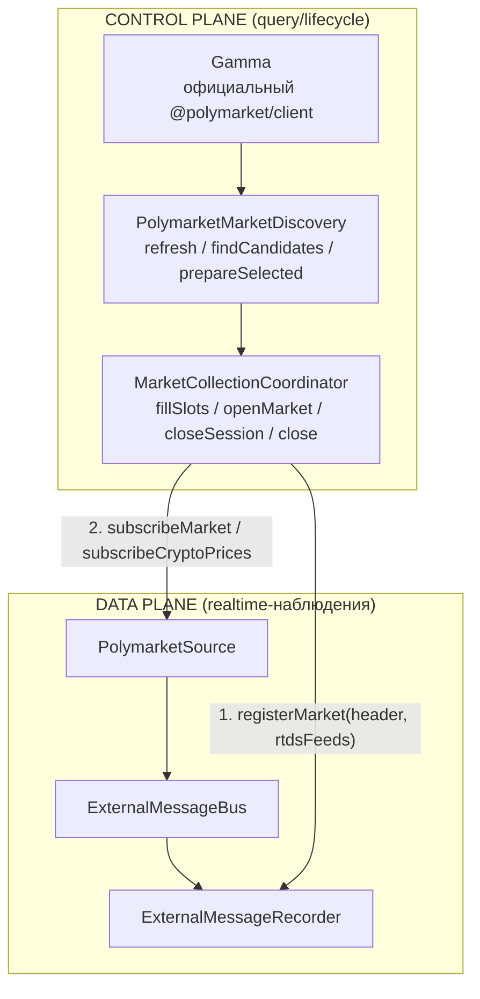

# Координация collection sessions (N-003)

## Проблема

После N-001/N-002 существовали data plane (Source → ExternalMessage → общий
bus → Recorder) и recording-регистрация, но не было control plane: кто
находит рынки, решает что открыть, регистрирует запись и открывает
подписки — так, чтобы первое событие не потерялось, дубликаты были
невозможны, а отказ любого шага не оставлял zombie-состояний.

## Решение

Два независимых плана + маленький оркестратор между ними.

### Data plane vs control plane



Gamma discovery — НЕ semantic market-data stream: результаты discovery
используются координатором для control-plane регистрации и никогда не
публикуются в общий bus.

### Почему recorder первым?

Первые WS-сообщения приходят сразу после подписки. Если бы подписка
открывалась раньше регистрации, первый `book` мог бы прийти до появления
routing-а и был бы потерян (`unroutedMarketMessages`). Порядок закреплён:

1. `recorder.registerMarket` — синхронный, routing существует немедленно;
2. только затем `source.subscribeMarket`.

Инвариант доказан интеграционным тестом с реальными bus+recorder, где fake
source публикует первое событие СИНХРОННО внутри `subscribeMarket`.

## Шаги алгоритма открытия

1. Синхронные guard-ы (без await): закрыт? уже открыт/открывается?
   отклонён lead-time памятью? истёк? есть capacity
   (`ACTIVE + OPENING < maxMarkets`)? → синхронная резервация OPENING.
2. `prepareSelected(candidate)`: `fetchEvent` только выбранного рынка —
   точное `eventStartsAt`, identity события, typed Gamma-состояние.
3. Повторная eligibility-проверка: expiry по точным данным; lead-time
   правило (см. ниже).
4. `registerMarket`: header (LINE 1) + `startsAt = СЕЙЧАС` + RTDS-фиды.
5. `subscribeMarket(allTokenIds)` — ВСЕ токены рынка.
6. Приобретение RTDS-фидов (shared/ref-counted).
7. Commit ACTIVE.

Отказ шага N откатывает шаги N-1..4 в обратном порядке; резервация
освобождается; retry возможен. Отказ одного кандидата не прерывает
`fillSlots` — следующий пробуется дальше.

### Rollback-матрица

| Отказ на шаге | Действия отката |
| --- | --- |
| `prepareSelected` | освободить резервацию |
| header не помещается в meta-блок | освободить резервацию, явный отказ ДО регистрации и подписок |
| `registerMarket → false` | освободить резервацию (retryable) |
| `subscribeMarket` | `finalizeMarket(SHUTDOWN)` → освободить резервацию |
| RTDS acquire | close market subscription → release acquired refs → `finalizeMarket(SHUTDOWN)` → освободить резервацию |
| `close()` во время OPENING | транзакция замечает флаг на каждом checkpoint и выполняет полный rollback |
| неожиданное исключение транзакции | best-effort снятие recording + освобождение резервации (вечная OPENING невозможна) |

## Timing-семантика записи (PART 9)

`startsAt` регистрации = момент открытия сессии (`clock.now()`), НЕ время
начала vendor-события — datasets начинаются с момента включения сбора,
как в legacy-коллекторе. Header различает обе точки:
`timing.recordingStartsAt` и `timing.eventStartsAt`.

### Lead-time правило (PART 23)

Legacy открывал рынок минимум за 2 минуты до расчётного старта события:
`estimatedStart = eventStartMs ?? (expiresAt - 15 мин)`. V2 сохраняет
семантику, но точное время берёт из `fetchEvent().schedule.startTime`
выбранного рынка; fallback 15 минут применяется ТОЛЬКО когда источник
действительно не дал значения (нет события / fetch упал / нет `startTime`).
Отклонённый рынок запоминается навсегда (время до старта монотонно
убывает) — повторные `fetchEvent` не выполняются; память чистится лениво
по текущему candidate cache.

## Header первой строки (PART 8)

`MarketMeta.rawMarket` (ключ `m` LINE 1) собирается из SDK-normalized
данных (`buildCollectionHeader`):

```json
{
  "headerVersion": 1,
  "source": "polymarket-v2",
  "conditionId": "0x...",
  "gammaMarketId": "3709899",
  "slug": "btc-updown-5m-...",
  "question": "Bitcoin Up or Down - ...",
  "outcomes": [{ "label": "Up", "instrumentId": "..." }, { "label": "Down", "instrumentId": "..." }],
  "event": { "id": "872598", "slug": "...", "title": "..." },
  "timing": { "eventStartsAt": 0, "expiresAt": 0, "recordingStartsAt": 0 },
  "crypto": { "source": "chainlink", "asset": "btc", "binanceSymbol": "BTCUSDT" },
  "rtdsFeeds": [{ "topic": "prices.crypto.chainlink", "symbol": "btc/usd" }],
  "gammaMarket": { "полный normalized SDK Market": "..." },
  "gammaEvent": { "normalized SDK Event без markets[]": "..." }
}
```

Бюджет: storage резервирует под LINE 1 блок 16 KiB и проверяет размер
ВСЕЙ meta-строки (`{t, formatVersion, ts, marketId, question, tokenIds,
m}`), поэтому билдер считает бюджет по probe полного конверта, а не только
payload `m`. Деградация: `truncated: ['gammaEvent']`, затем `['gammaEvent',
'gammaMarket']`; если даже усечённое ядро (identity/timing/RTDS) не
помещается — header не собирается (`undefined`), и открытие сессии явно
отказывает ДО регистрации и подписок. `gammaEvent.markets` выбрасываются
безусловно (дублируют `gammaMarket`). Это V2-формат: legacy raw Gamma JSON
байт-в-байт не воспроизводится.

## Shared RTDS: две разные ответственности

```text
SOURCE subscription sharing (координатор):
  prices.crypto.binance:btcusdt → одна SDK-подписка, refCount = N рынков

RECORDER routing (recorder, существующий):
  одно наблюдение фида → строка в файле КАЖДОГО зарегистрированного рынка
```

Конкурентная инициализация одного нового фида двумя рынками не создаёт
дублирующую SDK-подписку: entry с общим promise регистрируется синхронно.
Закрытие одного рынка не трогает фид, пока на нём есть чужие refs.

## Терминальный отказ source

Отказ доставки (bus отклонил публикацию) или падение SDK-итератора переводит
`PolymarketSource` в терминальное `hasFailed`: source сам закрывает все свои
handles. Сессии координатора при этом мертвы — данные не поступают, а
recorder-routing и слоты заняты впустую. `fillSlots()` выполняет
health-reconciliation:

1. `hasFailed` замечен → error-лог;
2. in-flight OPENING-транзакции докатываются (их подписки на отказавшем
   source падают → собственный rollback);
3. каждая сессия сносится штатным `closeSession(..., 'SHUTDOWN')` —
   recording снят, RTDS-refs и capacity освобождены (повторное закрытие
   уже закрытых handles идемпотентно по контракту Source);
4. `openMarket` на отказавшем source отвечает `skipped`.

Замена отказавшего shared source — ответственность composition root
(зависимости координатора иммутабельны): он создаёт новый source и новый
координатор поверх него; runtime-состояние старого уже очищено.

## Graceful shutdown

```text
coordinator.close()
  ├─ запрет новых открытий (флаг с текущего тика)
  ├─ ожидание исхода in-flight OPENING-транзакций (сами откатываются)
  └─ для каждой сессии: market subscription → RTDS refs → finalize(SHUTDOWN)
затем composition root:
source.close() → bus.drain() → recorder.close() → bus.close()
```

`finalizeMarket(SHUTDOWN)` = incomplete dataset: storage удаляет файл,
архив не создаётся (существующий контракт Recorder/DataRecorder). Повторный
`close()` идемпотентен.

## Почему отдельный пакет?

Координатор обязан видеть И `PolymarketSource`, И `ExternalMessageRecorder`
(PART 11 запрещает класть его в любой из них: source узнал бы storage,
recorder — SDK). Направления зависимостей:

```text
collection-coordinator ──► polymarket-v2 (discovery/source)
collection-coordinator ──► external-message-recorder
collection-coordinator ─X─► external-message-bus / data-collection / @polymarket/client
```

Граница закреплена тестом `contour-boundary.test.ts` (runtime-зависимости
package.json + import-ы исходников). Отдельный `apps/collect-data-v2`
сознательно НЕ создан: до N-004 (EXPIRED lifecycle) production-цикла у V2
нет, а составимость композиции доказывает live smoke (`scripts/smoke.ts`) —
полный composition root в ~100 строк.

## Expiry-lifecycle (N-004)

```text
OPENING ──► ACTIVE ──expiresAt──► FINALIZING ──архив──► removed
                                     │
                    beginFinalization(marketId):
                      1. state → FINALIZING ДО первого await (at most once)
                      2. recorder.sealMarket   ← routing снят, payload заморожен
                      3. close market subscription
                      4. release RTDS refs     ← общие фиды соседей живут
                      5. → FinalizingMarketSession (immutable snapshot)
```

- capacity (`maxMarkets`) считает ТОЛЬКО OPENING+ACTIVE — FINALIZING слот
  не занимает, но удерживает identity (duplicate reopen блокирован);
- `closeSession(SHUTDOWN)` FINALIZING не трогает; архив и снятие сессии —
  `@polymarket/market-finalizer`: `finalizeMarket(EXPIRED)` →
  `completeFinalization(marketId)` (удаляется только FINALIZING,
  identity-guard);
- `coordinator.close()` закрывает ACTIVE/OPENING как SHUTDOWN; оставшиеся
  FINALIZING (нарушенный порядок shutdown) дропаются с warn — их файлы
  заберёт cleanup-policy storage. Правильный порядок: `finalizer.close()`
  ДО `coordinator.close()` (см. docs market-finalizer).

Отдельный closed-markets blacklist с TTL из legacy не перенесён:
удержание identity FINALIZING-сессией + отклонение `expiresAt <= now`
покрывают reopen-защиту (доказано тестами).

## Не входит в контур координатора

- Gamma polling/enrichment после expiry — `@polymarket/market-finalizer`;
- Semantic Adapter, Application-интеграция, CEX-миграция, Reader/replay,
  удаление legacy.
