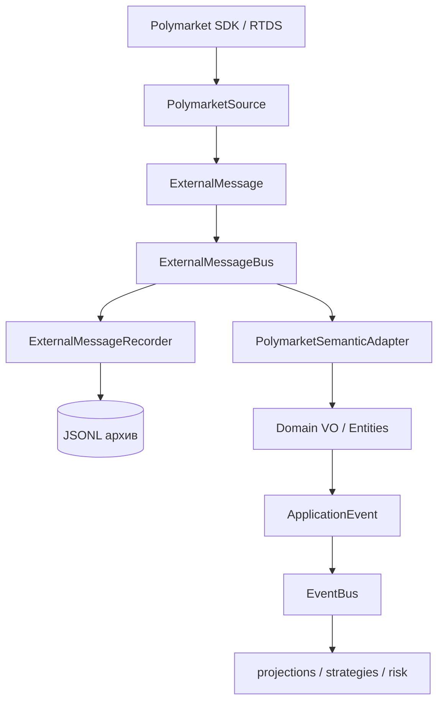

# Polymarket Semantic Adapter

## Проблема

К моменту MR-C сырой контур был закончен: наблюдения официального SDK
доезжают до `ExternalMessageBus` и записываются в архив как есть. Но между
«у нас есть строки от vendor-а» и «стратегия видит стакан» не было ничего.

Отдельная сложность в том, что Polymarket шлёт стакан ДЕЛЬТАМИ
(`price_change`), а canonical `Orderbook` иммутабелен и про delta-протокол
знать не должен. Значит, кто-то обязан держать мутабельное состояние
реконструкции — и этот «кто-то» не может жить в Domain.

## Решение

Отдельный infrastructure-пакет — независимый потребитель raw-шины:



### Почему именно независимый потребитель

Альтернативы были хуже:

- `SemanticAdapter → DataCollector.getMessages()` — адаптер стал бы
  collection-specific и никогда не заработал бы в replay;
- `DataCollector → SemanticAdapter` как обязательная зависимость — сбор
  данных начал бы зависеть от корректности semantic-слоя.

Веерная раздача шины уже изолирует обработчики (`Promise.allSettled`),
поэтому падение маппинга физически не может помешать записи.

## Реконструкция стакана

### Почему состояние — infrastructure

`Orderbook` описывает состояние книги В МОМЕНТ ВРЕМЕНИ. Знание «`price_change`
задаёт абсолютный размер, а `size = 0` удаляет уровень» — протокол конкретного
venue. Смешать их значило бы заставить Domain знать про Polymarket.

Поэтому мутабельные `Map` живут в `OrderbookReconstructionState`, а наружу
отдаётся только НОВЫЙ иммутабельный `Orderbook`; внутренние структуры не
утекают никогда.

### Алгоритм шагами

1. **`book`** — authoritative snapshot:
   - все уровни парсятся в VO во ВРЕМЕННЫЕ `Map`;
   - при успехе состояние инструмента ЗАМЕЩАЕТСЯ целиком;
   - флаг `DESYNCED` снимается, версия книги увеличивается.
2. **`price_change`** — пачка дельт:
   - нет снапшота → `deltaBeforeSnapshot++`, публикации нет;
   - инструмент в `DESYNCED` → пропуск, ждём `book`;
   - изменения применяются к КОПИЯМ сторон:
     `size > 0` — установить/заменить уровень, `size = 0` — удалить;
   - верхушка копий сверяется с `bestBid`/`bestAsk` источника;
   - только при успехе копии коммитятся и версия увеличивается.
3. **Публикация** — `BOOK_DEPTH` всегда, `BOOK_UPDATED` при смене верхушки.

### Транзакционность

Плохой уровень В СЕРЕДИНЕ пачки не оставляет книгу полуприменённой: валидация
идёт до коммита, и при отказе прежнее состояние сохраняется байт в байт. Это
прямое требование к состоянию, из которого выводятся торговые решения.

### Ключ состояния

Только `tokenId` (instrument). Не `Up`/`Down`, не вопрос рынка, не символ:
человекочитаемые имена не уникальны и меняются. `marketId` хранится РЯДОМ с
состоянием — он нужен контракту `BOOK_UPDATED` и групповому cleanup.

Цены внутри `Map` ключуются КАНОНИЧЕСКОЙ decimal-строкой
(`price.value().toString()`), а не исходной строкой источника: иначе `"0.50"` и
`"0.5"` стали бы двумя разными уровнями одной цены.

### Desync

`price_change` несёт собственные `bestBid`/`bestAsk`. После применения пачки
реконструированная верхушка сверяется с ними:

| Утверждение источника | Наше состояние | Исход |
| --- | --- | --- |
| поле отсутствует | любое | сверки нет |
| валидная цена `P` | верхушка `= P` | ок |
| валидная цена `P` | верхушка `≠ P` или сторона пуста | DESYNC |
| не цена (практически `"0"`) | сторона пуста | ок |
| не цена (практически `"0"`) | на стороне есть уровни | DESYNC |

Сравнение идёт по `Price.equals` (Decimal), а не по строкам.

DESYNC означает: наша книга разошлась с venue. Публикация по инструменту
ПРЕКРАЩАЕТСЯ. Единственный выход — следующий authoritative `book`, который
заодно гарантирует, что устаревшие уровни не переживут восстановление.

### Что показали замеры

Расхождения — НЕ теоретические и НЕ ложные срабатывания детектора. Live-прогон
(9 минут, 2026-08-26): 674 desync на ~366 000 применённых пачек (**0.18 %**), и
все 674 восстановились следующим `book` (`resyncs = 674`).

Отдельный разбор на записанном архиве (6.4 млн применённых пачек, 51 рынок)
показал, КАК выглядит расхождение в момент обнаружения:

```text
верхушка НЕ пересекается   97.5 %   ← подавляющее большинство
locked  (bid = ask)         1.9 %
crossed (bid > ask)         0.7 %

трейд по тому же токену в пределах ±1 с   28.6 %
```

То есть типичный desync — это **просто другая верхушка**, а не скрещенная
книга: наш лучший бид/аск отличается от заявленного источником, оставаясь
внутренне корректным. Скрещивание и локи — редкие частные случаи, а не
объяснение явления.

Пример редкого (1.9 %) случая, где книга оказывается залоченной:

```text
до          bid=0.51  ask=0.52
изменение   BUY 0.52 x 9.52          ← пришло ОДНО изменение
источник    bestBid=0.52 bestAsk=0.53
у нас       bid=0.52  ask=0.52       ← locked
```

Общий механизм у всех случаев один: `price_change` Polymarket **не является
полным описанием изменения книги**, а `bestBid`/`bestAsk` описывают состояние
venue на момент отправки — включая изменения, которые до нас ещё не доехали.

Отсюда два вывода:

1. `bestBid`/`bestAsk` в `price_change` — авторитетный сигнал сверки, а не
   избыточное поле. Без него расхождение осталось бы незамеченным.
2. Остановка публикации до следующего `book` — правильная политика:
   альтернатива «опубликовать что есть» означала бы торговое решение по
   книге, которой на venue не существует.

Стоимость политики измерена и мала: пропускается ~0.2 % обновлений, восстановление
100 %-е, и `book` приходит достаточно часто (≈9–10 снапшотов в минуту на токен).

Отдельно: **locked/crossed book НЕ является признаком сделки** и никогда не
превращается в трейд. Трейд рядом с desync наблюдается лишь в 28.6 % случаев,
а цены и объёма исполнения в `price_change` нет вовсе. Единственный источник
сделок — `last_trade_price`.

### Мульти-токен

Одно raw-событие несёт изменения нескольких токенов. Они группируются по
токену, применяются пачкой, и только ПОСЛЕ полного применения публикуется
ОДИН итоговый снапшот на затронутый инструмент. Промежуточная
полуприменённая книга наружу не выходит.

Для desync-сверки берётся утверждение ПОСЛЕДНЕГО изменения токена в событии:
промежуточные `bestBid`/`bestAsk` описывают промежуточные состояния.

## Semantic-версия книги

`BookUpdatedEvent` требует `sequenceNumber`. Глобальный sequence шины для
этого не годится: он содержит сообщения других токенов, RTDS и CEX, поэтому у
одного инструмента имеет естественные «дыры», неотличимые от потерь.

Поэтому определена **per-instrument монотонная semantic-версия книги**: она
увеличивается ровно на успешно применённое обновление ИМЕННО ЭТОГО
инструмента. Production-потребителей у прежнего значения не было (legacy
`BookUpdateHandler` подставлял туда timestamp как заглушку).

## Semantics `BOOK_UPDATED`

Документированный контракт события — «каждое изменение лучшей цены стакана»,
и оно несёт `TopOfBook`. Поэтому адаптер публикует его ТОЛЬКО при фактической
смене верхушки (цена или размер любой из сторон), сравнивая канонические
decimal-строки. Legacy-обработчик слал его на каждый снапшот — это была
особенность реализации, а не контракт: слать «верхушка изменилась», когда она
не изменилась, значит обманывать подписчика.

`BOOK_DEPTH` публикуется на КАЖДОЕ применённое обновление: его контракт несёт
полную книгу, и глубина меняется даже при неизменной верхушке.

Односторонняя и пустая книга — валидные состояния: `TopOfBook` представляет
отсутствующую сторону как `undefined`, уровни не фабрикуются, спред без второй
стороны не вычисляется.

## Сделки

### Идентичность: `transactionHash` и есть trade id

Первоначальный аудит предполагал, что `transactionHash` не годится в
идентификаторы, потому что «одна транзакция способна закрыть несколько
мэтчей». Проверка на записанном архиве это **опровергла**:

```text
выборка                     37 407 трейдов, 51 рынок, 102 токена, 29 часов
без transactionHash                  0   ← присутствует всегда
различных transactionHash       37 407   ← уникален 1:1 на сделку
сделок в одну миллисекунду        до 8   ← и у каждой СВОЙ хеш
```

Поэтому `venueTradeId` заполняется хешем источника КАК ЕСТЬ, без постфиксов.

Для сравнения, синтетический ключ legacy-мэппера
(`{marketId}_{tokenId}_{ts}_{price}_{size}`, применяемый когда хеша нет) на
той же выборке даёт **7 коллизий на 14 событий**: две одинаковые сделки в
одну миллисекунду склеиваются в одну. Настоящий хеш такой проблемы не имеет,
и синтезировать id вместо него не нужно.

Если vendor хеш не прислал (контракт SDK помечает поле как
`optional | nullable`), `venueTradeId` остаётся `undefined`. Фальшивый id
молча склеил бы разные сделки в ленте — это хуже отсутствующего.

### Почему событие, а не `Trade` entity

`Trade` — Domain-сущность с обязательными `VenueTradeId`/`VenueId`; её место
в ленте (`TradeTape`), а не на границе наблюдения. Адаптер публикует
НАБЛЮДЕНИЕ со всеми полями, нужными для построения `Trade` — включая
настоящий id и `marketId` — а собирает сущность тот потребитель, которому она
нужна. Так граница не тянет за собой сборку агрегатов.

Следствие для cutover: `TradeMapper._buildVenueTradeId` синтезирует id
только потому, что раньше событие его не несло. После перевода потребителей
на новый контур эта фабрикация обязана быть удалена, а не перенесена.

### Отсутствующий объём

`size` в SDK-контракте опционален. `TRADE_RECEIVED` требует `Quantity`, а
выдумывать объём (`0`/`1`) запрещено — такой трейд пропускается со счётчиком
`tradesMissingSize`. Raw-сообщение уже сохранено recorder-ом, поэтому данные
не теряются.

### Сторона

Сохраняется ФАКТИЧЕСКАЯ семантика источника: `BUY` остаётся `BUY`.
Инвертировать сторону «потому что maker/taker» без доказательства запрещено —
это молча исказило бы всю ленту.

## Референсные цены

### Почему нельзя через `Price`

`Price` — цена outcome-токена рынка предсказаний, её инвариант — диапазон
`[0.0001, 0.9999]`. `79341.36626633028` в него не помещается ПО ИНВАРИАНТУ:
конструктор обязан её отвергнуть. Это не неудобство, а разные домены.

Поэтому добавлен минимальный source-agnostic VO `AssetPrice`
(положительный Decimal без верхней границы) и событие
`REFERENCE_PRICE_UPDATED`. Ни VO, ни событие не знают про Polymarket —
будущий CEX Semantic Adapter публикует ИХ ЖЕ со своим `sourceId`.

### Провенанс

«BTC подорожал» — недостаточная семантика: Binance-спот, Chainlink-спот и
Chainlink TWAP в один момент дают РАЗНЫЕ числа, а по TWAP рассчитываются
Up/Down-рынки. Наблюдение всегда несёт:

```text
sourceId      POLYMARKET_RTDS_BINANCE | POLYMARKET_RTDS_CHAINLINK | POLYMARKET_RTDS_CHAINLINK_TWAP
baseAsset     btc          ← canonical
quoteAsset    usdt | usd   ← canonical
nativeSymbol  btcusdt | btc/usd   ← только provenance
feed          { kind: 'SPOT' } | { kind: 'TWAP', windowSeconds }
```

### Где заканчиваются vendor-форматы

Идентичность пары **каноническая**, и это принципиально. Источники пишут
символ по-разному:

```text
Binance     btcusdt      слитно
Chainlink   btc/usd      через слэш
```

Пропусти адаптер наружу один лишь нативный символ — разбирать эти формы
пришлось бы Application, то есть нормализация просто переехала бы за
границу. Так уже произошло в legacy: `StrategyScheduler.normalizeCryptoAsset`
режет символы регулярками (`replace(/usd[tc]?$/i, '')`) и **теряет
котировку целиком** — `btcusdt` и `btc/usd` схлопываются в один `btc`.

Поэтому разбор живёт в `symbols.ts` адаптера, а наружу уходит пара.
Неразобранный символ — **отказ**, а не догадка: наблюдение без canonical
идентичности downstream бесполезно, и лучше отбросить его явно, чем
опубликовать с неверной парой.

### `USDT` не приводится к `USD`

`BTC/USDT` и `BTC/USD` — разные пары с разными ценами. Считать ли их
взаимозаменяемыми — решение стратегии, а не границы наблюдения: приняв его
здесь, мы бы необратимо стёрли различие ещё до того, как кто-либо о нём
узнал. Котировка сохраняется как есть.

`feed` — дискриминированный union, а не опциональное поле: окно есть часть
идентичности усреднённого потока (`btc/usd` TWAP 30 и TWAP 60 — разные ряды),
а у спота его не существует вовсе. `SPOT`-вариант делает окно
НЕПРЕДСТАВИМЫМ, а не «обычно undefined».

Три отдельных `sourceId` повторяют решение MR-B, где TWAP сознательно
разведён со спотом в отдельный raw-канал.

### Что здесь НЕ делается

Резолюция рынка. Адаптер превращает TWAP-наблюдение в наблюдение и всё:
победитель, Up/Down и финализация — ответственность `MarketFinalizer`
(MR-B). Дублировать её здесь значило бы завести второй источник истины об
итоге рынка.

## Causality

Semantic-событие — СЛЕДСТВИЕ raw-наблюдения, поэтому его metadata создаётся
через `nextChild(raw.metadata)`:

```text
raw ExternalMessage      messageId M, correlationId C
        ↓
BOOK_DEPTH               messageId M1, correlationId C, causationId M
BOOK_UPDATED             messageId M2, correlationId C, causationId M
```

Одно наблюдение может породить несколько событий — у каждого СВОЯ identity,
но общий родитель и общий корень цепочки. `nextRoot()` для semantic-события
был бы ошибкой: он оборвал бы связь с наблюдением, из-за которого событие
возникло.

## Ошибки и границы

| Ситуация | Реакция |
| --- | --- |
| неизвестный SDK event-тип | `unknownMarketEvents++`, пропуск |
| непарсящийся уровень/цена/объём | `invalidPayloads++`, состояние не меняется |
| дельта до снапшота | `deltaBeforeSnapshot++`, публикации нет |
| расхождение верхушки | `desyncs++`, DESYNC, публикация приостановлена |
| отказ Application-шины | `semanticPublishFailures++`, лог `error` |

Ни одна из них не бросает исключение через обработчик raw-шины: запись сырых
данных обязана продолжаться.

## Границы памяти

`Map<tokenId, состояние>` не может расти месяцами. При этом связывать адаптер
с событиями жизненного цикла сбора нельзя — он стал бы collection-specific.

Компромисс: явный API `forgetInstrument()` / `forgetMarket()` плюс полное
освобождение в `close()`. Владелец жизненного цикла знает момент «этот рынок
больше не нужен» — он и вызывает cleanup. `MarketUniverse`/`SubscriptionManager`
для этого не строятся: это отдельный будущий этап.

## Паритет live и replay

Replay Reader здесь не реализуется, но инвариант, от которого он будет
зависеть, уже зафиксирован тестами: записанный source-native payload,
пересобранный в `ExternalMessage` и прогнанный через ТОТ ЖЕ адаптер, обязан
дать те же доменные значения, что и live-прогон. Расхождение означало бы, что
бэктест считает не то, что торговля.

Идентификаторы доставки (`messageId`, `sequence`, `runId`) при этом
намеренно различаются — они уникальны для каждого прогона by design.

## Что осталось за границами MR

- CEX Semantic Adapter;
- `MarketUniverse` / `MarketRegistry` / `SubscriptionManager` / policies;
- подключение Application/Strategy/Risk/Execution;
- Replay Reader и backtest;
- изменения сбора, TWAP-подписок и финализации;
- удаление legacy (`MarketDataFeedAdapter`, старый `OrderBook`, `TradeTape`) —
  пока их могут использовать существующие потребители.

`apps/collect-data` остаётся collect-only: адаптер туда по умолчанию не
включён.
