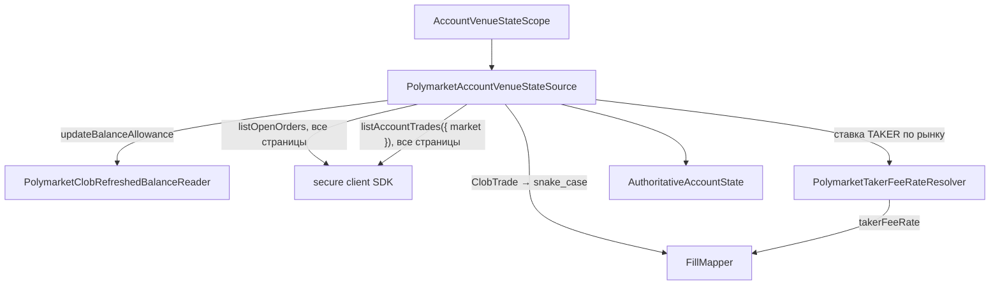

# Account venue state source (account plane)

`PolymarketAccountVenueStateSource` — production-адаптер порта
`IAccountVenueStateSource` (`@polymarket/account-reconciliation`) на
официальном `@polymarket/client` 0.6.x. Точка входа —
`@polymarket/polymarket-v2/account`, а не корень пакета: account plane в
runtime тянет порт сверки и `@polymarket/fill`, и потребители data/control-
плоскостей (сборщик, recorder, finalizer) не должны загружать этот стек. Контракт порта и его семантика
(scope, `recentFills`, текущее состояние площадки побеждает историю событий)
описаны в README `@polymarket/account-reconciliation` и в
`docs/guides/account-venue-state.md`; здесь — как адаптер их выполняет.

## Проблема

Сверке нужно authoritative текущее состояние аккаунта на площадке — но не
вся его история. Рантайм торгует на 1–4 рынках и совершает на каждом десятки
операций. Читать account-wide листинг позиций и всю историю сделок значит
зависеть от фильтров и пагинации, не нужных scoped-рантайму, и тянуть
старые рынки бесконечно.

## Решение

```text
AccountVenueStateScope
        ↓
PolymarketAccountVenueStateSource
        ├── refreshed collateral                (весь аккаунт)
        ├── scoped token balances               (каждый актив scope, ноль явно)
        ├── account-wide open orders            (все страницы SDK)
        └── complete trades of scoped markets   (каждый рынок scope, все страницы)
        ↓
AuthoritativeAccountState
```

```text
NO listPositions
NO lifetime trade scan
NO strategy ownership assumption
NO Portfolio construction
NO reconciliation/mutation
```

Адаптер — request/response-порт: он НЕ публикует ни `ExternalMessage`, ни
`ApplicationEvent`. Обе шины репозитория остаются неизменными.



## Создание: конфигурация привязана к аккаунту клиента

`FillMapper` строит исполнения с `config.accountId`, а балансы читают клиент
и reader. Поэтому поздняя проверка «исполнение принадлежит аккаунту» не
увидит расхождения конфигурации с клиентом: исполнения получают
настроенный аккаунт по построению. Привязка проверяется в `create()` — по
доверенной идентичности самих зависимостей, а не по конфигурации:

```text
client.account.wallet       кошелёк, выставленный аутентификацией SDK (AccountIdentity.wallet)
balanceReader.boundWallet   кошелёк, балансы которого читает reader
                            (CLOB-reader: client.account.wallet того же клиента)
```

| проверка | отказ |
| --- | --- |
| `client.account.wallet` читается и это EVM-адрес | `bound account: secure client wallet is not an EVM address …`, `bound account: dependency did not report its wallet` |
| `balanceReader.boundWallet` = кошелёк клиента | `bound account: balance reader is bound to …, secure client to …` |
| `makerAddress` = кошелёк клиента | `bound account: maker address … is not the secure client wallet …` |
| `accountId` = `wallet:<кошелёк клиента>` (`accountIdFromWallet`) | `bound account: configured account … is not the secure client account …` |

Регистр адресов не важен. `accountId` другого вида (`VENUE`, `SUBACCOUNT`)
с кошельком клиента не сверить — это тоже отказ (fail closed). Отказ
создания не делает ни одного запроса к API.

## Шаги `getAccountState(venueId, accountId, scope)`

1. **Идентичность.** `venueId` и `accountId` (через `accountIdEquals`)
   обязаны совпасть с настроенными; иначе `Err` без единого запроса.
2. **Scope.** Дубликат актива или рынка, рынок не в форме condition id —
   `Err` до запросов. Scope — множество; молчаливый dedupe скрыл бы ошибку
   вызывающего, а не-condition-id дал бы пустую выборку сделок, неотличимую
   от «сделок не было».
3. **Балансы** — параллельно через `PolymarketAuthoritativeBalanceReader`:
   collateral и КАЖДЫЙ актив scope. Результат — ровно по записи на актив,
   ноль явно.
4. **Открытые заявки** — `listOpenOrders()` без фильтра, все страницы
   последовательно. Каждая — `LIVE`; иначе `Err`. Повтор `orderId` — `Err`.
5. **Сделки** — для каждого рынка scope `listAccountTrades({ market })`, все
   страницы; рынки параллельно. Фильтр `makerAddress` НЕ передаётся:
   эндпоинт уже ограничен аккаунтом, а legacy наблюдал, что maker-фильтр
   скрывает taker-сделки.
6. **Исполнения** — каждая сделка через `FillMapper` (см. ниже); комиссия
   TAKER — по ставке `PolymarketTakerFeeRateResolver` рынка сделки, а не по
   `feeRateBps` ответа. Затем слияние повторов, проверка аккаунта, площадки
   `POLYMARKET` и рынка scope.
7. **Ответ** — одно `AuthoritativeAccountState`. Отказ любого шага — `Err`
   всего прохода; уже прочитанные страницы наружу не уходят.

`recentFills` для коротких текущих рынков фактически содержит ВСЕ сделки
аккаунта на рынках scope. Это по-прежнему ограниченное свидетельство
текущего торгового контура, а не история аккаунта.

## Балансы: обновлённый CLOB-взгляд

`PolymarketClobRefreshedBalanceReader` читает через `updateBalanceAllowance`, а
не `fetchBalanceAllowance`:

```text
updateBalanceAllowance = GET /balance-allowance/update → GET /balance-allowance
```

```text
This reader is a refreshed CLOB balance reader.
It MUST NOT be treated as independently verified on-chain truth.
A production composition that requires physical inventory truth may
replace/wrap it with an on-chain verifier without changing
PolymarketAccountVenueStateSource.
It MUST NOT silently convert transport/schema failures to zero.
```

Authoritative здесь — порт `PolymarketAuthoritativeBalanceReader` и
источник состояния: гарантию «фактического» баланса даёт reader, который
внедрил composition root. Конкретный `PolymarketClobRefreshedBalanceReader`
отдаёт обновлённый ВЗГЛЯД CLOB, а не доказательство on-chain владения
(legacy «фантомный MINT»). RPC/ERC-20/ERC-1155 `balanceOf` в этом MR не
реализован.

`balance` — целое в базовых единицах с шестью знаками. Перевод — сдвигом
запятой в строке, без `number`:

```text
"1234567" → "1.234567"        "1" → "0.000001"        "0" → 0 (настоящий ноль)
undefined / NaN / "-5" / "1.5" / "1e6" / " 5" / 23+ цифр → Err
```

Collateral выражен в canonical `USDC`, потому что это единственная валюта
canonical `Money`/`Portfolio` и `Fill.settlementAssetId`. Это НЕ утверждение,
что collateral-токен площадки — USDC: collateral Polymarket CLOB V2 — pUSD.
Решение не принято — см. [NEXT / BLOCKERS](#next--blockers).

## Заявки: статус CLOB + `sizeMatched`

Документированные статусы заявки CLOB: `LIVE`, `MATCHED`, `CANCELED`,
`CANCELED_MARKET_RESOLVED`, `INVALID`. `original_size`/`size_matched` уже
нормализованы в shares (делить на 1e6 не нужно).

| статус CLOB | `sizeMatched` | canonical |
| --- | --- | --- |
| `LIVE` | 0 | `OPEN` |
| `LIVE` | 0 < m < size | `PARTIALLY_FILLED` |
| `LIVE` | = size | `Err` |
| `MATCHED` | = size | `FILLED` |
| `MATCHED` | < size | `Err` |
| `CANCELED`, `CANCELED_MARKET_RESOLVED` | < size | `CANCELED` |
| `CANCELED`, `CANCELED_MARKET_RESOLVED` | = size | `Err` |
| `INVALID`, `DELAYED`, `UNMATCHED`, регистр, пустой, незнакомый | — | `Err` |
| любой | > size | `Err` |

`REJECTED` и `EXPIRED` этим путём не производятся — их площадка так не
сообщает, и они не угадываются. Ручная заявка без стратегических метаданных
переводится так же, как наша.

`getOrderState(orderId)` — `fetchOrder({ orderId })`:

```text
200                                 → AuthoritativeOrderState (в т. ч. терминальное)
RequestRejectedError, status 404    → Ok(undefined)   ("Order not found")
401 / 403 / 429 / 500 / транспорт / схема / любое другое → Err
ответ с другим id                   → Err
```

404 распознаётся структурно (`name === 'RequestRejectedError'` и
`status === 404`), а не `instanceof`: runtime-код SDK пакет не загружает.

## Сделки: одно правило `FillId` с приватным WS

REST `ClobTrade` переводится в snake_case-форму WS-события и разбирается
ТЕМ ЖЕ `FillMapper.allFromPolymarketTradeEvent`:

| REST (`ClobTrade`) | WS-форма для `FillMapper` |
| --- | --- |
| `id` | `id` |
| `takerOrderId` | `taker_order_id` |
| `traderSide` | `trader_side` |
| `conditionId` | `market` |
| `tokenId` | `asset_id` |
| `side`, `price`, `size` | как есть (строки) |
| `feeRateBps` (и у maker-заявок) | НЕ передаётся — ставку даёт резолвер |
| `status` (`TRADE_STATUS_*`) | canonical без префикса |
| `matchedAt` (ISO) | `timestamp` (мс) |
| `makerOrders[]` | `maker_orders[]` (`order_id`, `matched_amount`, `price`, `asset_id`, `side`, `owner`, `maker_address`) |
| — | `maker_address` = НАШ адрес из конфигурации |
| `owner` | не передаётся |

Правило `FillId` (из `FillMapper`, не дублируется):

```text
TAKER                          FillId = tradeId
MAKER, одна наша заявка        FillId = tradeId
MAKER, несколько наших заявок  FillId = `${tradeId}:${orderId}`
```

**Владение maker-заявкой — только по нашему адресу.** `owner` верхнего
уровня не передаётся: `FillMapper` признаёт запись нашей и по совпадению
`owner`, а в cross-outcome сделке верхний уровень описывает тейкера. MAKER-
сделка без нашей maker-записи — `Err`, а не откат на чужой верхний уровень.
TAKER-сделка, где наш адрес есть и среди maker-записей (self-match), — `Err`:
правило `FillId` такой случай не представляет.

**Время исполнения — `match time`.** `timestamp` входит в canonical факт
исполнения (`findFillFactDifference`), поэтому REST берёт `matchedAt`.
Требование к приватному WS-пути: в `timestamp` `FillMapper` должно попадать
время матчинга (`match_time`), а не время сообщения. Сегодня
`FillEventHandler` передаёт поле `timestamp` WS-события как есть; если оно
расходится с `match_time`, REST и WS дадут один `FillId`, но разный факт —
это проверяется тестом. Приватный WS в этом MR не меняется; требование
вынесено в [NEXT / BLOCKERS](#next--blockers).

### Комиссия TAKER: ставка от резолвера, не из `feeRateBps`

`fee` входит в canonical факт исполнения. Если одна сделка из WS и из REST
получит разную комиссию, это конфликт неизменяемого факта, а не уточнение.

Почему REST-путь не берёт `feeRateBps` из ответа: в записи сделки
аутентифицированного REST он приходит `"0"` (см. `polymarket-fee.ts` в
`@polymarket/fill`). Правило «`fee_rate_bps > 0` → комиссия» дало бы
тейкерской REST-сделке нулевую комиссию, а приватный WS — положительную.

Решение:

```text
PolymarketTakerFeeRateResolver.getTakerFeeRate(conditionId)
        ↓ rate
FillMapper.allFromPolymarketTradeEvent(raw, accountId, { takerFeeRate: rate })
        ↓
TAKER: fee = size × rate × p × (1 − p)   (calculatePolymarketTakerFeeWithRate)
MAKER: fee = 0, резолвер не вызывается
```

1. Для каждой TAKER-сделки адаптер спрашивает ставку у резолвера по
   `conditionId` сделки.
2. Отказ резолвера (рынок неизвестен, ставки нет) — `Err` всего прохода,
   а не нулевая комиссия.
3. `feeRateBps` в compat-вход `FillMapper` не передаётся ни на верхнем
   уровне, ни у maker-заявок: на комиссию он не влияет.
4. Опция `takerFeeRate` у `FillMapper` необязательна. Без неё (приватный
   WS) поведение прежнее: `fee_rate_bps > 0` → crypto-ставка `0.07`.

```typescript
interface PolymarketTakerFeeRateResolver {
  getTakerFeeRate(marketId: MarketId): Result<number, PolymarketAccountStateError>;
}

// Набор ставок рынков scope — от composition root.
const takerFeeRates = PolymarketStaticTakerFeeRateResolver.create([
  [conditionId, POLYMARKET_CRYPTO_TAKER_FEE_RATE], // 0.07, @polymarket/fill
]);
```

`PolymarketStaticTakerFeeRateResolver` сравнивает condition id без учёта
регистра. Ставка обязана быть конечной и неотрицательной, повтор рынка —
отказ создания.

**Статусы сделки** — явная таблица по ВСЕМ значениям enum `TradeStatus` SDK
(`Record` по template literal type: новый статус SDK не скомпилируется):

| SDK | canonical |
| --- | --- |
| `TRADE_STATUS_MATCHED` | `MATCHED` |
| `TRADE_STATUS_MINED` | `MINED` |
| `TRADE_STATUS_CONFIRMED` | `CONFIRMED` |
| `TRADE_STATUS_RETRYING` | `RETRYING` |
| `TRADE_STATUS_FAILED` | `FAILED` |
| `TRADE_STATUS_MATCHED_NOT_BROADCASTED` | `Err` (решения ещё нет) |
| пустой, без префикса, незнакомый | `Err` |

Сохраняются ВСЕ статусы, включая `MINED`, `RETRYING` и `FAILED`: это
свидетельство для сверки, а не PnL.

**Повторы.** Тот же `FillId` с тем же фактом и метаданными — одна запись;
с другим фактом или другим статусом — `Err` (какой новее, из одного прохода
не видно).

## Отказы и этапы

Все ожидаемые отказы — `Err(AccountReconciliationSourceError)` с `operation`
метода; этап — в тексте, исходная ошибка — в `originalError`:

| этап | пример текста |
| --- | --- |
| создание | `bound account: …` (см. «Создание») |
| идентичность | `identity: request … does not match configured …` |
| scope | `scope: duplicate asset …`, `scope: market … is not a Polymarket condition id` |
| collateral | `balances: collateral: balance refresh failed` |
| баланс актива | `balances: token 1000…: balance refresh failed`, `balances: token 1000…: outcome token balance: expected non-negative integer base units, got "-5"` |
| открытые заявки | `open orders pagination failed`, `open orders: open order …: …` |
| сделки рынка | `trades market 0x…: pagination failed`, `trades market 0x…: trade …: …` |
| ставка комиссии | `trades market 0x…: trade …: taker fee rate is unknown for market 0x…` |
| исполнения | `trades: fill … belongs to market … outside scope` |
| заявка | `order lookup …: request failed`, `order lookup …: venue returned order …` |

Reader, бросивший исключение вместо `Err`, тоже даёт `Err` с причиной —
дефект не превращается ни в ноль, ни в падение прохода без контекста.

## Пример (composition root)

```typescript
import { AssetType, createSecureClient } from '@polymarket/client';
import { updateBalanceAllowance } from '@polymarket/client/actions';
import { KnownVenues, accountIdFromWallet, parseWalletAddress } from '@polymarket/ids';
import { POLYMARKET_CRYPTO_TAKER_FEE_RATE } from '@polymarket/fill';
import {
  PolymarketAccountVenueStateSource,
  PolymarketClobRefreshedBalanceReader,
  PolymarketStaticTakerFeeRateResolver,
} from '@polymarket/polymarket-v2/account';

const secureClient = await createSecureClient(/* signer, wallet, credentials */);
// Идентичность — из аутентифицированного клиента, а не из отдельной настройки.
const wallet = parseWalletAddress(secureClient.account.wallet);
if (wallet === undefined) throw new Error('secure client wallet is not an EVM address');
const accountId = accountIdFromWallet(wallet);

const takerFeeRates = PolymarketStaticTakerFeeRateResolver.create([
  [conditionId, POLYMARKET_CRYPTO_TAKER_FEE_RATE],
]);
if (!takerFeeRates.ok) throw takerFeeRates.error;

const source = PolymarketAccountVenueStateSource.create(
  { venueId: KnownVenues.POLYMARKET, accountId, makerAddress: wallet },
  {
    client: secureClient,
    // reader того же клиента: boundWallet = secureClient.account.wallet
    balanceReader: PolymarketClobRefreshedBalanceReader.fromSdk(secureClient, {
      updateBalanceAllowance,
      assetTypes: AssetType,
    }),
    takerFeeRates: takerFeeRates.value,
  },
);
if (!source.ok) throw source.error; // в т. ч. «bound account: …»

const state = await source.value.getAccountState(KnownVenues.POLYMARKET, accountId, {
  marketIds: [conditionId],
  assets: [upToken, downToken],
});
```

Пакет сам runtime-код SDK не загружает (`import type` — проверяется
`contour-boundary.test.ts`): действие `updateBalanceAllowance` и enum
`AssetType` передаёт composition root.

## NEXT / BLOCKERS

Что обязано быть решено ДО того, как matcher или runtime начнут опираться
на этот источник. Ни один пункт этот MR не закрывает.

| блокер | почему | до чего |
| --- | --- | --- |
| REST `matchedAt` must be reconciled with private WS execution timestamp | `timestamp` — часть canonical факта; сегодня WS передаёт `timestamp` сообщения как есть | matcher / runtime wiring |
| pUSD vs USDC (см. ниже) | collateral площадки — pUSD, canonical `Portfolio` знает только USDC | matcher мутирует `Portfolio` |
| источник ставки комиссии в приватном WS | WS-путь всё ещё решает по `fee_rate_bps > 0` со ставкой `0.07`; если WS тоже присылает `"0"` у тейкерской сделки, WS-путь обязан брать ставку у того же резолвера | matcher сравнивает факты WS и REST |
| CLOB-баланс ≠ on-chain | `PolymarketClobRefreshedBalanceReader` — обновлённый CLOB-взгляд, не проверенный on-chain | композиция, которой нужна физическая истина инвентаря |

Open architectural decision (pUSD/USDC):

```text
Current canonical Portfolio supports only USDC.
Current Polymarket CLOB V2 collateral is pUSD.
Before state matcher is allowed to mutate Portfolio, the canonical
collateral representation must explicitly decide whether pUSD is
represented as its own currency or intentionally normalized to a
USD-equivalent accounting unit.
```

Вне этого MR: on-chain reader, matcher, `CorrectionPlan`, коррекция
`Portfolio`, runtime wiring, `TradingContext`.

## Проверить live

| вопрос | что зависит |
| --- | --- |
| закрывает ли `updateBalanceAllowance` фантомный MINT-случай | нужен ли on-chain `balanceOf` |
| регистр и форма статусов `/data/order(s)` (`LIVE` vs `live` vs префикс) | сейчас принимается только задокументированный верхний регистр |
| смысл `INVALID`; статус истёкшей GTD-заявки | сейчас `Err` |
| `TRADE_STATUS_MATCHED_NOT_BROADCASTED` | сейчас `Err` |
| совпадает ли WS `timestamp` с `match_time` | идентичность факта REST ↔ WS |
| приходит ли в WS `fee_rate_bps` положительным у тейкерской сделки | комиссия WS-пути без резолвера |
| ставка taker-комиссии рынков scope (fee schedule) | набор `PolymarketStaticTakerFeeRateResolver` |
| полнота `listAccountTrades({ market })` без `makerAddress` для TAKER и MAKER | полнота `recentFills` |

## Тесты

| файл | что покрывает |
| --- | --- |
| `PolymarketClobRefreshedBalanceReader.test.ts` | точный перевод базовых единиц, настоящий ноль, отказ SDK и невалидные значения → `Err`, `fromSdk` передаёт клиент и enum SDK, `boundWallet` = `client.account.wallet` |
| `polymarketAccountMapping.test.ts` | таблица статусов заявок, список открытых только `LIVE`, таблица статусов сделок, **P0: REST и WS → один canonical `Fill`** (TAKER, один MAKER, multi-MAKER, cross-outcome), **P0 комиссии: WS `fee_rate_bps > 0` и REST `feeRateBps "0"` + ставка резолвера → тот же `FillId` и факт**, `feeRateBps` ответа на комиссию не влияет, MAKER без комиссии и без запроса ставки, отказ резолвера → `Err`, требование к времени, владение только по адресу, self-match, слияние повторов |
| `PolymarketAccountVenueStateSource.test.ts` | совместимость с `SecureClient`, привязка при создании (чужой `accountId`, клиент другого кошелька, reader чужого кошелька, чужой `makerAddress`, `accountId` не WALLET-вида, кошелёк не сообщён — отказ без запросов), балансы scope (ноль явно), отказ до запросов, пагинация заявок и сделок со сбоем на странице N, сделки рынка вне scope, ставка запрашивается для каждой TAKER-сделки по её рынку, отказ резолвера → `Err` прохода, `getOrderState` (статусы, 404, 500, 401, транспорт, чужой id) |
| `PolymarketTakerFeeRateResolver.test.ts` | ставка по рынку без учёта регистра, неизвестный рынок → `Err`, невалидная ставка и повтор рынка → отказ создания |
| `contour-boundary.test.ts` | закрытый список импортов account plane, `@polymarket/fill` только в нём, из SDK — только `import type` |
