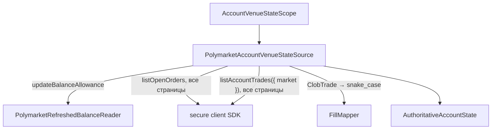

# Account venue state source (account plane)

`PolymarketAccountVenueStateSource` — production-адаптер порта
`IAccountVenueStateSource` (`@polymarket/account-reconciliation`) на
официальном `@polymarket/client` 0.6.x. Точка входа —
`@polymarket/polymarket-v2/account`, а не корень пакета: account plane в
runtime тянет порт сверки и `@polymarket/fill`, и потребители data/control-
плоскостей (сборщик, recorder, finalizer) не должны загружать этот стек. Контракт порта и его семантика
(scope, `recentFills`, текущее состояние площадки побеждает историю событий)
описаны в README `@polymarket/account-reconciliation` и в
`docs/guides/account-venue-state.md`; здесь — как адаптер их выполняет.

## Проблема

Сверке нужно authoritative текущее состояние аккаунта на площадке — но не
вся его история. Рантайм торгует на 1–4 рынках и совершает на каждом десятки
операций. Читать account-wide листинг позиций и всю историю сделок значит
зависеть от фильтров и пагинации, не нужных scoped-рантайму, и тянуть
старые рынки бесконечно.

## Решение

```text
AccountVenueStateScope
        ↓
PolymarketAccountVenueStateSource
        ├── refreshed collateral                (весь аккаунт)
        ├── scoped token balances               (каждый актив scope, ноль явно)
        ├── account-wide open orders            (все страницы SDK)
        └── complete trades of scoped markets   (каждый рынок scope, все страницы)
        ↓
AuthoritativeAccountState
```

```text
NO listPositions
NO lifetime trade scan
NO strategy ownership assumption
NO Portfolio construction
NO reconciliation/mutation
```

Адаптер — request/response-порт: он НЕ публикует ни `ExternalMessage`, ни
`ApplicationEvent`. Обе шины репозитория остаются неизменными.



## Шаги `getAccountState(venueId, accountId, scope)`

1. **Идентичность.** `venueId` и `accountId` (через `accountIdEquals`)
   обязаны совпасть с настроенными; иначе `Err` без единого запроса.
2. **Scope.** Дубликат актива или рынка, рынок не в форме condition id —
   `Err` до запросов. Scope — множество; молчаливый dedupe скрыл бы ошибку
   вызывающего, а не-condition-id дал бы пустую выборку сделок, неотличимую
   от «сделок не было».
3. **Балансы** — параллельно через `PolymarketAuthoritativeBalanceReader`:
   collateral и КАЖДЫЙ актив scope. Результат — ровно по записи на актив,
   ноль явно.
4. **Открытые заявки** — `listOpenOrders()` без фильтра, все страницы
   последовательно. Каждая — `LIVE`; иначе `Err`. Повтор `orderId` — `Err`.
5. **Сделки** — для каждого рынка scope `listAccountTrades({ market })`, все
   страницы; рынки параллельно. Фильтр `makerAddress` НЕ передаётся:
   эндпоинт уже ограничен аккаунтом, а legacy наблюдал, что maker-фильтр
   скрывает taker-сделки.
6. **Исполнения** — каждая сделка через `FillMapper` (см. ниже), слияние
   повторов, проверка аккаунта, площадки `POLYMARKET` и рынка scope.
7. **Ответ** — одно `AuthoritativeAccountState`. Отказ любого шага — `Err`
   всего прохода; уже прочитанные страницы наружу не уходят.

`recentFills` для коротких текущих рынков фактически содержит ВСЕ сделки
аккаунта на рынках scope. Это по-прежнему ограниченное свидетельство
текущего торгового контура, а не история аккаунта.

## Балансы: обновлённый CLOB-взгляд

`PolymarketRefreshedBalanceReader` читает через `updateBalanceAllowance`, а
не `fetchBalanceAllowance`:

```text
updateBalanceAllowance = GET /balance-allowance/update → GET /balance-allowance
```

This implementation refreshes the CLOB balance cache before reading.
It MUST NOT silently convert transport/schema failures to zero.
An optional/stronger on-chain verifier can replace or wrap this reader
without changing IAccountVenueStateSource.

Это обновлённый ВЗГЛЯД CLOB, а не доказательство on-chain владения (legacy
«фантомный MINT»). Для текущего MR это рабочий production-кандидат; RPC/
ERC-1155 `balanceOf` не реализован и проверяется live отдельно.

`balance` — целое в базовых единицах с шестью знаками. Перевод — сдвигом
запятой в строке, без `number`:

```text
"1234567" → "1.234567"        "1" → "0.000001"        "0" → 0 (настоящий ноль)
undefined / NaN / "-5" / "1.5" / "1e6" / " 5" / 23+ цифр → Err
```

Collateral выражен в canonical `USDC` — том же активе, что
`Fill.settlementAssetId`.

## Заявки: статус CLOB + `sizeMatched`

Документированные статусы заявки CLOB: `LIVE`, `MATCHED`, `CANCELED`,
`CANCELED_MARKET_RESOLVED`, `INVALID`. `original_size`/`size_matched` уже
нормализованы в shares (делить на 1e6 не нужно).

| статус CLOB | `sizeMatched` | canonical |
| --- | --- | --- |
| `LIVE` | 0 | `OPEN` |
| `LIVE` | 0 < m < size | `PARTIALLY_FILLED` |
| `LIVE` | = size | `Err` |
| `MATCHED` | = size | `FILLED` |
| `MATCHED` | < size | `Err` |
| `CANCELED`, `CANCELED_MARKET_RESOLVED` | < size | `CANCELED` |
| `CANCELED`, `CANCELED_MARKET_RESOLVED` | = size | `Err` |
| `INVALID`, `DELAYED`, `UNMATCHED`, регистр, пустой, незнакомый | — | `Err` |
| любой | > size | `Err` |

`REJECTED` и `EXPIRED` этим путём не производятся — их площадка так не
сообщает, и они не угадываются. Ручная заявка без стратегических метаданных
переводится так же, как наша.

`getOrderState(orderId)` — `fetchOrder({ orderId })`:

```text
200                                 → AuthoritativeOrderState (в т. ч. терминальное)
RequestRejectedError, status 404    → Ok(undefined)   ("Order not found")
401 / 403 / 429 / 500 / транспорт / схема / любое другое → Err
ответ с другим id                   → Err
```

404 распознаётся структурно (`name === 'RequestRejectedError'` и
`status === 404`), а не `instanceof`: runtime-код SDK пакет не загружает.

## Сделки: одно правило `FillId` с приватным WS

REST `ClobTrade` переводится в snake_case-форму WS-события и разбирается
ТЕМ ЖЕ `FillMapper.allFromPolymarketTradeEvent`:

| REST (`ClobTrade`) | WS-форма для `FillMapper` |
| --- | --- |
| `id` | `id` |
| `takerOrderId` | `taker_order_id` |
| `traderSide` | `trader_side` |
| `conditionId` | `market` |
| `tokenId` | `asset_id` |
| `side`, `price`, `size` | как есть (строки) |
| `feeRateBps` | `fee_rate_bps` |
| `status` (`TRADE_STATUS_*`) | canonical без префикса |
| `matchedAt` (ISO) | `timestamp` (мс) |
| `makerOrders[]` | `maker_orders[]` (`order_id`, `matched_amount`, `price`, `asset_id`, `side`, `owner`, `maker_address`) |
| — | `maker_address` = НАШ адрес из конфигурации |
| `owner` | не передаётся |

Правило `FillId` (из `FillMapper`, не дублируется):

```text
TAKER                          FillId = tradeId
MAKER, одна наша заявка        FillId = tradeId
MAKER, несколько наших заявок  FillId = `${tradeId}:${orderId}`
```

**Владение maker-заявкой — только по нашему адресу.** `owner` верхнего
уровня не передаётся: `FillMapper` признаёт запись нашей и по совпадению
`owner`, а в cross-outcome сделке верхний уровень описывает тейкера. MAKER-
сделка без нашей maker-записи — `Err`, а не откат на чужой верхний уровень.
TAKER-сделка, где наш адрес есть и среди maker-записей (self-match), — `Err`:
правило `FillId` такой случай не представляет.

**Время исполнения — `match time`.** `timestamp` входит в canonical факт
исполнения (`findFillFactDifference`), поэтому REST берёт `matchedAt`.
Требование к приватному WS-пути: в `timestamp` `FillMapper` должно попадать
время матчинга (`match_time`), а не время сообщения. Сегодня
`FillEventHandler` передаёт поле `timestamp` WS-события как есть; если оно
расходится с `match_time`, REST и WS дадут один `FillId`, но разный факт —
это проверяется тестом и должно быть закрыто в MR приватного WS.

**Статусы сделки** — явная таблица по ВСЕМ значениям enum `TradeStatus` SDK
(`Record` по template literal type: новый статус SDK не скомпилируется):

| SDK | canonical |
| --- | --- |
| `TRADE_STATUS_MATCHED` | `MATCHED` |
| `TRADE_STATUS_MINED` | `MINED` |
| `TRADE_STATUS_CONFIRMED` | `CONFIRMED` |
| `TRADE_STATUS_RETRYING` | `RETRYING` |
| `TRADE_STATUS_FAILED` | `FAILED` |
| `TRADE_STATUS_MATCHED_NOT_BROADCASTED` | `Err` (решения ещё нет) |
| пустой, без префикса, незнакомый | `Err` |

Сохраняются ВСЕ статусы, включая `MINED`, `RETRYING` и `FAILED`: это
свидетельство для сверки, а не PnL.

**Повторы.** Тот же `FillId` с тем же фактом и метаданными — одна запись;
с другим фактом или другим статусом — `Err` (какой новее, из одного прохода
не видно).

## Отказы и этапы

Все ожидаемые отказы — `Err(AccountReconciliationSourceError)` с `operation`
метода; этап — в тексте, исходная ошибка — в `originalError`:

| этап | пример текста |
| --- | --- |
| идентичность | `identity: request … does not match configured …` |
| scope | `scope: duplicate asset …`, `scope: market … is not a Polymarket condition id` |
| collateral | `balances: collateral: balance refresh failed` |
| баланс актива | `balances: token 1000…: balance refresh failed`, `balances: token 1000…: outcome token balance: expected non-negative integer base units, got "-5"` |
| открытые заявки | `open orders pagination failed`, `open orders: open order …: …` |
| сделки рынка | `trades market 0x…: pagination failed`, `trades market 0x…: trade …: …` |
| исполнения | `trades: fill … belongs to market … outside scope` |
| заявка | `order lookup …: request failed`, `order lookup …: venue returned order …` |

Reader, бросивший исключение вместо `Err`, тоже даёт `Err` с причиной —
дефект не превращается ни в ноль, ни в падение прохода без контекста.

## Пример (composition root)

```typescript
import { AssetType, createSecureClient } from '@polymarket/client';
import { updateBalanceAllowance } from '@polymarket/client/actions';
import { KnownVenues } from '@polymarket/ids';
import {
  PolymarketAccountVenueStateSource,
  PolymarketRefreshedBalanceReader,
} from '@polymarket/polymarket-v2/account';

const secureClient = await createSecureClient(/* signer, wallet, credentials */);
const source = PolymarketAccountVenueStateSource.create(
  { venueId: KnownVenues.POLYMARKET, accountId, makerAddress: funderAddress },
  {
    client: secureClient,
    balanceReader: PolymarketRefreshedBalanceReader.fromSdk(secureClient, {
      updateBalanceAllowance,
      assetTypes: AssetType,
    }),
  },
);
if (!source.ok) throw source.error;

const state = await source.value.getAccountState(KnownVenues.POLYMARKET, accountId, {
  marketIds: [conditionId],
  assets: [upToken, downToken],
});
```

Пакет сам runtime-код SDK не загружает (`import type` — проверяется
`contour-boundary.test.ts`): действие `updateBalanceAllowance` и enum
`AssetType` передаёт composition root.

## Проверить live

| вопрос | что зависит |
| --- | --- |
| закрывает ли `updateBalanceAllowance` фантомный MINT-случай | нужен ли on-chain `balanceOf` |
| регистр и форма статусов `/data/order(s)` (`LIVE` vs `live` vs префикс) | сейчас принимается только задокументированный верхний регистр |
| смысл `INVALID`; статус истёкшей GTD-заявки | сейчас `Err` |
| `TRADE_STATUS_MATCHED_NOT_BROADCASTED` | сейчас `Err` |
| совпадает ли WS `timestamp` с `match_time` | идентичность факта REST ↔ WS |
| полнота `listAccountTrades({ market })` без `makerAddress` для TAKER и MAKER | полнота `recentFills` |

## Тесты

| файл | что покрывает |
| --- | --- |
| `PolymarketRefreshedBalanceReader.test.ts` | точный перевод базовых единиц, настоящий ноль, отказ SDK и невалидные значения → `Err`, `fromSdk` передаёт клиент и enum SDK |
| `polymarketAccountMapping.test.ts` | таблица статусов заявок, список открытых только `LIVE`, таблица статусов сделок, **P0: REST и WS → один canonical `Fill`** (TAKER, один MAKER, multi-MAKER, cross-outcome), требование к времени, владение только по адресу, self-match, слияние повторов |
| `PolymarketAccountVenueStateSource.test.ts` | совместимость с `SecureClient`, балансы scope (ноль явно), отказ до запросов, пагинация заявок и сделок со сбоем на странице N, сделки рынка вне scope, `getOrderState` (статусы, 404, 500, 401, транспорт, чужой id) |
| `contour-boundary.test.ts` | закрытый список импортов account plane, `@polymarket/fill` только в нём, из SDK — только `import type` |
