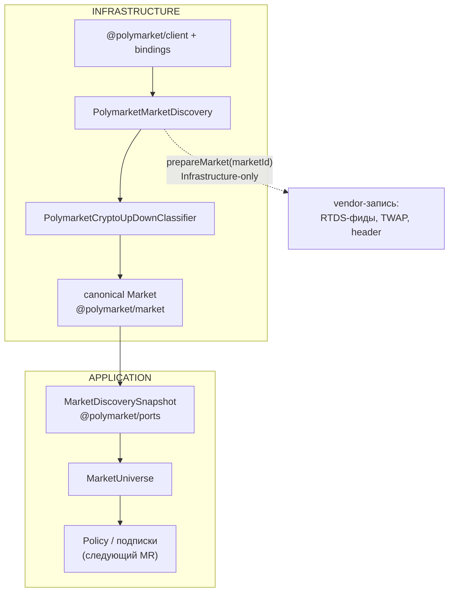

# Polymarket V2 Discovery → canonical market universe

Обнаружение рынков Polymarket через `@polymarket/client` +
`@polymarket/bindings` с выдачей **canonical Domain `Market`** за границу
Application. Control-plane путь V2; data plane (Source → bus → Recorder)
он не затрагивает.

## Почему это сделано так?

- **Discovery отвечает на технический вопрос, а не на вопрос вкуса.**
  «Какие ближайшие рынки площадки наш контур вообще способен вести?» — это
  Infrastructure. «Какие из них нам интересны» (ключевые слова, минимальная
  ликвидность, предпочтение BTC над ETH, 5m над 15m, top-N) — это owner
  policy, и она живёт НАД портом. Драйвер площадки, знающий про
  «интересность», — это policy, протёкшая в инфраструктуру.
- **Vendor-объекты не пересекают границу.** Наружу отдаётся
  `MarketDiscoverySnapshot` с доменными `Market`; ни `bindings.Market`, ни
  `bindings.Event`, ни `Record<string, unknown>` за порт не выходят.
- **Никаких выдуманных canonical-данных.** Нет ни одного fallback вида
  `startsAt = expiresAt - 1h`, `question = marketId`, подставного
  label/instrumentId или «по умолчанию BTC». Рынок, чьё обязательное поле
  нельзя получить честно, в universe не попадает — обход остальных
  продолжается.
- **Транспортом владеет клиент.** Пагинация, HTTP, decode и нормализация
  Gamma-ответа — ответственность `@polymarket/client`. Custom Gamma-клиент
  (`PolymarketMarketDataRestClient`) в V2-пути не используется, повторная
  реализация запрещена. `@polymarket/client` — **не** официальный SDK
  Polymarket, и документация его так не называет.

## Граница



Discovery — control/query path: он НЕ публикует ничего в
`ExternalMessageBus` (шина остаётся data plane realtime-наблюдений) и не
шлёт событий в `IEventBus`. Source of truth — снимок, доставляемый прямым
вызовом `MarketUniverse.replace()`.

## Конвейер одного обхода

```text
listMarkets      bounded pagination, server-side narrowing + ранняя остановка
      ↓          окно endDate + zombie grace
tradeability     active === true && closed !== true && enableOrderBook === true
      ↓
classifier       поддержано ли семейство CRYPTO_UP_DOWN (ДЕШЁВО, без сети)
      ↓          ТОЛЬКО поддержанное подмножество
fetchEvent       кэш + дедупликация → ТОЧНОЕ event.schedule.startTime
      ↓
canonical Market + MarketDiscoveryMetrics
      ↓          дедупликация venueId+marketId, технический порядок
MarketDiscoverySnapshot
```

Ключевой порядок: **классификация ДО обогащения**. Футбол, погода, политика
и произвольные crypto `Yes/No` события не запрашивают вовсе. В реальном
6-часовом окне это 5317 отсечённых рынков против 582 поддержанных.

## Публичный API

```typescript
interface IMarketDiscoveryService {
  refresh(options?: { force?: boolean }): Promise<boolean>;
  getSnapshot(): MarketDiscoverySnapshot;
}
```

`refresh()` без `force` — «поддерживай universe свежим»: соблюдает TTL
снимка и паузу после неудачного обхода. `refresh({ force: true })` —
«обнови сейчас, cadence мой». Возврат:

| Результат | Значение |
| --- | --- |
| `true` | актуальный снимок доступен (обновлён либо ещё свеж по TTL) |
| `false` | обход не выполнен либо не удался, доступен ПРЕДЫДУЩИЙ снимок |

Временная недоступность Gamma не лишает Application последнего успешного
universe — `getSnapshot()` продолжает отдавать его.

`prepareMarket(marketId)` — Infrastructure-only вход (наследник прежнего
`prepareSelected`): отдаёт vendor-запись рынка (RTDS-фиды, settlement,
typed Gamma-модели для header) **без сети** — событие уже получено на
стадии обхода. В порт он не входит: Application vendor-объектов не видит.

## Классификация `CRYPTO_UP_DOWN`

Единственное поддержанное семейство. `classifyPolymarketMarket()` даёт три
исхода, и различать их обязательно: у «не наше семейство» и «наше, но
поломанное» разные счётчики и разная реакция.

| Исход | Когда |
| --- | --- |
| `CRYPTO_UP_DOWN` | наше семейство И все обязательные поля извлечены |
| `UNSUPPORTED` | `not-crypto` (источник резолюции не крипто) либо `not-up-down` |
| `INVALID` | наше семейство, но нет обязательных данных |

Проверки идут строго в этом порядке — у чужого семейства «поломанность» нас
не касается:

1. **крипто?** — через существующий `derivePolymarketCryptoMeta()` по
   `resolution.source`. Актив берётся ТОЛЬКО отсюда: vendor уже сказал его
   точно, угадывать по заголовку запрещено;
2. **Up/Down-семантика?** — две строгие vendor-формы (ниже);
3. **обязательные поля** — `conditionId`, `question`, `endDate`, два
   различимых исхода с CLOB-токенами.

### Поддержанные формы Up/Down-семантики

**A. Пара исходов `Up`/`Down`** — case-insensitive, в ЛЮБОМ vendor-порядке.
Индексы при этом сохраняются в РЕАЛЬНОМ порядке площадки: realtime-события
адресуются тем же порядком, и «Up всегда 0» рассинхронизировало бы их.

**B. Исходы `Yes`/`No` + явная фраза `Up or Down`** в `question` либо
`groupItemTitle`, с корректными границами слов, case-insensitive.

Одних `Yes`/`No` недостаточно — иначе в universe поехал бы любой крипто-рынок:

```text
Bitcoin Up or Down — 6:30PM ET?          → supported (question-phrase)
BTC Up/Down, labels Up/Down              → supported (outcome-pair)
Will Bitcoin be above $100,000 tomorrow? → UNSUPPORTED (not-up-down)
Will Arsenal beat Chelsea?               → UNSUPPORTED (not-crypto)
```

Fuzzy-матчинга нет: `question.includes('up')` поймал бы
`Will Bitcoin close up on August 19?`, а границы слов не дают
`Groupon or Downtown` сойти за нашу серию.

## Стратегия пагинации `listMarkets`

Server-side сужение + ранняя остановка, НЕ full-world scan:

1. `closed=false`, `order=endDate`, `ascending=true` — ближайшие к истечению
   рынки первыми;
2. `endDateMin = now - zombieGraceMs` (2 мин) — отрезает на сервере
   zombie-рынки, которые Gamma продолжает отдавать активными;
3. клиентский cutoff `endDate <= now + endDateWindowMs`: страницы
   отсортированы по `endDate`, поэтому первый рынок за cutoff завершает
   пагинацию. `endDateMax` серверу сознательно НЕ передаётся — аудит
   зафиксировал HTTP 500 Gamma на `end_date_max` во всех форматах;
4. страховочный предел `maxPages` (100).

Отказы: ошибка страницы при частично собранных данных → используется
частичный список (ближайшие к истечению уже собраны); ошибка первой
страницы → прежний снимок не трогается, `refresh()` даёт `false`.

Конкурентные `refresh()` дедуплицируются — одна пагинация на всех
ожидающих.

### Окно `endDate`: главный рычаг стоимости

Дефолт СОЗНАТЕЛЬНО уменьшен с прежних двух суток до **6 часов**. Раньше
окно определяло только длину списка кандидатов, а точечный запрос события
выполнялся для ОДНОГО выбранного рынка. Теперь точное расписание нужно
каждому рынку universe, поэтому окно определяет и число запросов события.
Замер live 2026-09-01:

| Окно | Записей просмотрено | Canonical рынков | `fetchEvent` | Холодный обход |
| --- | --- | --- | --- | --- |
| 48 ч | 10 000 (упор в `maxPages`) | 1926 | 2040 | ~47 с |
| 6 ч | 6000 | 582 | 618 | ~17 с |
| 1 ч | 500 | 96 | 102 | ~1.4 с |

Шесть часов покрывают 5m/15m/1h/4h серии с запасом на lead time; дальше
горизонта Policy всё равно не принимает решений. Холодная стоимость
платится один раз — дальше расписания отдаёт кэш событий.

## Точное `startsAt` и кэш событий

Каталог рынков не несёт времени начала: оно живёт только в
`event.schedule.startTime`. Поэтому обогащение обязательно — и потому же
оно выполняется ТОЛЬКО для поддержанного подмножества.

```text
supported candidates → уникальные event id → _fetchEventOnce(id)
                                                  ↓
                              TTL-кэш → in-flight promise → сеть
```

Три уровня защиты от лишних запросов:

1. **TTL-кэш** по vendor event id (30 мин по умолчанию). TTL заметно длиннее
   TTL каталога, и это осознанно: расписание события после публикации на
   практике неизменно, а каталог меняется каждую минуту. Кэш ограничен по
   размеру — при переполнении вытесняются самые старые записи;
2. **in-flight promise** — одновременные обращения к одному событию
   разделяют один запрос;
3. **дедупликация уникальных id** — несколько рынков одного события дают
   один `fetchEvent`.

Запросы идут группами по `eventFetchConcurrency` (6 по умолчанию). Отказ
одного события исключает ТОЛЬКО его рынки; обход продолжается.

Проверено live (окно 1 ч): холодный проход — 102 запроса за 1358 мс, тёплый
— **0 запросов, 102 попадания в кэш** за 674 мс.

### Условия непригодности рынка

Рынок нашего семейства НЕ попадает в universe, если:

- у него нет ссылки на событие (`events[0]`);
- `fetchEvent` не удался;
- `event.schedule.startTime` отсутствует либо не парсится;
- `startsAt >= expiresAt`;
- фактическая длительность не является валидной `MarketDuration`.

Во всех случаях — счётчик `invalidMarkets` и debug-лог с причиной. Никаких
угаданных расписаний; regression-тест дополнительно проверяет, что в
исходниках нет арифметики `expiresAt - 5m/15m/1h`.

## Маппинг vendor `Market` → canonical `Market`

| Поле `Market` | Источник | Отказ |
| --- | --- | --- |
| `id` | `conditionId` | обязательное → `INVALID market-id` |
| `venueId` | константа `POLYMARKET` | — |
| `slug` | `slug`, если канонический | неканонический → поля просто нет |
| `question` | `question` | обязательное → `INVALID question` |
| `startsAt` | `event.schedule.startTime` | обязательное → рынок исключён |
| `expiresAt` | `state.endDate` | обязательное → `INVALID expiry` |
| `state` | `MarketState.active()` | CLOSED/RESOLVED не выдумываются |
| `outcomes` | `outcomes.yes/no` в vendor-порядке | обязательные токены и метки |
| `family` | `CRYPTO_UP_DOWN` | единственное поддержанное |
| `crypto.asset` | `derivePolymarketCryptoMeta().asset` | обязательное |
| `crypto.duration` | `expiresAt.diffMs(startsAt)` | `<= 0`/невалидная → исключён |

`crypto.duration` — ФАКТИЧЕСКАЯ длительность расписания через canonical
`Timestamp.diffMs()`, а не «5m/15m/1h по умолчанию». Номинал серии выведет
Policy из этого значения.

Vendor mapping boundary: bindings именуют первый/второй исход binary-рынка
`yes`/`no` даже когда реальные метки — `Up`/`Down`; эти имена свойств не
покидают классификатор.

## Метрики отдельно от `Market`

`liquidity` и `spread` — быстро меняющиеся наблюдения, а не identity рынка.
Класть их внутрь entity означало бы «рынок изменился», когда изменился
всего лишь стакан. Поэтому они едут отдельным полем записи:

```typescript
interface MarketDiscoveryEntry {
  readonly market: Market;               // identity/структура/расписание
  readonly metrics: MarketDiscoveryMetrics; // liquidity, spread?
}
```

Отсутствующая ликвидность трактуется как `Money.of(0, 'USDC')` (существующая
семантика V2). Отсутствующий спред остаётся `undefined`: «неизвестен» и
«нулевой» — противоположные утверждения, и подмена пропускала бы рынок
сквозь фильтр спреда.

## Порядок и дедупликация

Порядок записей ТЕХНИЧЕСКИЙ: `startsAt` ASC → `expiresAt` ASC → `id` ASC.
Это стабильность вывода (снимок, тесты, логи), а не ranking — ликвидность в
сортировке не участвует, иначе `MarketScorer` вернулся бы в инфраструктуру
под другим именем.

Идентичность рынка — ПАРА `venueId + marketId` (`marketUniverseKey()`, одно
правило на дедупликацию discovery и lookup universe). При дубликате
побеждает ПЕРВАЯ запись в порядке каталога; расхождение vendor-данных
логируется предупреждением и считается в `duplicateMarkets`, но обход не
роняет.

## Диагностика

```typescript
interface MarketDiscoveryDiagnostics {
  pagesFetched; marketsScanned; tradeableMarkets;
  unsupportedMarkets; supportedCryptoUpDown; invalidMarkets;
  duplicateMarkets; eventFetches; eventCacheHits;
}
```

Инвариант, проверяемый тестом:

```text
tradeableMarkets === supportedCryptoUpDown + unsupportedMarkets
                   + invalidMarkets + duplicateMarkets
```

`marketsScanned - tradeableMarkets` — записи, отсечённые окном `endDate` и
техническим gate торгуемости.

## RTDS-маппинг (`derivePolymarketCryptoMeta`)

Крипто-рынок распознаётся ТОЛЬКО по `resolution.source`; эвристики формата
символа нет — источник различает vendor topic. На той же границе выводится
canonical базовый актив `asset: CryptoAssetId` — он и попадает в
`Market.crypto.asset`.

| `resolution.source` | source | Фиды (vendor topic + символ) |
| --- | --- | --- |
| `binance.com/en/trade/BTC_USDT` | `binance` | `prices.crypto.binance:btcusdt`, `prices.crypto.chainlink:btc/usd` |
| `data.chain.link/streams/btc-usd` | `chainlink` | `prices.crypto.chainlink:btc/usd`, `prices.crypto.binance:btcusdt` |
| `data.chain.link/streams/btc-usd-twap-60s-streams` | `chainlink` | те же + `prices.crypto.chainlink.twap:btc/usd@60s` |

## Пример кода (актуальный!)

```typescript
// packages/infrastructure/polymarket-v2/src/PolymarketMarketDiscovery.ts
const discovery = new PolymarketMarketDiscovery(
  { client: createPublicClient(), clock, logger },
  { endDateWindowMs: 6 * 60 * 60_000 },
);

const refreshed = await discovery.refresh({ force: true });
if (!refreshed) {
  logger.warn('Discovery refresh failed, serving previous universe');
}
universe.replace(discovery.getSnapshot());

for (const { market, metrics } of discovery.getSnapshot().entries) {
  market.family;          // 'CRYPTO_UP_DOWN'
  market.crypto?.asset;   // 'btc'
  market.startsAt;        // ТОЧНОЕ event.schedule.startTime
  metrics.liquidity;      // наблюдение, а не часть Market
}

// Infrastructure-only: физическая подготовка подписок, без сети
const vendor = discovery.prepareMarket(entry.market.id);
vendor?.rtdsFeeds;        // [{ topic, symbol }, ..., { topic, symbol, windowSeconds }]
```

## Live smoke

```bash
npx tsx packages/infrastructure/polymarket-v2/scripts/discovery-smoke.ts
DISCOVERY_WINDOW_HOURS=1 npx tsx packages/infrastructure/polymarket-v2/scripts/discovery-smoke.ts
```

Один холодный и один тёплый обход против публичных endpoints: печатает
диагностику, разбивку по активам и длительностям и подтверждает, что
расписание тёплого прохода целиком приходит из кэша. WS-подписок не
открывает, ничего не пишет.
