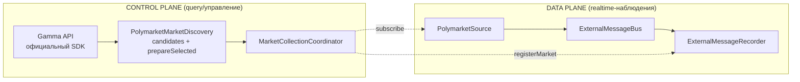

# Market Discovery V2 (N-003)

Обнаружение рынков Polymarket через официальный `@polymarket/client` с
сохранением нашей selection policy. Control-plane путь V2: заменяет custom
Gamma HTTP-клиент legacy-коллектора; data plane (Source → bus → Recorder)
не затрагивает.

## Почему это сделано так?

- **SDK владеет транспортом.** Пагинация, HTTP, decode и нормализация
  Gamma-ответа — ответственность официального SDK. Custom Gamma-клиент
  (`PolymarketMarketDataRestClient`) в V2-пути не используется, повторная
  реализация запрещена.
- **Selection policy остаётся нашей.** `MarketFilter` и `MarketScorer` —
  существующие, vendor-independent компоненты (`@polymarket/market-discovery`);
  они reuse-ятся без изменений, кандидат остаётся port-контрактом
  `DiscoveredMarket`. SDK-фильтры запросов сужают выборку на сервере, но не
  заменяют наши правила.
- **Никакого N+1.** Дорогие точечные запросы (`fetchEvent`) выполняются
  ТОЛЬКО для рынка, реально претендующего на открытие сессии.

## Две плоскости



Gamma discovery — control/query path: результаты discovery НЕ публикуются в
`ExternalMessageBus` (никакого `POLYMARKET_GAMMA_MARKET` ради симметрии —
bus остаётся data plane realtime-наблюдений).

## Используемые API официального SDK

| API | Где | Зачем |
| --- | --- | --- |
| `client.listMarkets(request)` | `refresh()` | paginated-каталог кандидатов |
| `client.fetchEvent({ id })` | `prepareSelected()` | точные данные события ВЫБРАННОГО рынка |

`fetchMarket`/`listEvents` не нужны: normalized `Market` из `listMarkets`
уже несёт всё необходимое кандидату, а событие точечно добирается
`fetchEvent`.

## Стратегия пагинации `listMarkets`

Server-side сужение + ранняя остановка (parity с legacy `getActiveMarkets`):

1. `closed=false`, `order=endDate`, `ascending=true` — ближайшие к истечению
   рынки первыми;
2. `endDateMin = now - zombieGraceMs` (2 мин) — отрезает на сервере
   zombie-рынки, которые Gamma продолжает отдавать активными;
3. клиентский cutoff `endDate <= now + endDateWindowMs` (2 суток): страницы
   отсортированы по `endDate`, поэтому первый рынок за cutoff завершает
   пагинацию. `endDateMax` серверу сознательно НЕ передаётся — legacy-аудит
   зафиксировал HTTP 500 Gamma на `end_date_max` во всех форматах;
4. страховочный предел `maxPages` (100).

Отказы: ошибка страницы при частично собранных данных → используем частичный
список (самое ценное — ближайшие к истечению — уже собрано); ошибка первой
страницы → прежний кэш кандидатов не трогается.

Конкурентные `refresh()` дедуплицируются (одна пагинация на всех ожидающих),
а после неудачного обновления авто-refresh из `findCandidates()` выдерживает
паузу `refreshFailureBackoffMs` (15 с по умолчанию) — недоступный Gamma не
молотится на каждом чтении кэша. Явный `refresh()` backoff не учитывает:
cadence явных обновлений принадлежит вызывающему.

Замечание: из-за взрыва количества 5-минутных серий (`btc-updown-5m-...`)
окно в 2 суток сейчас содержит >10 000 рынков, и пагинация упирается в
`maxPages` — ровно как legacy с теми же лимитами. Это осознанная parity;
сужение окна — отдельное будущее решение.

## Маппинг normalized SDK `Market` → кандидат

| Поле кандидата (`DiscoveredMarket`) | SDK `Market` | Отказ |
| --- | --- | --- |
| `marketId` | `conditionId` | обязательное: `null` → рынок отброшен |
| `instrumentId` | `outcomes.yes.tokenId` | обязательное (parity: `clobTokenIds[0]`) |
| `allTokenIds` | `outcomes.yes/no.tokenId` | `no` может отсутствовать → один токен |
| `question` | `question` | обязательное |
| `expiresAt` | `state.endDate` | обязательное |
| `tickSize` | `trading.minimumTickSize` | деградация до `0.01` |
| `minOrderSize` | `trading.minimumOrderSize` | деградация до `1` |
| `minOrderValue` | константа `1 USDC` | — |
| `liquidity` | `metrics.liquidity ?? liquidityNum` | деградация до `0` |
| `spread` | `prices.spread` | деградация до `undefined` |
| `eventStartMs` | **отсутствует в normalized Market** | всегда `undefined` (см. gaps) |
| `sdkMarket` (V2-поле) | весь `Market` | typed initial Gamma state |

Pre-filter торгуемости (parity):
`state.active === true && state.closed !== true && state.enableOrderBook === true`.

### Canonical IDs выбранного рынка

Vendor primitives заканчиваются на mapping boundary. SDK именует свойства
первого/второго исхода binary-рынка `yes`/`no` даже когда реальные labels —
`Up`/`Down`; эти имена свойств не покидают маппинг. Наш контракт:

- `SelectedPolymarketOutcome` = `{ label, instrumentId: InstrumentId }` —
  нейтральные исходы в vendor-порядке, identity инструмента — canonical
  `InstrumentId` (`@polymarket/ids`; для Polymarket это CLOB token id);
- список инструментов ВЫВОДИТСЯ:
  `selected.outcomes.map((outcome) => outcome.instrumentId)` — отдельной
  коллекции ids нет (single source of truth);
- `marketId: MarketId` ЕСТЬ Polymarket conditionId (routing-контракт
  `String(marketId) === payload.market`, N-002) — primitive-дубликата
  `sourceMarketId` нет; vendor Gamma numeric id хранится отдельным
  `gammaMarketId: string` (vendor identity для re-fetch N-004).

## Gamma gaps N-001 и `prepareSelected`

Normalized `Market` НЕ несёт `eventStartTime`/`eventMetadata` сырого
Gamma-ответа. Решение (без custom raw-fallback):

```text
listMarkets() → дешёвые кандидаты (без времени начала события)
      ↓ координатор выбрал рынок
prepareSelected(candidate) → fetchEvent(events[0].id)
      ↓
Event.schedule.startTime  → точное eventStartsAt
Event.metadata            → eventMetadata (priceToBeat/finalPrice — N-004)
```

Отказ `fetchEvent` деградирует до `eventStartsAt: undefined` — решение об
открытии принимает координатор своим fallback-правилом (см. документацию
`@polymarket/collection-coordinator`).

## RTDS-маппинг (`derivePolymarketCryptoMeta`)

Крипто-рынок распознаётся ТОЛЬКО по `resolution.source` normalized Market;
эвристики формата символа нет — источник различает vendor topic:

| `resolution.source` | source | Фиды (vendor topic SDK + символ) |
| --- | --- | --- |
| `binance.com/en/trade/BTC_USDT` | `binance` | `prices.crypto.binance:btcusdt`, `prices.crypto.chainlink:btc/usd` |
| `data.chain.link/streams/btc-usd` | `chainlink` | `prices.crypto.chainlink:btc/usd`, `prices.crypto.binance:btcusdt` |
| `data.chain.link/streams/btc-usd-twap-60s-streams` | `chainlink` | те же (TWAP-форма текущих 5m/15m-серий) |

## Parity с legacy (behavior oracle)

Проверено тестами `discovery-parity.test.ts` на twin-фикстурах (одни
логические рынки в raw-DTO и normalized-форме) против НАСТОЯЩЕГО
`PolymarketMarketDiscoveryAdapter`:

- идентичные eligible/not eligible исходы (keywords/expiry/liquidity/spread);
- идентичная дедупликация и ranking (порядок `conditionId`);
- идентичный маппинг identity/токенов/timing/торговых полей;
- идентичные RTDS-символы с переводом vendor topic
  (`crypto_prices` → `prices.crypto.binance`,
  `crypto_prices_chainlink` → `prices.crypto.chainlink`).

### Документированные намеренные отличия

1. **`eventStartMs` у кандидатов отсутствует** (gap normalized Market);
   точное время начала события добирается `fetchEvent`-ом только для
   выбранного рынка. Следствие: duration-фильтр (`minDurationMinutes`/
   `maxDurationMinutes`) на стадии кандидатов пропускает рынки без данных —
   у collect-data конфигурации он не используется.
2. **RTDS-вывод не требует `eventStartTime`** — legacy требовал его для
   klines-математики, а не для подписки.
3. **TWAP-форма Chainlink URL парсится** — legacy-регекс не понимал URL
   текущих 5m/15m-серий вовсе, и старый коллектор писал такие рынки БЕЗ
   RTDS-цен; V2 выводит те же фиды, что для классической формы URL.

## Пример кода (актуальный!)

```typescript
// packages/infrastructure/polymarket-v2/src/PolymarketMarketDiscovery.ts
const discovery = new PolymarketMarketDiscovery(
  { client: createPublicClient(), filter: new MarketFilter(), scorer: new MarketScorer(clock), clock, logger },
  {
    filter: {
      minTimeToExpiryHours: 0,
      minSpread: 0,
      minLiquidity: 0,
      maxMarketsToReturn: 5,
      requiredKeywords: ['up or down'],
      anyOfKeywords: ['bitcoin', 'ethereum'],
    },
  },
);

await discovery.refresh();
const candidates = await discovery.findCandidates();
const selected = await discovery.prepareSelected(candidates[0]!);
// selected: { marketId, outcomes: [{label, instrumentId}], expiresAt,
//             eventStartsAt?, rtdsFeeds, gammaMarket, gammaEvent? }
```
